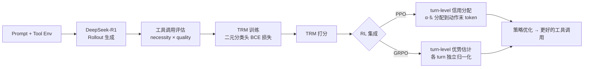

# Empowering LLM Tool Invocation with Tool-call Reward Model

**会议**: ICLR 2026  
**代码**: [OpenDFM/TRM](https://github.com/OpenDFM/TRM)  
**领域**: LLM 智能体 / 工具调用强化学习  
**关键词**: 工具调用奖励模型、过程奖励模型、强化学习、PPO/GRPO、梯度冲突

## 一句话总结

针对 LLM 工具调用中结果奖励信号粒度粗、导致梯度冲突的问题，提出 Tool-call Reward Model（TRM）——一种为每次工具调用独立打分的过程奖励模型，并设计了与 PPO/GRPO 集成的 turn-level 信用分配与优势估计策略，在搜索问答和代码数学任务上均取得持续提升。

## 研究背景与动机

**领域现状**：LLM 通过调用外部工具（搜索引擎、代码执行器）弥补知识陈旧和计算错误的缺陷，已成为主流 agentic 范式。强化学习（PPO、GRPO）被广泛用于增强工具使用能力。

**现有痛点**：几乎所有 agentic RL 方法都只使用 **outcome reward**——仅根据最终答案是否正确来分配奖励。这带来两个问题：(1) 信用分配粒度粗，无法区分哪次工具调用有价值；(2) 梯度冲突——若轨迹最终答案错误，其中正确的工具调用也会被惩罚，反之亦然。

**核心矛盾**：现有 Process Reward Model（PRM）研究主要面向数学逐步推理，工具调用场景有两大独特挑战：如何构造有效的 TRM 训练数据，以及如何在 GRPO 等算法中集成 TRM 而不引发 reward hacking（模型倾向于尽量少调用工具以规避惩罚）。

**本文目标**：提出专为工具调用设计的 TRM，系统研究其构建流程，并设计可与 PPO/GRPO 稳定集成的训练算法。

**核心 idea**：为轨迹中每次工具调用打一个二元效用分（必要性 × 质量），在 RL 训练中取代或补充结果奖励，实现 turn-level 细粒度信用分配。

## 方法详解

### 整体框架

TRM 系统分为「创建」与「应用」两个阶段：首先从前沿 LLM 蒸馏带标注的轨迹数据来训练 TRM；再将训好的 TRM 嵌入 PPO/GRPO 的奖励信号，通过 turn-level 信用分配和优势估计指导策略优化。

### 关键设计

**1. 数据蒸馏：necessity × quality 双维度标注**  
TRM 训练数据来自 DeepSeek-R1 在工具环境中自动生成的多轮轨迹。对每次工具调用 $a_i$，由 LLM 再评估打两个二元分：**必要性** $s_i^{ne}$（该调用是否对任务推进有实质贡献）和**质量** $s_i^q$（工具参数是否合理、使用是否正确）。最终分数 $s_i = s_i^{ne} \cdot s_i^q$，只有两者同时满足才为 1。消融实验表明，单用质量分会导致工具调用过多引入噪声，单用必要性分则损害每次调用的精度，组合二者效果最优。

**2. TRM 训练：轻量分类头替换语言建模头**  
TRM 以 Qwen2.5 系列为骨干，将原始语言建模头（下一 token 预测）替换为单层线性二元分类头。对每个工具调用 $a_i$，TRM 取观测输出 $o_i$ 最后一个 token 的隐状态，输出预测效用概率 $\tilde{s}_i \in [0,1]$，以 BCE 损失训练：

$$\mathcal{L}_{BCE} = \mathbb{E}_\tau \left[ -\frac{1}{n_\tau} \sum_{i=1}^{n_\tau} \left( s_i \log \tilde{s}_i + (1-s_i)\log(1-\tilde{s}_i) \right) \right]$$

实验发现 3B 规模 TRM 在 10K 样本下即可达到稳定性能，更大的 7B 反而因数据量不足而过拟合。

**3. Turn-level 信用分配（PPO）：奖励锚定到动作末 token**  
PPO 工作在 token 级别，TRM 奖励则定义在 turn 级别，需要跨粒度映射。具体做法：将第 $i$ 轮工具调用的 TRM 分数 $\tilde{s}_i$ 分配给该工具动作的最后一个 token，结果奖励分配给轨迹的最后一个 token：

$$r_j = \begin{cases} \alpha \cdot \tilde{r}_{I(j)}, & j \in E \quad (\text{工具末 token}) \\ \tilde{r}_{I(j)}, & j = L \quad (\text{答案末 token}) \\ 0, & \text{otherwise} \end{cases}$$

超参数 $\alpha \in (0,1]$ 控制 TRM 信号权重，实验设为 0.05。

**4. Turn-level 优势估计（GRPO）：规避 reward hacking**  
GRPO 直接使用 group-level 归一化（将一组轨迹的所有工具调用奖励放在一起统计均值方差）会导致 reward hacking——模型发现减少工具调用可以规避低分，于是倾向于"少用工具"。本文的解决方案是 **turn-level 归一化**：对每个 turn $i$，只在同组轨迹中对应 turn 的奖励之间做独立归一化（见公式 9），结果奖励同样独立归一化。实验（Figure 4）表明 turn-level 方案比 group-level 提升约 1.3 个百分点。

## 实验关键数据

### 主实验（搜索问答）

| 模型规模 | 方法 | NQ | HotpotQA | 2Wiki | Avg. |
|----------|------|----|-----------|----|------|
| 3B | Search-R1-PPO | 36.93 | 32.65 | 32.47 | 32.75 |
| 3B | Search-R1-PPO-**TRM** | **39.58** | **34.80** | **33.22** | **34.93** |
| 3B | Search-R1-GRPO | 47.01 | 43.34 | 42.68 | 42.33 |
| 3B | Search-R1-GRPO-**TRM** | **47.89** | **44.47** | **43.48** | **43.49** |
| 7B | Search-R1-GRPO | 49.97 | 49.06 | 47.80 | 46.90 |
| 7B | Search-R1-GRPO-**TRM** | **52.11** | **51.32** | **47.67** | **48.62** |

### 主实验（代码数学）

| 模型规模 | 方法 | AIME24 | AIME25 | MATH500 | Avg. |
|----------|------|--------|--------|---------|------|
| 1.5B | ToRL-GRPO | 25.56 | 19.33 | 75.80 | 43.18 |
| 1.5B | ToRL-GRPO-**TRM** | **26.00** | **27.00** | 75.80 | **45.42** |
| 7B | ToRL-GRPO | 35.00 | 21.89 | 83.80 | 52.19 |
| 7B | ToRL-GRPO-**TRM** | **36.56** | **23.67** | 83.20 | **53.70** |

### 消融实验

| 配置 | Avg. | 说明 |
|------|------|------|
| group-level 优势估计 | 41.18 | GRPO 默认方式，reward hacking |
| turn-level 优势估计（TRM） | **42.47** | 各 turn 独立归一化，+1.29 |
| 仅质量分 | 最低 | 工具调用过多引入噪声 |
| 仅必要性分 | 中等 | 减少调用但损失质量 |
| 必要性 × 质量 | **最高** | 平衡调用数与质量 |
| ORM（轨迹级打分） | 低于 answer-only | 轨迹级噪声过大 |
| TRM as verifier | 次优 | 聚合分优于轨迹级但不如完整 TRM |

### 关键发现

- TRM 在 PPO 和 GRPO、1.5B 至 7B 模型、搜索和代码两类任务上均有稳定提升，具有高度通用性。
- 3B 规模 TRM 用 10K 样本训练即已足够；7B TRM 反而因过拟合性能下降。
- TRM 还显著提升工具调用的跨任务泛化能力——在搜索场景训练的模型加入 TRM 后，在代码数学任务上的迁移性能显著更高。

## 亮点与洞察

- **梯度冲突的实质解法**：outcome reward 之所以产生梯度冲突，根源在于轨迹内各步骤奖励耦合。TRM 将每次调用的效用解耦，是对症而非治标。
- **Reward hacking 的精准定位**：group-level 归一化时工具调用奖励均值随着调用减少而上升，本文通过 turn-level 独立归一化切断这条激励路径，设计简洁有效。
- **10K + 3B 的工程友好性**：相较于动辄百亿参数的 LLM，一个 3B TRM 在数万样本上可以达到稳定效果，实际部署成本低。
- **双维度标注优于单一准则**：necessity 防止多余调用，quality 确保调用执行正确，缺一不可，消融结果直接验证了设计合理性。

## 局限与展望

- 当前 TRM 训练数据依赖 DeepSeek-R1 进行轨迹生成与标注，较强的教师模型可能不总是可得。
- 仅在搜索问答和代码数学两类工具上验证，对更复杂的多工具、工具链场景（如 API 调用、数据库查询）的泛化性尚待探索。
- TRM 目前是离线预训练的静态模型，若策略随 RL 训练动态演化，TRM 是否需要同步更新（在线 TRM）尚未研究。
- 超参数 α 的最优值在 PPO（0.05）和 GRPO（0.01）之间有差异，如何自适应调节仍是开放问题。

## 相关工作与启发

- **vs Search-R1 / ToRL**：本文在这些 outcome-only RL 基线上直接插入 TRM 作为过程奖励补充，无需改变整体训练框架，模块化集成方式值得借鉴。
- **vs StepSearch / AgentPRM**：StepSearch 用规则衡量搜索查询相关性，AgentPRM 以"是否最终成功"倒推中间步骤标签，两者均非专为工具调用设计；TRM 直接在工具调用粒度建模，实验上优于二者。
- **vs 数学 PRM（Lightman 2024 等）**：数学 PRM 的步骤边界清晰（每步一行推导），工具调用边界不同（一次搜索返回大段文本），TRM 需要额外处理 observation 的边界识别和噪声滤除问题。

## 评分

- 新颖性: ⭐⭐⭐⭐ 把 PRM 延伸到工具调用场景思路清晰，turn-level 优势估计解 reward hacking 的设计有新意，但整体框架是 PRM + RL 的自然组合
- 实验充分度: ⭐⭐⭐⭐ 双任务、多规模、多 RL 算法验证充分，消融细致，泛化性分析到位
- 写作质量: ⭐⭐⭐⭐ 问题描述清晰，图示直观，方法公式完整，可读性高
- 价值: ⭐⭐⭐⭐ 工具调用是 agentic LLM 的核心能力，TRM 作为即插即用模块对从业者实用价值高

<!-- RELATED:START -->

## 相关论文

- [\[ICLR 2026\] OSWorld-MCP: Benchmarking MCP Tool Invocation in Computer-Use Agents](osworld-mcp_benchmarking_mcp_tool_invocation_in_computer-use_agents.md)
- [\[ICLR 2026\] A$^2$FM: An Adaptive Agent Foundation Model for Tool-Aware Hybrid Reasoning](a2fm_an_adaptive_agent_foundation_model_for_tool-aware_hybrid_reasoning.md)
- [\[ICLR 2026\] GTool: Graph Enhanced Tool Planning with Large Language Model](gtool_graph_enhanced_tool_planning_with_large_language_model.md)
- [\[ICLR 2026\] WebArbiter: A Principle-Guided Reasoning Process Reward Model for Web Agents](webarbiter_a_principle-guided_reasoning_process_reward_model_for_web_agents.md)
- [\[ICLR 2026\] Benchmarking LLM Tool-Use in the Wild](benchmarking_llm_tool-use_in_the_wild.md)

<!-- RELATED:END -->
