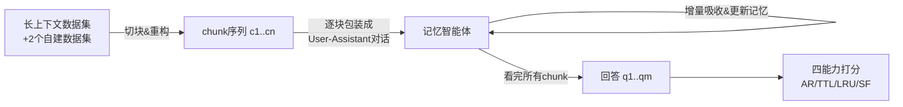

# Evaluating Memory in LLM Agents via Incremental Multi-Turn Interactions

**会议**: ICLR 2026  
**代码**: 开源（Datasets + Source Code，见论文首页链接）  
**领域**: LLM Agent / Memory / Benchmark  
**关键词**: 记忆智能体, 多轮交互, 增量记忆评测, RAG, MemoryAgentBench  

## 一句话总结
作者基于记忆科学与认知科学，把记忆智能体应拥有的能力拆成「准确检索、测试时学习、长程理解、选择性遗忘」四项核心能力，并构建了首个把长文本切块、增量喂给智能体来模拟多轮交互的统一基准 **MemoryAgentBench**，发现现有的长上下文、RAG、商用记忆智能体没有一个能同时掌握四项能力。

## 研究背景与动机
**领域现状**：LLM 智能体已能写代码、控制浏览器、解决复杂工具任务，GAIA、SWE-Bench 等基准也层出不穷，但这些评测几乎只盯着「推理」（规划、调工具、合成代码），而把同样关键的「记忆」（如何抽象、存储、更新、检索长期信息）几乎留白。

**现有痛点**：评测记忆的旧基准各有硬伤——LOCOMO（~9k）、LooGLE（~24k）、LongBench（~20k）上下文太短，已经challenge不动当代模型；NovelQA、NOCHA、∞-Bench 等虽把上下文拉到 100k+，但它们是为「静态长上下文阅读理解」设计的，一次性把全文塞进去，不反映记忆智能体「逐块吸收、边走边压缩」的交互本质；最接近的 LongMemEval 用合成长对话，但话题单一、交互不真实。更要命的是，**没有任何一个现有基准覆盖全部四项记忆能力**。

**核心矛盾**：记忆 ≠ 长上下文。长上下文是把历史逐字塞进窗口；而记忆是对过去信息的**压缩与蒸馏**——选择性保留要点、丢弃无关内容、还会从过往经验衍生出新推断。因此记忆智能体天生需要**增量地处理上下文**（piece by piece 吸收、随时间巩固、产生新推断、从积累的历史中学新规则），一次性给整段文本的数据集根本不适用。

**本文目标**：建立一个统一、可复现、覆盖四项能力、且以「多轮增量喂入」方式模拟真实记忆智能体的评测框架与数据集，系统衡量记忆质量。

**核心 idea**：**[能力分类法]** 从认知科学提炼四项互补能力（AR / TTL / LRU / SF）作为评测骨架；**[增量改造]** 把已有长上下文数据集切块、按时间顺序逐块喂入，再补两个自建数据集（EventQA、FactConsolidation）填补 AR 与 SF 的空白，最终拼成 MemoryAgentBench。

## 方法详解

### 整体框架
MemoryAgentBench 由三部分构成：(1) 四能力分类法把评测目标拆成可测维度；(2) 数据集层把 12 个数据集（含 2 个自建）标准化成「chunk 序列 + 问题 + 答案」的多轮格式；(3) 评测协议把所有 chunk 包装成模拟的 User-Assistant 对话逐块喂给智能体，让智能体增量更新记忆，看完所有 chunk 后再回答问题。被测对象覆盖长上下文、RAG、商用 Agentic Memory 三大类智能体。

### 关键设计

**1. 四项核心记忆能力：从认知科学落到可测维度。** 作者援引 James(1890)、McClelland(1995) 等经典记忆/认知理论，把「记忆智能体应具备的能力」拆成四项互补维度。**准确检索 (AR)** 要求按 query 抽出正确片段，可单跳或多跳，只要一次 query 能拿到相关信息即可；**测试时学习 (TTL)** 要求部署期不再训练就能吸收新行为、习得新技能（如从上下文里的标注样例学会分类）；**长程理解 (LRU)** 要求整合分散在 ≥100k token 上下文里的信息、回答需要全局理解的问题；**选择性遗忘 (SF)** 要求面对矛盾证据时修正、覆盖或删除旧信息，对应模型编辑与知识遗忘的目标。这套分类法是整个基准的设计骨架——每个数据集都对应明确的某一项能力。

**2. 增量多轮改造：把静态长文本变成「逐块喂入」的交互流。** 这是本文区别于长上下文基准的核心动作。作者把数据集统一成 $c_1, c_2, \cdots, c_n$（chunk）、$q_1, \cdots, q_m$（问题）、$a_1, \cdots, a_m$（答案）的格式，其中每个 chunk $c_i$ 被包装成一条带「请记住它，我等下会提问」记忆指令的 user message，按时间顺序逐条喂入，整个 $c_1 \cdots c_n$ 构成一段连续对话。智能体必须一块块吸收、增量更新记忆，看完全部 chunk 才统一作答。为了缓解「灌 1M token 只问一个问题」的资源浪费，作者刻意设计「一段上下文配多个问题」（如 LME(S*) 用 5 段上下文配 300 问），同一次注入反复探测记忆，大幅提升评测效率。

**3. 两个自建数据集填补能力空白：EventQA 与 FactConsolidation。** 现有数据集凑不齐四项能力，作者补了两个。**EventQA**（补 AR）是一个推理式 NIAH 任务：让智能体读小说，在给出最多 5 个前置事件后，从候选里选出正确的后续事件，考验对长篇叙事中时序的回忆与推理；它走**全自动 pipeline** 构建，无需人工标注，可直接迁移到其它小说文本。**FactConsolidation**（补 SF）用 MQUAKE 的反事实编辑对构造：每对含一个真事实和一个被改写的矛盾版本，把改写版排在原版之后模拟「事实更新」，再拼成 6K/32K/64K/262K 的长上下文；问题分单跳（直接事实回忆）与多跳（跨多事实推断），并在 prompt 里加显式护栏——告诉智能体「事实按序号索引，序号越大越新，冲突时取最新」，直接衡量长序列上选择性遗忘的强度与一致性。

**4. 三类记忆智能体的统一形式化与公平对比。** 被测对象覆盖三大范式：**长上下文智能体**维护一个最近 token 的缓冲区，塞满 128K/1M 窗口后按 FIFO 淘汰最早的 chunk，纯靠位置近因；**RAG 智能体**把历史存进外部记忆池按需检索，又细分为 Simple RAG（BM25 等字符串匹配）、Embedding RAG（稠密向量 + 余弦相似度）、Structure-Augmented RAG（构建知识图谱/事件时间线如 GraphRAG、HippoRAG-v2）；**Agentic Memory 智能体**（MemGPT、MIRIX 等）用迭代推理循环动态地重述问题、查记忆、更新工作记忆。为保证公平，所有智能体在每类评测里都用标准化 prompt 模板，都按「逐块吸收→增量更新→统一作答」的协议运行。

## 实验关键数据

### 主实验表格（Overall，节选；分数为各能力 Avg 与总分）

| 智能体 | AR | TTL | LRU | SF | Overall |
|---|---|---|---|---|---|
| GPT-5-mini (400K, 长上下文) | 74.4 | 48.6 | **66.2** | **53.0** | **60.6** |
| Claude-3.7-Sonnet (200K) | 59.7 | **53.9** | 62.2 | 22.5 | 49.6 |
| GPT-4o (128K) | 58.1 | 50.0 | 54.9 | 32.5 | 48.8 |
| BM25 (Simple RAG) | 45.3 | 44.5 | 35.6 | 25.5 | 41.5 |
| HippoRAG-v2 (Struct RAG) | 65.1 | 35.8 | 36.2 | 29.5 | 41.6 |
| MIRIX (Agentic, 4.1-mini) | 63.0 | 35.7 | 40.5 | 11.5 | 37.7 |
| Mem0 / Cognee / Zep | 32.6/28.3/37.5 | 21.2/22.8/37.5 | 20.7/16.0/16.2 | 10.0/15.5/5.0 | 21.1/20.6/24.0 |

RAG 在 AR 上普遍超过同backbone的 GPT-4o-mini（擅长抽片段）；长上下文模型在 TTL 与 LRU 上最强（能整体理解、能跨上下文学习），RAG/商用记忆智能体因只检索 top-k 而缺乏全局理解；**SF 上所有方法集体崩盘**，多跳场景无一超过 28%。

### 消融实验表格

| 消融维度 | 关键发现 |
|---|---|
| Chunk size (512→4096) | AR 任务用**更小 chunk + 更多检索**更好（细粒度切分提升相关性）；LRU 任务反而被切块伤害 |
| Retrieval top-k (2/5/10) | 检索块数越多整体越好，但 chunk=4096 时取 10 块已约 40k token，未测 20 块 |
| Backbone (4o-mini/4.1-mini/Gemini) | RAG 智能体：backbone 够强后就不再是瓶颈，升级仅边际提升；Agentic Memory（MIRIX）：换强 backbone 涨 9.7（25.6 vs 15.9），潜力大 |
| FactConsolidation 验证 (o4-mini) | 推理模型 SH 可达 100%(6K)，但 MH 仍只 14%(32K)，证明 SF 难度真实而非数据集缺陷 |

### 关键发现
- **没有银弹**：四项能力没有任何一类智能体能通吃——RAG 强在检索、长上下文强在理解与学习，商用 Agentic Memory（Mem0/Cognee/Zep）在多数维度反而垫底。
- **选择性遗忘是公认难题**：即使加了「取最新事实」的显式护栏，多跳遗忘几乎全军覆没；换 o4-mini 推理模型能改善单跳但仍救不了多跳。
- **Agentic Memory 受 backbone 拖累更明显**，强模型加持下涨幅最大，预示其上限取决于底座推理能力。

## 亮点与洞察
- **把「记忆」和「长上下文」彻底分开**——记忆是压缩蒸馏的表示，必须增量喂入才测得准，这个 framing 纠正了大量长上下文基准被误用来评测记忆智能体的现状。
- **四能力分类法有认知科学背书**，不是拍脑袋拼凑，AR/TTL/LRU/SF 互补且都能落到具体数据集，可作为后续记忆系统设计的 checklist。
- **EventQA 全自动构建 pipeline** 可迁移到任意小说文本，绕开了长叙事数据集对人工标注的依赖，scalable。
- **「一段上下文配多问题」的设计**直击长上下文评测的资源浪费痛点，对 1M token 级别评测很务实。

## 局限与展望
- 主要聚焦文本历史与外部数据库形式的记忆，参数化记忆（MemoryLLM、M+ 等）因「学术界为主、弱于商用 API」被排除，覆盖面留有缺口。
- 商用记忆智能体（MIRIX/MemGPT/Mem0）受 API 成本限制只能用较大 chunk（4096）、较弱 backbone（4o-mini），可能没发挥其全部实力，对比的「公平」是协议层面的而非算力层面的。
- 选择性遗忘几乎全员失败但论文未给出解决方案，只是诊断出问题；如何让记忆智能体真正实现长序列上的一致遗忘仍是开放难题。

## 相关工作与启发
- **长上下文基准**（LongBench/∞-Bench/RULER/NOCHA）：评测单次处理海量信息的能力，但不反映增量多轮，本文正是对它们「不适用记忆智能体」的回应。
- **RAG 基准**（KILT/BEIR/RAGBench/RAGTruth）：假设静态/缓变知识库与短交互，强调检索精度与 grounding，缺少持续更新与选择性遗忘。
- **记忆智能体**（MemGPT/Mem0/MIRIX/Zep/Cognee）与**模型编辑/知识遗忘**（MQUAKE/model editing）：本文把 SF 与模型编辑社区的目标对齐，并首次在多轮智能体场景下统一评测这些系统。
- **启发**：做记忆系统时别只优化检索精度，要按 AR/TTL/LRU/SF 四维 checklist 自检；尤其「选择性遗忘」是当前几乎空白的蓝海方向。

## 评分
- 新颖性: ⭐⭐⭐⭐ 把记忆从长上下文里剥离、用认知科学四能力分类法 + 增量多轮改造构建首个全覆盖基准，framing 与方法都新。
- 实验充分度: ⭐⭐⭐⭐⭐ 覆盖 3 大类 20+ 智能体、12 数据集、四维度，外加 chunk/top-k/backbone/数据集验证四组消融，非常扎实。
- 写作质量: ⭐⭐⭐⭐ 动机层层递进（记忆≠长上下文讲得透），表格信息密度高，分类法清晰。
- 价值: ⭐⭐⭐⭐⭐ 为记忆智能体提供了急需的统一 testbed，诊断出「无银弹」与「选择性遗忘集体失败」两大结论，对后续研究有强指导性。

<!-- RELATED:START -->

## 相关论文

- [\[AAAI 2026\] Towards Trustworthy Multi-Turn LLM Agents via Behavioral Guidance](../../AAAI2026/llm_agent/towards_trustworthy_multi-turn_llm_agents_via_behavioral_guidance.md)
- [\[ICLR 2026\] ToolACE-MT: Non-Autoregressive Generation for Agentic Multi-Turn Interaction](toolace-mt_non-autoregressive_generation_for_agentic_multi-turn_interaction.md)
- [\[ICLR 2026\] InfoMosaic-Bench: Evaluating Multi-Source Information Seeking in Tool-Augmented Agents](infomosaic-bench_evaluating_multi-source_information_seeking_in_tool-augmented_a.md)
- [\[ICLR 2026\] FaSTA*: Fast-Slow Toolpath Agent with Subroutine Mining for Efficient Multi-turn Image Editing](fasta_fast-slow_toolpath_agent_with_subroutine_mining_for_efficient_multi-turn_i.md)
- [\[ICLR 2026\] From Single to Multi-Granularity: Toward Long-Term Memory Association and Selection of Conversational Agents](from_single_to_multi-granularity_toward_long-term_memory_association_and_selecti.md)

<!-- RELATED:END -->
