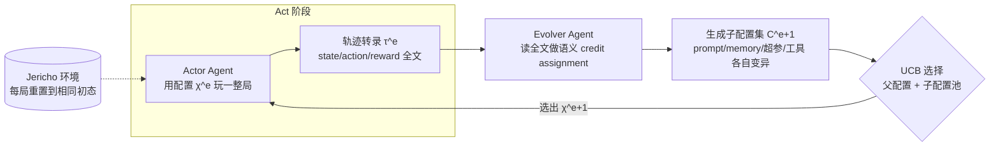

# EvoTest: Evolutionary Test-Time Learning for Self-Improving Agentic Systems

**会议**: ICLR 2026  
**OpenReview**: [https://openreview.net/forum?id=JFnnajbkvP](https://openreview.net/forum?id=JFnnajbkvP)  
**代码**: [https://github.com/yf-he/EvoTest](https://github.com/yf-he/EvoTest)  
**领域**: LLM Agent / 自我进化智能体 / 测试时学习  
**关键词**: test-time learning, self-improving agent, evolutionary optimization, gradient-free, Jericho, UCB selection  

## 一句话总结
提出 J-TTL 基准衡量智能体在同一任务上"边玩边学"的能力，并设计 EvoTest——一个无需微调、无需梯度的框架，每局结束后由 Evolver Agent 读取整局轨迹文本、整体进化智能体的 prompt/记忆/超参/工具用法，从而在重复尝试中持续提分。

## 研究背景与动机
**领域现状**：当前 AI 智能体大多在部署后就锁死配置，像"聪明但茫然的实习生"——能执行指令，却无法从经验里改进自己的决策流程。人类面对新任务的核心能力恰恰是"边做边学"：尝试、复盘、调整策略、再来一次。

**现有痛点**：领域缺乏专门衡量"会话内快速自我提升"的标准化测试床，而现有适配范式在这种设定下各有硬伤：

- **反思类（Reflexion）**：把失败摘要追加进 prompt，但不改动核心决策逻辑与工具使用方式。
- **记忆类（MemGPT/MemoryBank）**：提升信息召回，却不教智能体"换一种打法"。
- **在线微调（SFT/RL）**：在稀疏奖励、单局数据极少的设定下，credit assignment 失败、数据利用率太低，且一次更新要 5–10 分钟、4 张 H100，根本不适合测试时实时学习。

**核心矛盾**：测试时学习要求"从单次复杂经历中快速、整体地改进"，但已有方法要么只动单一通道（只改 prompt 或只加记忆），要么依赖昂贵且数据低效的梯度更新——没有方法能在一两局之内对整个智能体系统做多维度调整。

**本文目标**：(1) 提供一个能系统度量"on-the-fly 学习"能力的基准；(2) 给出一个无梯度、快速、整体进化的测试时学习算法。

**核心 idea**：**把"一局游戏的叙事"当作学习信号** —— 不再依赖标量奖励做反向传播，而是让一个 Evolver LLM 阅读整局轨迹文本，**对整个智能体配置（prompt + 记忆 + 超参 + 工具用法）做基因式进化**，并用 UCB 在新旧配置间做探索-利用权衡。

## 方法详解

### 整体框架
J-TTL 把 Jericho 文字冒险游戏建模为 POMDP，要求智能体对**同一个游戏连续玩 K 局**（每局玩完重置到相同初始状态），用 AUC（累计得分 / 最大可能得分）衡量是否越玩越好。EvoTest 在此之上跑一个 **Act–Evolve 循环**：Actor Agent 用当前配置 $\chi^{(e)}$ 玩完一整局产出轨迹 $\tau^{(e)}$；Evolver Agent 读取轨迹与父配置，生成一批进化后的子配置；UCB 从"父配置 + 子配置"池中选出下一局要用的单一配置。两个角色共享一个固定、不可训练的骨干 LLM——学习完全发生在"高层配置"而非"模型权重"上。

### 关键设计

**1. 整体智能体配置 χ=(p,M,h,u)：把"可学组件"从权重换成四元组。** EvoTest 把 J-TTL 里抽象的可学参数 $\theta$ 实例化为一个四元组配置 $\chi=(p, M, h, u)$：策略 prompt $p$ 给出高层策略与护栏；部署期记忆 $M$ 是结构化可查数据库，分"成功记忆"（记录导致加分的状态-动作对，如 `(state_hash, action) -> score_delta`）和"失败记忆"（记录原地打转等负面模式）；超参 $h$ 控制温度、探索强度、停止条件；工具用法 $u$ 含两段可进化逻辑——一是**记忆交互逻辑**（决策前查 $M$，命中成功记忆就把验证过的动作作为强提示注入 prompt），二是**状态抽象逻辑**（一个可进化的 Python `state extractor`，把冗长游戏历史解析成里程碑短句如 `Milestone: Found the map`，每步注入 prompt 提供高效情境感知）。这样"学习"就变成对这四个旋钮的协同调节，而非只动 prompt 单一轴。

**2. 双 Agent 解耦"行动"与"适配"。** Actor 与 Evolver 职责分离：Actor 在一局内只用固定配置 $\chi^{(e)}$ 反复查询骨干 LLM、根据观测 $o_t$ 和记忆检索结果出动作，产出 $\tau^{(e)}$ 与回报 $R^{(e)}$；Evolver 在局间执行更新规则 $\chi^{(e+1)}=U(\chi^{(e)}, \tau^{(e)})$，用一个强推理 LLM（实验中是 o3）阅读整局转录并提出改进。这种解耦让"玩"保持稳定、"学"集中发生在局与局之间，避免边玩边改带来的不稳定。

**3. 四类进化算子做"全系统变异"。** Evolver 不是只改 prompt，而是对四个组件分别施加遗传式算子生成子配置 $\tilde\chi$：**Prompt 变异**——把有效策略写进 prompt（"拿东西前先检查物体"）或加规则防止已观测到的失败（"避免重复导航循环"）；**记忆更新**——程序化解析转录，把加分前的 $(o_t,a_t)$ 记入成功表、把无进展的交互序列记入失败表，更新后的 $M^{(e+1)}$ 被所有子配置继承；**超参调整**——若发现智能体卡在循环里，就调高 temperature 鼓励多样动作；**工具用法精化**——把记忆查询从"温和建议"升级为"每步必须先查成功记忆"等硬指令。一个子配置就是这些变异组件的新组合，代表"更有效智能体"的一个假设。这正是相对 prompt-only 方法的本质优势：能同时解决"prompt 完美但探索不足"这类跨通道瓶颈。

**4. UCB 选择：在进化里做探索-利用并自带安全网。** 子配置生成后面临经典两难：复用历史表现好的，还是试探未验证的新配置。EvoTest 用多臂老虎机的 UCB 规则从"父配置 + 子配置"池中选下一局配置：

$$\chi^{(e+1)} = \arg\max_{\tilde\chi \in \{\chi^{(e)}\}\cup C^{(e+1)}} \left( \hat\mu(\tilde\chi) + \beta\sqrt{\frac{\log N}{1+n(\tilde\chi)}} \right)$$

其中 $\hat\mu(\tilde\chi)$ 是该配置的历史平均得分（鼓励复用靠谱配置），后一项是探索奖励——$n(\tilde\chi)$ 是该配置被试次数、$N$ 是已完成总局数、$\beta$ 控制探索强度，试得越少奖励越高，让新变异更有吸引力。关键在于**父配置永远在候选池里**：若某个子配置侥幸拿了高分但其实不稳，下一局表现差就会拉低其 $\hat\mu$，UCB 便自然"回退"到久经考验的父配置——这等于给进化路径加了安全网，防止系统被一次幸运高分带偏、保证更平滑的持续提升。

## 实验关键数据

### 主实验表格
6 个 Jericho 游戏、两个骨干（G=gemini-2.5-flash / C=claude-4-sonnet），指标为 AUC（越高越好），下表为各方法的平均 AUC：

| 方法 | 类型 | Avg. AUC (G) | Avg. AUC (C) |
|---|---|---|---|
| Static | 不学习 | 0.11 | 0.12 |
| Memory | 记忆 | 0.13 | 0.14 |
| RAG | 记忆 | 0.18 | 0.19 |
| Summary | 反思 | 0.25 | 0.27 |
| Reflexion | 反思 | 0.32 | 0.34 |
| TextGrad | prompt 优化 | 0.31 | 0.33 |
| Promptbreeder | prompt 进化 | 0.34 | 0.36 |
| EvoPrompt | prompt 进化 | 0.34 | 0.36 |
| SFT (online) | 权重更新 | 0.23 | — |
| GRPO (online) | 权重更新 | 0.30 | — |
| **EvoTest (Ours)** | **全系统进化** | **0.47** | **0.50** |

EvoTest 在全部 6 个游戏、两个骨干上都拿最高 AUC；比最强 prompt-进化基线 EvoPrompt 提升约 **38%**，比在线 RL（GRPO）提升约 **57%**。论文强调它是**唯一能通关两个游戏（Detective、Library）的方法**，所有基线一局都赢不了。

### 消融实验表格
组件消融（AUC，Detective / Zork1 / Balances）：

| 配置 | Detective | Zork1 | Balances |
|---|---|---|---|
| EvoTest（完整） | 0.94 | 0.14 | 0.32 |
| w/o Prompt 进化 | 0.52 | 0.05 | 0.16 |
| w/o UCB 选择 | 0.68 | 0.08 | 0.22 |
| w/o Memory 进化 | 0.82 | 0.11 | 0.28 |
| w/o 超参调整 | 0.89 | 0.12 | 0.30 |
| w/o 工具用法精化 | 0.91 | 0.13 | 0.30 |

Evolver LLM 质量消融（Detective）：o3 0.94 > deepseek-r1 0.90 > qwen3-32b 0.82 > qwen3-8b 0.68 > Static 0.21——性能随 Evolver 模型能力单调上升。Prompt 进化结构消融显示：完整结构化进化 0.94，换成"简单通用变异指令"骤降到 0.65（与纯 EvoPrompt 持平），说明多部分 master prompt 的结构本身是关键。

### 关键发现
- **去 Prompt 进化掉得最狠**（0.94→0.52），证明进化高层策略是策略适配的主驱动力。
- **去 UCB 不只掉分还失稳**：贪心选择会因一次"侥幸高分"过度押注高风险变异，曲线出现灾难性骤跌；UCB 靠"回退父配置"维持稳定上升轨迹。
- **效率碾压权重更新**：EvoTest 单次局间更新仅 20–30 秒、1 次 LLM 调用；而 SFT/GRPO 要 5–10 分钟 + 4×H100，在测试时学习场景下不实用。
- **进化式 credit assignment 比 RL 更省数据**：稀疏奖励下单局标量信号噪声大，EvoTest 改用"对整局故事做语义分析"识别失败/成功的因果链，做出针对性结构编辑——把"反向传播式 credit assignment"换成"叙事分析式 credit assignment"。

## 亮点与洞察
- **"叙事即梯度"的范式转换**：用整局文本转录替代标量奖励作为学习信号，绕开稀疏奖励下的 credit assignment 难题，这是从单次经历高效学习的关键洞察。
- **从 prompt 进化升维到全系统进化**：明确指出 prompt-only 优化的天花板——再好的 prompt 也救不了"探索太低/工具用法低效"，而协同调四个旋钮才能解开跨通道瓶颈。
- **UCB 当安全网**这一设计巧妙：进化算法常见的"被局部幸运解带偏"问题，靠"父配置永驻候选池 + 平均分回退"优雅化解，兼顾激进探索与稳定性。
- **基准与算法配套贡献**：J-TTL 把评测从"单局/跨游戏泛化"转到"同一任务重复尝试的会话内提升"这一被忽视但关键的轴。

## 局限与展望
- **任务域偏窄**：实验集中在 Jericho 文字冒险游戏，是否能迁移到现实 web/GUI/具身等带真实副作用、不可任意重置的环境仍待验证（J-TTL 依赖"每局重置到相同初态"的理想假设）。
- **强依赖 Evolver LLM 能力**：消融显示换成 qwen3-8b 时 AUC 从 0.94 掉到 0.68，整套框架的上限被最强可用推理模型的成本与能力卡住。
- **配置空间手工设计**：四元组 $(p,M,h,u)$ 与进化算子仍是人工定义的，进化的"基因表达"边界由设计者划定，离真正开放式自进化还有距离。
- **难游戏增益有限**：Zork1 这类极难游戏上 AUC 仅 0.14，绝对水平仍低，说明在超长程稀疏奖励任务上"叙事进化"也未必够。

## 相关工作与启发
- **反思/记忆类**：Reflexion 用文字反思改 prompt、MemGPT/MemoryBank 管长上下文记忆——EvoTest 指出它们都是"单通道"适配，启发我们把适配看成多组件协同优化问题。
- **自动 prompt 优化/进化**：APE、OPRO、TextGrad（文本梯度）、Promptbreeder、EvoPrompt（prompt 种群遗传）——EvoTest 把"prompt 进化"泛化为"整个智能体配置进化"，是对这条线的自然推广。
- **自进化智能体系统**：EvoAgent、MASS、AlphaEvolve 等统一优化愿景与本文一脉相承；对做 agent 自我改进的研究者，"用 UCB 管理进化探索-利用 + 父配置回退"是一个可复用的稳定化技巧。
- **测试时学习视角**：把"会话内快速适配"独立成一个评测轴，对 agentic 系统的部署后持续学习评估有方法论启发。

## 评分
- **新颖性**: ⭐⭐⭐⭐ 「叙事即梯度 + 全系统进化 + UCB 安全网」的组合在测试时学习设定下确有原创性，并配套提出 J-TTL 基准。
- **实验充分度**: ⭐⭐⭐⭐ 6 游戏 × 2 骨干 × 三大问题，对比覆盖记忆/反思/prompt 进化/在线微调四类基线，组件/Evolver/结构三套消融完整，含成本分析。
- **写作质量**: ⭐⭐⭐⭐ 动机叙事生动（"聪明但茫然的实习生"），方法分层清晰，图表充分；公式与设计对应明确。
- **价值**: ⭐⭐⭐⭐ 给出无需 GPU、20–30 秒/次的实用测试时学习方案，对资源受限下的 agent 自改进有较强落地参考，主要待扩展到真实非可重置环境。

<!-- RELATED:START -->

## 相关论文

- [\[ICLR 2026\] Agentic Context Engineering: Evolving Contexts for Self-Improving Language Models](agentic_context_engineering_evolving_contexts_for_self-improving_language_models.md)
- [\[ICLR 2026\] GTA1: GUI Test-time Scaling Agent](gta1_gui_test-time_scaling_agent.md)
- [\[ICLR 2026\] Test-Time Adaptation for LLM Agents via Environment Interaction](test-time_adaptation_for_llm_agents_via_environment_interaction.md)
- [\[ICLR 2026\] Pushing Test-Time Scaling Limits of Deep Search with Asymmetric Verification](pushing_test-time_scaling_limits_of_deep_search_with_asymmetric_verification.md)
- [\[ICML 2026\] From Player to Master: Enhancing Test-Time Learning of LLM Agents via Reinforcement Learning over Memory](../../ICML2026/llm_agent/from_player_to_master_enhancing_test-time_learning_of_llm_agents_via_reinforceme.md)

<!-- RELATED:END -->
