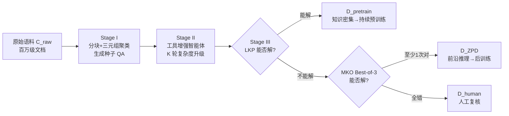

# Expanding the Capability Frontier of LLM Agents with ZPD-Guided Data Synthesis

**会议**: ICLR 2026  
**OpenReview**: [https://openreview.net/forum?id=c5bf47nDx1](https://openreview.net/forum?id=c5bf47nDx1)  
**代码**: 待确认  
**领域**: LLM Agent / 数据合成  
**关键词**: 智能体训练数据, 最近发展区(ZPD), 知识融合, 自演化基准, 持续预训练  

## 一句话总结
借用教育心理学的"最近发展区(ZPD)"理论，用一个能自动把题目难度精确校准到模型能力边界的数据合成引擎，造出可用于持续预训练和后训练的高价值智能体数据，把 30B-A3B 的小模型在 HLE 上推到 28.6%，超过若干闭源 deep-research 智能体。

## 研究背景与动机
**领域现状**：当前 LLM 在常规推理任务上已经很强，但在需要跨领域、多文档、深度整合的"deep research"型任务上仍然吃力。要让模型从"调用内部静态知识"跃迁到"工具使用 + 自反思 + 多步规划"的智能体能力，最稀缺的恰恰是训练数据——能系统性培养这些能力的语料几乎不存在。

**现有痛点**：主流数据合成范式分两类——query-centric（在已有 QA 上做变体）和 document-centric（从单文档抠出 QA），二者都只考查"局部理解"，像考学生单独某一章，而不是考他融会贯通整本教材的能力。同时，专家手工出的高难基准（如 Humanity's Last Exam）造价高、不可扩展，很快被刷穿。

**核心矛盾**：有效的数据合成难点不在"生成难题"，而在**把难度精确卡在模型能力的边界上**——既要难到超过模型独立能力，又要在适当支持下能解出来。现有方法靠粗粒度难度标注或堆砌约束，缺乏精确瞄准这条边界的机制；而模型自生成的数据又困在自己的能力天花板之内，难以系统性地拔高。

**本文目标**：构建一条自动化流水线，持续合成位于 LLM"最近发展区"内的高价值数据，并同步产出一个能随模型进步而自我演化、抗饱和的评测基准。

**核心 idea**：**把 Vygotsky 的 ZPD 理论工程化**——定义两个角色：能力较弱的同伴 LKP（裸 base LLM）和更博学的他者 MKO（工具增强的强智能体）；**凡是 LKP 做不出、但 MKO 能做出的题，就恰好落在模型的 ZPD 里**。以此为筛子，自动识别出"信息量最大"的训练资源，并随模型能力边界外推而持续自适应更新课程。

## 方法详解

### 整体框架
AgentFrontier 数据引擎是一条三阶段智能体合成流水线，把原始文档语料 $\mathcal{C}_{raw}$ 转化为经过校准的高价值数据集 $\mathcal{D}_{ZPD}$。Stage I 从多源文档生成需要知识融合的种子 QA；Stage II 用工具增强智能体迭代升级这些 QA 的复杂度；Stage III 用 LKP-MKO 对抗校准把数据切成"持续预训练用的知识密集数据"和"后训练用的前沿推理数据"两股协同输出。

### 关键设计

**1. 复合单元驱动的种子生成：从单文档理解逼到跨文档融合**　要让题目天生就需要"知识融合"，引擎不从单个文档出题，而是从**主题相关的文档块三元组**出题。先用 Qwen3-235B 做分块函数 $\Phi_{chunk}$ 把长文清洗、压缩成信息密集块 $\mathcal{C}_{chunk}$，再建向量索引，对每个块 $c_i$ 取 $k$ 近邻，在邻域里搜索满足 $\mathrm{Sim}(c_x,c_y)>\tau_{theme}$ 的高主题一致性三元组 $(c_i,c_j,c_k)$。这种检索式聚类绕开了组合爆炸，又保证生成器 $\mathcal{M}_{gen}$（DeepSeek-R1）出的种子 QA 必须横跨多个来源，而非局部事实检索。

**2. 四维对抗式复杂度升级：让题目沿能力边界向上爬**　引擎的核心是一个迭代精炼循环：精炼智能体 $\mathcal{A}_{refine}$（DeepSeek-R1 + 搜索/学术/浏览器/代码四件套）对第 $k$ 轮的 QA 施加升级算子，$(q_{k+1},a_{k+1})=\Psi_{escalate}(q_k,a_k,\mathcal{A}_{refine})$，沿四个维度做加法——**知识扩展**（查外部源织入背景）、**概念抽象**（提炼更高层原理或隐含关系）、**事实加固**（多源交叉验证）、**计算建模**（用 Python 执行引入定量计算/逻辑模拟）。一轮的输出是下一轮的输入，自举式地把推理链越拉越深，$K$ 轮后得到高复杂度的 $\mathcal{D}_{refined}$。

**3. LKP-MKO 双判据 ZPD 校准：把数据精确切成预训练流和后训练流**　并非所有合成 QA 都同等有价值。引擎实例化 LKP（裸 DeepSeek-R1-0528，无工具）和 MKO（工具增强 DeepSeek-V3.1），用 GPT-4o 当自动判官给出二值 $\mathrm{IsSolvableBy}(A,q,a)$。若 LKP 能解（=1），说明太简单，划入知识密集预训练集 $\mathcal{D}_{pretrain}$；若 LKP 解不出（=0），交给 MKO 做 Best-of-N（$N=3$）验证：MKO 至少一次答对（$\sum_i \mathrm{IsCorrect}(s_i,a)\ge 1$）就判定落在 ZPD 内——难但可学，纳入后训练集 $\mathcal{D}_{ZPD}$；MKO 三次全错则可能本身有缺陷或过难，转人工复核 $\mathcal{D}_{human}$。最后再用 reranker 做语义去重，丢弃满足 $\max_{(q,a)\in\mathcal{D}_{ZPD}}\mathrm{Sim}(q',q)\ge\epsilon$（$\epsilon=0.7$）的冗余样本，保证多样性。

**4. ZPD Exam：与模型共同演化的自评测基准**　同一引擎换个配置就能产出一个抗饱和的活基准。它先从 2023–2025 年 3 万篇前沿科学论文（数学/CS/物理等）取材，保证答案不能靠参数化知识背出来；再用严格的对抗双约束筛题——基线模型(DeepSeek-R1)无工具三次都解不出、但有工具三次都能解出，由此圈定经验上的 ZPD 边界。最终采样 1024 道公开短答题构成 ZPD Exam-v1。因为构造完全自动，模型一旦进步就能重新生成基准瞄准新边界，形成飞轮。其评测把智能体分成三档：**内在能力区**(<20，纯参数知识天花板)、**推理瓶颈区**(20–60，有工具但缺乏跨工具调度的元认知)、**涌现精通区**(>60，能像 MKO 一样把工具探索织进连贯推理)。

## 实验关键数据

### 主实验表格

四个多学科基准上对比四种 agent-tuning 数据集（同样 12000 条轨迹、rejection sampling、3 epoch），AgentFrontier 全面领先。

| Backbone | RFT 数据集 | HLE | ZPD Exam-v1 | RBench-T | xBench-SciQA |
|---|---|---|---|---|---|
| Qwen3-8B | TaskCraft | 14.6 | **87.5** | 64.3 | 30.0 |
| Qwen3-8B | MegaScience | 14.2 | 84.7 | 62.3 | 36.0 |
| Qwen3-8B | MiroVerse | 15.0 | 84.5 | 62.8 | 32.0 |
| Qwen3-8B | **AgentFrontier** | **18.8** | 86.8 | **67.2** | **40.0** |
| Qwen3-32B | MiroVerse | 19.9 | 87.7 | 67.4 | 43.0 |
| Qwen3-32B | **AgentFrontier** | **23.8** | **90.9** | **70.3** | **51.0** |
| Qwen3-30B-A3B | MegaScience | 20.2 | 90.0 | 73.1 | 48.0 |
| Qwen3-30B-A3B | **AgentFrontier** | **25.7** | **91.4** | **74.4** | **54.0** |

HLE 学科级分析显示：8B/32B backbone 上 AgentFrontier 分别在 8 个学科中拿下 6 个、7 个最优；30B-A3B 上更是**每个学科全部领先**，总均分 25.67%，相对原始 base 模型在无工具/有工具设定下分别提升 178% 和 152%。

加上持续预训练后的最终模型 **AgentFrontier-30B-A3B** 与 SOTA 智能体对比：

| Agent | HLE | ZPD Exam | RBench-T | xBench-SciQA |
|---|---|---|---|---|
| GPT-4o (with tools) | 4.8 | 51.3 | 48.5 | 15.0 |
| Claude 4 Sonnet | 14.3 | 86.6 | 71.1 | 47.0 |
| WebSailor-72B | 9.2 | 62.1 | 44.9 | 27.0 |
| **AgentFrontier-30B-A3B (RFT only)** | 25.7 | 91.4 | 74.4 | 54.0 |
| **AgentFrontier-30B-A3B (CPT+RFT)** | **28.6** | **93.4** | **77.1** | **61.0** |

CPT 这一步单独贡献了 +2.9 (HLE)、+2.0 (ZPD)、+2.7 (RBench)、+7.0 (xBench-SciQA)。

### 消融实验表格

LKP/MKO 配置消融，揭示"数据产量 vs 数据复杂度"的权衡（1000 样本子集）。

| 配置 (LKP / MKO) | ZPD 数据产率 | 平均轮数 | 平均工具调用 |
|---|---|---|---|
| **1. DS-R1 / DS-V3.1+T（原始，均衡差距）** | **33.1%** | **3.32** | **2.32** |
| 2. Qwen3-30B / DS-V3.1+T（更宽差距） | 47.7% (↑44.1%) | 1.85 (↓44.3%) | 0.85 (↓63.4%) |
| 3. DS-R1 / DS-R1+T（更窄差距） | 24.0% (↓27.5%) | 2.99 | 1.99 |

更弱的 LKP 虽把产率拉高 44%，却让数据复杂度暴跌（工具调用 ↓63%），数据变水；更窄差距维持了复杂度但产率掉 27.5%、规模化效率低。原始均衡配置兼顾了规模与深度。

### 关键发现
- **Best-of-N 揭示难度恰到好处**：在 300 样本验证集上，pass@1 21.7% → pass@8 40.7%，+19.0 点的跳跃证明数据不是"非平凡即不可能"的二元混合，而是处在"初次可能失败、探索后可成功"的真正前沿——既为 SFT 提供丰富信号，也为后续 RL 留下探索空间。
- **从高频调用到高效编排**：AgentFrontier 训出的智能体在 HLE 上宏平均条件工具准确率达 26.3%，显著超过竞品 21% 的平台期，且交互次数相当——能力来自工具使用的"效率"而非"数量"。
- **均衡工具分布培养跨工具协同**：相比 code-centric 的 MiroVerse 或 search-centric 的 TaskCraft，AgentFrontier 在 search/scholar/browser/code 上分布均衡，迫使智能体理解工具间协同而非单点精通。

## 亮点与洞察
- **把抽象教育理论落成可操作的工程判据**：ZPD 在心理学里是定性概念，本文用"LKP 失败 ∧ MKO 成功"这一对二值判据把它变成可自动执行的数据筛选器，且这条边界随模型进步自动外推，天然形成自适应课程。
- **数据合成 + 评测基准同源**：同一引擎既造训练数据又造 ZPD Exam，且训练语料与评测语料严格不相交，既保证评测无污染，又让基准能随模型共同演化、抗饱和。
- **小模型超大模型**：30B-A3B（激活仅 3B）在 HLE 上 28.6% 直追 OpenAI/Gemini DeepResearch（26.6/26.9），印证"数据质量校准到 ZPD"比单纯堆参数更能解锁专家级推理。
- **三档诊断而非单一榜单**：ZPD Exam 把智能体分成内在能力/推理瓶颈/涌现精通三区，能精确指出当前模型缺的是"元认知工具编排"而非"工具本身"。

## 局限与展望
- **依赖多个强教师模型**：流水线用到 Qwen3-235B、DeepSeek-R1、DeepSeek-V3.1、GPT-4o 等多个强模型当生成器/精炼器/判官，合成成本不低，且数据质量上限受这些教师能力约束。
- **MKO 天花板即 ZPD 天花板**：被 MKO 三次全错的题直接进人工复核，意味着"超出当前最强工具智能体"的真·前沿题无法自动利用，飞轮的上界仍卡在 MKO。
- **判官可靠性**：难度判定和正确性验证都靠 LLM-as-a-judge（GPT-4o / o3-mini），判官的偏差会直接传导到数据切分和最终评分。
- **RL 尚未落地**：BoN 分析论证了 RL 的潜力（pass@1↔pass@8 差距大），但本文止步于 SFT/RFT，把 AgentFrontier 数据用于 RL 的实际收益留作未来工作。

## 相关工作与启发
- **vs query/document-centric 合成**：传统合成只考"局部理解"，本文用复合单元三元组强制跨文档知识融合，瞄准的是"deep research"型能力。
- **vs 静态专家基准（HLE）**：HLE 造价高、易饱和；ZPD Exam 自动、自演化、抗饱和，是对前者的可扩展补充。
- **vs 粗粒度难度合成**：相比靠难度标注或堆约束，LKP-MKO 对抗校准给出了精确瞄准能力边界的原理化机制。
- **启发**：ZPD 这套"双角色对抗筛数据"的范式可迁移到其他领域（代码、数学、具身），凡是能定义"弱代理 vs 强代理"的任务，都能用同样思路自动挖出最有信息量的训练样本，并构造随能力演化的活基准。

## 评分
- 新颖性: ⭐⭐⭐⭐⭐ 把 ZPD 理论工程化为可自动执行的 LKP-MKO 数据筛选判据，并让数据合成与评测基准同源共演化，框架优雅且原创性强。
- 实验充分度: ⭐⭐⭐⭐ 三种 backbone × 四基准 × 四数据集主实验扎实，配 HLE 学科级、LKP/MKO 消融、BoN、工具效率、CPT 全链路分析；略缺 RL 实证。
- 写作质量: ⭐⭐⭐⭐ 理论动机—流水线—评测—分析逻辑清晰，图表充分；公式与三阶段叙述完整。
- 价值: ⭐⭐⭐⭐⭐ 给"如何造前沿智能体训练数据"提供了可扩展范式，小模型超闭源 deep-research 智能体的结果极具说服力，数据与基准均可复用。

<!-- RELATED:START -->

## 相关论文

- [\[ICLR 2026\] Open Data Synthesis for Deep Research](open_data_synthesis_for_deep_research.md)
- [\[ICML 2026\] Rule2DRC: Benchmarking LLM Agents for DRC Script Synthesis with Execution-Guided Test Generation](../../ICML2026/llm_agent/rule2drc_benchmarking_llm_agents_for_drc_script_synthesis_with_execution-guided_.md)
- [\[ICLR 2026\] Helmsman: Autonomous Synthesis of Federated Learning Systems via Collaborative LLM Agents](helmsman_autonomous_synthesis_of_federated_learning_systems_via_collaborative_ll.md)
- [\[ICLR 2026\] Towards Multimodal Data-Driven Scientific Discovery Powered by LLM Agents](towards_multimodal_data-driven_scientific_discovery_powered_by_llm_agents.md)
- [\[ICLR 2026\] DeepScientist: Advancing Frontier-Pushing Scientific Findings Progressively](deepscientist_advancing_frontier-pushing_scientific_findings_progressively.md)

<!-- RELATED:END -->
