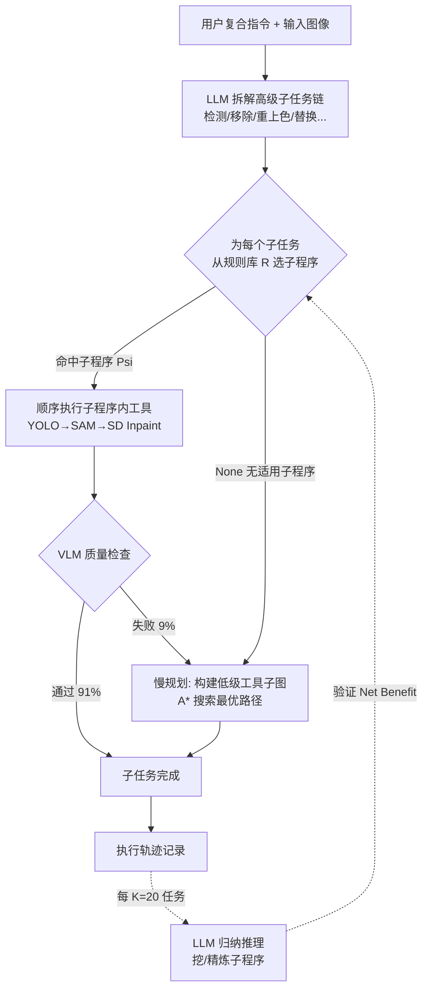

# FaSTA*: Fast-Slow Toolpath Agent with Subroutine Mining for Efficient Multi-turn Image Editing

**会议**: ICLR 2026  
**OpenReview**: [https://openreview.net/forum?id=yhhbL9T1QB](https://openreview.net/forum?id=yhhbL9T1QB)  
**代码**: 论文声明开源（Our code and data can be accessed here）  
**领域**: LLM Agent / 神经符号工具调用 / 多轮图像编辑  
**关键词**: 工具路径规划, 神经符号 Agent, A* 搜索, 子程序挖掘, 快慢思考, In-Context RL  

## 一句话总结
FaSTA* 把 LLM 的"快规划"和 A* 搜索的"慢规划"拼成一个会学习的神经符号 Agent：用归纳推理从历史成功工具路径里挖出可复用的符号化子程序当作"高级工具"，绝大多数子任务直接套子程序秒解，只有失败时才退回昂贵的 A* 搜索，在多轮图像编辑上相比 CoSTA* 省 49.3% 成本、质量只掉 3.2%。

## 研究背景与动机
**领域现状**：多轮图像编辑（如"检测长椅并把它涂成粉色，同时移除猫、把墙刷成黄色"）需要把一句复合指令拆成检测、分割、修复、重上色等一串异构子任务，每步交给专门的 AI 工具。直接用文生图模型做长程编辑很难，于是工具调用 Agent 成了主流：把任务拆成子任务，再为每个子任务规划一条"工具路径"（toolpath，一串工具调用）。

**现有痛点**：工具的质量和成本在不同任务甚至不同样本间差异巨大，规划高度依赖对每步工具质量/成本的准确估计。两条现有路线各有短板——LLM Agent 擅长"快规划"（凭先验快速拆子任务），但常误估工具成本质量、还会幻觉（明明简单滤镜就够却选昂贵扩散模型）；经典 A* 搜索能在工具依赖图上算出可验证的最优路径，但探索昂贵、是计算瓶颈。前作 CoSTA* 用 LLM 剪枝子图再跑 A*，效果好但 A* 搜索成本仍居高不下。

**核心矛盾**：CoSTA* 是纯测试时方法，**每次都从零搜索**，无法把过去任务上探索过的经验沉淀下来加速未来任务——而作者观察到，跨任务的工具子序列大量重复（如"YOLO→SAM→SD Inpaint"在 100 个任务里被用于物体移除 57 次）。人类会把高频操作录成宏来复用，机器为什么不能？

**本文目标**：在不牺牲质量的前提下，让 Agent 像人一样从历史经验中学习可复用动作，大幅压低工具路径搜索成本。

**核心 idea**：
- **【符号化子程序记忆】** 用 LLM 对历史成功路径做归纳推理，把高频工具子序列抽成带触发条件的符号规则，当成新"高级工具"。
- **【自适应快慢规划】** 先用子程序拼"快计划"，只有当子程序失败或不适用时才对该子任务**惰性触发** A* 慢搜索。

## 方法详解

### 整体框架
FaSTA* 建立在 CoSTA* 之上：先用 LLM 把指令拆成子任务链，再为每个子任务找工具路径。它在两处做了关键升级——**在线挖子程序**（从历史轨迹归纳出符号规则库 R）和**自适应快慢执行**（默认走子程序快计划，失败才退回 A* 慢搜索）。本质上是一种新颖的 In-Context RL：不存储所有原始轨迹，而是把它们浓缩成少量可复用、可解释的子程序原则来指导未来任务。

### 关键设计

**1. 在线归纳挖掘可复用子程序：把一堆轨迹压成几条符号规则。** 一个子程序 $P_s=(t_1,t_2,\dots,t_k)$ 是一串在特定条件 $C_s$ 下能有效完成某子任务的有序工具调用，整个记忆是一张规则表 $R=\{(P_j,C_j,s_j)\}_{j=1}^M$，把"子任务 + 上下文特征 → 高性价比子程序"映射起来。和标准 ICRL 直接喂原始日志不同，FaSTA* 让 LLM 做**显式归纳推理**：分析执行轨迹后合成紧凑的"(子程序, 激活规则, 子任务)"三元组。整个循环分四步——①**数据记录**：持续记下每个子任务在什么条件下走了什么路、结果如何（如 YOLO 给的物体大小、SAM 的掩码细节、LLM 推断的背景复杂度、成本/质量/是否失败）；②**周期性精炼**：每 K=20 个任务用最近一批轨迹触发一次，兼顾持续学习与系统稳定；③**LLM 归纳**：用最近轨迹 + 当前规则集提示 LLM，识别高频成功子程序并推断其激活条件——关键是条件用**语义分桶**而非数值阈值（如"物体面积小""掩码占比高"而非 `area ≤ θ`），更鲁棒可泛化；④**验证与采纳**：把 LLM 提的规则当假设，用专门测试集对照基线打"Net Benefit"分（平衡成本/质量）决定是否并入 R，失败可让 LLM 重试精炼。为保证公平，归纳是在 benchmark 之外的留出新任务集（随机互联网图 + 新复杂指令）上做的。

**2. 自适应快慢规划：默认快、失败才慢的惰性回退。** 拿到子任务链后，FaSTA* 先**不做搜索**生成"快计划"——LLM（GPT-4o）拿输入图、指令、子任务序列 $s_{1:N}$ 和规则集 R，为每个子任务 $s_i$ 选一个子程序 $P_{s_i}$ 或 "None"。若同一子任务有多个子程序满足激活条件，就选成本-质量权衡分最小者：

$$C_{avg}(P_j)^{\alpha}\times(2-Q_{avg}(P_j))^{2-\alpha}$$

其中 $C_{avg},Q_{avg}$ 是该子程序在历史路径里的平均成本与质量，$\alpha$ 是用户设的权衡系数（沿用 CoSTA*）。得到快计划 $M_{subseq}=(P_{s_1},\dots,P_{s_N})$ 后顺序执行：每个子程序内的工具逐一调用，并用 VLM 检查每步质量。**慢规划触发器**是核心——只有当某子任务选不到子程序（$s_i$=None）或某步 VLM 质量检查不过时，才为这一个子任务构建低级工具子图 $G_{low}(s_i)$ 并在上面跑 A* 搜索（成本函数和算法都同 CoSTA*）。这样昂贵的 A* 是**惰性、局部**触发的，统计上 91% 子任务靠子程序快解决，仅 9% 回退到 A*。

**3. 子程序验证：防止坏规则污染记忆。** LLM 提的规则只是假设，若不验证直接采纳，坏子程序会在执行时频繁失败、还会在真正需要 A* 时误导 Agent。FaSTA* 对每条变更 $\Delta$ 用专门测试集对照基线（CoSTA* 或当前 FaSTA*）算 Net Benefit 才决定接受。消融显示：不验证时低级回退率高达 28%，加验证后降到 9%——验证确保只有可靠子程序进库，避免在坏提议上浪费执行、也避免在该用搜索时被带偏。

## 实验关键数据

### 主实验表格
在 CoSTA* benchmark（121 个图像-指令对，1–8 子任务，共 550 次操作）上，$\alpha=1$ 平衡设置：

| 任务类型 | FaSTA* | CoSTA* | GenArtist | CLOVA | InstructPix2Pix | MagicBrush |
|---|---|---|---|---|---|---|
| 图像任务 | 0.91 | 0.94 | 0.78 | 0.70 | 0.64 | 0.67 |
| 文本+图像任务 | 0.91 | 0.93 | 0.61 | 0.50 | 0.40 | 0.43 |
| **全部任务** | **0.91** | **0.94** | 0.73 | 0.63 | 0.56 | 0.59 |

质量仅比 CoSTA* 掉 3.2%，但远超其他所有基线（尤其在 7-8 子任务的长程任务上 CoSTA*/FaSTA* 保持 0.91+，其他基线跌到 0.4–0.6）。**成本**：FaSTA* 平均 29.5s vs CoSTA* 58.2s（$\alpha=1$），降幅 49.3%。

跨数据集泛化（Complex-Edit benchmark 子集）：

| 任务复杂度 | 指标 | CoSTA* | FaSTA* |
|---|---|---|---|
| 1-3 子任务 | 成本(s)/准确率 | 46.75 / 0.88 | 35.87 / 0.86 |
| 4-5 子任务 | 成本(s)/准确率 | 77.25 / 0.90 | 54.17 / 0.89 |
| 6-8 子任务 | 成本(s)/准确率 | 105.60 / 0.90 | 73.20 / 0.88 |
| **整体** | 平均成本/准确率 | 78.27 / 0.89 | **55.12 / 0.87** |

独立 benchmark 上约 30% 成本下降、质量相当，证明增益可泛化。

### 消融实验表格

| 实验 | 设置 | 结果 |
|---|---|---|
| 子程序验证 | w/o 验证 | 低级回退率 **28%** |
| | w/ 验证 | 低级回退率 **9%** |
| 快慢规划组件 | 仅快规划 | 质量 0.84 / 成本 27.5s（脆弱） |
| | 仅慢规划 | 质量 0.93 / 成本 46.8s（贵） |
| | **FaSTA*** | **质量 0.91 / 成本 29.5s**（兼顾） |

### 关键发现
- **回退统计**：91% 子任务由子程序快解决，仅 9% 需 A* 慢搜索——昂贵搜索被有效避开。
- **经验越多越快**：留出测试集上，随着挖出的子程序增多，纯快规划成功率**指数级**上升，FaSTA* 越用越优。
- **快慢缺一不可**：仅快规划质量掉到 0.84（脆，子程序失败就放弃），仅慢规划贵到 46.8s；FaSTA* 用惰性回退拿到两者最优组合。
- **Pareto 占优**：扫不同 $\alpha$，FaSTA* 的成本-质量前沿全程压过 CoSTA* 及其他基线。

## 亮点与洞察
- **"挖宏"这个朴素观察很值钱**：作者从 100 条 CoSTA* 路径里发现工具子序列高度重复（Top-5 子程序复用率极高），这个数据驱动的观察直接催生了整套方法，动机扎实。
- **符号化 + 语义分桶让规则可解释可泛化**：不存原始日志而是归纳成"if 物体小且掩码占比高 then YOLO→SAM→SD Inpaint"这种带语义条件的符号规则，比纯数值阈值更鲁棒，也天然可读可审计。
- **惰性回退是工程上的优雅解**：默认快、失败才慢，把"何时该深思"这个决策交给 VLM 质量检查来动态触发，而非预先一刀切，91%/9% 的分流比说明这个 gate 很有效。
- **验证机制不可省**：消融里"不验证→回退率 28%"直接量化了坏规则的代价，说明"LLM 提议当假设、必须实测验证"是这类自学习 Agent 的关键护栏。

## 局限与展望
- **强依赖 CoSTA* 这套底座**：TDG / MDT / BT 等知识结构、A* 成本函数、VLM 检查标准全部沿用 CoSTA*，方法本身是增量式增强，离开这套预定义脚手架是否成立未验证。
- **质量有 3.2% 的真实损失**：用子程序换速度不是免费午餐，长程任务上偶有掉点；对质量极敏感的场景未必愿意接受。
- **子程序库的冷启动与领域迁移**：归纳需要先积累足够多历史轨迹（每 20 任务精炼一次），新领域/新工具集下从零冷启动时快规划成功率低，优势要靠经验慢慢攒出来。
- **评测重度依赖人工**：因 CLIP 等自动指标抓不住多步多模态编辑的细微错误，质量全靠人工打分，规模化与可复现性受限。
- **触发条件靠 VLM 检查**：整个快慢分流的可靠性系于 VLM 质量检查的准确度，VLM 误判会让坏路径漏过或好路径被误退。

## 相关工作与启发
- **vs CoSTA***（Gupta et al. 2025）：直接前作与主基线，提供 benchmark 和底层搜索框架；FaSTA* 的核心增量是给它加了"经验复用 + 快慢分流"，把纯测试时搜索变成会学习的 Agent。
- **vs 工具调用 Agent**（GenArtist、CLOVA、Visual ChatGPT、MM-REACT）：这些要么贪心调工具不管预算、要么缺乏从历史模式学习的机制，导致重复计算；FaSTA* 的子程序记忆正是补这一课。
- **vs ICRL**（In-Context RL）：标准 ICRL 把原始经验日志一股脑塞进上下文、泛化低效；FaSTA* 用 LLM 显式归纳成紧凑符号规则，是对 ICRL 的一个具体改进。
- **启发**：这套"高频子结构挖掘 → 符号化 → 惰性回退"的范式不限于图像编辑，任何"LLM 规划 + 昂贵搜索/执行"的工具 Agent（代码 Agent、网页 Agent、机器人技能库）都可借鉴——把反复出现的成功子流程沉淀成可复用技能，再用质量 gate 决定何时退回慢思考。

## 评分
- **新颖性**: ⭐⭐⭐⭐ — "符号化子程序记忆 + 自适应快慢规划"组合新颖，把人类"录宏复用"的直觉落地为可学习的神经符号 Agent；不过整体是 CoSTA* 之上的增量增强而非全新框架。
- **实验充分度**: ⭐⭐⭐⭐ — 两个 benchmark、Pareto 前沿、回退统计、验证/快慢组件消融都齐，结论清晰；扣分在质量靠人工评测、规模偏小（121+子集）。
- **写作质量**: ⭐⭐⭐⭐ — 动机链条（观察重复→挖宏→快慢分流）讲得顺，图表到位；细节大量塞进附录，正文部分推导略简。
- **价值**: ⭐⭐⭐⭐ — 近乎对半砍成本却几乎不掉质量，对成本敏感的工具 Agent 部署很实用，且范式可迁移到其他规划+搜索类 Agent。

<!-- RELATED:START -->

## 相关论文

- [\[ICLR 2026\] M²-Miner: Multi-Agent Enhanced MCTS for Mobile GUI Agent Data Mining](m2-miner_multi-agent_enhanced_mcts_for_mobile_gui_agent_data_mining.md)
- [\[CVPR 2026\] iSHIFT: Lightweight Slow-Fast GUI Agent with Adaptive Perception](../../CVPR2026/llm_agent/ishift_lightweight_slow-fast_gui_agent_with_adaptive_perception.md)
- [\[ICLR 2026\] Evaluating Memory in LLM Agents via Incremental Multi-Turn Interactions](evaluating_memory_in_llm_agents_via_incremental_multi-turn_interactions.md)
- [\[ICLR 2026\] ToolACE-MT: Non-Autoregressive Generation for Agentic Multi-Turn Interaction](toolace-mt_non-autoregressive_generation_for_agentic_multi-turn_interaction.md)
- [\[ICLR 2026\] Efficient Agent Training for Computer Use](efficient_agent_training_for_computer_use.md)

<!-- RELATED:END -->
