# Flash-Searcher: Fast and Effective Web Agents via DAG-Based Parallel Execution

**会议**: ICLR 2026  
**OpenReview**: [https://openreview.net/forum?id=QuaJ6kJaBm](https://openreview.net/forum?id=QuaJ6kJaBm)  
**代码**: [https://github.com/OPPO-PersonalAI/Flash-Searcher](https://github.com/OPPO-PersonalAI/Flash-Searcher)  
**领域**: LLM Agent / Web Agent / Deep Research  
**关键词**: 并行推理, DAG, 工具增强 Agent, Deep Research, 工作流优化, 蒸馏  

## 一句话总结
把传统 web agent 的"串行思考链"重写成"DAG 并行执行图"，让相互独立的子任务同时检索同时推理，在 BrowseComp / xbench / GAIA / HLE 上拿到 SOTA 的同时把执行步数砍掉 35%、端到端时间缩短约 65%。

## 研究背景与动机
**领域现状**：当下解决复杂深度检索任务（deep research）的 agent 主要走两条路——多智能体系统（MAS）让多个角色 agent 协作规划、推理、调工具；工具集成推理（TIR）则把工具调用能力通过训练塞进单个模型。两条路都在 BrowseComp 这类 internet-scale 检索基准上展现了不错的能力。

**现有痛点**：无论 MAS 还是 TIR，骨子里都是**串行处理**。MAS 因为顺序调度 + 冗余通信导致工具利用低效、推理链冗长、执行时间过长；TIR 则容易把推理链拉到撑爆上下文窗口。更糟的是，为了提升可靠性两者还要叠加反思、自我批判、迭代验证等机制，进一步拉高计算开销——当前框架完成一个深度研究任务动辄需要 20+ 甚至 40+ 次交互，耗时可达数小时。

**核心矛盾**：解的质量和计算效率之间存在尖锐张力。任务越复杂，串行链越长、延迟越高，用户体验越差，这严重限制了 agent 在响应式应用里的落地。作者甚至直接发问：当复杂任务带来不可避免的延迟时，用户真的愿意为那点性能提升忍受（或付费）这些等待吗？

**本文目标**：在不牺牲（甚至提升）任务质量的前提下，从根本上压缩执行步数与延迟，重新定义复杂任务求解的"效率—效果"前沿。

**核心 idea**：**[把执行范式从串行链改造成有向无环图（DAG）]**——把复杂任务拆成带显式依赖的子任务，让没有依赖关系的推理路径并发执行，同时用动态工作流优化持续根据中间结果重写执行图，并配合主动信息检索与知识共享减少冗余交互。

## 方法详解

### 整体框架
Flash-Searcher 把传统线性工作流转码成一个**动态 DAG 计划**，整条流水线分三步循环推进：先把任务 $T$ 分解成带依赖的子目标图 $G_{\text{plan}}$；再在每个执行步并行调度"就绪"的子任务、并发调工具；最后每隔 $\Delta$ 步根据已完成结果自适应重写 DAG 并做进度总结，直到所有子任务清空、汇总出最终答案。

```mermaid
flowchart TD
    T[复杂任务 T] --> D[DAG 计划构建 D&#40;T&#41;]
    D --> G["G_plan = &#40;V, E&#41;<br/>子任务+依赖边"]
    G --> E{就绪判定 φ<br/>选出可执行子任务}
    E --> P[并行执行 &amp; 工具编排<br/>多分支同时调 Search/Crawl]
    P --> S[状态聚合 F<br/>整合多路观测]
    S --> R{每 Δ 步<br/>自适应重写 DAG R}
    R -->|删已完成/补新节点| E
    R -->|P_t 为空| A[进度总结 → 最终答案]
```

### 关键设计

**1. DAG 计划构建：把任务依赖显式建模成图，解锁并行空间。** 给定复合任务 $T$，分解函数 $\mathcal{D}$ 识别出构成子任务及其相互依赖，产出 DAG 计划 $\mathcal{D}(T)=G_{\text{plan}}=(V,E)$，其中 $V=\{t_1,\dots,t_n\}$ 是子任务节点、$E\subseteq V\times V$ 编码先后约束——每条有向边 $(t_i,t_j)$ 表示 $t_i$ 必须先于 $t_j$。这一步是整个框架的地基：传统 agent 把任务摊成一条线性链，而这里一开始就把"哪些目标彼此独立、哪些必须排队"写进图结构，为后续并发调度划好了边界。论文 Figure 1 的例子里，"找 2013–2023 年票房 1.45–1.75 亿美元的美国电影"和"找奥斯卡获奖导演执导的电影"就是两条可以同时跑的独立 Goal。

**2. 激进并行调度 + 工具编排：放宽拓扑排序，允许"未完全就绪"也先跑。** 在执行步 $t$，框架从待处理集合 $\mathcal{P}_t\subseteq V$ 里用就绪谓词 $\varphi$ 选出候选子任务 $\mathcal{E}(G_t,\mathcal{P}_t)=\{v_i\in\mathcal{P}_t\mid\varphi(v_i,G_t,s_t)=1\}$。关键在于 $\varphi$ 不是严格拓扑排序：一个子任务 $v_i$ 只要满足 (i) 所有前置已完成，**或** (ii) 部分执行能为依赖验证提供辅助信号，就可以被调度——也就是把"交叉验证"做成了依赖满足与启发式一致性检查的混合判据，从而比保守的拓扑调度释放出更多并行度。被选中的多个子任务通过工具/agent 并发调用，系统再把多路结果聚合进推理状态 $s_{t+1}=\mathcal{F}\big(s_t,\{a_t^{(k)}\}_{k=1}^m,\{o_t^{(k)}\}_{k=1}^m\big)$，其中 $a_t^{(k)}$、$o_t^{(k)}$ 是第 $k$ 路并行执行的动作与观测。工具侧刻意做得极简——只用 Serper API 的 Search 工具 + Jina Reader 的 Crawl 工具，且 Crawl 自带同骨干模型的自动摘要，既保证信息表示一致又显著降低上下文负担，让并行编排不至于把轨迹搞乱。

**3. 自适应进度跟踪与 DAG 重写：每 Δ 步根据中间结果动态优化执行图。** 框架每隔 $\Delta$ 步刷新一次 DAG 计划：$G_{\text{plan}}^{t+\Delta}=\mathcal{R}\big(G_{\text{plan}}^{t},\mathcal{C}_t,\mathcal{P}_t,s_t\big)$，其中 $\mathcal{C}_t$ 是已完成子任务集合。重写规则 $\mathcal{R}$ 做三件事：删掉已解决的节点、根据交叉验证结果重新校验未解决的依赖、并在需要时动态插入新的分解节点。$\Delta$ 是个可调旋钮——$\Delta$ 越小刷新越频繁、任务自适应越快越灵敏；$\Delta$ 越大则抑制过度优化、在复杂或稳定任务上省下计算开销。正是"DAG 分解 + 受控激进并行 + 周期性图优化"这三者合一，让 Flash-Searcher 在保持逻辑一致性的同时绕开了串行瓶颈（完整流程见论文 Algorithm 1：循环选就绪集 → 并行执行 → 聚合更新状态 → 每 Δ 步重写图，直到待处理集为空）。

**4. 并行轨迹蒸馏：把框架级的并行推理能力 SFT 进单模型。** 为验证范式可迁移，作者从 WebWalker、ASearcher、WebShaper、CoA 等数据源构造了 3354 条高质量 DAG 推理轨迹，每条都带周期性 DAG 工作流复盘、并格式化成多轮对话以利长程依赖建模与上下文外推。然后用 Llama-Factory 对 Qwen-2.5 系列做轻量 SFT（最大对话长度 131,072 token、学习率 $10^{-5}$、4 个 epoch，**不用 RL、不依赖工具**）。这一步把"并行推理"从一种框架编排能力转化为一种**可学习、可扩展的归纳偏置**，证明无需重型训练就能把并行 agent 策略传给开源模型。

## 实验关键数据

### 主实验（框架，Pass@1）
Flash-Searcher 配 GPT-5 在四大基准上全面领先或逼近最强闭源方案：

| 基准 | Flash-Searcher (GPT-5) | 代表对手 |
|------|------|------|
| BrowseComp | **67.7** | OpenAI ChatGPT agent 68.9 / BrowseMaster(开源) 30.0 |
| xbench-DeepSearch | **83.0** | BrowseMaster 66 / Metaso DR 64 |
| GAIA | 82.4（GPT-5-mini 也达 80.6） | Alita 75.2 / Manus 73.3 |
| HLE | **44.0** | OAgents 26.9 等，全面领先 |

即便换上较弱的 GPT-5-mini，BrowseComp 仍有 35.3%，GAIA 达 80.6% 反超 Alita / Manus，说明并行范式不挑骨干模型。

### 蒸馏 Agent 模型（Table 1，Pass@1）
轻量 SFT 把并行能力迁进开源模型后刷新同规模 SOTA：

| Backbone | 方法 | BrowseComp | xbench | GAIA | HLE |
|------|------|------|------|------|------|
| Qwen-2.5-32B | AFM-RL | 11.1 | 58.0 | 55.3 | 18.0 |
| Qwen-2.5-32B | **Flash-Searcher** | **14.4** | **63.0** | **57.3** | **19.4** |
| Qwen-2.5-72B | WebSailor | 12.0 | 55.0 | 55.4 | - |
| Qwen-2.5-72B | **Flash-Searcher** | **18.9** | **68.0** | **61.2** | **20.2** |

32B 上较最强先前方法 BrowseComp +3.3 / xbench +5.0 / GAIA +2.0；扩到 72B 持续涨点，且在最复杂的 BrowseComp、xbench 上增益最大（约 +5），说明并行范式随模型容量优雅扩展；HLE 上即使不用代码解释器也拿 SOTA，印证其推理鲁棒性。相比 WebDancer，xbench 提升达 29.3。

### 效率分析（GPT-5-mini）
- GAIA 上执行步数较 OAgents 降 **35%**（11.2→7.4 步）、较 OWL-Roleplaying 降 30%；BrowseComp 端到端时间从 27.4 分压到约 9.6 分（约 **−65%**）。
- 每步工具调用数平均 **3.00**，而 OAgents 仅 0.83、OWL-Roleplaying 0.85——并行让每步更"密"、更高效。
- 任务越复杂优势越明显（BrowseComp > xbench > HLE > GAIA），同时提升效率与性能，真正同时改善了长期存在的效率—效果权衡。

### 关键发现
DAG 并行执行直接消灭了串行链里的冗余工具调用循环：通过跨分支协调信息需求去重检索，既砍步数又保留推理多样性，从而打破"要么快要么准"的二选一。

## 亮点与洞察
- **范式级而非技巧级的改动**：不是给串行链加 trick，而是把执行底座从"链"换成"图"，把并行从实现细节提升为一等公民，这让效率与效果可以同向提升而非互相牺牲。
- **激进但受控的并行**：就绪谓词 $\varphi$ 允许"前置未完全就绪也先跑"，用交叉验证兜底，在并行度和正确性之间找了个聪明的折中——这是比纯拓扑排序更激进、又比无脑并发更安全的设计。
- **工具极简主义**：只用 Search + Crawl 两个工具 + 自动摘要，证明强性能不必堆复杂工具箱，反而让并行编排的轨迹更干净可控。
- **并行是可蒸馏的归纳偏置**：仅靠 3354 条轨迹的轻量 SFT（无 RL）就把并行能力传进开源 Qwen，且随规模涨点，意味着这套范式不被闭源大模型独占。

## 局限与展望
- **缺少模块级消融**：论文主要给出整体性能与效率对比，但对 $\Delta$ 取值、就绪谓词 $\varphi$ 两种触发条件各自贡献、DAG 重写规则三种操作的拆解消融较薄，难以定位增益主要来自哪一环。
- **依赖外部 API 稳定性**：执行时间受 Serper / Jina API 速率限制与推理非确定性影响，作者自己也承认精确复现有挑战；步数降低虽稳健，但端到端时延仍受环境波动。
- **任务分解质量是上限**：整套框架建立在 $\mathcal{D}$ 能把任务正确拆成合理 DAG 之上，若分解错误或粒度不当，并行反而可能放大错误路径——论文未深入讨论分解失败时的鲁棒性。
- **并行带来的成本结构**：每步 3.00 次工具调用虽降低了总步数，但单步并发工具调用是否在 token / API 计费上真正省钱，需要更细的成本会计（论文放在附录 D.3）。

## 相关工作与启发
- **对照 MAS（CAMEL / MetaGPT / ChatDev / Magnetic-One / Workforce / Alita）**：这些工作强调角色分工与协作循环，但普遍是串行调度 + 冗余通信，延迟问题被低估；Flash-Searcher 正是冲着"latency 被忽视"这个空白去的。
- **对照 TIR（Search-o1 / 各类 post-training agent）**：TIR 把工具能力训进单模型但执行流程窄、易撑爆上下文；本文用 DAG 把流程"摊宽"而非"拉长"。
- **最接近的 ParallelSearch**：同样想并行化检索，但它聚焦把查询拆成独立子查询；Flash-Searcher 更进一步把整个推理-执行过程组织成动态可重写的 DAG，并支持周期性图优化与跨分支知识共享。
- **启发**：当一个 agent 框架的瓶颈是"链太长"时，与其优化链上每一环，不如先问"这条链里有多少步本就互相独立、能并发"——把依赖关系显式化成图，往往能同时拿下效率和效果。

## 评分
- **新颖性**: ⭐⭐⭐⭐ — 把 DAG 并行执行系统性引入 web agent 并配合动态图重写 + 轨迹蒸馏，范式层面的重构而非增量调参，方向有说服力。
- **实验充分度**: ⭐⭐⭐⭐ — 四大硬基准 + 多骨干 + 框架/蒸馏双路验证 + 详尽效率分析，覆盖广；扣分在模块级消融偏薄。
- **写作质量**: ⭐⭐⭐⭐ — 动机犀利（直接质问延迟值不值）、公式与 Algorithm 清晰、图示直观，少数图表排版略显拥挤。
- **价值**: ⭐⭐⭐⭐ — 同时打破效率—效果权衡且全面开源代码与数据，对 deep research / 响应式 agent 落地有直接实用价值。

<!-- RELATED:START -->

## 相关论文

- [\[AAAI 2026\] Cook and Clean Together: Teaching Embodied Agents for Parallel Task Execution](../../AAAI2026/llm_agent/cook_and_clean_together_teaching_embodied_agents_for_paralle.md)
- [\[ICLR 2026\] Agent Data Protocol: Unifying Datasets for Diverse, Effective Fine-tuning of LLM Agents](agent_data_protocol_unifying_datasets_for_diverse_effective_fine-tuning_of_llm_a.md)
- [\[ICLR 2026\] Web-CogReasoner: Towards Multimodal Knowledge-Induced Cognitive Reasoning for Web Agents](web-cogreasoner_towards_multimodal_knowledge-induced_cognitive_reasoning_for_web.md)
- [\[ICLR 2026\] The Tool Decathlon: Benchmarking Language Agents for Diverse, Realistic, and Long-Horizon Task Execution](the_tool_decathlon_benchmarking_language_agents_for_diverse_realistic_and_long-h.md)
- [\[ICLR 2026\] WALT: Web Agents that Learn Tools](walt_web_agents_that_learn_tools.md)

<!-- RELATED:END -->
