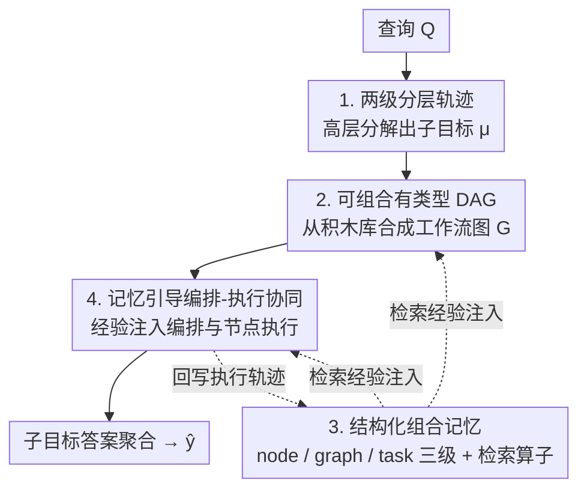

# FlowSearcher: Synthesizing Memory-Guided Agentic Workflows for Web Information Seeking

**会议**: ICLR 2026  
**OpenReview**: [https://openreview.net/forum?id=34v7DVz2l0](https://openreview.net/forum?id=34v7DVz2l0)  
**代码**: https://github.com/XiangKeYiNTU/flowsearcher  
**领域**: LLM Agent / 深度搜索 / Agentic Workflow  
**关键词**: 工作流合成, 分层记忆, 经验复用, 深度研究智能体, Web 信息搜索

## 一句话总结
FlowSearcher 把 Web 信息搜索从「ReAct 式的线性工具链」重新表述为「记忆引导的 agentic 工作流合成」——先把查询拆成子目标、为每个子目标合成一张有类型的工作流 DAG，再用一套 node/graph/task 三级记忆把过往轨迹沉淀为可复用的结构化经验注入编排与执行，从而在不做任何监督微调或 RLHF 的前提下，在 GAIA / BrowseComp / GPQA 上追平甚至超过同规模的 RL 训练 Web 智能体。

## 研究背景与动机
**领域现状**：深度研究智能体（deep research agent）已经成为把 LLM 从「静态知识库」变成「能上网检索、评估、综合知识的协作者」的关键路线，OpenAI Deep Research、Gemini Advanced 都是代表。主流开源系统（WebThinker、WebDancer、Search-o1 等）几乎都沿用 ReAct 模板，把「思考–行动–观察」串成一条线性轨迹，或者用 plan–execute 先生成一份固定计划再照着执行。

**现有痛点**：作者指出，真正的瓶颈不是模型规模，而是「智能体决定如何在网上导航的决策结构」。ReAct 式的单线程轨迹会把本质上**分叉**的研究查询硬压成线性链，压制了并行探索、回溯和结构性修订；plan-first 框架虽然有更高层的组织，但计划一旦生成就是固定脚手架，新证据到来时几乎无法重排或自适应。

**核心矛盾**：第二个更深的痛点是「跨任务无法学习」。大多数智能体活在 episode isolation 里——工具调用发生在短反应链中，一旦 episode 结束，学到的东西就蒸发了。它们依赖的是 ephemeral、episodic 的记忆，思维链、工具轨迹、探索路径从未被固化成持久的结构化知识，于是智能体不断「重新发明轮子」，在相似任务上几乎没有积累。

**本文目标**：(1) 让工作流结构本身成为可被推理、修订、复用的一等对象；(2) 建立一个累积式的结构化记忆，能保留、组织、复用过往工作流。

**切入角度**：与其让 backbone LLM 在单条反应轨迹里隐式地理解和分解查询，不如把「该用什么样的信息搜索流程」这件事显式地拿出来推理——把工作流表示成显式的图，让组合、排序、修订都变成可操作对象。

**核心 idea**：用「经验驱动的工作流合成」替代「顺序工具调用预测」，并用分层记忆把过往轨迹的结构知识注入到新查询的工作流设计与执行中，实现 learning-free 的泛化。

## 方法详解

### 整体框架
FlowSearcher 把一次研究任务连同其求解轨迹形式化为三元组 $\{Q, \hat{y}, \Gamma\}$：$Q$ 是原始查询，$\hat{y}$ 是预测答案，$\Gamma = \{\mu_i, G_i\}$ 是由分解出的子问题 $\{\mu_i\}$ 及其对应工作流图 $\{G_i\}$ 组成的轨迹。系统额外维护一个结构化执行记忆 $M$，每步执行后增量更新，既记录中间轨迹，又反过来为后续的工作流合成与执行提供经验基础。

整个求解被组织成**两级轨迹**：高层负责「查询分解 + 工作流合成」，低层负责「工作流执行」。高层逐步把查询拆成子问题 $\mu_i$ 并为其合成工作流图 $G_i$，整条轨迹的概率为

$$P(\Gamma \mid Q, M_0) = \prod_{i=1}^{K} P(\mu_i \mid Q, \Gamma_{<i}, M_{i-1}, \theta_\mu)\, P(G_i \mid Q, \Gamma_{<i}, M_{i-1}, \theta_G, \mu_i),$$

其中 $\theta_\mu, \theta_G$ 是分解模块与工作流合成模块的提示。轨迹起点 $\Gamma_0, M_0 = \varnothing$，随着轨迹展开记忆被增量充实。低层把每个 $G_i$ 在**节点级**执行：节点沿依赖边逐个跟进，在累积记忆引导下与 Web 环境交互产生动作序列 $\alpha$ 与观察 $o$，对一个含 $K_v$ 个动作步的节点分解为 $P(\alpha, o \mid \mu_i, M_{i-1}) = \prod_{t=1}^{K_v} P(\alpha_t, o_t \mid \alpha_{<t}, o_{<t}, \mu_i, M_{i-1})$。所有子目标解完后做一次 finalize 聚合出 $\hat{y}$。

### 关键设计

**1. 两级分层任务建模：把「设计流程」和「执行流程」解耦**

ReAct 把「理解查询」和「逐步选动作」紧紧耦合在一条反应轨迹里，查询一复杂、一异质，backbone LLM 在 prompt-time 推理里能编码的策略就不够用了。FlowSearcher 的应对是把求解显式切成上下两级：上层只管「把 $Q$ 迭代分解成子问题、并为每个子问题决定该用什么结构的工作流」，下层只管「把这张工作流图在节点级老老实实执行」。这样高层的编排（orchestration）和低层的执行（execution）被分开，既能让分解对齐执行，又让记忆能在两级分别落地。式 (1)(2) 正是这套上下级的概率分解：上层在 $\theta_\mu, \theta_G$ 两套提示下采样子问题与工作流图，下层在节点内逐动作展开。解耦带来的直接好处是「非线性研究行为」成为可能——分叉探索、回到先前决策、重组中间步骤，都可以在工作流图这个层面发生，而不必塞进一条线性链。

**2. 工作流即可组合的有类型 DAG：用一套紧凑积木库换来结构表达力**

把工作流当成「隐式执行痕迹」或「固定协议模板」是过往方法的通病。FlowSearcher 把工作流显式表示成**有类型的有向无环图**（typed DAG），节点从一个预定义的积木库 $\mathcal{B}$（building blocks）里挑选并组合。形式化地，编排器为子问题 $\mu_i$ 构造

$$\text{orchestrator}(Q, \mu_i, \Gamma_{<i}, B, \theta_G) \xRightarrow{M_{i-1}} G_i\big(V_{[\tau,\theta,l]}, E_{[\rho]}\big),\quad V \subseteq B,\ E \subseteq V \times V,$$

其中 $V_{[\tau,\theta,l]}$ 是被工具 $\tau$、提示模式 $\theta$、backbone 模型 $l$ 参数化的有类型节点，$E_{[\rho]}$ 是受 Web 语法 $\rho$ 约束的合法边。积木库覆盖三类节点及其变体：Searcher（General / First-Hit / Parallel）、Browser（First-Hit / In-Depth / General）、Summarizer（General / Ensemble）；它们能拼出 Swift-Hit、Parallel、Break-Down 等不同的工具使用模式。关键在于：$G_i$ 的构造绑定了 $Q$、当前子问题 $\mu_i$、先前轨迹 $\Gamma_{<i}$ 和记忆 $M_{i-1}$，所以每张工作流不是静态拼装，而是「随上下文演化的、经验驱动的程序」。论文的消融（见下文 Table 2）也佐证：决定性能的是「工作流表达力」而非「工具数量」。

**3. 结构化组合记忆：node / graph / task 三级 + 统一检索算子**

要跨任务复用经验，就得有比 episodic context window 更结构化的东西。FlowSearcher 设计了一套三级层次的 Structured Compositional Memory，整体是任务条目的集合 $M = \{M^{task}_j\}$：

- **节点级** $M^{node}_v = (N_v, \alpha(v), o(v))$：记录节点类型与变体 $N_v$、动作序列与输出，支持工具执行模式的精确重放与迁移。
- **图级** $M^{graph}_i = (\mathcal{G}_i, \mu_i, \gamma_i, n_i, \{M^{node}_v\})$：$\mathcal{G}_i$ 是工作流图的文本表示，$\gamma_i \in \{0,1\}$ 是成功标记，$n_i$ 是每工具使用次数向量（分量 $(n_i)_\tau$ 数工具 $\tau$ 被调用几次）。同时记录结构、成败信号和工具统计，让系统能定向复用有效策略、又避免对脆弱工具链的过度依赖。
- **任务级** $M^{task}_j = (Q_j, \xi_Q, \{M^{graph}_i\}_{i=1}^K)$：$\xi_Q \in \{0,1\}$ 标记整任务是否解决，封装端到端的问题上下文与结果，让成功和失败都能被直接召回。

检索由一个统一算子 $R(\cdot; \zeta)$ 完成，$\zeta \in \{\text{graph}, \text{node}\}$ 指定检索层级。给定新查询 $(Q^*, \mu^*; \zeta)$，它按原问题与子问题的嵌入相似度的加权和取 top-$k$：

$$R(Q^*, \mu^*; \zeta) = \mathop{\arg\text{top-}k}\limits_{M^{task},\, Q,\, M^\zeta,\, \mu}\left(\delta\,\frac{E(Q^*)\cdot E(Q)}{|E(Q^*)||E(Q)|} + (1-\delta)\,\frac{E(\mu^*)\cdot E(\mu)}{|E(\mu^*)||E(\mu)|}\right),$$

其中 $E(\cdot)$ 是文本嵌入，$\delta$ 平衡「原问题相似度」与「子问题相似度」。命中条目还会在层次内灵活展开成 $R(Q^*,\mu^*;\zeta) \oplus \{M^\zeta_i\}$，让推理既能 ground 在相关历史查询上，也能落到具体执行痕迹里的细粒度经验。这套「检索由任务查询 + 正在合成的工作流结构共同塑造」的设计，正是它区别于 A-MEM / Mem0 / G-Memory 那些固定检索策略记忆的地方。

**4. 记忆引导的编排-执行协同优化：把检索到的经验「蒸馏成洞见」再注入**

光有记忆还不够，关键是怎么把它喂回生成过程。FlowSearcher 在编排和执行两端都做经验注入，且都遵循「检索 → 蒸馏成简洁洞见 → 注入提示」三步。**编排端**：$\tilde{M}_G = R_G(Q^*, \mu^*)$ 检索图级痕迹（含工作流结构 $G$、成功标记 $\gamma$、工具统计 $n_k$），由编排 instructor $I_G$ 蒸馏成简洁洞见 $\xi_G$，注入编排提示得到 $G^* = \text{orchestrator}(\theta_G \oplus \xi_G)$（式 5）。通过对比成功与失败的工作流，系统能挖出指导设计选择的结构模式，工具统计还揭示「效率如何随结构变化」，让编排资源感知、被历史系统性地打磨。**执行端**：$\tilde{M}_v = R_v(Q^*, \mu^*)$ 检索节点级痕迹，经节点 instructor $I_v$ 蒸馏出执行洞见 $\xi_v$，注入节点提示得到 $(\alpha^*, o^*) = \text{execute}(\theta_v \oplus \xi_v, \tau_v)$（式 6）。这支持 node-type specialization（按检索/解析/调用等角色细化执行）和 cross-query transfer（新任务继承结构相似节点的行为）。工作流图 $G^*$ 提供结构脚手架，节点级记忆驱动局部行为修正——错误被定位、缓解在节点这一层，长程工作流的鲁棒性因此提升。作者称这是首个实现「经验驱动 agentic 工作流规划」的框架。

### 一个完整示例
以原问题「找一个在 1940s–1960s 播出、且以打破第四面墙著称的漫画角色」为例：高层编排器先分解出子目标 1「列出 1940s–1960s 在播的角色」、子目标 2「列出以打破第四面墙著称的漫画角色」。对子目标 1，编排器检索图级记忆发现「这类列举型查询用 Parallel Searcher + General Summarizer 更稳」，于是合成一张含并行搜索节点 + 汇总节点的工作流图；执行时节点级记忆注入「优先以下来源」「这任务可能涉及导航」之类的执行洞见。两个子目标的工作流各自在节点级执行、回写痕迹到记忆，最后 finalize 把两条线索求交，定位到同时满足两个条件的角色作为 $\hat{y}$。整个过程没有任何参数更新，所有「该并行还是该深挖、该用哪个 source」的改进都来自检索到的过往经验。

## 实验关键数据

### 主实验
三个 benchmark（GAIA 文本子集 103 题、BrowseComp、GPQA-Diamond），统一报告 Pass@1。OpenAI Deep Research 仅作灰色参考（不可复现，不纳入定量对比）。

| Backbone | 框架 | GAIA Avg. | GPQA Avg. | BrowseComp Avg. |
|----------|------|-----------|-----------|------------------|
| Qwen-2.5-32B | Vanilla ReAct | 31.0 | 53.0 | 0.0 |
| QwQ-32B | WebThinker-Base | 44.7 | 68.7 | 2.3 |
| QwQ-32B | WebThinker-RL | 48.5 | 70.7 | 2.7 |
| QwQ-32B | WebDancer | 51.5 | - | 3.8 |
| QwQ-32B | **FlowSearcher** | **56.3** | **71.2** | **8.0** |
| GPT-4o-mini | **FlowSearcher** | 55.3 | 65.7 | **11.8** |

关键对比：QwQ-32B 上 FlowSearcher 比 WebDancer 在 GAIA +4.8、BrowseComp +4.2；GPQA 上达到 71.2，与 DeepSeek-R1-671B（74.2）相当却小了一个数量级。相比 WebThinker-Base，论文 intro 报告 +11.5% GAIA、+9.5% BrowseComp（GPT-4o-mini 上 BrowseComp 11.8 vs 2.3 即 +9.5）。最有力的对照是：WebThinker-RL 在重金做数据集和训练后，相对 Base 仅 GAIA +3.8、GPQA +2.0、BrowseComp +0.2——说明「微调本身救不了线性 ReAct 的结构瓶颈」，而 FlowSearcher 全程无监督微调。

### 消融实验

| 配置（积木库规模，Table 2 / GAIA Avg.） | 指标 | 说明 |
|------|---------|------|
| First-Hit only | 27.2 | 只能单次搜索、首条命中即停 |
| First-Hit + General | 35.0 | +7.8，可发多查询、浏览多页，但不能深度导航 |
| No limitations（完整） | 55.3 | +20.3，开放全部积木 |

| 记忆组合（Table 3 / 1-103 累积成功数） | 数值 | 说明 |
|------|---------|------|
| Full Mem. | 57 | 长期最优，成功+失败痕迹共同支撑纠错与泛化 |
| Succ.-Only | 53 | 早期上升最快（无噪声地强化正样本模式） |
| Unsucc.-Only | 48 | 改进慢 |
| No Mem. | 42 | 最慢，凸显结构化经验复用的重要性 |

### 关键发现
- **表达力 > 工具数量**：积木库从 first-hit-only 扩到完整带来 +20.3% 的跃升，远大于「+General」的 +7.8%，证明决定性能的是工作流可表达的策略空间，而非单纯堆工具。
- **记忆的 exploitation/correction 权衡**：只用成功记忆早期涨得最快（强化高质量正模式），但全量记忆长期反超——失败痕迹随时间变得关键，用来暴露 failure mode、修订工作流结构、支撑长程泛化。
- **积木使用随任务难度自适应**（Fig 4）：First-Hit Searcher 在各级都占主导（多数子步是快速查证）；Parallel Searcher 在 GAIA Level 2/3 更频繁；In-Depth Browser 在 Level 3 急剧上升成为最常用——编排器确实按角色把积木分配给匹配的任务。
- **资源受限下仍稳健**：即便工具集缩小，系统会重组工作流（搜索受限就转深度浏览、浏览受限就靠汇总）来维持性能。

## 亮点与洞察
- **「工作流结构」被提升为一等对象**：把求解结构从「step-wise 动作的隐式副产物」变成可操作、可修订、可跨查询复用的显式 DAG，这是和 ReAct/plan-execute 最根本的分野，也是分叉探索/回溯能够发生的载体。
- **记忆不是辅助件而是驱动器**：三级记忆 + 「检索由任务查询和正在合成的工作流结构共同塑造」的设计，让经验直接塑造工作流怎么拼、节点怎么执行，而不是只缩短 prompt。这套思路可迁移到任何需要跨 episode 积累的 agent 系统。
- **learning-free 却追平 RLHF**：核心论点「memory-driven workflow design 能解锁与微调相当甚至更好的提升」由 WebThinker-RL 几乎不涨的对照强力支撑——对没有训练预算、又想要持续自我精炼的场景极有吸引力。
- **「检索 → 蒸馏成洞见 → 注入提示」的注入范式**：不直接把原始痕迹塞进上下文，而是先用 instructor 蒸馏成简洁 $\xi$，既控制了上下文长度又提炼了可操作经验，是个干净可复用的工程模式。

## 局限与展望
- **依赖 backbone 的指令遵循与嵌入质量**：编排/执行洞见全靠提示注入和嵌入检索（式 3 的余弦相似度 + $\delta$ 加权），若 backbone 对结构化提示不敏感、或嵌入对子问题区分度差，注入收益会打折；论文未充分分析 $\delta$、top-$k$ 的敏感性。
- **积木库是预定义的**：虽然比固定模板灵活，但 Searcher/Browser/Summarizer 三类变体仍由人工设计，开放域里遇到库外的工具使用模式时表达力受限；作者也把「更细粒度模式与更具表达力的工作流表示」列为未来方向。
- **记忆随任务增长的成本与漂移**：三级痕迹持续累积，检索/存储开销、以及过时/误导经验的污染如何控制，论文未深入；GAIA 只用 103 题文本子集，长程持续学习的稳定性还需更大规模验证。
- **评测范围**：仅在三个 QA/browsing benchmark 上验证，多模态、需要真实交互（表单、登录）的复杂 Web 任务尚未覆盖。

## 相关工作与启发
- **vs WebThinker / WebDancer（ReAct/RL 式）**：它们把信息搜索压成线性 think–act–observe 链或端到端 RL 管线，全局策略隐式、优化困难；FlowSearcher 显式合成工作流图、且无需训练。对照实验里 WebThinker-RL 重金训练仅微涨，凸显结构 > 微调。
- **vs AutoFlow / AFLOW / MermaidFlow（自动工作流合成）**：它们在预定义工作流空间里用固定模板、进化搜索或离线优化产生工作流；FlowSearcher 在**推理时动态**合成，并把结构与执行都条件化在检索到的经验和任务证据上。
- **vs A-MEM / Mem0 / G-Memory（agent 记忆）**：它们多用固定检索策略或有限的记忆抽象；FlowSearcher 引入「工作流条件化的多级记忆」，检索由任务查询和正在演化的工作流结构共同塑造，让经验直接反哺工作流设计与执行。

## 评分
- 新颖性: ⭐⭐⭐⭐⭐ 把 Web 搜索重构为「经验驱动的工作流合成」并让记忆驱动结构设计，是清晰且站得住的范式转变。
- 实验充分度: ⭐⭐⭐⭐ 三 benchmark + 多 backbone + 积木/记忆两组消融较完整，但缺超参敏感性与更大规模长程验证。
- 写作质量: ⭐⭐⭐⭐ 形式化与图示清楚，两级轨迹和三级记忆讲得明白；个别记号（式 3 的展开 $\oplus$）略简。
- 价值: ⭐⭐⭐⭐⭐ learning-free 追平 RLHF 的结论 + 可迁移的记忆注入范式，对深度研究智能体很有实践意义。

<!-- RELATED:START -->

## 相关论文

- [\[ICLR 2026\] GPS: Graph-guided Proactive Information Seeking in Large Language Models](gps_graph-guided_proactive_information_seeking_in_large_language_models.md)
- [\[ICLR 2026\] InfoMosaic-Bench: Evaluating Multi-Source Information Seeking in Tool-Augmented Agents](infomosaic-bench_evaluating_multi-source_information_seeking_in_tool-augmented_a.md)
- [\[ICLR 2026\] An Information Theoretic Perspective on Agentic System Design](an_information_theoretic_perspective_on_agentic_system_design.md)
- [\[ICLR 2026\] A Benchmark for Deep Information Synthesis (DeepSynth)](a_benchmark_for_deep_information_synthesis.md)
- [\[ICLR 2026\] Type-Compliant Adaptation Cascades: Adapting Programmatic LM Workflows to Data](type-compliant_adaptation_cascades.md)

<!-- RELATED:END -->
