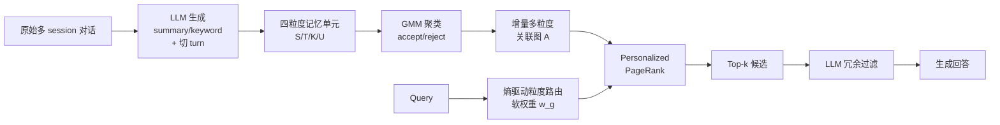

# From Single to Multi-Granularity: Toward Long-Term Memory Association and Selection of Conversational Agents

**会议**: ICLR 2026  
**OpenReview**: [https://openreview.net/forum?id=i2yIvZARnG](https://openreview.net/forum?id=i2yIvZARnG)  
**代码**: [https://github.com/Applied-Machine-Learning-Lab/ICLR2026_MemGAS](https://github.com/Applied-Machine-Learning-Lab/ICLR2026_MemGAS)  
**领域**: LLM Agent / 长期记忆 / 检索增强  
**关键词**: 对话记忆, 多粒度检索, 高斯混合模型, Personalized PageRank, 熵驱动路由  

## 一句话总结
MemGAS 用「多粒度记忆单元 + GMM 关联 + 熵驱动粒度路由 + PPR 检索 + LLM 过滤」一条龙，把对话 agent 的长期记忆从单一粒度切分升级为跨粒度关联与自适应选择，在四个长期记忆 benchmark 上 QA 和检索全面超越 SOTA。

## 研究背景与动机
**领域现状**：LLM 当个性化助手时，用户与 agent 的交互越攒越长，但上下文窗口有限，于是普遍用「检索增强的外部记忆系统」——把历史对话存下来，需要时检索相关片段喂回模型。现有方法在「怎么切分记忆」和「怎么组织记忆」上各有招数：有的用 session 级整段做检索单元，有的用更细的 turn 级，有的做 topic-aware 切分，有的生成 summary 压缩，还有 RAPTOR/MemTree 用树、HippoRAG/Mem0 用知识图谱来组织。

**现有痛点**：作者指出两个共性缺陷。其一，**多粒度记忆关联不足**——现有方法虽然在搭树或图，但基本只在单一粒度上做（要么实体、要么 session summary），无法建立跨粒度的记忆连接。论文用一个跨 session 查询举例：「我一共上了多少门网课？」答案要把 Conversation 1（Coursera 三门）和 Conversation 2（edX 两门）拼起来才对，只有靠共享的 keyword/summary 把两段连上才能全量检索，否则只召回一段就答错。其二，**缺少自适应的粒度选择**——大多数方法用固定粒度策略，粒度不对就要么召回不全要么引入噪声；实证分析显示，若能为每个 query 挑「最适合的粒度」（在 summary/keyword 降噪和原始 session 信息保全之间权衡），收益相当可观。

**核心矛盾**：记忆检索本质上要在**信息完整性**与**检索噪声**之间权衡，而单一固定粒度无法同时照顾「需要细节的查询」和「需要概览的查询」。

**本文目标**：构建一个训练-free 框架，既能跨粒度关联记忆、又能按 query 自适应选择粒度，从而同时提升 QA 与检索质量。

**核心 idea**：**多粒度关联 + 熵驱动选择**——把每条记忆拆成 session/turn/keyword/summary 四个粒度的节点，用 GMM 在新旧记忆之间建关联图，再用基于熵的软路由按 query 的匹配确定性给各粒度加权，最后 PPR 在图上传播 + LLM 过滤冗余。

## 方法详解

### 整体框架
MemGAS 分两阶段：**离线构建**阶段，LLM 把每个 session 生成 summary 和 keyword、并切成 turn，组成「session/turn/keyword/summary」四粒度记忆单元；新记忆加入时用 GMM 把历史记忆聚成 accept/reject 两类，把 accept 集合与新记忆连边，增量维护一张多粒度关联图。**在线检索**阶段，给定 query 先算它与各粒度记忆的相似度分布、用 Shannon 熵衡量匹配确定性，据此给四个粒度分配软权重；再以加权相似度为种子分，在关联图上跑 Personalized PageRank 传播得到 top-k 候选；最后由 LLM 过滤冗余，把精炼后的上下文喂给生成器。

### 关键设计

**1. 多粒度记忆单元与 GMM 动态关联：让新记忆自动"认亲"**。第 $i$ 个 session $S_i$ 经 LLM 处理得到 summary $U_i$ 和 keyword $K_i$，再切成 turn 集合 $T_i$，组成记忆块 $M_i=\{S_i, T_i, U_i, K_i\}$。关键不在切分本身，而在新记忆 $M_{new}$ 入库时怎么和历史建联系：所有粒度都编码成稠密向量，计算 $M_{new}$ 与历史库 $M_{cur}$ 中每个元素各粒度的两两相似度，得到相似度向量集 $s_{sim}$，再用高斯混合模型（GMM）把它们概率性地聚成两簇——**accept 集**（与新记忆高度相似，建立直接关联）和 **reject 集**（无关，排除连边）。每个粒度都被当作独立节点参与建联，因此一条新记忆能在 keyword、summary 等多个层面分别和历史记忆连上。关联图增量更新 $A_{cur} \leftarrow A_{cur} \cup A_{new}$，模拟人类「选择性强化相关记忆」的巩固过程。用 GMM 而非固定阈值的好处是：相似度高低的分界由数据分布自适应决定，避免人工调阈值。

**2. 熵驱动的粒度软路由：用"匹配确定性"决定信哪个粒度**。对 query $q$，先在每个粒度 $g$ 上算它与所有记忆块的相似度 $s^g$，softmax 归一化成分布 $p^g$ 后求 Shannon 熵：

$$H_g = -\sum_{i=1}^{n} p_i^g \log p_i^g, \quad p_i^g = \frac{\exp(\text{sim}(q, M_i^g)/\lambda)}{\sum_{j=1}^{n}\exp(\text{sim}(q, M_j^g)/\lambda)}$$

直觉是：**熵低说明该粒度上 query 与某条记忆的对应关系清晰（高置信）**，熵高则说明匹配模糊。于是按逆熵归一化给各粒度分配权重：

$$w_g = \frac{1/H_g}{\sum_{g'=1}^{G} 1/H_{g'}}$$

熵越低的粒度权重越大，等于让系统自动「相信」当前 query 匹配最确定的那个粒度，无需人工指定该用 session 还是 keyword。$\lambda$ 控制熵的尖锐程度。这一步是论文回应「自适应粒度选择」痛点的核心。

**3. PPR 图传播 + LLM 冗余过滤：从关联结构里捞出又准又不重的上下文**。检索时把每个 $M_i^g$ 当图节点，用路由权重给出初始相关分 $\text{score}_i^g = w_g \cdot \text{sim}(q, M_i^g)$，这组分数作为 Personalized PageRank 的个性化起始概率；选 top-$\alpha$ 作种子节点跑 PPR，让相关性沿关联图传播，从而既强调「直接与 query 相关」又强调「与其它高价值节点紧密相连」的记忆，PPR 收敛后取 top-k 候选。最后用一个专门设计的 prompt 让 LLM 对 top-k 候选做冗余过滤，去掉无关或重复内容，把最终上下文精炼到只剩与 $q$ 最相关的信息再交给生成器。这一步把「图结构召回」和「语义级去噪」串起来，是 GMM 建联之后真正兑现检索质量的环节。

## 实验关键数据

### 主实验表格
四个长期记忆数据集（LoCoMo / Long-MT-Bench+ / LongMemEval-s / LongMemEval-m），backbone 统一用 gpt-4o-mini，Contriever 做编码器，训练-free。QA 主表（节选 LongMemEval-s，更高更好）：

| 模型 | GPT4o-J | F1 | BLEU-4 | ROUGE-L | BERTScore | Avg.Tokens |
|------|---------|-----|--------|---------|-----------|------------|
| Full History (128k) | 50.60 | 11.48 | 1.40 | 10.85 | 83.07 | 103,137 |
| Contriever | 55.40 | 13.78 | 2.21 | 12.89 | 83.70 | 8,286 |
| SeCom | 56.00 | 12.95 | 2.25 | 11.93 | 83.51 | 2,741 |
| HippoRAG 2 | 57.60 | 14.73 | 2.15 | 13.83 | 83.86 | 8,530 |
| A-Mem | 55.60 | 13.73 | 2.11 | 12.98 | 83.88 | 9,018 |
| **MemGAS** | **60.20** | **20.38** | **4.22** | **19.47** | **85.21** | 8,829 |

MemGAS 的 F1 从次优的 14.73 跳到 20.38（相对 +38%），且 token 消耗与延迟和主流基线相当（2.55s），而 Full History 要 10 万 token、9.39s 还效果最差。LongMTBench+ 上 GPT4o-J 也以 69.44 居首。

### 消融实验表格
LongMemEval-s 上逐个移除模块（w/o MA = 同时去 GMM 和 PPR）：

| 设置 | GPT4o-J | F1 | ROUGE-L | R@3 | R@10 |
|------|---------|-----|---------|-----|------|
| **MemGAS** | **60.20** | **20.38** | **19.47** | **78.51** | **94.47** |
| w/o GMM | 57.20 | 19.49 | 18.68 | 76.38 | 91.28 |
| w/o PPR | 56.60 | 19.76 | 18.85 | 75.96 | 90.64 |
| w/o MA | 56.80 | 17.69 | 19.00 | 74.89 | 91.49 |
| w/o Router | 56.60 | 18.88 | 18.62 | 75.53 | 92.34 |
| w/o All | 55.40 | 13.78 | 12.89 | 71.06 | 90.00 |

去掉全部模块后 F1 从 20.38 暴跌到 13.78、R@3 从 78.51 降到 71.06，每个模块单独移除都掉点，验证关联与选择缺一不可。检索侧（Table 2）MemGAS 在所有数据集的 Recall/NDCG 也全面第一，LongMemEval-m 的 R@10 达 77.02（次优 66.60）。

### 关键发现
- 各模块引入的额外延迟极小（QA 最多 +0.0191s，检索最多 +0.0079s），而 LLM API 调用占端到端延迟 98% 以上——说明 MemGAS 的图结构开销在工程上可忽略。
- 多粒度关联对「跨 session 综合类查询」帮助最大，正对应动机里「上了多少门网课」那类需要拼接多段的问题。

## 亮点与洞察
- **把「粒度」从超参变成由 query 自适应决定的变量**：熵驱动软路由是个轻量却统一的思路——不再纠结该用 session 还是 turn，而是用匹配确定性自动加权，普适性强。
- **GMM 建联代替固定阈值**：用概率聚类决定 accept/reject，避免人工调相似度阈值，且天然支持增量更新，符合「记忆巩固」的认知隐喻。
- **训练-free 即插即用**：全程不训练，靠现成编码器 + LLM，落地成本低，token 与延迟控制得也好。

## 局限与展望
- **重度依赖 LLM 生成 summary/keyword 与最终过滤**，质量受 backbone 能力和 prompt 影响；论文坦言 LLM API 占了 98% 延迟，真正瓶颈在 LLM 而非框架本身。
- **粒度集合固定为四种**（session/turn/keyword/summary），是否需要、以及如何引入更多自定义粒度（如实体、时间段）未深入探讨。
- 评测集中在英文长对话 benchmark，对多语种、多模态记忆或超大规模记忆库的可扩展性还需验证；RAPTOR/A-Mem 在 LongMemEval-m 因运行时间过长无法评测，侧面提示大规模下效率仍是普遍难题。

## 相关工作与启发
- **单粒度切分**：session 级（MPC）、turn 级（MemoryBank）、topic-aware（SeCom）各执一端，MemGAS 把它们统一进多粒度框架并用路由选择。
- **结构化记忆**：RAPTOR / MemTree 用树、HippoRAG 2 / Mem0 用图来组织记忆，但都在单一粒度建结构；MemGAS 的贡献在于跨粒度建图 + PPR 传播。
- **启发**：「用熵衡量检索确定性并据此加权」可迁移到一般 RAG 的多路检索融合；「GMM 自适应分簇建关联图」也适用于其它需要增量构建记忆/知识图谱的场景。

## 评分
- **新颖性**: ⭐⭐⭐⭐ 多粒度记忆单元 + 熵驱动软路由是新颖且自洽的组合，把「粒度选择」问题形式化得很清晰；单个组件（GMM、PPR、LLM 过滤）多为已有技术的巧妙拼装。
- **实验充分度**: ⭐⭐⭐⭐ 四个 benchmark、QA 与检索双任务、丰富的消融与效率分析，对比基线覆盖单粒度与结构化两大流派；大规模可扩展性与多语种验证略缺。
- **写作质量**: ⭐⭐⭐⭐ 动机用「数网课」例子讲得直观，方法-公式-图衔接清楚，结构标准易读。
- **价值**: ⭐⭐⭐⭐ 训练-free、即插即用、效果显著且开源，对做对话 agent 长期记忆/个性化检索的工程与研究都有直接参考价值。

<!-- RELATED:START -->

## 相关论文

- [\[ACL 2026\] HiGMem: A Hierarchical and LLM-Guided Memory System for Long-Term Conversational Agents](../../ACL2026/llm_agent/higmem_a_hierarchical_and_llm-guided_memory_system_for_long-term_conversational_.md)
- [\[ICLR 2026\] Solving the Granularity Mismatch: Hierarchical Preference Learning for Long-Horizon LLM Agents](solving_the_granularity_mismatch_hierarchical_preference_learning_for_long-horiz.md)
- [\[ICLR 2026\] SMAN-Bench: A Cross-System Benchmark for Mobile Agents under Single- and Multi-path, Ambiguous, and Noisy Tasks](sman-bench_a_cross-system_benchmark_for_mobile_agents_under_single-_and_multi-pa.md)
- [\[ACL 2026\] TiMem: Temporal-Hierarchical Memory Consolidation for Long-Horizon Conversational Agents](../../ACL2026/llm_agent/timem_temporal-hierarchical_memory_consolidation_for_long-horizon_conversational.md)
- [\[ICLR 2026\] MEM1: Learning to Synergize Memory and Reasoning for Efficient Long-Horizon Agents](mem1_learning_to_synergize_memory_and_reasoning_for_efficient_long-horizon_agent.md)

<!-- RELATED:END -->
