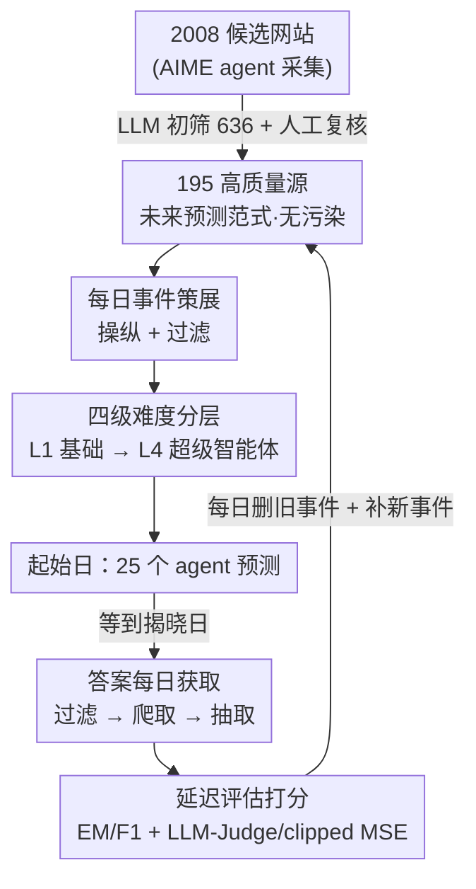

# FutureX: An Advanced Live Benchmark for LLM Agents in Future Prediction

**会议**: ICLR 2026  
**OpenReview**: [https://openreview.net/forum?id=z28PLIEj6l](https://openreview.net/forum?id=z28PLIEj6l)  
**代码**: 无  
**领域**: Agent / LLM 评测基准  
**关键词**: 未来预测, LLM Agent, 动态基准, 数据污染, 难度分层

## 一句话总结
FutureX 构建了一个面向"未来预测"任务的**实时动态基准**——通过全自动管线每天从 195 个高质量网站采集尚未发生的未来事件、让 25 个 LLM/agent 在事件起始日做预测、等事件揭晓后再自动爬取真实结果打分，从根本上消除数据污染，并发现即便最强的 Grok-4 在高波动开放式事件上仍显著落后于人类专家。

## 研究背景与动机
**领域现状**：LLM 正从"会写连贯文本"进化成"能规划、调工具、在动态环境里自主完成目标的 agent"。评测也随之从 MMLU、SuperGLUE 这类静态知识考试，转向 search、tool-use、coding 等 agent 能力基准。

**现有痛点**：现有 agent 基准几乎都在评测**答案已知**的静态、良定义问题——SWE-bench 的 issue、tool-use 的固定任务，本质上"世界已经知道答案"。它们漏掉了人类专家在金融、政治、商业里每天都在做的核心能力：**综合实时信息、在不确定下推理、预测尚无人知晓答案的未来**。

**核心矛盾**：要评测"未来预测"天然面临一对矛盾——未来事件**预测时还没有 ground truth**，无法预先验证；而若用历史事件做回测（backtesting），又会因为"现在去搜过去的事"引入**时间泄漏与检索污染**，把答案泄给模型。已有尝试要么只评不带搜索的 vanilla LLM（不现实），要么只取预测市场（PolyMarket 等）的少量二元选择题（FutureBench 仅约 30 题、ForecastBench 以多选为主），事件少、太简单、且无法考察开放式信息搜集。

**本文目标**：建一个**大规模、跨领域、无污染、可自动持续更新**的未来预测基准，能真正区分 agent 的高阶搜索与推理能力。

**切入角度**：作者抓住"未来预测"任务的一个天然性质——只要问的事件**在预测时尚未发生**，答案就不可能出现在任何模型的训练数据里，污染问题被定义层面直接消解。剩下的工程难题是"如何可靠地拿到答案"，作者用精选高质量信息源 + 全自动爬取抽取来解决。

**核心 idea**：把基准做成一个**每日运转的闭环活体系统**——今天采题、今天让 agent 预测、揭晓后自动取答打分——并按事件类型与波动性把题目分成四级难度，从而既无污染又能持续产出有挑战性的评测任务。

## 方法详解

### 整体框架
FutureX 不是一份静态数据集，而是一条**每天循环运转的全自动流水线**，由四个阶段串成闭环：① **事件库构建**——用 AIME agent 从政治/经济/金融/科技/体育等领域抓到 2008 个候选网站，经 LLM 初筛（去重、判断可否出题、评估更新频率）降到 636 个，再人工复核保留 195 个高质量源（预测市场、新闻、娱乐榜单、政府站、实时数据平台五类）；② **每日事件策展**——以这些站点为"种子"每天爬取生成预测题，做事件操纵（随机化/扰动）与过滤（剔除太简单、有害、主观题），并下采样二元 yes/no 题以提高难度；③ **agent 每日预测**——在每个事件的起始日（早于揭晓日数天）自动跑 25 个模型并存下它们的预测；④ **答案每日获取**——揭晓日一过，系统按日期过滤出应揭晓的事件，爬取对应网站、用 Seed1.5-Thinking 抽取精确答案，再给此前的预测打分。整库每日还会移除已无法取答的事件、补入新事件，保持"活体"。

### 关键设计

**1. 未来预测范式：用"答案尚未发生"从定义上消灭数据污染**

所有 agent 评测基准的隐疾是数据污染——题目和答案若进过训练语料，分数就虚高。FutureX 的破解办法不是事后去重，而是**重新定义任务**：只问 resolution date 在未来的事件（如"8 月 20 日以太坊涨还是跌""8 月 20 日沪港通当日买入成交额是多少"）。在 agent 做预测的那一刻，这些事件**客观上还没发生**，真实答案根本不存在于世界上、更不可能在任何模型的训练数据里。这把污染问题从"难以根除的工程对抗"转成了"被任务定义天然排除"，也顺带保证了基准的长期有效性——它不会像静态基准那样被刷穿后失效，因为明天的题目永远是新的。代价是引入了**评估延迟**（evaluation delay）：预测必须等到事件揭晓才能评分，作者采用一周的预测窗口在事件覆盖度与评测时延间折中。

**2. 半自动数据管线：从 2008 站点漏斗到 195 高质量源 + 每日活体策展**

"无污染"只解决了答案是否泄露，没解决**答案能不能可靠拿到**——这才是活体基准最容易崩的地方。作者用一条 LLM 与人工协同的漏斗管线保证信息源质量：AIME agent 先广撒网抓 2008 个站点，Seed1.5-Thinking + DeepSeek-R1 做去重、可出题性判断和更新频率评估，砍到 636 个；再由人工聚焦"可靠、有排行榜、高更新频率"的源，最终保留 195 个，划成预测市场、新闻、娱乐榜单、政府数据、实时金融平台五类。在此之上每日做事件策展：以站点为种子生成题目，通过随机化/扰动做事件操纵防止固定模式被记忆，并过滤掉简单题、有害题、主观题，还专门下采样占比过高的二元题来抬高整体难度。这套"LLM 初筛 + 人工把关 + 每日增删"的组合，使答案获取成功率超过 **97%**，支撑起一个真正能无人值守每天跑的管线。

**3. 四级难度分层：按事件类型与波动性把能力考点拆开**

如果所有题混在一起，强弱模型的差距会被简单题淹没。FutureX 依据"事件类型 + 预期波动性"把题库切成四个递进难度层，每层精准对应一类 agent 能力。**Level 1 基础**是选项少于 4 的单选题，搜索空间被选项锁死，信息检索和推理都很轻量；**Level 2 宽搜索**是需要返回全部正确项、且只能返回正确项的多选题，考穷尽而精确的判别；**Level 3 深搜索**是事实相对稳定（低波动）的开放式题，无选项、需自己多步搜索与综合证据收敛到答案，考信息导航与整合；**Level 4 超级智能体**是高波动开放式题（如某日具体成交额），agent 必须广撒网搜信息、在漂移信号和深度不确定下做概率化推理与长程预测，连人类专家都吃力。值得注意的是 Level 3、4 全部由自动管线生成，既保证可规模化扩展又维持质量控制，这是相对 ForecastBench/FutureBench"多为简单预测市场题"的关键区别。

**4. 全自动延迟评估闭环：起始日预测、揭晓日取答、按层加权打分**

整条管线的价值在于**无人干预的闭环**。每个事件在其指定起始日自动触发 25 个 agent 跑预测并存档；揭晓日过后系统再自动爬网取真值、对此前预测打分。评测指标按难度分层定制：Level 1/2 用 exact-match 与 F1；Level 3/4 用 LLM-as-Judge（公式 1）与 clipped MSE（公式 2，⚠️ 两式定义见原文 Appendix E，此处未给出具体形式，以原文为准）。总分则把四层成绩按 **10% / 20% / 30% / 40%** 加权——越难的层权重越大，引导评测聚焦高阶能力而非简单题刷分。整个流程的时效性、客观性与可扩展性都来自这套自动闭环，使 FutureX 能以"每日采题 + 每周出榜"的节奏长期运转。

## 实验关键数据

### 主实验
作者在 2025-07-20 至 08-03 评测了 **25 个模型**，分四类：8 个无工具 base LLM、6 个 SmolAgent-DR、2 个 AgentOrchestra、7 个带思考+搜索的商用 LLM、2 个闭源 Deep Research 模型。总分按四层 10/20/30/40% 加权。

| 维度 | 关键结果 | 说明 |
|------|---------|------|
| 总分第一 | **Grok-4** | 其次为 Gemini-2.5-flash Deep Research、GPT-o4-mini（Think&Search）、Seed1.6(豆包) |
| 模型类型趋势 | 带搜索的推理模型整体领先 | 凸显高阶搜索+推理在未来预测中的重要性 |
| L1/L2 最佳 | **DouBao-Seed1.6-Thinking** | 即便无工具，也超过多数带搜索 agent 与 Deep Research |
| L3/L4 最佳 | **Grok-4** | 在更难事件上甚至超过 Gemini Deep Research，且搜索更少、推理更快 |
| 人类对照 | 40 位行业专家（四大/麦肯锡/投行），抽 300 题 | L1、L3、L4 上人类显著领先 LLM；仅 L2 部分模型反超人类 |

### 消融 / 难度分层分析
| 配置 | 关键发现 | 说明 |
|------|---------|------|
| 跨四层难度 | 性能随 L1→L4 单调显著下滑 | 验证难度分层有效，L4 上最强模型常"零分" |
| Base LLM @ L1/L2 | 高准确率 | 简单单/多选靠事实回忆即可，无法区分模型强弱 |
| 加搜索/工具 @ L3 | 显著优于纯静态知识 | 工具增强推理对多步复杂题至关重要 |
| SmolAgent-DR vs LLM(Think&Search) | 前者反而偏弱 | 推测受其搜索 API 能力限制 |

### 关键发现
- **难度分层确实分层**：四层性能单调下滑，证明分层标签与真实复杂度对齐；L4 高波动开放式题对当前模型是真·天花板，最强模型也常完全失分，可作为未来"超人类"能力的标尺。
- **L1/L2 区分度不足**：base LLM 就能拿高分，只适合建立 baseline，无法甄别高阶模型——这反而说明社区需要 L3/L4 这类硬题。
- **不同模型各有专长**：DouBao 擅长有选项时的知识检索，Grok-4 擅长开放式难题，GPT 系列在 Crypto 域表现好（因子分析显示"难度等级"与"事件领域"是影响成绩最显著的两个因素）。
- **强模型搜得更多**：Grok-4 的平均搜索次数甚至超过 Deep Research 模型，印证搜索量与未来预测能力正相关。

## 亮点与洞察
- **用任务定义而非工程手段根除污染**：把"未来事件"本身当成防污染机制，比任何去重/水印都干净彻底，且让基准天然抗"被刷穿"——这是最值得迁移的思路，任何怕污染的评测都可考虑"只评尚未发生/尚未公开的实例"。
- **活体闭环 + 一周预测窗口的工程折中**：起始日预测、揭晓日取答的延迟评估范式，把"无 ground truth"这个看似致命的问题，转成了一个可被时间自动解决的工程问题，97% 答案获取率说明它真能跑起来。
- **难度按波动性分层**：用"事件波动性高低"而非主观难易来划分 L3/L4，给"开放式预测有多难"提供了客观抓手，可迁移到其它需要量化任务难度的开放式基准。
- **人类专家对照线**：拉 40 位真·行业专家来标 300 题做红线，让"agent 距专家还差多远"有了可信参照，而非空谈 SOTA。

## 局限与展望
- **评估延迟天然存在**：一周窗口意味着任何结果都滞后揭晓，难以做即时迭代；长程（数月）事件无法纳入。
- **答案抽取仍可能出错**：97% 成功率背后有爬取错误（反爬）与抽取错误，依赖人工复核+定制 prompt 兜底，规模再扩大时人工成本会上升。
- **横向比较需谨慎**：不同难度层用不同指标（EM/F1 vs LLM-Judge/clipped MSE），跨层分数不可直接比大小；总分的 10/20/30/40% 权重是人为设定，会影响排名。
- **覆盖偏中英文/特定平台**：195 个源虽广，但仍偏向作者可稳定取答的站点，地域与语言覆盖可能有偏。
- **改进方向**：作者表示正持续加入新领域与数据源，保持"活体"以推动 agent 逼近人类专家。

## 相关工作与启发
- **vs ForecastBench**：同样只问未来事件来防污染，但 ForecastBench 主要评 vanilla LLM、依赖预测市场、以多选为主，事件简单且多样性受限；FutureX 来源更广（195 站、11 域）、含大量开放式/数值题、且评 25 个带搜索 agent，月更 → 日更。
- **vs FutureBench**：FutureBench 仅取 PolyMarket、事件约 30 个、只评单个开源 agent；FutureX 在事件规模（约 500/周）、域覆盖、模型多样性上全面碾压。
- **vs 历史回测类（如 backtesting）**：回测靠历史事件，会因"现在搜过去"引入时间泄漏与检索污染；FutureX 用真·未来事件从源头规避。
- **vs 静态 agent 基准（SWE-bench、tool-use bench）**：它们评答案已知的良定义任务，FutureX 评答案尚未存在的开放式预测，更贴近人类分析师的真实工作。

## 评分
- 新颖性: ⭐⭐⭐⭐⭐ 用"未来事件"定义层面根除污染 + 全自动活体闭环，是未来预测基准的首个大规模综合方案
- 实验充分度: ⭐⭐⭐⭐⭐ 25 模型四类、四级难度、人类专家对照、多维因子/轨迹/搜索分析
- 写作质量: ⭐⭐⭐⭐ 设计原则与管线讲得清晰，但核心指标公式置于附录、正文略简
- 价值: ⭐⭐⭐⭐⭐ 提供了可持续运转、抗污染、有挑战性的 agent 评测标准，指向"AI 下半场"的真实能力

<!-- RELATED:START -->

## 相关论文

- [\[ICLR 2026\] FingerTip 20K: A Benchmark for Proactive and Personalized Mobile LLM Agents](fingertip_20k_a_benchmark_for_proactive_and_personalized_mobile_llm_agents.md)
- [\[ICLR 2026\] SimuHome: A Temporal- and Environment-Aware Benchmark for Smart Home LLM Agents](simuhome_a_temporal-_and_environment-aware_benchmark_for_smart_home_llm_agents.md)
- [\[ICLR 2026\] Orak: A Foundational Benchmark for Training and Evaluating LLM Agents on Diverse Video Games](orak_a_foundational_benchmark_for_training_and_evaluating_llm_agents_on_diverse_.md)
- [\[ICLR 2026\] ST-WebAgentBench: A Benchmark for Evaluating Safety and Trustworthiness in Web Agents](st-webagentbench_a_benchmark_for_evaluating_safety_and_trustworthiness_in_web_ag.md)
- [\[AAAI 2026\] SoMe: A Realistic Benchmark for LLM-based Social Media Agents](../../AAAI2026/llm_agent/some_a_realistic_benchmark_for_llm-based_social_media_agents.md)

<!-- RELATED:END -->
