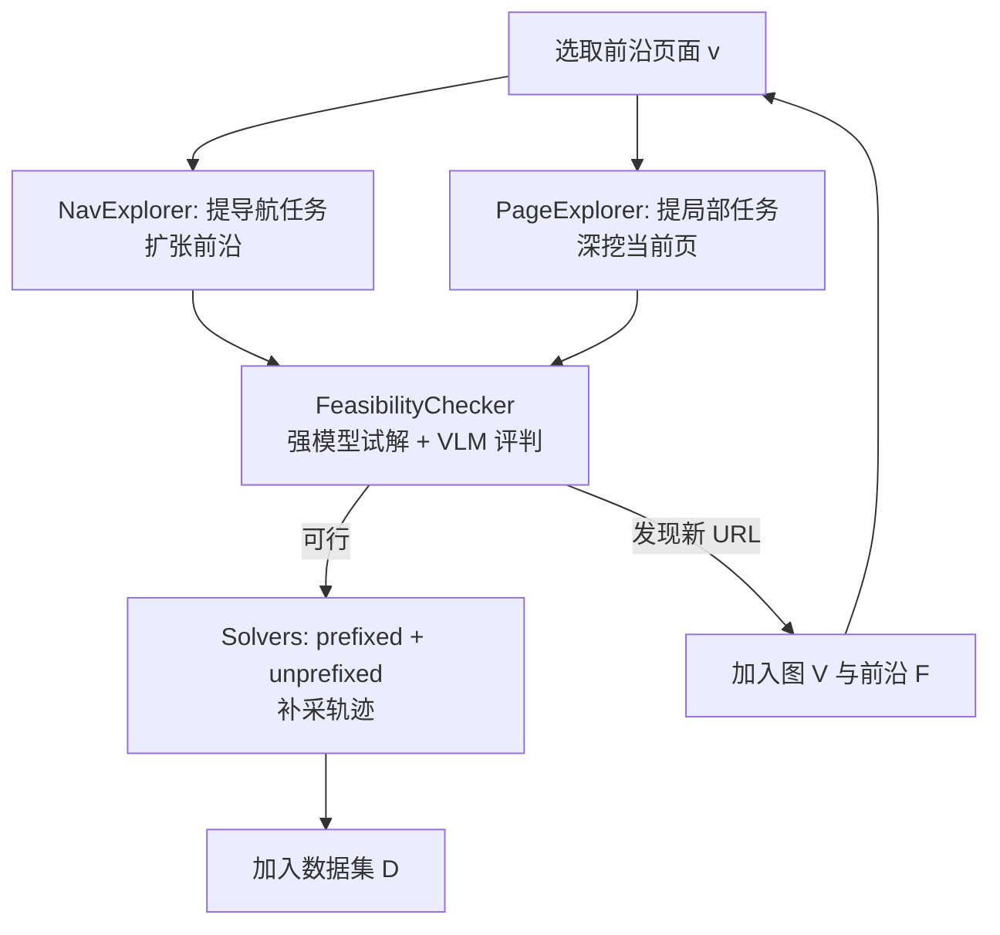

# Go-Browse: Training Web Agents with Structured Exploration

**会议**: ICLR 2026  
**OpenReview**: [https://openreview.net/forum?id=IpzRWE52yw](https://openreview.net/forum?id=IpzRWE52yw)  
**代码**: [https://github.com/ApGa/Go-Browse](https://github.com/ApGa/Go-Browse)  
**领域**: LLM Agent / Web Agent / 自动数据采集  
**关键词**: Web Agent, 结构化探索, 图搜索, 数据合成, WebArena, 监督微调  

## 一句话总结
把网页智能体的训练数据采集建模成对网站的**图搜索**：用一个不断扩张的 URL 前沿（frontier）维护"已发现但未充分探索"的页面，每到一个页面就提任务、查可行性、采轨迹，并通过"重置到已发现页面"复用历史探索成果，从而在 WebArena 上采到 10K 条成功轨迹，微调 7B 模型即达 21.7% 成功率，超过 GPT-4o mini。

## 研究背景与动机
- **领域现状**：预训练 LLM 在网页 GUI 任务上表现糟糕——人类在 WebArena 上成功率 78%，而 GPT-4o 仅 38%、GPT-4o mini 仅 19%、Qwen-2.5-7B 仅 8%；专门训练过的 GUI 模型（Claude-3.7-Sonnet 45.4%、CUA 58%）则明显更强。这说明**用智能体专用交互数据训练**是做出可用网页智能体的关键。
- **现有痛点**：高质量网页数据极难获取。人工演示昂贵；无监督自动采集里又分两派——**interaction-first**（如 NNetNav，先用泛化指令漫游再事后打标签）各 episode 相互独立、探索高度冗余，反复踩同一批易找的页面；**instruction-first**（先提任务再求解）则任务提案锚定在初始静态观察上，只覆盖当前页、还会幻觉出不可行任务。
- **核心矛盾**：智能体缺乏对**部署环境本身**的先验理解。从教程或别处的演示学到的知识难以迁移到一个陌生网站，所以"直接探索目标环境"的方法（16% 成功率）远胜"用互联网通用知识"的方法（6%）——但直接探索又面临探索效率低、覆盖不全的难题。
- **本文目标**：设计一种探索策略，既能**全局覆盖**整个网站（不漏深层页面），又能在每个页面上**局部充分**地提任务采数据，同时跨 episode 复用信息以提高效率。
- **核心 idea**：**把数据采集当成图搜索**。维护一个 URL 节点 + 轨迹边的图，外循环像 BFS 一样扩张前沿保证全局覆盖，内循环像 instruction-first 一样在每个页面深挖；关键创新是**每轮把探索重置到一个已发现的页面**——这既解耦了"网页导航"与"局部求解"两个难度不同的子问题，又让信息在 episode 间复用。灵感来自强化学习中的 **Go-Explore**（reset-then-explore 解 Montezuma's Revenge）。

## 方法详解

### 整体框架
Go-Browse 对每个网站构建图 $G=(V,E)$，节点 $v$ 是唯一 URL、边 $e$ 是页面间的轨迹。**外循环**（全局覆盖）维护一个探索前沿 $F$，每次从前沿取出一个页面 $v$；**内循环**（局部探索）在 $v$ 上跑三步：① 用 NavExplorer + PageExplorer 提出导航任务与局部任务，② 用 FeasibilityChecker 过滤不可行任务并采集首条轨迹，③ 用 Solvers 为可行任务补采更多轨迹。求解新任务时若发现新 URL，就把它加入 $V$ 和前沿 $F$，外循环继续扩张直到前沿清空。

### 关键设计

**1. NavExplorer：把任务提案者做成会探索的智能体，负责扩张前沿。** 传统 instruction-first 的 TaskProposer 只看一张静态观察就提任务，覆盖面窄还容易幻觉。Go-Browse 把 NavExplorer 实现成一个**真正去交互的网页智能体**：给它一个目标"找到当前页面的邻居页面并提出到达它们的导航任务"，并给它扩展一个动作 `add_tasks_to_dataset(tasks)`。这样它能基于**动态获取的真实观察**来锚定任务提案，而且被要求优先添加那些"用户可能想去、且有常用任务"的新页面，从而高效地把前沿往有价值的方向扩张。

**2. PageExplorer：局部任务采集，把单个页面的功能挖透。** 与 NavExplorer 互补，PageExplorer 只负责当前页面 $v$ 内部的任务：让 LLM 生成一组"用户在这个页面上可能想做的事"。它产出的训练数据系统性地覆盖每个页面的各项功能（如商品页的筛选、排序、加购、查看详情等），保证局部探索的充分性，而把"跳到别的页面"的活交给 NavExplorer。

**3. FeasibilityChecker：用强模型 + VLM-as-a-judge 过滤幻觉任务。** 前两个模块提出的任务里必然混有不可行/幻觉项。FeasibilityChecker 用一个强预训练智能体（Claude-3.7-Sonnet，最多试 3 次）去尝试求解每个任务，并用 GPT-4o 实现的 **VLM-as-a-judge** 奖励模型 $R(g,\tau)\in\{0,1\}$ 判断轨迹是否真的完成了任务。最多采 $N_{max}$ 条轨迹、一旦成功即停；只保留**至少有一条成功轨迹**的任务及其轨迹，其余丢弃——既过滤掉不可行任务，又顺手采到了首批高质量数据。

**4. Solvers 的 prefixed/unprefixed 采样：解耦导航与求解，bootstrap 弱模型。** 对过滤后的可行任务，Solvers 用更便宜的模型（GPT-4o-mini、Qwen-2.5-7B）大量补采轨迹，并混合两种起点：**prefixed** 从当前页面 $v$ 直接开始求解（已经导航到位，只需局部操作）；**unprefixed** 强制从网站根节点（首页/dashboard）开始求解（需自己先导航再求解）。prefixed 把"找到页面"的导航难题剥离出去，成功率显著更高、尤其在深层节点上，因此能让弱预训练模型也产出高质量数据（bootstrap）；unprefixed 则保留长程任务求解与探索行为。两者结合让数据既好采又不失长程能力。

> 与既有范式的关系：内循环（NavExplorer + PageExplorer + FeasibilityChecker）本质是 instruction-first，但**不只从根节点出发，而是每轮从前沿取新页面初始化**，弥补了 instruction-first 的局部性，强制全局覆盖；同时通过"重置复用"弥补了 interaction-first 的冗余探索问题。

## 实验关键数据

### 数据集统计（GO-BROWSE-WA，WebArena 5 域、每域探索 20 页、共 100 URL）

| 指标 | 成功 | 失败 | 合计 |
|------|------|------|------|
| 轨迹数 | 9,504 | 17,245 | 26,749 |
| 步数 | 39,339 | 157,123 | 196,462 |
| 唯一任务数 | — | — | 3,422 |

采轨迹的成功轨迹来源较均衡：Qwen-2.5-7B 29.5% / GPT-4o-mini 36.6% / Claude-3.7-Sonnet 33.9%。整套采集约花费 **\$975.57**。微调只用成功步，但完整数据（含失败、含 accessibility tree / HTML / 截图多种表示）全部开源。

### 主实验：WebArena 成功率（812 任务）

| 模型 | Overall (%) | Admin | Shopping | Reddit | Gitlab | Map |
|------|------------|-------|----------|--------|--------|-----|
| GPT-4o-mini（闭源） | 19.3 | 19.2 | 19.3 | 21.1 | 20.9 | 15.6 |
| GPT-4o | 37.6 | 35.7 | 32.3 | 50.9 | 36.7 | 37.5 |
| Claude-3.7-Sonnet | 45.4 | 37.4 | 37.0 | 58.8 | 52.0 | 47.7 |
| Qwen-2.5-7B-Instruct（基座） | 8.3 | 7.1 | 9.4 | 7.9 | 8.7 | 7.8 |
| NNetNav-7B（SOTA 对照） | 18.8 | 14.3 | 20.3 | 23.7 | 19.9 | 17.2 |
| **GO-BROWSE-7B** | **21.7** | **25.3** | **22.4** | **30.7** | 15.3 | **17.9** |

- 比基座 Qwen-2.5-7B 提升 **+13.4%**，比 sub-10B 前 SOTA NNetNav-7B **+2.9%**，并反超 GPT-4o-mini **+2.4%**。
- 除 Gitlab 外全域领先；在最难导航的 Shopping Admin 上比 NNetNav **+11%**、Reddit 上 **+7%**。

### 泛化实验：Online-Mind2Web（300 任务 / 136 个真实网站，域外）

| 模型 | SR (%) |
|------|--------|
| NNetNav-7B | 4.00 |
| **GO-BROWSE-7B** | **5.33** |
| GPT-4o-mini | 9.33 |

域外整体下降明显，但 GO-BROWSE-7B 仍领先 NNetNav-7B；在与 WebArena 相近的 In-Domain-Adjacent 网站上，GO-BROWSE-7B 逼近 GPT-4o-mini（<1% 差距），仍比 NNetNav-7B 高 3%。

### 关键发现
- **任务更多样**：用 GPT-4o-mini 把任务聚类成意图类别后，NNetNav 的分布出现明显大"楔形"（探索冗余，反复采易找页面），且 Gitlab 任务过多、Reddit 过少；GO-BROWSE 因重置复用使难找页面也被充分探索，分布更均衡。
- **成功轨迹更深**：仅 GO-BROWSE 成功的轨迹其 URL 深度分布更右偏，深层 URL（如编辑具体商品属性、查看特定订单、Reddit 搜索）访问次数远超 NNetNav（如某商品编辑页 9 vs 1、Reddit 搜索 7 vs 0），说明它的优势来自能解长程深层任务。
- **prefixed 采样 bootstrap 弱模型**：prefixed 成功率整体更高，且随节点深度增大优势越明显、对弱模型（Qwen-2.5-7B）尤其显著——印证了"解耦导航与求解能让弱模型产出更高质量数据"。

## 亮点与洞察
- **范式融合得漂亮**：把 instruction-first 的"任务驱动、提案精准"和 interaction-first 的"能探深层、信息复用"统一进一个图搜索框架，外循环管覆盖、内循环管深度，职责清晰。
- **"reset-then-explore"迁移到网页**：借鉴 Go-Explore 的核心思想——一旦发现难到达的状态就记住并反复从那里出发，把游戏里的硬探索难题平移到网页导航，是很自然且有效的类比。
- **解耦导航与局部求解**是全文最实用的洞察：网页智能体的真正瓶颈往往是"找到正确页面"而非"在页面上操作"，prefixed 采样把前者剥离，直接让 7B 弱模型也能采到高质量长程数据。
- **成本透明、数据全开源**：\$975 采全套、连失败轨迹和多模态表示都放出来，对后续研究复用价值高。

## 局限与展望
- **强模型依赖**：NavExplorer/FeasibilityChecker 重度依赖 Claude-3.7-Sonnet、GPT-4o 等强闭源模型来探索和评判，采集成本与可复现性受其约束；弱模型能否自举出整条管线尚未验证。
- **仅在 WebArena 自托管克隆站上采集**：100 个 URL、5 个域虽具代表性，但都是受控环境；域外 Online-Mind2Web 上绝对成功率仍低（5.33%），真实开放网页的泛化仍是大缺口。
- **Gitlab 域反而落后**：在结构复杂、以"新建项目/fork"为主的 Gitlab 上不及 NNetNav，提示图搜索式探索对某些任务类型的覆盖仍有盲区。
- **只做 SFT**：仅在成功轨迹上做监督微调，未利用大量失败轨迹（可做 RL / 偏好学习 / 过程奖励），数据潜力未挖尽。
- VLM-as-a-judge 作为奖励模型本身有噪声，可能引入错误的"可行/成功"标注。

## 相关工作与启发
- **Go-Explore**（Ecoffet 等）：reset-then-explore 解硬探索 RL 任务，本文直接的思想源头。
- **NNetNav**（Murty 等）：interaction-first 的代表与主要对照，本文针对其"episode 独立、探索冗余"痛点改进。
- **instruction-first 系列**（Lai 等、PAE/Zhou 等）：先提任务再求解；PAE 需要人工演示截图来辅助提案，本文用会探索的智能体自动获取上下文替代之。
- **WebArena / BrowserGym / Online-Mind2Web**：评测与执行框架；ReAct 作为智能体的基本交互模式。
- **启发**：① "把数据采集建模成图搜索 + 状态重置"可推广到其他需要长程探索的智能体环境（GUI、OS、游戏）；② "用强模型探索+评判、弱模型大规模采样"的分工是高性价比合成数据的通用配方；③ 解耦"导航/定位"与"局部执行"对任何分层任务的弱模型 bootstrap 都值得借鉴。

## 评分
- **新颖性**: ⭐⭐⭐⭐ — 图搜索 + reset-then-explore 迁移到网页数据采集，把两类探索范式优雅融合，思路清晰且有 Go-Explore 的扎实根基；非颠覆性创新但组合得当。
- **实验充分度**: ⭐⭐⭐⭐ — 主实验全域对比 + 域外泛化 + 任务多样性/深度/prefixed 三类细致分析，附统计显著性检验；不足是仅 WebArena 采集、只做 SFT。
- **写作质量**: ⭐⭐⭐⭐ — 动机层层递进，把 interaction-first/instruction-first 的优劣讲得透彻，算法伪代码与图示清晰。
- **价值**: ⭐⭐⭐⭐ — 让 7B 开源模型反超 GPT-4o-mini，数据/代码/模型全开源且成本透明，对开源网页智能体社区是实打实的资产。

<!-- RELATED:START -->

## 相关论文

- [\[ACL 2025\] Explorer: Scaling Exploration-Driven Web Trajectory Synthesis for Multimodal Web Agents](../../ACL2025/llm_agent/explorer_scaling_exploration-driven_web_trajectory_synthesis_for_multimodal_web_.md)
- [\[ICLR 2026\] Meta-RL Induces Exploration in Language Agents](meta-rl_induces_exploration_in_language_agents.md)
- [\[ICLR 2026\] Web-CogReasoner: Towards Multimodal Knowledge-Induced Cognitive Reasoning for Web Agents](web-cogreasoner_towards_multimodal_knowledge-induced_cognitive_reasoning_for_web.md)
- [\[ICLR 2026\] WALT: Web Agents that Learn Tools](walt_web_agents_that_learn_tools.md)
- [\[ICLR 2026\] How Dark Patterns Manipulate Web Agents](how_dark_patterns_manipulate_web_agents.md)

<!-- RELATED:END -->
