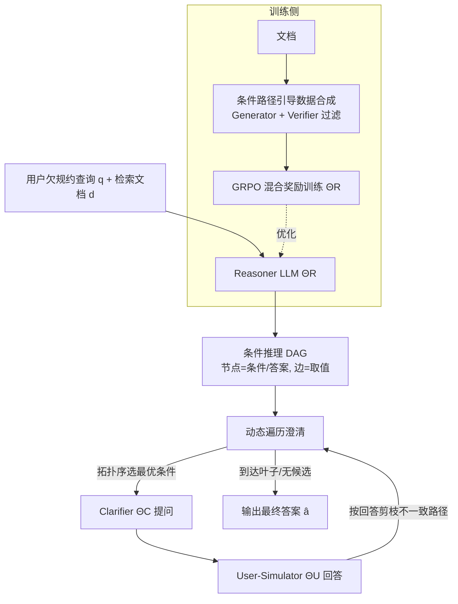

# GPS: Graph-guided Proactive Information Seeking in Large Language Models

**会议**: ICLR 2026  
**OpenReview**: [https://openreview.net/forum?id=xpKe5qMaY4](https://openreview.net/forum?id=xpKe5qMaY4)  
**代码**: [https://github.com/lrq111/GPS](https://github.com/lrq111/GPS)  
**领域**: LLM Agent / 主动澄清 / RAG  
**关键词**: 主动信息获取, 澄清问题, 条件推理 DAG, RAG, 强化学习, GRPO  

## 一句话总结
GPS 把检索文档里隐含的"if-then 规则"显式建模成一张逻辑完备的有向无环图（DAG），再用动态遍历剪枝按需提问，并用混合奖励的强化学习（GRPO）训 Reasoner LLM 生成高质量 DAG，从而让 LLM 在面对信息不全的用户提问时既问得准又问得少。

## 研究背景与动机
**领域现状**：RAG 系统默认用户的提问已经包含了足够信息，检索回相关文档后直接作答。但现实里用户常因为缺乏领域知识、或习惯性省略"显而易见"的细节，导致提问是**欠规约（underspecified）**的——比如"我能领残疾补贴吗？"这个答案其实取决于收入、残疾等级、年龄等一堆没说出口的条件。给 LLM 装上"主动追问澄清"的能力是化解这种歧义的关键。

**现有痛点**：当前两条路线都不理想。Prompting 类方法（ProCoT、UoT、BED-LLM）靠 LLM 自身推理能力迭代识别歧义、生成澄清问题，但小模型常常压根识别不出歧义，且对话历史一长就"lost-in-the-middle"。Fine-tuning 类方法要么依赖昂贵的人工标注多轮对话，要么用自采样（Clarify-DPO 等）收集数据但**对澄清搜索空间不加约束**，容易问出一堆无关或冗余的问题。

**核心矛盾**：检索文档里其实藏着一套**条件规则推理结构**（if-then 把条件组合映射到结论），而这恰恰是歧义的根源；但现有方法都把澄清当成开放式对话问题，忽略了这层结构，于是既学不到有效又高效的提问策略。论文用三个挑战点出难处：(C1) 怎么设计一个既能表达任意逻辑依赖、又能实时交互的推理结构？(C2) 现有数据集没有条件推理标注，怎么训模型抽这种结构？(C3) 怎么同时优化正确性和交互效率？

**本文目标 & 核心 idea**：**[显式建模条件结构]** 把文档里的条件规则抽成 DAG——非终端节点是条件变量、终端节点是答案、边标注条件取值，单前驱隐式 AND、多前驱隐式 OR。**[逻辑完备 + 高效遍历]** 理论证明该 DAG 能用析取范式（DNF）表达任意有限值函数（逻辑完备），同时支持子图共享和按用户回答动态剪枝，把澄清复杂度从条件总数 $k$ 降到平均推理深度 $r \ll k$。**[合成数据 + RL]** 用条件路径引导的数据合成解决数据稀缺，再用面向澄清的强化学习把"准确 + 高效"打进奖励里优化 Reasoner。

## 方法详解

### 整体框架
GPS 是一个两阶段框架：**推理阶段**由 Reasoner LLM $\Theta_R$ 把"查询 + 检索文档"读成一张条件推理 DAG；**澄清阶段**由 Clarifier LLM $\Theta_C$ 与 User-Simulator $\Theta_U$ 交互，沿 DAG 拓扑序动态剪枝、逐个追问缺失条件，直到走到唯一合法的叶子节点给出答案。为了让 Reasoner 产出的 DAG 足够好，离线训练侧先用**条件路径引导数据合成**造高质量训练集，再用**面向澄清的强化学习**（GRPO + 混合奖励）优化 $\Theta_R$。

### 关键设计

**1. 条件推理 DAG：用图把规则的"逻辑完备性"撑起来**。GPS 把检索文档建成 $G=(N,E)$：非终端节点 $n_{c_i}$ 对应条件变量 $c_i$，终端节点对应可能答案 $a_m$，每条边 $e_{i,j}=(n_{c_i}, n_{c_j}, \nu)$ 标注前驱节点的一个取值 $\nu \in V_{c_i}$，且同一节点的出边互斥且穷尽。结构语义很巧：单前驱节点与前驱形成 AND 关系，多前驱节点对所有前驱形成 OR 关系——这样一条根到叶的路径就是 DNF 里的一个合取项，所有指向同一答案的路径并起来就编码了该答案指示函数的完整 DNF。Proposition 1 据此证明：对任意有限值函数都存在这样一张 DAG 精确表达，从而保证 Reasoner 抽出的结构在原理上不会漏掉任何与查询相关的条件，澄清才可能"问全"。

**2. 动态遍历式澄清：把"问全"压成"问少"**。光有完备的 DAG 还不够，关键是别把所有条件都问一遍。GPS 按拓扑序维护一个候选条件集 $U=U_1 \cup U_2$：$U_1$ 是入度为 0 且未知的根条件，$U_2$ 是其唯一已知前驱已就绪的条件——即"前驱没被未解决条件挡住"的节点才有资格被问。为决定先问谁，对每个候选估计期望剩余代价 $\ell(n_i)=\frac{1}{|P_{n_i}|}\sum_{p\in P_{n_i}}\mathrm{len}(p)$，即从该节点到叶子各路径上缺失条件数的平均值，优先问那些能更快收敛的条件。每轮拿到用户回答后，沿一致的边走、剪掉不一致的分支，直到到达终端条件或候选集为空。正因为剪枝，期望澄清轮数只取决于真实推理路径上那一小撮条件，而非文档里全部条件，平均复杂度 $O(r)$。

**3. 条件路径引导的数据合成：从"24.5% 欠规约"造出可训练的数据**。训练数据基于 ConditionalQA，但其中只有 24.5%（550/2247）是欠规约样本，不足以训出泛化的主动追问能力。GPS 分两步扩充：**Problem Generation** 用 DeepSeek-R1 从文档沿多条件推理路径生成欠规约问题 $q$、缺失条件集 $C$（带取值域）、以及条件路径 $P=\{(v,a)\}$（完整赋值 $v$ 唯一确定答案 $a$）；**Verification** 引入基于"缺失条件必要性"的过滤——让 Verifier LLM 分别在"有/无缺失条件"两种输入下预测答案，只保留**全输入预测对、掩码输入预测错**的样本，确保这些缺失信息真的是回答所必需的，得到高质量数据集 $D=\{q_i,v_i,d_i,a_i\}$。

**4. 混合奖励 + GRPO：把"对、省、不冗余"一起塞进回报**。把 DAG 构造建模成 RL 任务：策略 $\pi_\theta(o\mid q,d)$ 自回归生成并解析出 DAG $o$，DAG 确定性地诱导一条澄清轨迹并产生标量奖励，用 GRPO 优化（组内采 $h$ 个 DAG，按组相对优势 $A_i=\frac{r_i-\mathrm{mean}(r)}{\mathrm{std}(r)}$ 加权 + 参考模型 KL）。奖励由三部分相乘叠加：**有效性** $r_{acc,i}$（澄清后答案对则为 1）；**效率** $r_{eff,i}=1-\alpha\frac{t_i}{t_{max}}$（轮数越少越高，$\alpha=0.5$）；**结构质量** $r_{\eta,i}=H_{leaf}/H_{graph}$——用前向概率传播在 DAG 上算出"图分裂熵 $H_{graph}=\sum_{n\in C}P(n)\log|F(n)|$"和"叶子分布熵 $H_{leaf}=-\sum_\ell \tilde P(\ell)\log\tilde P(\ell)$"，衡量一张图把中间分支的不确定性"转化"成对最终结论判别力的效率，越高说明结构越不冗余。最终 $r_i=r_{acc,i}\cdot(r_{eff,i}+r_{\eta,i})$，用有效性作门控——答错时奖励直接归零，逼着模型先保证正确再谈省与精。

## 实验关键数据

### 主实验表格
在 Synthetic、ConditionalQA、ShARC 三个数据集、两种 backbone 上比较，指标为 SR（成功率↑）、WCT（加权澄清轮数↓）、F1（澄清需求预测↑）：

| Method (Qwen2.5-7B) | Syn SR↑ | Syn WCT↓ | CondQA SR↑ | CondQA WCT↓ | ShARC SR↑ | ShARC WCT↓ |
|---|---|---|---|---|---|---|
| Base Method | 21.2 | 7.88 | 70.3 | 2.98 | 49.3 | 5.08 |
| ProCoT | 42.5 | 6.07 | 71.6 | 2.95 | 62.6 | 4.06 |
| UoT | 32.8 | 7.05 | 60.3 | 4.25 | 70.5 | 3.25 |
| BED-LLM | 40.9 | 6.41 | 52.8 | 5.26 | 62.2 | 4.22 |
| Clarify-DPO | 59.2 | 4.67 | 72.0 | 3.52 | 78.5 | 2.93 |
| **GPS** | **60.2** | **4.59** | **73.4** | **2.91** | **79.3** | **2.41** |

LLaMA3-8B 上 GPS 在 ConditionalQA SR 74.6（最高）、ShARC WCT 2.79，相对次优方法 SR 平均提升约 10.4%（LLaMA）/ 4.5%（Qwen）。论文摘要总结 GPS 相比最佳基线平均成功率 +7.5%、澄清效率 +4.2%。

### 消融实验表格
Qwen2.5-7B 上逐组件消融：

| Method | Syn SR↑ | Syn WCT↓ | CondQA SR↑ | CondQA WCT↓ |
|---|---|---|---|---|
| **GPS** | **60.2** | **4.59** | **73.4** | **2.91** |
| w/o RL | 52.2 | 5.57 | 67.7 | 3.63 |
| w/o Efficient Reward | 59.0 | 5.06 | 70.7 | 3.58 |
| w/o Structural Quality Reward | 56.1 | 5.32 | 70.3 | 3.61 |
| w/o Dynamic Traversal | 59.6 | 5.19 | 71.2 | 3.63 |

### 关键发现
- **训练是必需的**：Base Method 在欠规约多的 Synthetic/ShARC 上成功率很低；prompt-only 方法（ProCoT）有时甚至不如 Base，说明小模型本身识别歧义能力有限。
- **去掉 RL 掉得最狠**：w/o RL 在 Synthetic SR 从 60.2 掉到 52.2、WCT 从 4.59 升到 5.57，策略优化对生成高质量 DAG 至关重要。
- **两个奖励都不能少**：去掉效率奖励或结构质量奖励都让 WCT 升、SR 降，印证"正确性 + 效率"联合建模的必要性。
- **动态遍历主要省轮数**：去掉它后两个数据集 WCT 都明显上升，证明它的作用是引导更高效的澄清路径。
- **强泛化**：GPS 没在 ShARC 上训练，却与直接在 ShARC 上训的 Clarify-DPO 打平甚至更优。

## 亮点与洞察
- **把"澄清对话"重构成"图上的结构化搜索"**：核心洞察是文档里的条件规则本质是 if-then 逻辑，把它显式抽成 DAG 后，"问什么、按什么顺序问、什么时候停"全都变成图遍历问题，既可证明完备又天然高效，跳出了开放式对话那种又慢又容易漏的范式。
- **结构质量奖励很别致**：用信息论的"熵转化效率" $H_{leaf}/H_{graph}$ 当奖励，奖励那些把分支不确定性高效转化为结论判别力的 DAG，给"什么是好结构"提供了一个可微（可优化）的量化定义，而不是只看最终答案对错。
- **有效性门控的乘法奖励设计**：$r_i=r_{acc,i}\cdot(r_{eff,i}+r_{\eta,i})$ 让答错直接零奖励，避免模型为了少问问题而牺牲正确性，符合"先对再省"的产品直觉。

## 局限与展望
- **强依赖 DAG 抽取质量**：整个框架的上限取决于 Reasoner 能否从文档准确抽出条件规则；面对规则隐晦、跨文档、或需要常识补全的场景，DAG 构造可能出错，而后续遍历无从纠正。
- **均匀分支假设**：结构质量奖励的前向概率传播假设每个条件节点出边概率均分，现实中条件取值分布往往不均，这个假设会让熵估计与真实信息增益有偏差。
- **User-Simulator 评测**：实验用 LLM 模拟用户回答，真实用户可能回答模糊、拒答或前后矛盾，鲁棒性尚未在真人交互中验证。
- **答案空间与文档长度受限**：ShARC 答案空间限于 yes/no、文档很短；更开放的生成式答案、超长多文档 RAG 场景下的可扩展性待考。

## 相关工作与启发
- **LLM 澄清提问**：prompting（ProCoT、UoT、BED-LLM 用贝叶斯实验设计选信息增益最大的问题）vs fine-tuning（StarGate、Clarify-DPO 自采样收集对话）。GPS 的差异是给澄清搜索空间套上了 DAG 这层结构约束。
- **NLP 中的图推理**：Graph-of-Thoughts、Query2Box（把多跳逻辑查询嵌成向量空间里的盒子）、用 GNN 给 LLM 注入知识图谱等，都聚焦良规约查询的多跳推理保真度；GPS 则专为欠规约查询设计，把图推理与主动澄清结合。
- **启发**：当任务背后存在可枚举的规则/约束结构时，"先抽结构再在结构上做搜索/RL"往往比纯端到端对话更可控、更可解释，也更省交互——这套思路可迁移到工具调用、表单填写、诊断问答等需要逐步消歧的 agent 场景。

## 评分
- **新颖性**: ⭐⭐⭐⭐ — 首个把条件推理 DAG 显式引入 RAG 主动澄清的框架，DNF 逻辑完备性证明 + 熵转化效率奖励都是有辨识度的设计。
- **实验充分度**: ⭐⭐⭐⭐ — 三数据集两 backbone、七个强基线、完整消融 + 定性分析、ShARC 跨域泛化都有覆盖；不足是缺真人交互评测、答案空间偏受限。
- **写作质量**: ⭐⭐⭐⭐ — 三挑战（C1-C3）对应三方案的结构清晰，理论命题与图示（Figure 1-3）配合到位。
- **价值**: ⭐⭐⭐⭐ — 主动信息获取是 RAG/agent 落地的真实痛点，"结构化 + RL"的解法可控且效率收益明确，代码开源便于复现。

<!-- RELATED:START -->

## 相关论文

- [\[ICLR 2026\] FlowSearcher: Synthesizing Memory-Guided Agentic Workflows for Web Information Seeking](flowsearcher_synthesizing_memory-guided_agentic_workflows_for_web_information_se.md)
- [\[ICLR 2026\] GTool: Graph Enhanced Tool Planning with Large Language Model](gtool_graph_enhanced_tool_planning_with_large_language_model.md)
- [\[ICLR 2026\] InfoMosaic-Bench: Evaluating Multi-Source Information Seeking in Tool-Augmented Agents](infomosaic-bench_evaluating_multi-source_information_seeking_in_tool-augmented_a.md)
- [\[ICLR 2026\] ToolWeaver: Weaving Collaborative Semantics for Scalable Tool Use in Large Language Models](toolweaver_weaving_collaborative_semantics_for_scalable_tool_use_in_large_langua.md)
- [\[ICLR 2026\] Do Large Language Models Know What They Are Capable Of?](do_large_language_models_know_what_they_are_capable_of.md)

<!-- RELATED:END -->
