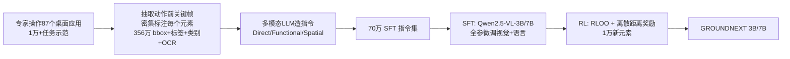

# Grounding Computer Use Agents on Human Demonstrations

**会议**: ICLR 2026  
**OpenReview**: [https://openreview.net/forum?id=9WiPZy3Kro](https://openreview.net/forum?id=9WiPZy3Kro)  
**代码 / 数据**: [https://groundcua.github.io](https://groundcua.github.io)（承诺开源数据集与模型）  
**领域**: 计算机使用智能体 / GUI 接地 (Computer-Use Agents, GUI Grounding)  
**关键词**: desktop grounding, computer-use agent, 人类示范, 视觉语言模型, SFT+RL, 数据效率  

## 一句话总结
用专家人类示范构建迄今最大的桌面 GUI 接地数据集 GROUNDCUA（87 应用、5.6 万截图、356 万人工标注元素），仅用十分之一的训练数据就把 GROUNDNEXT 系列模型在五个接地基准上训到 SOTA，证明"高质量密集监督"比"堆数据量"更能驱动可靠的桌面接地。

## 研究背景与动机
**领域现状**：计算机使用智能体（CUA）要替用户操作软件，必须先"规划下一步"，再把规划"接地"到屏幕上要点击/输入/拖拽的精确元素。Web 和 Mobile 已有大规模接地数据，桌面环境的高质量资源却严重稀缺。

**现有痛点**：桌面应用是接地的最难场景——高分辨率、布局密集、视觉相似元素多（FreeCAD 里"打开取色器"要在一堆相似图标里精准点中那个小调色板），还充斥着训练时没见过的用户特定内容（文档、表格）。而现有数据集的采集方式都有硬伤：Web 数据靠 HTML/DOM 自动抓取，偏重带文字元素、漏掉纯图标控件；桌面数据靠无障碍树（accessibility tree）遍历，但该信号常常残缺、标注不准；JEDI 靠合成界面凑规模，但简化界面又还原不了真实桌面的复杂度。

**核心矛盾**：接地一旦失败，再完美的规划也会跑偏、小错累积、任务崩盘——可桌面恰恰是最缺高质量接地数据、又最难自动采集的环境。

**本文目标**：用专家人类示范填补桌面接地的数据空白，并证明高质量数据能在远小于现有规模的数据量下达到甚至超越 SOTA。

**核心 idea**：**[数据驱动]** 不再靠自动管线碰运气，而是雇训练有素的标注员真实操作 87 个开源桌面软件、对每帧截图的几乎每个可见元素做密集人工标注，再用多模态 LLM 把这些密集标注转成多样化指令，最后 SFT+RL 两阶段训练出小而强的接地模型。

## 方法详解

### 整体框架
方法分三段流水线：① 采集——专家标注员真实操作桌面应用，录制交互轨迹并对关键帧密集标注；② 造指令——用多模态 LLM 把"边界框+标签+类别+OCR"等密集标注转写成三类自然语言指令，构成 70 万 SFT 指令集；③ 训练——以 Qwen2.5-VL（3B/7B）为底座，先 SFT 学接地，再用 RLOO 强化学习微调，奖励来自一个基于归一化距离的离散打分函数。

### 关键设计

**1. 专家密集标注采集：用真实交互轨迹替代随机搜索。** 与 OS-ATLAS 那种靠深度/广度优先搜索随机触发界面状态不同，本文让标注员设计并执行真实的日常任务（起草文档、编辑表格、跑仿真），录制下来的截图分布因此更贴近真实使用。从轨迹里抽取"用户动作触发界面变化前一刻"的关键帧，对每个可见元素画框、给文本标签（元素名优先，短文本用显示内容，长段落用 PaddleOCR 抽 OCR 或简要摘要），约 50% 元素还打上八大高层类别。最终覆盖 87 应用 / 12 类别，平均每张截图 64 个标注（是 OS-Atlas 桌面版的 3 倍多），框平均只占图面积 0.13%，专门抓住了图标、工具栏这些自动工具最容易漏掉的小控件。

**2. 上下文感知的三类指令合成：把密集标注喂给 LLM 造高难度指令。** 真实用户的指令形态各异，本文据此造三类：**Direct**（描述元素属性/位置/周边，如"点搜索栏旁的放大镜图标"）、**Functional**（描述意图而非具体控件，如"打开新标签页"而不是"点 + 号"）、**Spatial**（靠相对位置定位，如"点 Files 左边那个元素"）。关键在于：不像前人用预训练模型生成，而是把标注好的边界框、应用名、元素标签和周边上下文一起喂给多模态 LLM，让指令同时绑定视觉与文本内容，靠"几乎每个可见元素"造出语义和上下文都贴切、且足够有挑战的训练样本。

**3. SFT 先打底、RL 再精修的两阶段训练。** 底座选 Qwen2.5-VL-Instruct（3B/7B），SFT 阶段全参微调视觉编码器和语言模型（消融表明比只调语言模型接地更好），用 70 万指令子集训练。RL 阶段从更大的池子里另取 1 万个 SFT 没用过的新元素，用 **RLOO（Relative Leave-One-Out）** 做策略优化——把每个 rollout 的奖励和同组其它样本的平均奖励比较，免去训练单独的 critic：

$$\nabla_\theta J(\pi_\theta) = \frac{1}{n}\sum_{i=1}^{n}\Big(R(y_i,x) - \frac{1}{n-1}\sum_{j\neq i}R(y_j,x)\Big)\nabla_\theta \log \pi_\theta(y_i\mid x)$$

其中 $y_i$ 是预测坐标 $\hat{p}_i$ 的 token 序列，$x$ 是输入提示与图像。

**4. 基于归一化距离的离散奖励：简单却好用。** 不依赖不可靠的奖励模型/judge，而是设计离散奖励 $R_{score}(\hat{p},B,I)$：先算预测点 $\hat{p}$ 到真值框 $B$ 的带符号距离 $D(\hat{p},B)$（框内为正），归一化为 $D_{norm}=\frac{D(\hat{p},B)}{D_{ref}}$，框内时 $D_{ref}=\frac{\text{diam}(B)}{2}$、框外时 $D_{ref}=D_{max}(B,I)$，使 $D_{norm}\in[-1,1]$。再按区间离散打分：

$$R_{score}=\begin{cases}-1.0 & D_{norm}<-0.5\\ -0.5 & -0.5\le D_{norm}<-0.1\\ -0.1 & -0.1\le D_{norm}<0\\ 0.1 & 0\le D_{norm}<0.1\\ 0.5 & 0.1\le D_{norm}<0.5\\ 1.0 & D_{norm}\ge 0.5\end{cases}$$

直觉是：刚出框的预测罚得轻、远出框的罚得重、框内的鼓励往中心靠。实验对比过连续和二值方案，最终离散版经验表现最好（group size $n=8$，单 H100 节点训 1 epoch）。

## 实验关键数据

### 主实验表格（SFT-only，五基准准确率，预测点落入真值框即算对）

| 模型 | SSPro | OSW-G | MMB-GUI | SSv2 | UI-V | Avg |
|---|---|---|---|---|---|---|
| JEDI-3B（9M 数据） | 36.1 | 50.9 | 66.5 | 88.6 | 18.7 | 52.2 |
| GUI-Actor-3B | 42.2 | 48.9 | 69.8 | 91.0 | 19.7 | 54.3 |
| **GROUNDNEXT-3B (SFT)** | **48.6** | **62.2** | **75.5** | 87.3 | **58.2** | **66.4** |
| JEDI-7B | 39.5 | 54.1 | 70.4 | 91.7 | 24.8 | 56.1 |
| **GROUNDNEXT-7B (SFT)** | **50.2** | **67.2** | **80.4** | 89.3 | **58.7** | **69.2** |

3B 仅用 70 万指令（JEDI 用 9M）就反超 JEDI-3B 14.2 分；含 UI-V 时比次优 GUI-Actor-3B 高 +12.1 分。

### RL 微调与智能体表现

| 模型 | Avg（五基准） |
|---|---|
| GROUNDNEXT-3B (SFT) → (RL) | 66.4 → **68.4** |
| GROUNDNEXT-7B (SFT) → (RL) | 69.2 → **70.5** |

OSWorld-Verified 智能体设定（o3 作规划器）：GROUNDNEXT-3B 总分 **50.6**，碾压同级 OpenCUA-A3B(17.7)、Kimi-VL-A3B(10.3)，并超过 OpenCUA-72B(46.1)、Claude-4-Sonnet(41.4) 等大得多的模型，与 JEDI-7B(51.0) 打平却只有不到一半参数。

### 关键发现
- **高质量胜过大数据量**：用同一底座在各数据集各取 10 万样本对比，GROUNDCUA 的 SFT 平均分显著最高。
- **RL 增益与 SFT 质量负相关**：用 GROUNDCUA 做 SFT 的模型从 RL 拿到的提升最小（说明 SFT 已纠错充分），而用其它数据 SFT 的模型靠 GROUNDCUA 做 RL 反而提升更大。
- **图标识别是最大增益点**：SSPro 上图标识别平均超其它模型 10.7%，开发类、创意类图标分别超次优 15.9%、8.4%，得益于开源软件带来的应用特定知识。
- **跨平台泛化**：只训桌面却在移动/Web（MMBench-GUI、SSv2）上有竞争力的表现。

## 亮点与洞察
- **数据质量 > 数据量**的有力实证：70 万样本击败 9M 样本，给"接地靠堆数据"的主流路线泼了冷水。
- 用**专家真实任务轨迹**取代随机搜索/自动抓取，从源头解决了桌面密集小图标标注难、无障碍树不可靠的痛点。
- RL 奖励刻意做"简单离散"，反而印证了在高质量 SFT 之上，复杂奖励不是必需品——把性能主体归功于数据本身。
- 3B 小模型在真实多步智能体任务上超越 72B 和闭源 API，对资源受限的实际部署很有吸引力。

## 局限与展望
- **RL 增益偏小**：作者承认离散奖励简单，更精细的奖励（如 InfiGUI-G1）可能带来更大 RL 提升，留作未来工作。
- **Web 泛化偏弱**：只训桌面，SSv2 的 Web split 落后，需混入 Web/Mobile 数据。
- **规模与算力受限**：只训到 3B/7B、70 万样本，数据集本身支持更大规模扩展未充分探索。
- **领域平衡难题**：桌面是多窗口复杂工作流、移动/Web 更轻量，跨域混训如何平衡与解决迁移瓶颈仍待研究。

## 相关工作与启发
- **CUA 接地路线**：UGround、OS-ATLAS、JEDI 靠扩数据规模映射语言到 UI，本文反其道用高质量专家数据走数据高效路线。
- **RL 接地**：GUI-R1、GUI-G2、InfiGUI-G1 等用复杂距离奖励，本文用极简离散奖励说明 SFT 数据质量才是大头。
- **启发**：① 在数据稀缺/标注昂贵的具身或 GUI 任务里，"少而精的专家示范 + 密集标注"可能比自动扩量更划算；② 密集标注（带类别/位置/上下文）天然支持用 LLM 合成多样化、高难度指令，是低成本造高质量监督的通用思路；③ "RL 增益与 SFT 质量负相关"提示：评估 RL 方法时必须控制 SFT 起点，否则容易高估 RL 贡献。

## 评分
- **新颖性**: ⭐⭐⭐⭐ — 数据集构建思路（专家示范+密集人工标注）扎实但非颠覆性，核心贡献是"高质量数据"这一资源型创新，方法侧（RLOO+离散奖励）较常规。
- **实验充分度**: ⭐⭐⭐⭐⭐ — 五基准 + SFT/RL 对照 + 同量数据集横评 + 真实智能体设定 + 跨平台/图标/开源软件细粒度分析，论证链条完整有力。
- **写作质量**: ⭐⭐⭐⭐ — 动机清晰、表格和发现组织得当，FreeCAD 取色器的例子很有画面感。
- **价值**: ⭐⭐⭐⭐⭐ — 填补桌面接地高质量数据空白，承诺开源数据+模型，"质量胜量"的结论对整个 CUA 社区有方向性意义。

<!-- RELATED:START -->

## 相关论文

- [\[ICLR 2026\] SCUBA: Salesforce Computer Use Benchmark](scuba_salesforce_computer_use_benchmark.md)
- [\[ICLR 2026\] Efficient Agent Training for Computer Use](efficient_agent_training_for_computer_use.md)
- [\[ICLR 2026\] VideoAgentTrek: Computer Use Pretraining from Unlabeled Videos](videoagenttrek_computer-use_pretraining_from_unlabeled_videos.md)
- [\[ICLR 2026\] R-WoM: Retrieval-augmented World Model for Computer-use Agents](r-wom_retrieval-augmented_world_model_for_computer-use_agents.md)
- [\[ICLR 2026\] AgentSynth: Scalable Task Generation for Generalist Computer-Use Agents](agentsynth_scalable_task_generation_for_generalist_computer-use_agents.md)

<!-- RELATED:END -->
