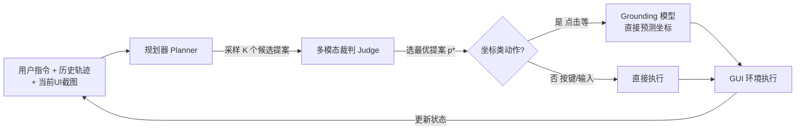

# GTA1: GUI Test-time Scaling Agent

**会议**: ICLR 2026  
**OpenReview**: [https://openreview.net/forum?id=3VIPmz7iAi](https://openreview.net/forum?id=3VIPmz7iAi)  
**代码**: 待确认（Salesforce AI Research）  
**领域**: GUI Agent / Computer Use / 多模态强化学习  
**关键词**: GUI Agent, Test-time Scaling, GUI Grounding, GRPO, 两阶段智能体, OSWorld  

## 一句话总结
GTA1 用「每步并行采样多个动作提案 + 多模态裁判挑最优」的测试时扩展解决规划易级联失败的问题，再用「直接预测坐标、点中即奖励」的纯 RL grounding 模型（不要 CoT thinking）做精准定位，让两阶段 GUI 智能体在 grounding 与任务执行两类基准上同时达到 SOTA。

## 研究背景与动机
- **领域现状**：GUI 智能体要把用户指令拆成一连串「点击 / 按键」动作，逐步与不断变化的界面交互。主流是**两阶段**范式——一个强规划器（如 o3、Claude 3.7）负责每步出动作提案，一个 grounding 模型负责把提案落到屏幕上的精确坐标。
- **现有痛点 ①（规划）**：同一个任务往往存在多条可行的动作序列，规划器一旦在早期某步选错就会**级联失败**拖垮整条轨迹；而 GUI 不像解数学题那样能「向前看」（很多动作有不可逆的状态副作用），无法提前 roll out 完整序列来挑最优路径。
- **现有痛点 ②（grounding）**：主流 grounding 靠 SFT 去拟合目标元素的**中心点**，但任务本质是「落在目标元素框内任意一点都算成功」——SFT 惩罚偏离中心，与任务目标错位，在 4K 高分辨率、复杂专业界面上泛化差。后来有人套用 DeepSeek-R1-Zero 的 RL 范式，让模型先「thinking」（CoT）再吐坐标，但 thinking 反而拖累 grounding。
- **核心矛盾**：规划需要鲁棒性却又无法 lookahead；grounding 需要灵活的奖励信号却被 SFT 的中心点监督和多余的 CoT 束缚。
- **本文目标**：用两套互补策略同时啃下规划与 grounding，建一个全程两阶段、却能在动态真实环境跑赢 native 端到端智能体的 GUI 智能体。
- **核心 idea**：**规划侧**——不提前承诺单条序列，而在每一步并行采样 K 个候选提案、用多模态裁判即时选最优，用算力换决策质量；**grounding 侧**——抛弃 thinking 与 bbox 辅助奖励，直接预测坐标、**点中目标框就给二值奖励**，让训练目标和任务本质对齐。

## 方法详解

### 整体框架
GTA1 是「规划器 + grounding 模型」的两阶段架构。每一步把（历史轨迹、当前 UI 截图、用户指令）喂给规划器，采样出 K 个候选动作提案；一个多模态大模型裁判从中选出最契合当前界面状态和用户意图的那个；若选中的是坐标类动作（如点击），再交给 grounding 模型预测精确落点去执行，非坐标动作（如按键、输入文本）则直接执行。如此逐步推进直到任务完成。两个组件分别用「测试时扩展」和「纯 RL grounding」两条独立技术线优化。

### 关键设计

**1. 测试时扩展规划：每步并行采样 + 裁判选优，用算力换鲁棒性。** 这是绕开「GUI 无法 lookahead」的核心招数。在第 $t$ 步，规划器基于当前上下文采样 $K$ 个候选提案 $\{p_k\}_{k=1}^{K}$，每个 $p_k$ 对应一个具体动作（点蓝色按钮、敲快捷键等）。随后一个多模态裁判（可以就是规划器自身）评估这 $K$ 个候选与用户意图、当前 GUI 状态的契合度，挑出最优的 $p_{k^*}$。关键在于 $K$ 个候选是**并发采样**的——只探索「短期备选」而非展开完整序列，既避免了对次优提案的过早承诺，又因并发而几乎不增加 wall-clock 时间。当 $K=1$ 时退化为不做测试时扩展的普通两阶段智能体。这条策略与具体规划器解耦，论文也验证它能直接迁移去增强 UI-TARS-1.5-7B。

**2. 数据清洗：用 OmniParser 反查标注框，剔除渲染错位的脏样本。** RL grounding 的奖励完全依赖「预测坐标是否落在目标框内」，所以训练数据的 bbox 必须准。但开源数据（如 Aria-UI）的 bbox 来自 A11y / HTML 解析器，常因 UI 动画、渲染延迟与真实视觉位置错位，给奖励引入噪声。清洗策略是：对截图 $s$ 用 OmniParser $M(\cdot)$ 检测出所有 UI 元素框 $\{b_i\}=M(s)$，对标注框 $b_{ann}$ 计算它与检测框的最大 IoU，若低于阈值 $\tau$ 就丢弃该样本：

$$\max_{b_i \in M(s)} \text{IoU}(b_{ann}, b_i) < \tau \;\Rightarrow\; \text{discard}$$

论文取 $\tau=0.3$，以此保证训练标注与真实视觉目标一致。

**3. 纯坐标 GRPO grounding：直接吐坐标、点中即奖励，不要 thinking。** grounding 模型 $\pi(\cdot,\cdot)$ 输入截图 $s$ 与动作提案 $p$，**直接输出一对像素坐标** $o_n=(x_n,y_n)$，没有任何 CoT 前置推理——这正是与 SFT 中心点监督和 R1 式 thinking 范式的本质区别。沿用 GRPO，对每个 prompt 采样 $N$ 个响应，奖励是纯二值的「是否落在标注框 $(x_{min},y_{min},x_{max},y_{max})$ 内」：

$$r_n = \begin{cases} 1, & x_{min}\le x_n\le x_{max} \;\text{且}\; y_{min}\le y_n\le y_{max}\\ 0, & \text{否则}\end{cases}$$

再用组内 Z-score 把奖励归一化成优势 $A_n$，并以 PPO 式 clip 目标优化：

$$A_n = \frac{r_n - \frac{1}{N}\sum_n r_n}{\sqrt{\frac{1}{N}\sum_n (r_n - \frac{1}{N}\sum_n r_n)^2}}$$

$$L = -\frac{1}{N}\sum_{n=1}^{N}\min\!\left(\frac{\pi(o_n|s,p)}{\pi_{old}(o_n|s,p)}A_n,\; \text{clip}\!\left(\frac{\pi(o_n|s,p)}{\pi_{old}(o_n|s,p)},1-\epsilon,1+\epsilon\right)A_n\right)$$

这个奖励让「框内任意一点都算对」的任务本质与训练目标完全对齐，简单却高效，是 grounding 拿到 SOTA 的根本原因。

## 实验关键数据

### 主实验表格
ScreenSpot-Pro（最难，高分辨率专业界面）grounding 准确率：

| 模型 | 参数 | Avg (%) |
|------|------|---------|
| UGround-72B | 72B | 34.5 |
| Qwen2.5-VL-72B | 72B | 53.3 |
| OpenCUA-32B | 32B | 55.3 |
| UI-TARS-1.5-7B | 7B | 42.0 |
| **GTA1-7B** | 7B | **50.1** |
| **GTA1-32B** | 32B | **63.6** |

GTA1-7B 以 7B 体量（50.1%）反超 UGround-72B（34.5%）。ScreenSpot-V2 上 GTA1-32B 达 95.2%，追平闭源 Seed-1.5-VL；OSWorld-G 上 GTA1-32B 72.2% 刷新 SOTA。

任务执行（OSWorld-Verified / WindowsAgentArena 成功率）：

| 智能体 | OSWorld-Verified (%) | WAA (%) |
|--------|----------------------|---------|
| Agent S2.5 w/ GPT-5 | 58.4 | - |
| CoAct-1 | 60.8 | - |
| Jedi-7B | - | 33.7 |
| **GTA1-7B w/ GPT-5** | **61.0** | 49.2 |
| **GTA1-32B w/ GPT-5** | **63.4** | 50.6 (51.2 w/ o3) |

GTA1-7B w/ o3 在原始 OSWorld 上 45.2%（100 步），超过 native 的 CUA o3（42.9%，200 步），首次证明两阶段智能体能在动态真实环境跑赢端到端 native 智能体。

### 消融实验表格
奖励设计消融（grounding 准确率 %）：

| Click | IoU | Format(thinking) | ScreenSpot-Pro | ScreenSpot-V2 | OSWorld-G |
|:---:|:---:|:---:|:---:|:---:|:---:|
| ✓ | ✓ | ✓ | 44.5 | 89.3 | 59.9 |
| ✓ | ✓ |  | 42.2 | 89.2 | 59.2 |
| ✓ |  | ✓ | 46.9 | 93.2 | 67.0 |
| ✓ |  |  | **50.1** | 92.4 | **67.7** |

**纯 click 奖励**在两个最难基准上都最好——加 IoU 或 format(thinking) 反而拖后腿。

### 关键发现
- **thinking 只在动态环境有用**：静态 grounding 基准上加不加 thinking 几乎无差（成功样本不同更像训练抖动）；但在 AndroidWorld 这种带历史轨迹+任务目标的动态环境，thinking 把成功率从 39% 提到 44%——复杂文本上下文才激发推理价值。
- **K 越大越好且省墙钟时间**：把 K 从 1 增到 32，UI-TARS-1.5-7B 仅跑 15 步就超过其不做扩展跑 100 步的成绩；因 K 个候选并发采样，几乎不增加耗时；50 步 horizon 增益最大（15 步常不够完成任务，100 步又过于宽松稀释收益）。
- **测试时扩展可迁移**：该策略直接套在 UI-TARS-1.5-7B 上同样稳定涨点，证明与具体规划器解耦。

## 亮点与洞察
- **「用算力换规划鲁棒性」的优雅解法**：在无法 lookahead 的 GUI 里，把「挑路径」从「展开完整序列」降级为「每步并发采样+裁判选优」，既避开不可逆副作用，又靠并发不增加延迟，是测试时扩展在 agent 场景的漂亮落地。
- **「少即是多」的 grounding 哲学**：去掉 thinking、去掉 bbox 辅助奖励，只留「点中框就给 1」的二值奖励，反而把任务本质（框内即对）和训练目标对齐到极致，7B 反超 72B。
- **打破「native 端到端必然更强」的成见**：首次让两阶段智能体在 OSWorld 动态环境跑赢 native CUA，且步数更短。

## 局限与展望
- **裁判即上界**：测试时扩展的天花板取决于裁判能否正确从 K 个候选里识别最优提案，裁判错判会直接限制收益。
- **算力成本**：K 倍采样虽并发但总 token 消耗与算力成本随 K 线性增长，论文也展示了 token usage 上升。
- **thinking 的不可预测性**：thinking 在动态环境有用、静态无用，何时该开 thinking 仍靠经验判断，缺乏自适应机制。
- **数据清洗依赖外部检测器**：清洗质量受限于 OmniParser 的检测准确度，检测器本身的漏检/错检会传导成新的噪声。

## 相关工作与启发
- **延续 DeepSeek-R1-Zero / GRPO 路线**：把 R1 的 RL 思想迁到 GUI grounding，但**反向**论证了 GUI 场景不需要 thinking——与并发工作 GUI-G1 的观察一致。
- **对比两阶段 vs native**：相对 UI-TARS / CUA / Claude Computer Use 等端到端 native 智能体，本文坚持两阶段模块化（规划器+grounding 解耦）并证明其竞争力。
- **启发**：测试时扩展不只属于数学/代码推理，凡是「单步决策多解、整体不可回溯」的序贯决策任务（机器人操作、网页导航）都可借鉴「每步并发采样+裁判」的范式；奖励设计应回到任务本质而非套用通用模板。

## 评分
- 新颖性: ⭐⭐⭐⭐ 测试时扩展用于 GUI 规划 + 纯 click 奖励去 thinking 的组合有清晰洞察，虽两条技术线本身（GRPO、采样选优）非首创，但针对 GUI 痛点的诊断和「少即是多」结论很有价值。
- 实验充分度: ⭐⭐⭐⭐ 覆盖 3 个 grounding + 2 个 agent 基准、多种模型规模、奖励/thinking/K 三组消融，且验证了向 UI-TARS 的可迁移性，证据链扎实。
- 写作质量: ⭐⭐⭐⭐ 问题动机（lookahead 缺失、SFT 错位）讲得透彻，图 2 架构与公式清晰，结论可操作。
- 价值: ⭐⭐⭐⭐ 同时刷新 grounding 与任务执行 SOTA，首次让两阶段智能体跑赢 native，对 computer-use agent 工程实践有直接指导意义。

<!-- RELATED:START -->

## 相关论文

- [\[ICLR 2026\] Pushing Test-Time Scaling Limits of Deep Search with Asymmetric Verification](pushing_test-time_scaling_limits_of_deep_search_with_asymmetric_verification.md)
- [\[ICLR 2026\] Test-Time Adaptation for LLM Agents via Environment Interaction](test-time_adaptation_for_llm_agents_via_environment_interaction.md)
- [\[ACL 2025\] METAL: A Multi-Agent Framework for Chart Generation with Test-Time Scaling](../../ACL2025/llm_agent/metal_a_multi-agent_framework_for_chart_generation_with_test-time_scaling.md)
- [\[ICLR 2026\] EvoTest: Evolutionary Test-Time Learning for Self-Improving Agentic Systems](evotest_evolutionary_test-time_learning_for_self-improving_agentic_systems.md)
- [\[ICLR 2026\] Scaling Agent Learning via Experience Synthesis](scaling_agent_learning_via_experience_synthesis.md)

<!-- RELATED:END -->
