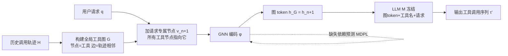

# GTool: Graph Enhanced Tool Planning with Large Language Model

**会议**: ICLR 2026  
**OpenReview**: [https://openreview.net/forum?id=bn47cqGQ7l](https://openreview.net/forum?id=bn47cqGQ7l)  
**代码**: 待确认  
**领域**: LLM Agent / 工具规划  
**关键词**: 工具规划, 工具依赖图, 图神经网络, 缺失依赖预测, LLM Agent  

## 一句话总结
GTool 把"工具之间的依赖关系"建成一张请求专属的工具图，用 GNN 编码成一个 `<graph token>` 喂给冻结的 LLM，并设计缺失依赖预测任务来对抗不完整依赖，让 7B 小模型的工具规划性能比 SOTA 高出 29.6%。

## 研究背景与动机
**领域现状**：工具规划（tool planning）是让 LLM 调用外部 API/算法解决复杂问题的核心能力——选哪些工具、怎么组织、按什么顺序调用，是连接"自然语言理解"和"任务执行"的桥梁。现有方法分两派：tuning-free 派靠提示工程把工具描述塞进上下文，tuning-based 派引入可训练模块或专用语料微调 LLM。

**现有痛点**：两派都把不同工具当成孤立组件，忽略了工具之间天然存在的依赖关系——一个工具的输入往往依赖另一个工具的输出。结果是规划出的调用序列经常是无效的（顺序错、缺前置工具）。tuning-free 方法上下文太长且看不懂用户意图；tuning-based 方法则依赖预先定义好的依赖结构，而这在真实场景里几乎拿不到。

**核心矛盾**：工具依赖天然适合用图来表示（节点=工具，边=依赖），但真实世界里这张图是从有限的历史调用轨迹里"攒"出来的，**必然是不完整的**——轨迹覆盖不到所有依赖对，导致图里既有错边也有缺边。直接把这种残缺图丢给模型反而会误导规划。

**本文目标**：在依赖不完整的现实约束下，第一个系统性地为 LLM 工具规划注入图结构信息，同时不动 LLM 主干参数。

**核心 idea**：**「请求专属工具图 + 图 token 注入 + 缺失依赖预测」**。把每个用户请求当作一个特殊节点接到工具图上，用 GNN 把请求相关的依赖信息聚合成一个图 token 注入 LLM；再用一个专门的缺失依赖预测任务训练 GNN，让它即便面对残缺图也能稳健工作。整套方案冻结 LLM、只训练 GNN，因此能即插即用到各种主干。

## 方法详解

### 整体框架
GTool 由三个模块串成一条流水线：**请求专属工具图构建 → 工具依赖建模 → 图增强规划**。先从历史调用轨迹里搭出一张全局工具图，再针对每个请求裁出请求专属子图，用 GNN 把它压缩成一个图 token，最后把这个 token 连同工具名列表和用户请求一起喂进冻结的 LLM 生成调用序列。训练时联合优化"工具规划损失"和"缺失依赖预测损失"，且全程只更新 GNN 参数。

### 关键设计

**1. 请求专属工具图：把"和这个请求相关的依赖"聚到一个节点上。** 全局工具图 $G=\{V,E\}$ 的节点属性 $a_i = f(d(t_i))$ 用 BERT 编码工具文档得到，边则由历史轨迹相邻关系迭代累加：对每条轨迹 $\tau_i$ 加入边集 $E \leftarrow E \cup \{(v_{ij}, v_{ij+1})\}$。问题是一次请求真正用到的工具远少于整张图，无差别建模整图会引入大量无关噪声。GTool 的做法是为每个请求 $q$ 额外加一个请求专属节点 $v_{n+1}$（属性为 $f(q)$），并让**所有工具节点都连一条有向边指向它** $E(q)=E\cup\{(v_i,v_{n+1})\}$。这样在 GNN 消息传递时，和请求相关的工具语义与依赖信息会沿这些边汇聚到 $v_{n+1}$，自然完成"请求相关信息的聚合与浓缩"。

**2. 图 token 注入：用 GNN 的一个节点表示当作 LLM 能读懂的依赖摘要。** GNN 编码器（实现用 TransformerConv，3 层）对请求专属图做一次前向 $[h_1,\dots,h_{n+1}]=\phi(G(q);\theta)$，由于所有节点都指向 $v_{n+1}$，请求相关信息全部传播到它身上，于是直接取 $h_G = h_{n+1}$ 作为整张图的表示。规划时构造提示模板，把工具名列表、用户请求和这个图嵌入 $\langle \text{graph embed}\rangle = h_G$ 拼在一起（用 `[/graph]` 作为图表示的特殊标识符），喂给冻结的 LLM $M$，目标是自回归生成真实轨迹 $\tau_G$，损失为 $L_{TL}=p_M(\tau_G|w)$。关键点在于：工具描述被压进图 token 而非塞进提示，所以 per-request 的提示 token 量骤降（实测降 80%+），同时让 LLM 的推理能同时吃到"请求语义"和"图结构"。

**3. 缺失依赖预测（MDPL）：主动 mask 掉一些边，逼模型学会补全残缺图。** 既然历史轨迹搭出的图必然缺边，GTool 不假设图是完整的，而是显式建模这种不完整性。具体三步：对已有边以概率 $\rho$ 随机 mask，把被 mask 的边记为正候选 $(v_i,v_j,l=\text{'yes'})$，不存在的边记为负候选 $l=\text{'no'}$；按模板把节点嵌入对填进文本语料 $x$（用 `[/node]` 标记表示边界）；再让 LLM 自回归地预测这条边是否存在，反向优化 GNN 参数 $\theta$。由于边数可能巨大、全量算损失开销爆炸，GTool 对正负边各做平衡采样 $S=RS(\hat{E}^+,\alpha)\cup RS(\hat{E}^-,\alpha)$，损失只在采样集上算：$L_{MDPL}=\frac{1}{|S|}\sum_S p_M(l|x)$。最终把两个损失加权合并 $L=L_{TL}+\lambda L_{MDPL}$ 联合训练，让 GNN 既学会规划又学会补依赖。

**4. 冻结 LLM、只训 GNN 的即插即用设计。** 整个训练过程不动 LLM 主干的任何参数，只优化 GNN 编码器 $\theta$。这带来两个直接好处：一是不需要为每个新主干重新大规模微调，GTool 能无缝接到 LLaMA、Vicuna、Qwen3 等十种开源模型上；二是大幅省算力，训练语料构造也不再 labor-intensive。代价是模型能力强弱仍会影响上限（弱模型受益更大，强模型本身鲁棒）。

## 实验关键数据

### 主实验表格
在 TaskBench（HuggingFace/Daily Life/Multimedia 三个子集）和 ToolE 上，三种主干对比（n-F1↑ / l-F1↑ / NED↓）：

| 主干 | 方法 | HuggingFace n-F1 | Daily Life n-F1 | Multimedia n-F1 | ToolE n-F1 |
|------|------|------|------|------|------|
| LLaMA-2-7B | GNN4Plan (最强baseline) | 0.4853 | 0.3588 | 0.4593 | 0.5069 |
| LLaMA-2-7B | **GTool** | **0.7913** | **0.9458** | **0.8001** | 0.3800 |
| Vicuna-13B | GNN4Plan | 0.5776 | 0.7872 | 0.6364 | 0.7209 |
| Vicuna-13B | **GTool** | **0.8029** | **0.9612** | **0.7905** | 0.7833 |
| Qwen3-14B | GNN4Plan | 0.7602 | 0.9024 | 0.8269 | 0.7639 |
| Qwen3-14B | **GTool** | **0.8053** | **0.9668** | **0.8543** | 0.7749 |

GTool 在几乎所有数据集/主干上全面领先，相比最强 baseline GNN4Plan 的 n-F1 增幅约 26.7%（论文摘要口径 7B 主干 >29.6%）。仅在 ToolE（序列短于 3 步）上，HuggingGPT 在 l-F1/NED 略胜，因短链推理更契合其简洁风格。

### 消融实验表格
LLaMA-2-7B / Vicuna-13B 上的消融（n-F1↑ / l-F1↑ / NED↓）：

| 变体 | LLaMA n-F1 | LLaMA l-F1 | LLaMA NED | Vicuna n-F1 |
|------|------|------|------|------|
| w/o All（去掉整张图，仅工具名+指令） | 0.1566 | 0.0243 | 0.8611 | 0.1626 |
| w/o Both（去请求节点+MDPL，保留图token） | 0.6131 | 0.3469 | 0.4072 | 0.7370 |
| w/o RS（去请求专属节点） | 0.7128 | 0.4433 | 0.3108 | 0.7589 |
| w/o MDPL（去缺失依赖预测） | 0.7650 | 0.5196 | 0.2541 | 0.7707 |
| w/ LLMlp（用LLM直接预测依赖代替MDPL） | 0.7602 | 0.4869 | 0.2676 | 0.7784 |
| **GTool（完整）** | **0.7913** | **0.5403** | 0.2537 | **0.8029** |

请求专属节点贡献最大（去掉 n-F1 掉 9.92%、l-F1 掉 17.9%）；MDPL 也稳定有效，且用 LLM 直接预测依赖（w/LLMlp）效果不如专用 MDPL 模块。w/o All 直接崩盘，说明图信息是性能主体。

### 关键发现
- **抗缺失依赖**：在 0.1~0.9 的不同缺边比例下 GTool 稳定领先，即便缺 90% 依赖仍可用；但极端稀疏（90%）时在 Qwen3-14B 上会反被 baseline 超过——因为此时图几乎无信息，而 GTool 的提示又太简洁（只有工具名）。
- **大规模工具集（ToolBench, 16000+ API）**：n-F1 0.6126 仍最高，且工具图边数随工具数近似线性增长，scalability 好。
- **效率**：per-request token 量比 HuggingGPT/TaskBench 降 80%+；推理时间约为 SOTA 的 1/10（GTool 2.02s/R vs GNN4Plan 47.58s/R、Tool-Planner 6.67s/R）。
- **弱模型受益更大**：消融在 LLaMA-2-7B 上的性能跌幅明显大于 Vicuna-13B，说明 GTool 对能力较弱的主干增益更显著。

## 亮点与洞察
- **把"残缺"当成一等公民来建模**：不假设依赖图完整，而是用 mask + 预测主动学习补全，这正好贴合"轨迹永远覆盖不全依赖"的现实，是本文最务实的洞察。
- **图 token 替代长提示**：用一个 GNN 表示压缩工具描述与依赖，一举解决了上下文过长和成本两个老大难，token 降 80%+、推理快 10 倍。
- **冻结 LLM 的即插即用**：只训 GNN 让方法天然跨主干、低成本，工程落地友好。
- **请求专属图的星型聚合**：让所有工具节点指向请求节点，借 GNN 消息传递天然完成"任务相关信息浓缩"，设计简洁却最有效。

## 局限与展望
- **极端稀疏下退化**：缺 90% 依赖时简洁提示反成短板，说明 GTool 强依赖图里的结构信息，纯靠 LLM 兜底能力弱。
- **单次交互的天花板**：GTool 刻意只与 LLM 交互一次，未与 ToolLLaMA/STE 这类多轮交互方法比较；作者承认融合多轮可能进一步提升，留作未来工作。
- **图质量依赖工具描述**：cold-start（无历史轨迹）实验显示，描述越简陋（如 ToolE）性能掉得越多，方法对工具文档质量较敏感。
- **NED 仍是难点**：调用顺序正确性（NED）普遍比工具选择（n-F1）更难，留有提升空间。

## 相关工作与启发
- **Tuning-free 工具规划**：HuggingGPT、TaskBench、ToolLLM 等靠提示设计编码工具信息，启发了"上下文太长"这一痛点的提出。
- **Tuning-based 对齐模块**：GNN4Plan、ToolNet、Tool-Planner 引入可训练对齐模块，是 GTool 最直接的对手；GTool 的差异在于不需额外推理生成文本步骤。
- **图学习处理不完整图**：链路预测（Zhang & Chen 2018）、GCN（Kipf & Welling）等为缺失依赖预测提供了方法论基础。
- **启发**：把"图作为一种新模态注入冻结 LLM"这条路（graph token + 对齐），可推广到知识图谱问答、流程编排等任何"实体间有结构依赖"的 LLM 任务。

## 评分
- **新颖性**: ⭐⭐⭐⭐ 首个针对"不完整工具依赖"做建模的工作，请求专属图 + 图 token 注入 + MDPL 三件套组合新颖且动机扎实。
- **实验充分度**: ⭐⭐⭐⭐ 4 数据集 × 10 主干、含大规模 ToolBench、缺失比例、效率、消融、cold-start/transfer 鲁棒性，覆盖全面；唯缺与多轮交互方法的对比。
- **写作质量**: ⭐⭐⭐⭐ 动机—挑战—方法逻辑清晰，图示到位；个别句子有笔误但不影响理解。
- **价值**: ⭐⭐⭐⭐ 7B 小模型超 SOTA 29.6%、推理快 10 倍、token 省 80%，即插即用，对真实工具 Agent 落地价值高。

<!-- RELATED:START -->

## 相关论文

- [\[ICLR 2026\] DreamPhase: Offline Imagination and Uncertainty-Guided Planning for Large-Language-Model Agents](dreamphase_offline_imagination_and_uncertainty-guided_planning_for_large-languag.md)
- [\[ICLR 2026\] GPS: Graph-guided Proactive Information Seeking in Large Language Models](gps_graph-guided_proactive_information_seeking_in_large_language_models.md)
- [\[AAAI 2026\] AutoTool: Efficient Tool Selection for Large Language Model Agents](../../AAAI2026/llm_agent/autotool_efficient_tool_selection_for_large_language_model_agents.md)
- [\[ICLR 2026\] ToolTree: Efficient LLM Agent Tool Planning via Dual-Feedback Monte Carlo Tree Search and Bidirectional Pruning](tooltree_efficient_llm_tool_planning_via_dual-feedback_monte_carlo_tree_search_a.md)
- [\[ICLR 2026\] ToolWeaver: Weaving Collaborative Semantics for Scalable Tool Use in Large Language Models](toolweaver_weaving_collaborative_semantics_for_scalable_tool_use_in_large_langua.md)

<!-- RELATED:END -->
