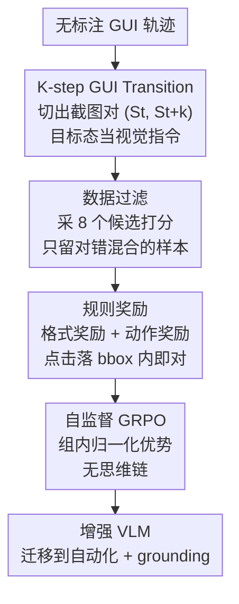

# GUI-Shift: Enhancing VLM-Based GUI Agents through Self-supervised Reinforcement Learning

**会议**: ICLR 2026  
**OpenReview**: [https://openreview.net/forum?id=NakMHPljT7](https://openreview.net/forum?id=NakMHPljT7)  
**代码**: https://github.com/UbiquitousLearning/GUI-Shift (待开源)  
**领域**: Agent / 多模态VLM  
**关键词**: GUI Agent, 自监督学习, 逆动力学, GRPO, 强化学习

## 一句话总结
本文提出 **K-step GUI Transition** 这一自监督逆动力学任务——只给一对截图 $(S_t, S_{t+k})$ 让模型预测引发该跳转的首个动作，从而无需任何文本指令标注；再用 GRPO 强化学习框架 GUI-Shift 配合数据过滤来训练，仅用 2K 样本就让多个 VLM 在 GUI 自动化任务上最高提升 11.2%，并能零额外微调地迁移到 GUI grounding 任务。

## 研究背景与动机

**领域现状**：移动端 GUI Agent 的主流范式，是用视觉语言模型（VLM）把自然语言指令映射到屏幕动作（点击、滑动等），训练方式几乎都是在「GUI 交互轨迹 + 人工标注任务指令」配对数据上做监督微调（SFT）。

**现有痛点**：这种范式高度依赖标注，而 GUI 轨迹的指令标注既费力又易错。论文给出一个触目惊心的例子：AndroidControl 数据集为了产出 15,283 条任务演示，花了**整整一年的付费标注**。标注成本直接卡死了数据规模的天花板，而真正海量、廉价、容易自动采集的是**无标注的 GUI 轨迹**，却被浪费掉了。

**核心矛盾**：一方面无标注轨迹本身就**内含了 ground-truth 动作**（轨迹里每一步点了哪、滑了哪都记录在案），另一方面 SFT 又有个结构性缺陷——GUI 里很多动作参数是**功能等价**的：点击按钮 bbox 内任意坐标都对，文本输入也允许多种格式。SFT 用交叉熵强行对齐数据集里那个唯一参考动作，会惩罚掉所有其他同样正确的选择，给出误导性的学习信号。

**本文目标**：① 如何不靠人工指令、直接利用海量无标注 GUI 轨迹来训练 GUI Agent；② 如何在训练范式上绕开 SFT 对「动作多样性」的惩罚。

**切入角度**：作者借鉴了机器人学/生物力学里的**逆动力学建模**——给定两个连续物理状态，预测连接它们的控制指令。把它搬到 GUI 上：截图就是「状态」，GUI 动作就是「指令」。于是「预测从当前屏到未来屏所需的动作」天然就是个自监督任务，监督信号直接藏在轨迹里，无需任何文本标注。

**核心 idea**：用「k 步之后的目标截图 $S_{t+k}$」替代「人写的文本指令」作为视觉目标，让模型预测跨状态跳转的首个动作（自监督逆动力学），并用容忍动作多样性的 GRPO 强化学习而非 SFT 来训练。

## 方法详解

### 整体框架

GUI-Shift 是一个把 GRPO 强化学习应用到 K-step GUI Transition 任务上的自监督训练框架。它的核心思路可以一句话概括：**从无标注 GUI 轨迹里切出截图对 → 用模型自己的采样打分把样本过滤成「难度适中」的训练集 → 用规则奖励驱动 GRPO 更新 VLM**，最终得到一个对 GUI 动态理解更强、可同时迁移到自动化与 grounding 的 backbone。

具体地，一条长度为 $n$ 的 GUI 轨迹可以切出多达 $n-k$ 个训练对 $(S_t, S_{t+k})$，其中 $S_{t+k}$ 是从 $S_t$ 执行 $K$ 个动作后的状态。每个样本喂给 VLM 的提示是「给你当前态 $S_t$ 和未来态 $S_{t+k}$，推断启动这一跳转的第一个动作」。训练时模型对每个样本采样 $N=8$ 个候选动作，用一个**纯规则奖励**（格式 + 动作正确性）打分，再做组内归一化优势计算并以 GRPO 更新——全程没有自然语言指令、没有显式思维链。数据侧用**完全相同**的采样打分机制做过滤，只保留那些「8 个候选里既有对的又有错的」样本，把训练集对齐到模型当前的学习能力。

### 关键设计

**1. K-step GUI Transition：把无标注轨迹变成自监督逆动力学任务**

这一设计直接针对「指令标注贵且浪费无标注轨迹」的痛点。它把任务定义为：给定当前截图 $S_t$ 和 $k$ 步之后的截图 $S_{t+k}$，预测**启动**这段跳转的第一个动作 $a_t$。监督信号 $a_t$ 是轨迹里现成记录的，无需任何人工标注；而 $S_{t+k}$ 作为「视觉目标」替代了文本指令的角色。相比 UI-TARS 那类「描述两屏视觉差异」的状态转移任务（只描述、不预测动作，和真正的自动化有 gap），也相比 MobileVLM 只支持单步、且仍用 SFT 的动作预测，本文的 $k$ 步公式更难也更有信息量：它逼模型**对比当前态与目标态、推断跳转意图、再定位起始动作**，从而学到真正的 GUI 时序动态。规模上，任意 $k$ 下一条 $n$ 屏轨迹可产出 $n-k$ 个样本，数据利用率拉满。

**2. 面向 GUI 的规则奖励：用容忍动作多样性的判定替代交叉熵硬对齐**

这一设计是为了根治 SFT「惩罚所有非参考的正确动作」的毛病。奖励由格式奖励 $R_f$ 与动作奖励 $R_a$ 相加构成：$R = R_f + R_a$。格式奖励要求最终答案包在 `<answer>...</answer>` 标签里，合规给 1 否则给 0。动作奖励则按动作类型分段判定（统一动作空间含 8 类）：

$$R_a = \begin{cases} 1, & x_1 \le \hat{x} \le x_2 \text{ 且 } y_1 \le \hat{y} \le y_2,\ t \in \{\text{click, long\_press}\} \\ 1, & \hat{t}=t \text{ 且 } \hat{p}=p,\ t \in \{\text{open\_app, input\_text, scroll}\} \\ 1, & \hat{t}=t,\ t \in \{\text{navigate\_back, navigate\_home, wait}\} \\ 0, & \text{otherwise} \end{cases}$$

关键在于点击/长按只要预测坐标**落在 ground-truth bbox 内**就算对，而不是 SFT 那样要求与参考坐标逐字符精确匹配。这种「容忍但仍可验证」的奖励，正好契合 GUI grounding 的实际需求——按钮里任意一点都是有效点击——因此给出比交叉熵更宽容也更有信息量的优化信号。

**3. 自监督 GRPO：去掉 critic 与思维链的高效强化学习**

这一设计承接奖励，把它接到 GRPO 上完成参数更新。对每个样本，模型用高温采样生成一组 $N=8$ 个候选 $\{o_1,\dots,o_G\}$，按上面的规则奖励打分，再计算组内归一化优势 $A_i = \frac{r_i - \text{mean}(\{r\})}{\text{std}(\{r\})}$，用带 KL 正则的裁剪目标更新策略。作者解释 GRPO 特别适配本任务有三点：相比 PPO 它省掉了与策略同尺寸的 value 网络，大幅降算力；相比 SFT 它能给每类动作定制灵活奖励（点击只要落 bbox 即可）；$N$ 候选采样机制鼓励探索、让模型从最优候选里学、避开次优。更激进的是，GUI-Shift **训练时不要求显式思维链**（不写 `<think>...</think>`）——这不仅没掉点反而常常涨点，还把 token 解码量砍掉、训练时间近乎减半（Qwen2.5-VL-7B 从 17 小时降到 9 小时）。

**4. 数据过滤流水线：用模型自身能力筛出「难度适配」的样本**

这一设计解决「无标注样本良莠不齐、太简单或太难都白练」的问题，且与训练**复用同一套采样打分机制**。流程是：对每个 $K\in\{1,2,3,4\}$ 先从原始数据构候选状态对池；对每个对，模型用与 GRPO 相同的采样温度生成 8 个回答并用规则奖励打分；最后**只保留那些既有正确又有错误回答的对**——全对说明太简单、全错说明太难，都被丢掉。因为不依赖人工指令，这个过滤几乎零成本即可大规模做（例如为 Mimo-VL-7B-RL 从 8K 个 1 步对里筛出 2,920 个高质量样本，无标注浪费）。筛后的训练集既有挑战性又对齐模型当前学习能力。

### 损失函数 / 训练策略

训练目标即 GRPO 目标（公式 1）：对每个问题 $q$ 从旧策略 $\pi_{\theta_{old}}$ 采一组输出，最大化裁剪后的代理目标 $\min(\rho_i A_i, \text{clip}(\rho_i, 1-\epsilon, 1+\epsilon)A_i)$ 并减去对参考策略的 KL 正则 $\beta D_{KL}(\pi_\theta \| \pi_{ref})$，其中重要性比 $\rho_i = \pi_\theta(o_i|q)/\pi_{\theta_{old}}(o_i|q)$。训练时**只优化语言模型，冻结视觉编码器与 projector**。基于开源 VLM-R1 框架，在 8×H100 上对四个 backbone（Qwen2.5-VL-7B、InternVL3-8B、MimoVL-7B-SFT、MimoVL-7B-RL）各用每个 $K$ 的 2K 样本训练；数据全部源自 AndroidControl 训练集的轨迹。

## 实验关键数据

### 主实验

在 GUI 任务自动化（AndroidControl、GUI Odyssey）上，GUI-Shift 用仅 2K 样本就让各 backbone 显著涨点，尤其是考验长程规划的 AC-High。TM=动作类型匹配，EM=类型+参数全对的精确匹配。

| 模型 | 训练样本 | AC-Low EM | AC-High EM | GUI Odyssey EM |
|------|---------|-----------|-----------|----------------|
| Qwen2.5-VL-7B (base) | - | 83.8 | 59.2 | 44.9 |
| **GUI-Shift-Qwen (k=1)** | 2K | 90.6 ↑6.8 | **70.4 ↑11.2** | 54.8 ↑9.9 |
| Mimo-VL-7B-SFT (base) | - | 85.7 | 63.1 | 62.0 |
| **GUI-Shift-Mimo-SFT (k=3)** | 2K | 93.2 ↑7.5 | 73.4 ↑10.3 | 60.7 ↓1.3 |
| UI-Venus-Navi-7B（标注训练） | 350K | 92.4 | 76.1 | 71.5 |

仅用 2K 自监督样本即逼近甚至超过用几十万到百万标注样本训练的模型。在 GUI grounding（ScreenSpot-v2 / -Pro）上也一致涨点，最好变体在 ScreenSpot-v2 上 +2.5%、ScreenSpot-Pro 上 +1.5%，且除专门为 grounding 训练（107K 标注）的 UI-Venus-Ground-7B 外超过了所有标注训练模型——证明纯无标注 Transition 数据能迁移到 grounding。

端到端（整条轨迹全步正确才算成功）上 Mimo-VL-7B-SFT 的 AC-Low 从 48.4% 升到 75.7%、AC-High 从 16.4% 升到 34.1%；在交互式 AndroidWorld 上 Pass@1 成功率从 6.0% 升到 16.4%（K=3）。

### 消融实验

| 配置 | 关键指标 | 说明 |
|------|---------|------|
| Full（GUI Transition + 过滤 + GRPO，无思维链） | AC-High EM 70.4 (Qwen) | 完整模型 |
| w/o 数据过滤 | AC-Low 最多 −4.8% (Mimo-SFT, K=3) | 用未过滤数据，多数场景掉点 |
| 用文本任务指令代替 $S_{t+k}$ | InternVL3 AC-Low/High EM −4.0/−3.6 | 视觉目标比文本指令更优 |
| w/ 显式思维链 | InternVL3 AC-High EM 最多 −7.9 | 加思维链反而掉点且训练慢近一倍 |
| SFT 代替 GRPO | 最多比 GRPO 低 65.1% (K=3) | SFT 一致低于 base 和 GRPO |

### 关键发现
- **视觉目标 > 文本指令**：把 $S_{t+k}$ 当指令，比配人工任务指令/步骤指令训练更好（InternVL3 上 EM 高 3.6~4.0%），说明目标截图提供的信号比文本更具体、更有信息量。
- **思维链反而有害**：去掉显式 reasoning 不仅不掉点常常涨点（InternVL3 AC-High 最多 +7.9% EM），还把训练时间砍半——这是个反直觉但很实用的结论。
- **SFT 在该任务上彻底失效**：SFT 一致低于 base 模型，最多比 GRPO 低 65.1%，印证了「交叉熵硬对齐 + 动作多样性」的结构冲突，必须用容忍式奖励的 RL。
- **GUI Odyssey 偶有小幅下降**，作者归因于测试集含 1,381 条平板 episode，其布局与训练用的手机差异大。

## 亮点与洞察
- **逆动力学跨域迁移到 GUI**：把机器人学的「两态预测控制指令」搬到「两屏预测动作」，让无标注轨迹直接变成自监督金矿，思路干净且可无限 scale（$n$ 屏出 $n-k$ 样本）。
- **「对错混合」的数据过滤判据极简且自洽**：用模型自己采样的 8 个候选，全对/全错都丢、只留混合——既筛掉无信息样本又天然对齐模型当前能力，且和训练共用一套机制，零额外成本。
- **去思维链既快又好**：在 GUI 动作预测这类「答案可验证、推理链冗余」的任务上，砍掉 reasoning token 省一半训练时间还涨点，可迁移到其他结构化输出的 RL 任务。
- **容忍式 bbox 奖励**：把「点击落在框内即对」写进奖励，精准匹配 GUI grounding 的物理事实，是 RL 优于 SFT 的关键来源。

## 局限与展望
- **训练数据仍取自有标注数据集的轨迹**：虽然训练时只用了轨迹里的动作（不用指令），但实验数据全来自 AndroidControl 这种已标注集，论文宣称的「自动探索采集无标注轨迹」尚未在真实大规模自动探索数据上验证。
- **跨形态泛化有限**：在平板布局（GUI Odyssey 的平板 episode）上出现下降，说明对训练分布外的屏幕布局仍敏感。
- **K 的选择缺乏自适应**：不同 backbone 的最优 $K$ 不同（Qwen 偏好 k=1、InternVL 偏好 k=4），目前靠枚举 $K\in\{1,2,3,4\}$ 而非自动决定，留有调参负担。
- **奖励仅覆盖可验证动作**：规则奖励对 input_text 要求参数精确匹配，对开放文本输入的多样性容忍度仍弱于点击坐标。

## 相关工作与启发
- **vs UI-TARS（状态转移任务）**：UI-TARS 的转移任务只**描述**两屏视觉变化、不预测底层动作，和真正的任务自动化有 gap；本文直接预测引发跳转的动作，把「理解动态」和「执行动作」打通。
- **vs MobileVLM**：MobileVLM 也做截图间动作预测，但只限单步转移且仍用 SFT；本文推广到 $k$ 步逆动力学并改用自监督 GRPO。
- **vs UI-R1 / GUI-R1 / InfiGUI-R1（规则 RL on GUI）**：这些工作虽用了 GRPO，但仍依赖人工标注的指令、且训练推理都要 reasoning；本文用单阶段 RL、无标注、无思维链，反而在更省的设定下取得有竞争力的泛化。

## 评分
- 新颖性: ⭐⭐⭐⭐⭐ 把逆动力学自监督 + 视觉目标 + 规则 RL 三者组合成无标注 GUI Agent 训练范式，切口清晰且有效。
- 实验充分度: ⭐⭐⭐⭐⭐ 4 个 backbone × 5 个 benchmark，覆盖单步/端到端/交互式，并对数据过滤、任务形式、思维链、训练算法四维度做了系统消融。
- 写作质量: ⭐⭐⭐⭐ 动机推导和方法讲述清楚，图表信息密度高；部分表格较密需细读。
- 价值: ⭐⭐⭐⭐⭐ 直击 GUI Agent 标注成本痛点，2K 样本逼近百万级标注，实用且可规模化。

<!-- RELATED:START -->

## 相关论文

- [\[ICLR 2026\] MobileRL: Online Agentic Reinforcement Learning for Mobile GUI Agents](mobilerl_online_agentic_reinforcement_learning_for_mobile_gui_agents.md)
- [\[ICLR 2026\] WebSeer: Training Deeper Search Agents through Reinforcement Learning with Self-Reflection](webseer_training_deeper_search_agents_through_reinforcement_learning_with_self-r.md)
- [\[CVPR 2026\] CGL: Advancing Continual GUI Learning via Reinforcement Fine-Tuning](../../CVPR2026/llm_agent/cgl_advancing_continual_gui_learning_via_reinforcement_fine-tuning.md)
- [\[ICLR 2026\] AlphaAgentEvo: Evolution-Oriented Alpha Mining via Self-Evolving Agentic Reinforcement Learning](alphaagentevo_evolution-oriented_alpha_mining_via_self-evolving_agentic_reinforc.md)
- [\[ICLR 2026\] GTA1: GUI Test-time Scaling Agent](gta1_gui_test-time_scaling_agent.md)

<!-- RELATED:END -->
