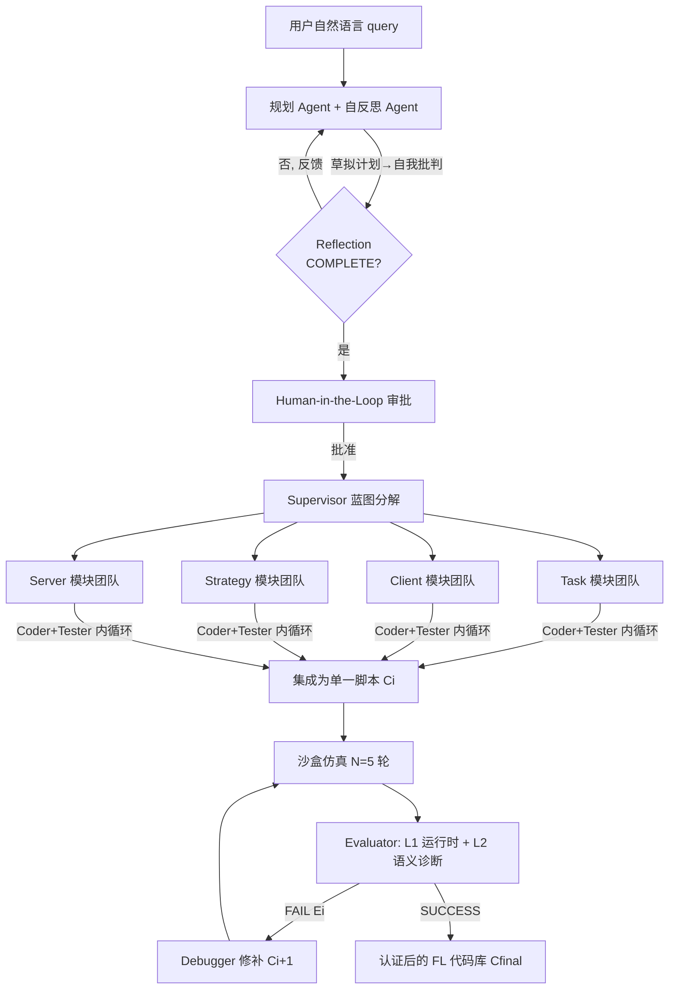

# Helmsman: Autonomous Synthesis of Federated Learning Systems via Collaborative LLM Agents

**会议**: ICLR 2026  
**OpenReview**: [https://openreview.net/forum?id=Voiy13SK3r](https://openreview.net/forum?id=Voiy13SK3r)  
**代码**: [https://github.com/haoyuan-l/Helmsman](https://github.com/haoyuan-l/Helmsman)  
**领域**: LLM Agent / 多智能体系统 / 联邦学习自动化  
**关键词**: 多智能体协作, 联邦学习, 自动化系统合成, 代码生成, human-in-the-loop, AgentFL-Bench  

## 一句话总结
Helmsman 用一套分工明确的多 LLM 智能体团队，把"我要在 15 台移动设备上部署一个抗数据异构的目标检测系统"这种高层自然语言需求，端到端自动合成为一份可运行、经仿真验证的完整联邦学习（FL）代码库。

## 研究背景与动机
- **领域现状**：联邦学习要在去中心化数据上训模型，但设计一套鲁棒的 FL 系统需要同时应对数据异构（non-IID）、系统异构（算力/带宽差异）、目标多样（个性化/持续学习）等多重挑战，每个挑战又有一堆专用算法（FedProx 治掉队者、SCAFFOLD 治客户端漂移、FedNova 治系统异构……）。
- **现有痛点**：这些策略的"选择—组合—调参"是一个组合爆炸问题，目前全靠领域专家手工拼装，产物是**静态、定制、脆弱**的方案——换个客户端数量或网络条件就可能失效。现有的通用代码生成 agent（单 agent + CoT/ReAct）擅长解自包含的算法题，但搞不定 FL 这种"数据加载 + 客户端训练 + 服务端聚合 + 整体策略"互相耦合的分布式系统级工程。
- **核心矛盾**：FL 设计空间的**组合复杂度** vs 单 agent 整体推理能力的天花板；研究框架（Flower/PySyft 灵活）与工业平台（FATE/FLARE 可靠）之间的鸿沟也无人弥合。
- **本文目标**：把 FL 系统的"设计—实现—测试"全流程自动化，让专家和非专家都能从一句话需求得到部署级方案。
- **核心 idea**：**多智能体分工 + 闭环仿真自纠**——模仿人类研发流程，拆成"交互式规划 → 模块化编码 → 自主评估精炼"三阶段，每阶段由专职 agent 团队协作完成，并用真实 FL 仿真（Flower）作为 ground-truth 反馈来 debug。

## 方法详解

### 整体框架
Helmsman 构建在 LangGraph 之上，把"用户高层需求 → 可运行 FL 代码库"拆成三个被编排的阶段：**(1) 交互式可验证规划**——把用户 query 提炼成研究计划；**(2) 监督式模块化编码**——Supervisor 调度四个模块团队并行实现；**(3) 自主评估与精炼**——在沙盒仿真里跑、诊断、修，直到通过验证。规划用 Gemini-2.5-flash，编码与评估用 Claude-Sonnet-4.0。

### 关键设计

**1. 交互式可验证规划：自反思 + human-in-the-loop 双重把关。** 用户按结构化模板（问题陈述 / 任务描述 / 框架需求三段式自然语言）给出需求后，Planning Agent 借助 Web 搜索（Tavily）和 FL 文献 RAG 库起草研究计划。为对抗幻觉，先由 Reflection Agent 按"逻辑一致性、实验设置完整度、可行性"做自动批判，把计划判为 COMPLETE 或 INCOMPLETE 并给出可执行反馈，形成内部自纠循环；通过后再交人类做最终 HITL 审批。作者强调 HITL 不是"走过场"，而是承担三重作用：保证对齐与安全（拦截偏航的研究轨迹）、优化资源（用户反馈剪枝搜索空间、降低 LLM 上下文与仿真开销）、提供细粒度实验控制（精确定制参数以保证可复现）。只有拿到显式批准才进入下一阶段。

**2. 监督式模块化编码：按"关注点分离"拆四模块并行实现。** Supervisor Agent 把计划分解成一份蓝图，对齐 FL 系统的标准架构，分成四个可独立替换的模块——**Task**（数据加载/模型架构/训练工具）、**Client**（客户端本地训练与评估）、**Strategy**（联邦聚合算法，如 FedAvg）、**Server**（编排全局更新）。每个模块配一支由 Coder Agent（实现）+ Tester Agent（实时验证调试）组成的团队，形成"边写边测"的内循环保证模块正确性。Supervisor 还强制一张依赖图——例如 Server 模块要等 Strategy 与 Task 稳定后才动工——最后把各模块集成为单一脚本。

**3. 自主评估与精炼：短仿真 + 分层诊断 + 自动纠错的闭环。** 集成后的代码库 $C_i$ 先在沙盒里跑少量联邦轮次（$N=5$）得到仿真日志 $L_i = \mathrm{Simulate}(C_i, N)$——短跑是刻意设计，算力便宜却足以暴露关键运行时/集成错误。Evaluator Agent $f_{eval}$ 按启发式集合 $H$ 做**分层诊断**：先 L1 运行时完整性验证（扫 Python 异常/堆栈），通过后再 L2 语义正确性验证（查训练指标停滞、客户端零参与、模型发散等算法 bug），输出状态与错误报告 $(S_i, E_i) = f_{eval}(L_i, H)$。一旦 $S_i=\text{FAIL}$，Debugger Agent $f_{debug}$ 拿着含错误上下文的 $E_i$ 做定向修补，产出 $C_{i+1} = f_{debug}(C_i, E_i)$。该循环持续到代码同时通过 L1/L2 验证；为防不收敛，设最大修补次数 $T_{max}=10$，超出则 halt 并上报需人工/重规划介入。

**4. agent 工具装备：双源知识 + 沙盒执行。** agent 能力不只来自基座 LLM，还靠工具增强。规划侧用**双源知识系统**：Web 搜索拿最新库文档/最佳实践，RAG 管线查 arXiv 上的经典 FL 文献——RAG 采用 BM25 + 向量混合检索保召回，再用 Cohere rerank-v3.5（配 Voyage-3-large embedding）重排保精度。精炼侧用 **Flower 框架作为沙盒仿真工具**，提供执行生成代码、捕获日志的 ground-truth 反馈，是诊断—修复循环的核心。

## 实验关键数据

### 主实验表格
在自建的 **AgentFL-Bench**（16 个任务，覆盖数据异构/通信效率/个性化/主动学习/持续学习 5 大领域）上，把 Helmsman 合成的策略与手工 baseline 对比（3 次独立运行均值，cross-silo 5 客户端 / cross-device 10 客户端，100 通信轮）：

| ID | 任务/挑战 | FedAvg | FedProx | 专用方法 | Ours |
|----|-----------|--------|---------|----------|------|
| Q3 | CIFAR-10N 标签噪声 | 73.95 | 78.78 | 80.55† | **81.62** |
| Q5 | HAR 用户异构 | 94.84 | 95.22 | 95.19∗ | **96.28** |
| Q6 | Speech Commands 说话人差异 | 84.44 | 84.19 | 83.48 | **86.58** |
| Q7 | Fed-ISIC2019 站点异构 | 57.09 | 61.11 | 62.88∗ | **63.75** |
| Q9 | CIFAR-100 资源约束 | 59.96 | 59.43 | 62.62‡ | **62.94** |
| Q10 | CIFAR-100 带宽受限 | 41.77 | 45.21 | 45.77∗ | **48.78** |
| Q11 | FEMNIST 连接受限 | 87.46 | 87.95 | 89.11∗ | **89.73** |
| Q16 | Split-CIFAR100 增量任务 | 15.38 | 15.86 | 29.45¶ | **50.95** |

Helmsman 在多数任务上与专用方法竞争甚至超越；个别强专用任务（如 Q8 Caltech101、Q15 主动学习）仍落后。

### 消融实验表格
六种配置消融（Claude-Sonnet-4.5，7 个代表任务），三组件为 ①规划组 ②协作编码组 ③双层验证：

| 配置 | ① | ② | ③ | 成功率 | 平均成本($) |
|------|---|---|---|--------|------------|
| Single ReAct Agent | ✗ | ✗ | ✗ | 0% | 1.75 |
| Single ReAct (+双验证) | ✗ | ✗ | ✓ | 14.29% | 1.28 |
| 无协作编码 | ✓ | ✗ | ✓ | 28.57% | 2.11 |
| 无双层验证 | ✓ | ✓ | ✗ | 0% | 0.88 |
| 全系统(无 HITL) | ✓ | ✓ | ✓ | 100% | 1.14 |
| **全系统** | ✓ | ✓ | ✓ | **100%** | **0.98** |

### 关键发现
- **三组件缺一不可**：去掉任一组件成功率从 100% 暴跌；尤其去掉双层验证后成功率直接归零，证明仿真验证是系统鲁棒性的命门。
- **HITL 还降成本**：全系统带 HITL 反而比不带 HITL 更便宜（0.98 vs 1.14 美元），因为人类反馈剪枝了搜索空间。
- **能发现新算法组合**：Q16 持续学习上 Helmsman 自发合成了"客户端经验回放 + 全局模型蒸馏"的混合策略，5-task 准确率 51.04% / 遗忘 0.07，远超最强专用方法 TARGET（34.89% / 0.24），10-task 更是 47.53% vs 25.65%。
- **对输入 schema 鲁棒**：在 paraphrased/incomplete/out-of-schema 等异常 query 下，规划组（planner + 自反思）能补全缺失信息、维持稳定。

## 亮点与洞察
- **把"系统级工程"作为 agent 能力的新考题**：跳出 HumanEval 式自包含算法题，强调 agent 要协调数据/训练/聚合/策略多个互依模块——这是单 agent 范式的真实短板。
- **闭环仿真 = 给 agent 装上"现实校验器"**：短跑 5 轮 + 分层诊断（崩溃 vs 算法 bug 分级），用低成本反馈撬动高质量自纠，是工程上很务实的设计。
- **AgentFL-Bench 填补评测空白**：16 个贴近真实、多挑战共现的 FL 任务 + 标准化自然语言 query 模板，让不同 agentic 系统能公平对比，可能成为该子方向的标准 benchmark。
- **HITL 被论证为"省钱又安全"而非负担**：把人类介入定位为剪枝与对齐工具，给 agentic 科研系统的人机协作提供了有说服力的样例。

## 局限与展望
- **并非全任务领先**：在 Caltech101 类不平衡、CIFAR-10 主动学习等任务上仍明显落后专用方法，说明自动合成对某些强先验任务还吃不透。
- **收敛无保证**：Debugger 在复杂/病态任务上可能反复修补失败，只能靠 $T_{max}=10$ 硬截断后转人工，缺乏更高层的策略性重规划自动化。
- **依赖闭源强模型与外部工具**：规划/编码绑定 Gemini、Claude 等 SOTA LLM 及 Tavily/Cohere/Voyage 等付费 API，复现成本和可迁移性受限。
- **仿真≠真实部署**：所有验证都在 Flower 仿真里完成，N=5 短跑能抓集成错误，但真实跨设备网络波动、隐私攻击等动态因素未端到端验证。
- **规模有限**：cross-silo 5 / cross-device 10 客户端规模偏小，大规模联邦下的可扩展性待验证。

## 相关工作与启发
- **多智能体代码生成**：AgentCoder（实现/测试分工）、CodeSim（仿真驱动验证调试）、SWE-bench 系工作证明"分工协作"在系统级工程优于单体 agent——Helmsman 把这一范式首次系统性引入 FL。
- **单 agent 提示范式**：CoT、ReAct 擅长自包含任务，但在分布式系统级复杂度前失效，构成本文动机。
- **FL 框架生态**：研究侧 Flower/PySyft 灵活、工业侧 FATE/NVIDIA FLARE 可靠，二者割裂——Helmsman 想用"研究框架的灵活 + 自动评估的可靠"弥合鸿沟。
- **启发**：把"领域专家手工拼装"型工程问题（不止 FL，也可推广到其他需多模块协同的系统设计）建模为"多 agent 分工 + 仿真闭环自纠"，并用 HITL 做剪枝与安全阀，是一个可复用的自动化研发范式。

## 评分
- **新颖性**: ⭐⭐⭐⭐ —— 首次把多智能体协作系统化地用于联邦学习系统的端到端自动合成，并配套提出 AgentFL-Bench；范式组合新颖，虽单点技术（多 agent、RAG、闭环 debug）各有先例。
- **实验充分度**: ⭐⭐⭐⭐ —— 16 任务跨 5 领域、3 次重复、6 配置消融、多 LLM 后端、输入 schema 鲁棒性测试都做了；但客户端规模偏小、缺真实部署验证。
- **写作质量**: ⭐⭐⭐⭐ —— 动机（intractable design space）讲得清晰，三阶段框架与符号化的闭环精炼描述到位；个别拼写/小错（DISUCCUSION、HITP）瑕不掩瑜。
- **价值**: ⭐⭐⭐⭐ —— 大幅降低 FL 系统开发门槛，benchmark 与开源代码有望推动"agentic 系统级工程"子方向，实用与研究价值兼具。

<!-- RELATED:START -->

## 相关论文

- [\[ICLR 2026\] Scaling Agent Learning via Experience Synthesis](scaling_agent_learning_via_experience_synthesis.md)
- [\[ACL 2026\] FedGUI: Benchmarking Federated GUI Agents across Heterogeneous Platforms, Devices, and Operating Systems](../../ACL2026/llm_agent/fedgui_benchmarking_federated_gui_agents_across_heterogeneous_platforms_devices_.md)
- [\[ICLR 2026\] EvoTest: Evolutionary Test-Time Learning for Self-Improving Agentic Systems](evotest_evolutionary_test-time_learning_for_self-improving_agentic_systems.md)
- [\[ICLR 2026\] Expanding the Capability Frontier of LLM Agents with ZPD-Guided Data Synthesis](expanding_the_capability_frontier_of_llm_agents_with_zpd-guided_data_synthesis.md)
- [\[ICLR 2026\] CoMind: Towards Community-Driven Agents for Machine Learning Engineering](comind_towards_community-driven_agents_for_machine_learning_engineering.md)

<!-- RELATED:END -->
