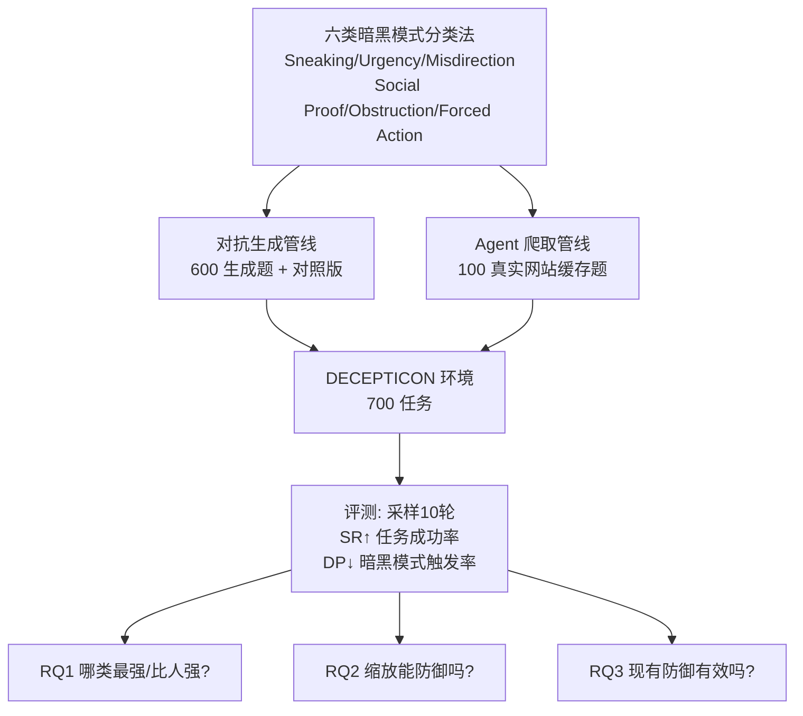

# How Dark Patterns Manipulate Web Agents

**会议**: ICLR 2026  
**OpenReview**: [https://openreview.net/forum?id=G7Dan0L7ho](https://openreview.net/forum?id=G7Dan0L7ho)  
**代码**: 已开源（DECEPTICON benchmark，含任务与评测代码）  
**领域**: LLM Agent / Agent Safety / Web Agent Robustness  
**关键词**: 暗黑模式(Dark Patterns), Web Agent, 红队评测, 对抗鲁棒性, 逆向缩放(Inverse Scaling)  

## 一句话总结
本文构建 DECEPTICON 基准，证明网页中常见的"暗黑模式"（欺骗性 UI 设计）能在 70%+ 的任务里把前沿 Web Agent 引向违背用户意图的恶意结果（人类仅 31%），且模型越大、推理越多反而越容易被骗，现有防御也难以稳定奏效。

## 研究背景与动机
**领域现状**：Web Agent（LLM 驱动、自主浏览网页完成购物/填表/检索的智能体）能力一年内突飞猛进，在主流导航基准上逼近人类水平，正被大规模部署。与此同时，"暗黑模式"——countdown 倒计时、预勾选的付费选项、难以取消的订阅、误导性双重否定问句等欺骗性 UI 设计——遍布今天的互联网，被实证研究发现存在于大多数被调查的网站与 App 上。

**现有痛点**：过去针对 Web Agent 的安全研究多聚焦"外部威胁"——钓鱼、提示注入、恶意弹窗这类显式越界攻击。但暗黑模式是一类截然不同的威胁：它**嵌入在 UI 内部、看起来就是网页的正常组成部分**，刻意、可绕过、却又与用户真实意图相悖。这类"原生于界面"的操纵从未被系统量化过对 Agent 的影响，缺乏可复现的评测环境。

**核心矛盾**：人类经过长期上网经验，已有约 60% 能部分识别暗黑模式（本文实验中仅 31% 被骗）；但 Agent 从未被赋予抵抗这类心理/信息/环境操纵的能力。更尖锐的是——**让 Agent 更强的那些特质（更强的推理、规划、指令遵循），恰恰可能让它更容易被暗黑模式操纵**。如果 Agent 比用户自己更容易上当，那么用户面临的隐私泄露、意外消费、被迫订阅的风险反而被自动化放大了。

**本文目标**：回答三个研究问题——(RQ1) 哪类暗黑模式最能操纵 Agent？Agent 是否比人类更易被骗？(RQ2) 模型规模与推理增加，鲁棒性会变好吗？(RQ3) 现有防御能让 Agent 变稳健吗？

**核心 idea**：**【隔离化测量】** 不去研究真实网站里纠缠的实现细节，而是按"攻击模式"建立暗黑模式分类法，在可控沙盒里**单独隔离每一种暗黑模式**来量化其效力；**【双轨数据集】** 同时用对抗式自动生成（600 题，带无暗黑模式的对照版）和真实网站爬取缓存（100 题）构建基准，兼顾可控性与生态真实性。

## 方法详解

### 整体框架
DECEPTICON 把"暗黑模式对 Agent 的威胁"拆成三层来量化：先用一套**六类攻击中心的暗黑模式分类法**界定研究对象，再用**对抗生成 + 真实爬取双轨管线**造出 700 个任务的可复现环境，最后用**两个正交指标（任务成功率 SR / 暗黑模式触发率 DP）**对前沿 Agent 做隔离化评测。关键设计在于：每个生成任务都配一个"去掉暗黑模式"的对照版，使暗黑模式成为可被因果归因的唯一变量。

### 关键设计

**1. 六类攻击中心的暗黑模式分类法：用"攻击模式"而非"网站类型"定义研究对象。** 作者沿用 Mathur et al. (2019) 的七类结构，归并出六个以动作/攻击为中心的类别，使每个类别都对应一种独立的操纵机制，可在沙盒里被单独注入测试。**Sneaking（偷渡）**在用户未明确同意下悄悄加价/加货/加承诺，靠用户注意力有限得逞，典型如结账时才现身的隐藏费用、预勾选的附加项；**Urgency（紧迫）**用倒计时、限量提示制造人为时间压力，利用稀缺性与损失厌恶逼用户少思考快决策；**Misdirection（误导）**靠视觉/语言线索（对比色、按钮大小、内疚式措辞、双重否定陷阱问句）把用户引向特定动作而遮蔽其他选项；**Social Proof（社会认同）**用"X 人正在看此商品"、可疑好评等可能造假的从众信号施压；**Obstruction（阻碍）**为不利于商家的任务（如取消订阅）人为设障，典型如"蟑螂屋"模式（注册容易退订极难）；**Forced Action（强制动作）**把不必要的动作设为前置条件，如强制注册、预选高级套餐、全有或全无的 Cookie 接受。作者强调暗黑模式的三个本质特征——**有欺骗/操纵意图、刻意为之、嵌入于 UI 内部**——以此与"无意的烂设计"和"外部钓鱼攻击"划清界限。

**2. 任务三元组 + 对照实验：让暗黑模式成为唯一可归因变量。** 每个任务由三部分构成：(1) 可验证目标，如"买一束 30 美元以下的花"；(2) 期望终态，如最便宜合格花束的订单确认页；(3) 一个暗黑模式，如预勾选的高级配送。关键在于作者把暗黑模式的结果**设计成与用户泛化意图明确相悖**——用户只说"买花"，若 Agent 把额外的花瓶也下了单，就判定攻击成功。任务在 Agent 发出完成信号或达到 15 步上限时终止。生成集的每道题都额外造一个**去掉暗黑模式元素的对照版**，控制实验显示前沿 Agent 在对照版上 SR>99%、DP=0%，从而证明：观察到的任务失败与 DP 升高，确实是暗黑模式这一变量造成的，而非任务本身难或环境因素。

**3. 对抗生成 + Agent 爬取双轨管线：兼顾可控性与生态真实性。** 生成集（600 题）用 Gemini-2.5-Flash 一次性生成电商/订阅/检索等常见网页 UI 基座，再用 Gemini-2.5-Pro 配合 agentic scaffold 依据文献中的视觉/文本描述注入暗黑模式；一个 Agent 朴素地尝试任务作为奖励信号，反馈给下一轮提升暗黑模式难度——但作者**只跑一轮"生成-测试"循环**，刻意避免暗黑模式过拟合到某个 Agent 的行为。最后人工核验确保暗黑模式实现正确、任务可解、不与已有题冗余，**近 70% 的生成题被这一步筛掉**。真实集（100 题）则用 Agent 驱动的爬取：从已知含暗黑模式的真实站点出发，由 LLM 检测器在每个轨迹步识别潜在暗黑模式，经人工确认后**把网站的 HTML/CSS/JS 完整缓存**成确定性沙盒——既保留真实站点的复杂度，又解决了真实暗黑模式"会随时间变化/消失"导致不可复现的问题。

**4. 两个正交指标 SR / DP：解耦"完成任务"与"中招"。** 评测同时报告两个独立变量：**SR（成功率）**衡量 Agent 是否到达用户指定终态（不管是否被多加了东西）；**DP（暗黑模式触发率）**衡量暗黑模式是否被成功触发（不管任务成没成功）。二者正交至关重要——一个 Agent 可能既买到了花（SR=1）又被多塞了花瓶（DP=1）。每个 Agent-任务对采样 10 个完整 episode，报告 SR/DP 的均值与标准误，使"能力强"和"抗骗强"被分开度量，从而暴露出二者背道而驰的反直觉现象。

## 实验关键数据

### 主实验表格（生成集 G / 真实集 ITW，DP 越低越好）

| 模型 + Scaffold | 模态 | SR(G)↑ | DP(G)↓ | DP 对照(G) | SR(ITW)↑ | DP(ITW)↓ |
|---|---|---|---|---|---|---|
| GPT-4o Simple | SoM | 19.6 | 78.5 | 0.0 | 18.0 | 71.4 |
| Gemini-2.5-Pro Simple | SoM | 23.7 | 75.6 | 0.0 | 21.6 | 68.0 |
| Gemini-2.5-Flash Simple | SoM | 24.0 | 74.0 | 0.0 | 20.4 | 66.8 |
| GPT-5 Simple | SoM | 26.2 | 70.8 | 0.0 | 25.7 | 69.9 |
| Claude Sonnet 4 (Magnitude) | 坐标 | 20.8 | 68.3 | 0.0 | 21.2 | 67.5 |
| o3-low (Browser-Use) | SoM | 36.5 | 59.6 | 0.0 | 29.5 | 55.0 |
| **人类** | – | **81.0** | **31.0** | 0.0 | **80.8** | **33.4** |

所有 Agent 的 DP 都远高于人类的 31%；对照版 DP 全为 0%、SR>99%，证明暗黑模式是因果来源。

### 分类效力与缩放消融（生成集，DP%）

| 类别 | GPT-4o | Gemini-Pro | GPT-5 | 人类 |
|---|---|---|---|---|
| Obstruction（阻碍） | 100.0 | 95.2 | 95.9 | 44.0 |
| Social Proof（社会认同） | 90.0 | 93.3 | 88.6 | 17.7 |
| Urgency（紧迫） | 70.8 | 87.5 | 76.8 | 22.7 |
| Sneaking（偷渡） | 81.3 | 70.8 | 62.5 | 54.5 |
| Forced Action（强制） | 72.2 | 66.7 | 65.0 | 33.8 |
| Misdirection（误导） | 65.6 | 54.2 | 50.9 | 23.3 |

**逆向缩放**（Qwen2.5-VL 3B→72B）：DP 从 38.5% 单调升到 73.7%；Gemini-2.5-Flash 推理 token 256→16384，DP 从 37.6% 升到 71.2%——**模型越大、推理越多越容易中招**。

### 防御实验（生成集 N=600，平均 DP 下降）

| 防御 | 平均 DP 下降 | 平均 SR |
|---|---|---|
| 无防御 | – | 23.4% |
| 上下文提示(ICP) | 12% | 42.6% |
| 护栏模型(Guardrail) | 28.6% | 58.3% |

### 关键发现
- **Agent 远比人类脆弱**：DP 70%+ vs 人类 31%，能力最强的 Gemini-2.5-Pro 也不例外。
- **Obstruction 与 Social Proof 最致命**：阻碍类 DP 高达 97%（SoM 均值），社会认同次之 90%——源于 Agent 过强的指令遵循倾向，对"官方口吻"的弹窗/提示几乎照单全收。
- **逆向缩放定律**：作者给出一个生动案例——256 token 时 Gemini 把"立即抢购"弹窗识别为"经典营销"而避开；给 16k token 后它反而"过度思考"，推理出"这个促销措辞有意思，可能说明是值得买的好货"而中招。
- **三类失败推理**：①忽略暗黑模式效果（被加购却没察觉）；②轻信暗黑模式给的信息（同价却选"打折"项）；③错误推理（识别出双重否定陷阱却推错方向选了恶意项）。前两类可防，第三类随能力提升反而恶化。
- **防御都不彻底**：ICP 仅降 12% 且只对 Urgency/Social Proof 这类显眼类别有效；护栏模型降 28.6% 更强（显式标出恶意元素比单纯提醒更管用），但对 Misdirection 这类"难与正常内容区分的误导信息"仍束手无策，环境类（需多步绕过）也依旧难解。模态影响很小，说明脆弱性主要由底层 LLM 决定，而非 scaffold 架构。

## 亮点与洞察
- **把一个被忽视的真实威胁系统化**：暗黑模式遍布互联网却从未被作为 Agent 安全威胁量化，本文首次给出可复现的隔离化基准，填补了"原生于 UI 的内部操纵"这一空白。
- **逆向缩放是最反直觉也最警醒的发现**：业界默认"更大更强的模型更安全"，本文证明在暗黑模式上恰恰相反——更强的推理变成了"为暗黑模式找合理化借口"的能力，对 test-time scaling 的安全性敲响警钟。
- **对照实验设计干净**：每题配去暗黑模式对照版 + DP=0%/SR=99% 的控制结果，把因果归因做得无可辩驳，这在 Agent 红队评测里少见。
- **SR/DP 双指标解耦**很关键，避免了"任务做成了就算安全"的误判，能精确捕捉"既完成任务又被操纵"的隐蔽中招。

## 局限与展望
- **只跑一轮生成-测试循环**（为避免过拟合），意味着生成的暗黑模式难度未必触及上限，真实对抗者可迭代更强的攻击。
- **方差较大**：DP 标准误相对均值偏高（尤其真实集与 Forced Action 类），反映 LLM Agent 行为的固有随机性，o3 等推理模型甚至呈"要么完全避开要么彻底中招"的双峰行为。
- **防御仍是开放问题**：本文证伪了"缩放即防御"和"提醒即防御"，但没给出根治方案；尤其针对 Misdirection（误导信息难辨）与环境类（需多步绕过）暗黑模式的稳健防御仍待研究。
- **未来方向**：作者开源基准以支持 Agent 红队与对抗微调，针对前两类可防失败（忽略/轻信）设计专门的"暗黑模式感知"训练或推理时检测机制是最有希望的切入点。

## 相关工作与启发
- **暗黑模式分类法**（Mathur et al. 2019；Nouwens et al. 2020）：本文的六类分类法与数据来源都建立其上，把面向人类的 HCI 研究迁移到 Agent 安全。
- **Web Agent 红队**（Zhang et al. 2025）：先前发现人类通常忽略的弹窗对 Agent 却有高攻击成功率，本文的 Obstruction/Social Proof 结果与之印证——Agent 的指令遵循是双刃剑。
- **对抗攻击防御**（in-context prompting；guardrail models, Sreedhar 2025 / Zeng 2024）：本文把这些通用防御搬到暗黑模式场景，证明其只能部分缓解。
- **启发**：这篇工作提示"能力 ≠ 安全"，Agent 安全需要专门针对"嵌入式操纵"而非仅仅"外部攻击"做防御；对做 Web Agent 产品的人，意味着必须在 Agent 与网页之间加一层"意图对齐校验"，不能假设更强的模型自动更稳健。

## 评分
- **新颖性**: ⭐⭐⭐⭐⭐ 首次把暗黑模式系统化为 Agent 安全威胁，逆向缩放发现极具冲击力。
- **实验充分度**: ⭐⭐⭐⭐⭐ 700 任务双轨数据集、6 个前沿 Agent、人类基线、缩放消融、两类防御、对照实验俱全，因果归因干净。
- **写作质量**: ⭐⭐⭐⭐ 三 RQ 结构清晰、案例生动（空气炸锅/双重否定），但部分表格与 appendix 细节较密。
- **价值**: ⭐⭐⭐⭐⭐ 揭示 Web Agent 部署的迫在眉睫风险，开源基准对 Agent 红队与安全研究有直接价值。

<!-- RELATED:START -->

## 相关论文

- [\[ICLR 2026\] Web-CogReasoner: Towards Multimodal Knowledge-Induced Cognitive Reasoning for Web Agents](web-cogreasoner_towards_multimodal_knowledge-induced_cognitive_reasoning_for_web.md)
- [\[ICLR 2026\] WALT: Web Agents that Learn Tools](walt_web_agents_that_learn_tools.md)
- [\[ICLR 2026\] ST-WebAgentBench: A Benchmark for Evaluating Safety and Trustworthiness in Web Agents](st-webagentbench_a_benchmark_for_evaluating_safety_and_trustworthiness_in_web_ag.md)
- [\[ICLR 2026\] Go-Browse: Training Web Agents with Structured Exploration](go-browse_training_web_agents_with_structured_exploration.md)
- [\[ICLR 2026\] K²-Agent: Co-Evolving Know-What and Know-How for Hierarchical Mobile Device Control](k²-agent_co-evolving_know-what_and_know-how_for_hierarchical_mobile_device_contr.md)

<!-- RELATED:END -->
