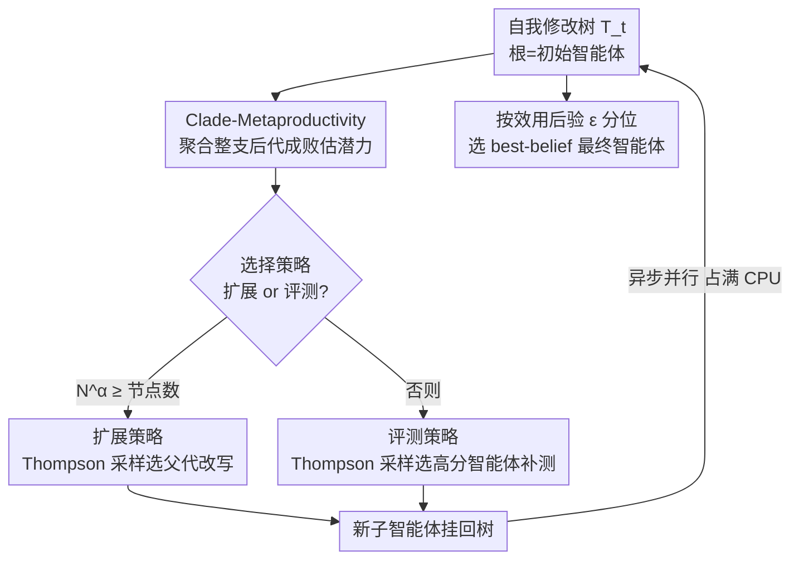

# Huxley-Gödel Machine: Human-Level Coding Agent Development by an Approximation of the Optimal Self-Improving Machine

**会议**: ICLR 2026  
**OpenReview**: [https://openreview.net/forum?id=T0EiEuhOOL](https://openreview.net/forum?id=T0EiEuhOOL)  
**代码**: https://github.com/metauto-ai/HGM  
**领域**: Agent / 自我改进 / 编程智能体  
**关键词**: 自我改进智能体, 编程智能体, 树搜索, Thompson 采样, Gödel Machine

## 一句话总结
针对"让编程智能体改写自己代码不断变强"这件事，本文指出现有方法用单步基准分当扩展指引并不靠谱（高分父代未必生出好后代），提出用**整个后代谱系（clade）的聚合表现** CMP 作为自我改进潜力的指标，并证明拿到真 CMP 就足以模拟最优的 Gödel Machine；据此实现的 Huxley-Gödel Machine（HGM）用 Thompson 采样按 CMP 估计来选节点扩展，在 SWE-bench Verified 和 Polyglot 上用更少 CPU 时数超过 DGM/SICA，并在 SWE-bench Lite 上达到人类工程师设计的编程智能体水平。

## 研究背景与动机
**领域现状**：近期一类"自我改进"工作让编程智能体直接编辑自己的代码库，生成一棵"自我修改树"——根是初始智能体，每个节点是它的某个改写版本。代表性方法 Darwin Gödel Machine（DGM）和 Self-Improving Coding Agent（SICA）都遵循同一套启发式：**优先扩展基准分更高的智能体**，默认"当前考得好 ⇒ 后续改写也更有希望"。

**现有痛点**：这个默认假设并不成立。作者观察到一个反复出现的现象——一个高分智能体可能生出一堆没出息的后代，而一个分数平平的智能体却可能开枝散叶、谱系长期收益更大。本文把这种"单步基准表现"与"长期自我改进潜力"之间的错配命名为 **Metaproductivity-Performance Mismatch（MPM，元生产力—表现错配）**。图 1 显示 DGM/SICA 的指引指标与真实长期改进的相关性只有 0.27~0.44，相当弱。

**核心矛盾**：理论上的最优答案是 Gödel Machine——只接受"可证明能提升期望长期效用"的自我修改。但它依赖形式化证明搜索，实践中几乎无法落地。于是大家退而求其次用基准分当代理，却引入了 MPM。问题的根本在于：**评价一次修改时只看它自己的即时效用，而忽略了它对"未来还能不能继续自我改进"的下游影响**。

**本文目标**：找一个既能近似 Gödel Machine 的"长期最优性"、又能从有限的、部分的评测里估出来的指引指标，用它来引导自我修改树的搜索。

**切入角度**：作者借用 Huxley 的"clade（演化支/谱系）"概念——一个共同祖先及其全部后代构成一个 clade（如哺乳动物是一个 clade）。一个智能体值不值得扩展，不该只看它自己考几分，而该看**它整支后代谱系的成材率**。

**核心 idea**：定义 **Clade-Metaproductivity（CMP）**——聚合某智能体 clade 内所有后代的成功表现作为其自我改进潜力的度量；理论上证明"拿到真 CMP 预言机就足以实现 Gödel Machine 的接受机制"，再用 CMP 的经验估计 + Thompson 采样来近似这台最优机器。

## 方法详解

### 整体框架
HGM 把"自我改进"形式化成一个**迭代树搜索**问题：维护一棵不断生长的智能体树 $T_t$（根 $a_0$ 是固定初始智能体），目标是在算力预算内找到一个在下游编程任务上效用最高的最终智能体 $a_{\text{final}}$。每一步，策略面对一个**复合决策**：要么"扩展"（选一个父节点，让它改写自己、生成一个子智能体挂到树上），要么"评测"（选一个已有智能体，再在一个下游任务上跑一次拿到成功/失败信号）。

与 DGM/SICA 把"扩展—评测"死绑在一起（每生成一个新智能体就立刻把评测预算砸在它身上）不同，HGM 把这套复合决策拆成三个子策略：**选择策略**（这一步是扩展还是评测）、**扩展策略**（扩展时选哪个父节点改写）、**评测策略**（评测时选哪个智能体再测一次）。三者都围绕同一个核心量——CMP 的估计 $\widehat{\mathrm{CMP}}$——来做决定，并把评测粒度细化到"单个智能体-单个任务"，从而能对没前途的智能体早停。

### 关键设计

**1. Clade-Metaproductivity（CMP）：用整支后代的成材率代替单步基准分**

这是全文的理论与方法基石，直接针对 MPM。作者先定义一个理想但难算的全局量 **Global Metaproductivity（GMP）**：从某节点出发把策略 $\pi$ 跑到底，最终选出的智能体的期望效用——它正对应强化学习里的 Q 值，但要把"整棵未来的树"都展开，过于宽泛无法估计。注意到 Gödel Machine 在决定是否接受一次修改时只关心"当前智能体及其后代"，作者把 GMP 局部化到以某节点为根的子树（即它的 clade），得到 CMP：

$$\mathrm{CMP}_\pi(T, a) = \mathbb{E}_{T_B \sim p_\pi(\cdot|T,a)}\Big[\max_{a' \in C(T_B, a)} U(a')\Big],$$

其中 $C(T_B, a)$ 是 $a$ 的 clade，$U$ 是下游任务效用（二元成功指示的平均）。关键结论是 **Theorem 1：在 Assumption 1（目标只取决于最终智能体、评测可重复独立、每次自我修改恰好花一单位预算、证明不耗预算）下，拿到 CMP 预言机就足以实现 Gödel Machine**。这把"近似最优自我改进机"这个看似遥不可及的目标，转化成一个可估计的统计量。落到实现，HGM 用 clade 内所有后代的通过/失败次数做加权估计：

$$\widehat{\mathrm{CMP}}(a) = \frac{n^C_{\text{success}}(a)}{n^C_{\text{success}}(a) + n^C_{\text{failure}}(a)}, \quad n^C_{\bullet}(a) = \sum_{a' \in C(a)} n_{\bullet}(a').$$

它本质是 clade 内各智能体经验均值的加权和（权重=该智能体被评测的次数）。在 clade 层而非单节点层估生产力有两个好处：一个平庸的祖先只要后代持续进步就仍被看重、停滞的谱系被降权（更契合"自我改进"的目标）；同时跨整支谱系聚合证据比单点结果统计上更稳健，这在评测昂贵、基准只被部分观测时尤其重要。

**2. Thompson 采样扩展 + 探索-利用调度器：把"选最有潜力的节点扩展"做成软最大化**

有了 $\widehat{\mathrm{CMP}}$，还要决定扩展时具体改写哪个父代。直接贪心选 $\widehat{\mathrm{CMP}}$ 最高者会过早收敛、忽视不确定性。HGM 借 bandit 文献的 **Thompson 采样**做"平滑的取最大"：把每个智能体 clade 的成功/失败计数当 Beta 分布参数采样，按采样值选扩展节点 $a^*$：

$$a^* \sim \mathrm{TS}\big(\{\tau(1 + n^C_{\text{success}}(a)),\ \tau(1 + n^C_{\text{failure}}(a)) \mid a \in T_t\}\big).$$

这里 $\tau$ 是一个随时间 $t$ 单调递增的**探索-利用调度器**：早期 $\tau$ 小、采样分布平、鼓励探索；接近预算末尾 $\tau$ 增大、分布被"极化"、采样更集中在高 CMP 节点上做利用。因为搜索预算已知（实验用 $\tau = B/b$，$b$ 为剩余预算），这个调度能把有限算力前松后紧地分配，既不一上来就压死探索，也不在收尾时还浪费在没把握的分支上。

**3. 选择策略 + 评测策略 + 异步执行：把扩展与评测解耦，细控算力**

DGM/SICA 生成新智能体后立刻独占评测，导致"一个连挂九个任务的新智能体还在烧评测，而一个有部分成功的老智能体却被无视"。HGM 把扩展和评测当两个独立步骤，由两条策略协同。**评测策略**也用 Thompson 采样、但按单个智能体（而非 clade）的成败 $\mathrm{TS}(\tau(1+n_{\text{success}}(a)), \tau(1+n_{\text{failure}}(a)))$ 优先补测高分智能体——这恰好在 clade 内诱导出"软最大值"，让 CMP 估计更贴近 $\max$ 而非平均。**选择策略**借鉴 UCB-Air 的无限臂 bandit 思路：当评测次数满足 $N_t^\alpha \ge |T_t|$（$\alpha \in [0,1]$）时才新增一只"臂"（即扩展生成新智能体），否则继续评测已有智能体，从而在"探明已知选项"和"引入新选项"间自动平衡。由于 CMP 能从整支 clade 快速攒样本，这种细粒度控制天然支持对没前途智能体的早停。最后，解耦还带来**异步实现**（HGM-Async）：每个空闲 CPU 各跑一轮迭代，跑完立刻开新一轮、用最新数据（执行选择时把所有在跑的扩展/评测都计入），把算力占满以缩短墙钟时间。

### 损失函数 / 训练策略
HGM 不训练神经网络，没有梯度损失；它是一套树搜索算法。预算耗尽时，**最终智能体选择**不取经验均值最高者，而取效用后验 $\epsilon$ 分位最高的 **best-belief 智能体**：

$$\arg\max_{a \in T_B} I_\epsilon\big(1 + n_{\text{success}}(a),\ 1 + n_{\text{failure}}(a)\big),$$

其中 $I$ 是正则化不完全 Beta 函数。实验取调度器 $\tau = B/b$、$\epsilon = 1$、$\alpha = 0.6$，所有 HGM 实验均用异步版。

## 实验关键数据

### 主实验

**CMP 估计的保真度（验证 MPM 确实存在、HGM 估计更准）**：在 SWE-Verified-60 和 Polyglot 上，比较三种方法的指引指标与经验 CMP 的 Pearson 相关性（经验 CMP 取 clade 内后代任务表现的最大经验均值、排除根以避免目标泄漏）。

| 估计器 | SWE-Verified-60 (加权) | SWE-Verified-60 (非加权) | Polyglot (加权) | Polyglot (非加权) |
|--------|------|------|------|------|
| SICA | 0.444 | 0.444 | 0.274 | 0.274 |
| DGM | 0.285 | 0.406 | 0.383 | 0.357 |
| **HGM (本文)** | **0.778** | **0.512** | **0.626** | **0.873** |

**自我改进能力对比（最佳 best-belief 智能体的准确率 + 跑满 800 次评测所需 CPU 时数）**：所有方法同初始祖先（SWE-Verified-60 起点 40%、Polyglot 起点 20.3%），扩展用 GPT-5 / Qwen3-Coder-480B、评测用 GPT-5 mini / Qwen3-Coder-30B。

| 方法 | SWE-Verified-60 准确率 | 用时(h) | Polyglot 准确率 | 用时(h) |
|------|------|------|------|------|
| SICA | 50.0 (+10) | 死循环 | 25.4 (+5.1) | 572 |
| DGM | 53.3 (+13.3) | 1231 | 27.1 (+6.8) | 2385 |
| **HGM (本文)** | **56.7 (+16.7)** | **517** | **30.5 (+10.2)** | **347** |

HGM 在两套数据上都拿最高准确率，同时跑 800 次评测最省 CPU 时数：SWE-Verified-60 上比 DGM 快 2.38×，Polyglot 上比 DGM 快 6.86×、比 SICA 快 1.65×。SICA 在 SWE-Verified-60 上 360 次评测后反复撞"超出 LLM 上下文窗口"卡死。

### HGM vs. 人类工程师（泛化到 SWE-Lite）
在全量 SWE-Verified（500 题、8000 次迭代）上优化：初始 GPT-5 mini 智能体 53.2% → HGM 发现的智能体 **61.4%**，超过 SWE-Verified 排行榜上最好的 GPT-5 mini 人类设计智能体，跻身所有受检提交的前 10（连用更贵的 Claude-3.7 等更强骨干的系统都被它超过）。把这个"在 SWE-Verified 上找到的"智能体迁移到 SWE-Lite：

| 编程智能体 | SWE-Lite Filtered (%) | SWE-Lite Standard (%) |
|-----------|------|------|
| SWE-agent + GPT-5 mini | 39.6 | 47.6 |
| **HGM best-belief + GPT-5 mini** | **40.1** | **49.0** |
| SWE-agent + Claude 4 Sonnet (榜首) | 48.3 | 56.7 |
| **HGM best-belief + GPT-5** | **48.8** | **57.3** |

同骨干 GPT-5 mini 下 HGM 智能体超过 SWE-agent，说明增益来自**智能体设计**而非模型；换上 GPT-5 后进一步超过所有官方受检提交。在更新的 SWE-Bench-Live Lite 上，HGM 智能体（GPT-5.1 Codex mini）拿到 27.0%，超过此前榜单最好的 24.7%。

### 关键发现
- **MPM 真实存在且是核心**：DGM/SICA 的指标与长期改进相关性仅 0.27~0.44，而 HGM 的 clade 级估计达 0.51~0.87，证明"单步分数当指引"确实不可靠，是把搜索带偏的根因。
- **clade 聚合既准又省**：跨整支后代攒样本既统计更稳，又因解耦扩展/评测 + 异步并行而显著省 CPU 时数（最高 6.86×），准确率反而更高——说明"省算力"和"更强"在这里不矛盾。
- **学到的是设计原则而非过拟合**：在 SWE-Verified 上优化出的智能体，换数据集（SWE-Lite）、换骨干（GPT-5 mini→GPT-5）都稳定迁移甚至更强，说明 HGM 改进的是通用编程智能体设计，而非刷某个 benchmark。

## 亮点与洞察
- **把"近似最优自我改进机"落成一个可估的统计量**：Theorem 1 在一组明确假设下把 Gödel Machine 的接受机制等价于"拥有 CMP 预言机"，于是问题从"搜形式化证明"变成"估一个 clade 成材率"，工程上一下子可做了——这是最漂亮的一步。
- **clade（演化支）的引入很巧**：判断一个节点的价值不看它自己、看它整支后代，天然契合"自我改进的目标是让后续还能继续改进"，并顺带解决了单节点评测噪声大的统计问题。
- **复合决策解耦是可复用的工程思路**：把"扩展 vs 评测"拆开 + Thompson 采样 + UCB-Air 式加臂条件 $N^\alpha \ge |T|$，让算力按需细分、对没前途分支早停——这套"无限臂 bandit 视角"可迁移到任何"生成新候选 vs 复测老候选"的搜索/AutoML 场景。
- **探索-利用调度器 $\tau=B/b$ 简单有效**：用剩余预算直接当温度，把搜索做成前期广撒网、后期收敛极化，不需要额外调参就能匹配已知预算。

## 局限与展望
- **理论保证依赖 Assumption 1**：要求"目标只取决于最终智能体、评测可重复且独立、每次修改恰好一单位预算、证明不耗预算"等较强假设；真实场景里评测有噪声、修改成本不均、过程奖励存在，CMP 与 Gödel Machine 的等价性会松动。
- **CMP 估计仍是 clade 内表现的简单加权比例**，没建模任务难度差异——不同数据集/轮次预算下的 CMP 数值不可直接横向比大小，加权与非加权相关性在两数据集上排序也不完全一致（如 Polyglot 非加权 0.873 高、加权 0.626）。
- **可能的基准过拟合**：作者自己也指出排行榜高分未必代表更强的通用编程能力，人类和机器设计的智能体都可能过拟合 benchmark；虽然做了跨数据集/骨干的迁移实验来缓解，但缺乏更广任务族的检验。
- **改进方向**：把任务难度、评测噪声纳入 CMP 估计；研究放宽 Assumption 1 后 HGM 与 Gödel Machine 的差距；在更多样的智能体能力（非纯 SWE 修 bug）上验证。

## 相关工作与启发
- **vs DGM（Darwin Gödel Machine）**：DGM 同样把自我改进当树生长，但用智能体的基准表现当扩展指引；本文指出这正是 MPM 的来源，改用 clade 级 CMP，在更少 CPU 时数下取得更高准确率。
- **vs SICA（Self-Improving Coding Agent）**：SICA 也把扩展与评测死绑、新智能体一生成就独占评测，易在没前途分支上烧预算（实验中甚至撞上下文窗口死循环）；HGM 解耦三子策略并细化到单智能体-单任务评测，支持早停。
- **vs 原始 Gödel Machine（Schmidhuber 2003）**：原始 GM 在单生命周期、需形式化证明且证明耗时的设定下给出最优自我改进；本文换到"可重复评测、目标只取决于最终智能体"的编程智能体设定，用 CMP 估计近似 GM，绕开了不可行的证明搜索。
- **启发**：任何"边生成候选边评测"的自动设计/搜索系统，都可以借鉴"用候选的后代谱系表现而非候选自身表现来排序"，以及"把生成新候选和复测老候选当无限臂 bandit 来调度"的思路。

## 评分
- 新颖性: ⭐⭐⭐⭐⭐ MPM 的发现 + CMP↔Gödel Machine 的等价定理，把一个理论概念落成可工程化的指标，视角新颖。
- 实验充分度: ⭐⭐⭐⭐ 覆盖相关性验证、能力对比、人类对标与跨数据集/骨干迁移，但任务族集中在 SWE/Polyglot。
- 写作质量: ⭐⭐⭐⭐⭐ 从动机到理论到算法层层递进，三子策略与异步实现讲得清楚。
- 价值: ⭐⭐⭐⭐⭐ 首次让自动发现的编程智能体在 SWE-bench Lite 上达到人类工程师水平，且更省算力，实践意义大。

<!-- RELATED:START -->

## 相关论文

- [\[ICLR 2026\] Darwin Gödel Machine: Open-Ended Evolution of Self-Improving Agents](darwin_gödel_machine_open-ended_evolution_of_self-improving_agents.md)
- [\[ICLR 2026\] CoMind: Towards Community-Driven Agents for Machine Learning Engineering](comind_towards_community-driven_agents_for_machine_learning_engineering.md)
- [\[ICLR 2026\] FeatureBench: Benchmarking Agentic Coding for Complex Feature Development](membership_privacy_risks_of_sharpness_aware_minimization.md)
- [\[ICLR 2026\] SciNav: A General Agent Framework for Scientific Coding Tasks](scinav_a_general_agent_framework_for_scientific_coding_tasks.md)
- [\[ICLR 2026\] Agentic Context Engineering: Evolving Contexts for Self-Improving Language Models](agentic_context_engineering_evolving_contexts_for_self-improving_language_models.md)

<!-- RELATED:END -->
