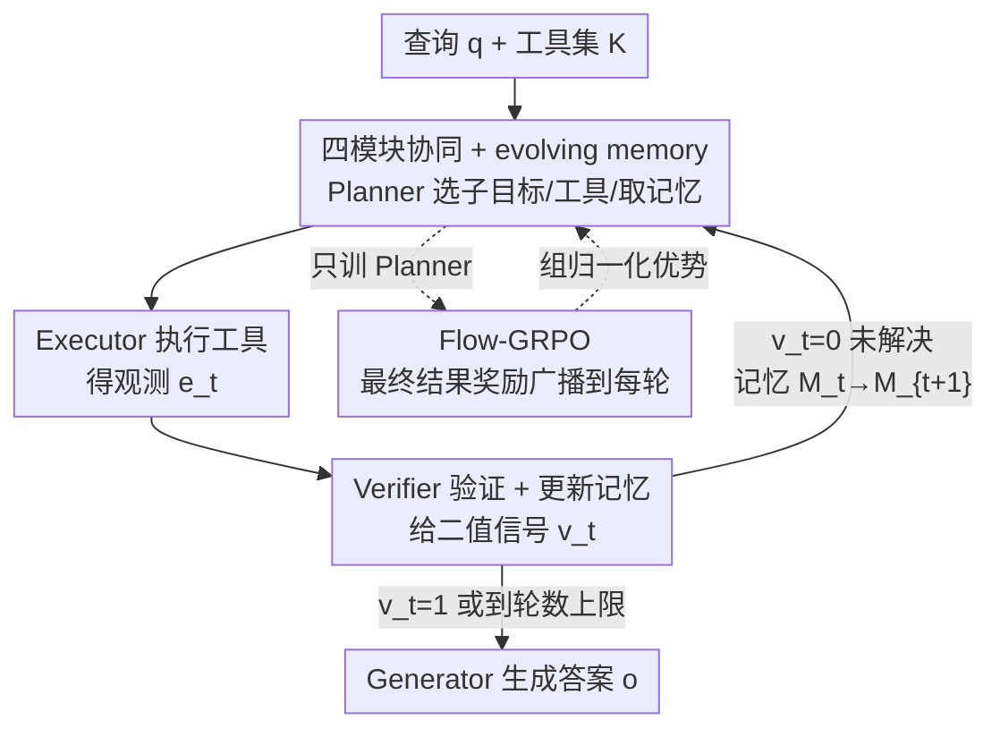

# In-the-Flow Agentic System Optimization for Effective Planning and Tool Use

**会议**: ICLR 2026  
**OpenReview**: [https://openreview.net/forum?id=Mf5AleTUVK](https://openreview.net/forum?id=Mf5AleTUVK)  
**代码**: https://agentflow.stanford.edu （项目页，含 Code/Model/Demo）  
**领域**: Agent  
**关键词**: 智能体系统, 工具调用, 多轮强化学习, 在线优化, 信用分配

## 一句话总结
提出 AGENTFLOW——一个由 planner / executor / verifier / generator 四模块加共享记忆协同的可训练智能体系统，并配套 Flow-GRPO 算法，在多轮交互的「活流程」中只在线优化 planner；7B 骨干在 10 个基准上平均涨 4~15 个点，甚至超过 ~200B 的 GPT-4o。

## 研究背景与动机

**领域现状**：让 LLM 学会用工具推理，目前主流是 tool-integrated reasoning（TIR）——用可验证奖励做 RL，训练**单个整体策略**，在完整上下文里交替输出 `<think>` 思考和 `<tool_call>` 工具调用（Search-R1、ReSearch、ToRL 等）。另一条线是 agentic systems（AutoGen 等），把任务拆给 planner / coder / critic 等专门模块协作。

**现有痛点**：单体 TIR 策略随着任务变长、工具变多、环境随工具反馈漂移，训练越来越不稳定，且对没见过的任务/工具泛化很脆。而多模块的 agentic 系统虽然结构灵活，却**几乎都是 training-free**——靠手写编排逻辑或提示词硬拼，模块全程冻结；少数用 SFT/偏好优化训某个模块的，又是 off-policy、和真实运行动态脱钩，学不到下游成败的信号。

**核心矛盾**：可训练的是「单体但僵硬」的策略，灵活的是「多模块但不训」的系统——两边的优点凑不到一起。要在 agentic 系统里真正把模块训好，必须面对长程、稀疏奖励下的信用分配难题：模块顺序协作、最终反馈要穿过很长的推理链才回传、状态分布还随工具输出不断变化。

**本文目标**：造一个既保留多模块灵活协同、又能在**多轮循环内部**对关键模块做 on-policy 训练的智能体系统，并解决随之而来的长程稀疏奖励信用分配。

**切入角度**：四模块里，真正决定「下一步干什么、调哪个工具、从记忆里取什么」的是 planner——把它**放进活流程里在线训练**，让它直接面对推理时会遇到的真实状态分布，就能让局部决策和全局成败对齐。

**核心 idea**：把一个多轮、工具集成的智能体系统形式化成 MDP，只对 planner 做 in-the-flow 在线 RL；并用「把单一可验证的最终结果奖励广播到每一轮」的技巧，把多轮 RL 化简成一串单轮策略更新。

## 方法详解

### 整体框架

AGENTFLOW 要解决的是「在多轮工具交互中做细粒度规划」。给定查询 $q$ 和工具集 $K$，系统进入一个多轮循环：每一轮里 **Action Planner** $P$ 看着当前记忆 $M^t$ 产出动作 $a^t$（拆一个子目标、选一个工具、从记忆取相关上下文）；**Tool Executor** $E$ 用所选工具执行得到观测 $e^t$；**Execution Verifier** $V$ 判断这次执行是否有效、累积记忆是否足以回答问题，给出二值信号 $v^t$。若 $v^t=0$，记忆按确定性函数更新 $M^{t+1}=f_\text{mem}(M^t,a^t,e^t,v^t)$（以简洁结构化的形式记下过程信息、时间、轮次、错误信号），循环继续；直到 $v^t=1$ 或触达最大轮数预算，最后由 **Solution Generator** $G$ 基于 $q$ 和最终记忆 $M^T$ 生成答案 $o$。

关键在于：四个模块里**只有 planner 是可训练策略 $\pi_\theta$**，其余三个模块和工具都冻结；planner 在这个活循环内部用 Flow-GRPO 做 on-policy 优化，从而能随工具调用、verifier 信号、记忆更新塑造出的真实轨迹动态适应。这个 evolving memory 是对推理过程的**显式、确定性记录**（不同于隐式的思维链），保证了状态可追踪、行为可控、上下文有界增长。

### 关键设计

**1. AGENTFLOW：四模块 + evolving memory 的在线可训练智能体系统**

针对「灵活的 agentic 系统不可训、可训的 TIR 又僵硬」这个矛盾，本文把问题求解形式化成一个变长时域的多轮 MDP：状态是 $(q,K,M^t)$，planner 的动作 $a^t\sim\pi_\theta(a^t\mid q,K,M^t)$，executor 给 $e^t$、verifier 给 $v^t$，记忆确定性地推进到 $M^{t+1}$。整条轨迹 $\tau=\{(a^t,e^t,v^t)\}_{t=1}^T$ 把规划—执行—验证的历史显式记录下来，联合生成过程可写成

$$p_\theta\big(\{a^t,e^t,v^t\}_{t=1}^T, o\mid q,K\big)=\Big[\prod_{t=1}^T \pi_\theta(a^t\mid q,K,M^t)\,E(e^t\mid a^t,K)\,V(v^t\mid q,e^t,M^t)\Big]G(o\mid q,M^T).$$

它的有效性在于：记忆 $M$ 是**显式且确定性**的，不像隐藏思维链那样难以观测，于是多轮决策变得透明可控；而把 executor/verifier/generator 冻结、只留 planner 可训，既保住了多模块分工的灵活性，又把「该训什么」收敛到了真正决定流程走向的那个模块上。

**2. Flow-GRPO：把最终结果奖励广播到每一轮，多轮 RL 化简为单轮更新**

长程稀疏奖励下，给中间动作分配信用极难——每个 $a^t$ 只间接影响最终答案，价值往往要好几轮后才显现。本文不去用脆弱的中间启发式打分，而是采用**纯最终结果奖励**：整条轨迹只看最终答案 $o$ 对 $q$、对标准答案 $y^*$ 是否正确，由 LLM-as-judge 按语义/数值/选项等价给出 $\bar R(o,q,y^*)\in\{0,1\}$，然后把这个同一个奖励**广播给轨迹里的每个动作**：$r=R(a^t)=\bar R(o,q,y^*),\ \forall t$。

这一步是关键：因为每一轮的更新都以该轮完整的状态 $s^t_i=(q,K,M^t_i)$ 为条件，又收到一致的全局成败信号，多轮 RL 就被**等价分解成一组独立的单轮策略更新**（论文在附录给出了这一等价性的证明与收敛性分析）。目标函数沿用 PPO 式的 token 级裁剪比率加 KL 正则：

$$J_\text{Flow-GRPO}(\theta)=\mathbb{E}\Big[\tfrac{1}{G}\sum_{i=1}^{G}\tfrac{1}{T_i}\sum_{t=1}^{T_i}\tfrac{1}{|a^t_i|}\sum_{j}\min\big\{\rho^t_{i,j}A^t_i,\ \text{clip}(\rho^t_{i,j},1-\epsilon,1+\epsilon)A^t_i\big\}-\beta D_\text{KL}(\pi_\theta\Vert\pi_\text{ref})\Big],$$

其中 $\rho^t_{i,j}$ 是第 $j$ 个 token 的重要性采样比。相比 off-policy SFT/偏好优化，它在 planner 推理时**真正会遇到的状态**上训练，避免了训练-部署分布漂移和早期错误级联。

**3. 组归一化优势：稳定稀疏信号下的训练**

由于奖励是单一的轨迹级信号，同一条轨迹内每一轮的优势 $A^t_i$ 其实是常数。为降低方差、锐化跨样本的信用分配，本文对一组并行 rollout（每个 query 采 $G$ 条）做组内归一化：

$$A^t_i=\frac{\bar R(o_i,q,y^*)-\text{mean}\big(\{\bar R(o_k,q,y^*)\}_{k=1}^G\big)}{\text{std}\big(\{\bar R(o_k,q,y^*)\}_{k=1}^G\big)}.$$

它把「这条轨迹相对同组其它轨迹好多少」作为优势，使得在 0/1 这种极稀疏的奖励下也能稳定地推动策略往高分方向走——这正是 agentic 系统协作动态下让训练不崩的关键一环。

### 一个例子：ISBN-10 校验位

以 GAIA 里一道题为例（求 Helotiales 目的 Tropicos ID 当成 ISBN-10 时的校验位，答案 3）：**微调前**，planner 先用 Wikipedia Search（无结果）→ Google Search（拿到 ID 100370510）→ Python Coder 算校验位，但代码报 `name 'isbn' is not defined`，随后第 3~9 步反复卡在同一个变量名错误里出不来，最终失败。**Flow-GRPO 微调后**，planner 在第 4 轮、连续两次失败之后**自主探索出新解法路径**：换了正确的变量与脚本，一次算出校验位 3。这个例子直观说明在线优化带来了更强的自我纠错和工具组合能力。

## 实验关键数据

主实验骨干统一用 Qwen2.5-7B-Instruct 实例化全部四模块，只训 planner；工具有 Base Generator / Python Coder / Google Search / Wikipedia Search / Web Search 五种；训练数据混合 Search-R1 与 DeepMath。评测覆盖搜索、agentic、数学、科学四类共 10 个基准，结果取 3 次平均。

### 主实验

| 任务类别 | 代表基准 | AGENTFLOW (w/ Flow-GRPO) | 同规模最强工具基线 | 提升 |
|--------|------|------|----------|------|
| 搜索 | 四基准均值 | 57.3 | AutoGen 42.4 | +14.9 |
| Agentic | GAIA | 33.1 | Search-R1 19.1 | +14.0 |
| 数学 | 三基准均值 | 51.5 | ToRL 37.0 | +14.5 |
| 科学 | GPQA/MedQA 均值 | 63.5 | TIR 59.4 | +4.1 |

同为 ~200B 级别对照，GPT-4o 在搜索/agentic/数学/科学上分别只有 49.1 / 17.3 / 35.1 / 45.5，全面被 7B 的 AGENTFLOW 反超（领先 8.2~18.0 个点）。单看 Flow-GRPO 带来的增量：2Wiki 60.0→77.2、AIME24 16.7→40.0、GameOf24 31.0→53.0。

### 消融实验（planner 训练策略，Table 3）

| Planner 训练方式 | 6 基准均值 | 相对冻结基线 |
|------|---------|------|
| Qwen2.5-7B 冻结 | 38.5 | — |
| 换成 GPT-4o 冻结 | 44.3 | +5.8 |
| Qwen2.5-7B + SFT（蒸馏 GPT-4o 轨迹） | 19.5 | −19.0 |
| Qwen2.5-7B + Flow-GRPO | 55.7 | +17.2 |

### 关键发现
- **在线 RL 是胜负手**：把 planner 换成更强的 GPT-4o 也只涨 5.8，因为静态模型无法与系统活动态协同；而离线 SFT 蒸馏 GPT-4o 轨迹反而**灾难性崩盘 −19.0**——token 级模仿目标和轨迹级任务成败错位，学不到对工具反馈的适应与纠错。Flow-GRPO 则 +17.2，证明「在流程里训」才是关键。
- **学会按任务选工具**：2Wiki（要广博事实）微调后 Google Search 占比 +42.0%；MedQA（要领域深检索）则反向，Google Search 66.2%→10.9%，转向 Wikipedia Search（0→59.8%）和 in-document Web Search（0→19.5%）。
- **正向 scaling**：骨干 3B→7B、最大轮数 $T_\text{max}$ 3→10，性能都单调提升且在 10 轮达峰，没有退化成无效循环；训练中奖励稳步上升、响应长度先升后收敛，比单体 TIR RL（ToRL）更高效。

## 亮点与洞察
- **「奖励广播 = 多轮拆单轮」是最巧的一招**：与其费力给中间步骤打分，不如把唯一可靠的最终成败信号灌到每一轮，再配组归一化优势——既绕开了脆弱的中间启发式，又把难解的长程信用分配化成了好优化的单轮更新，还附了等价性证明。
- **「只训 planner」的取舍很聪明**：在多模块系统里精准锁定真正决定流程走向的那个模块去训，其余冻结，既省训练成本又保住系统灵活性，是可迁移到其它 agent 框架的思路。
- **evolving memory 当显式状态**：用确定性、结构化的记忆替代隐式思维链做 MDP 状态，让多轮决策透明可控、上下文有界，这对做 on-policy RL 的可观测性至关重要。
- SFT 崩盘的对照极有说服力：直观点破了「离线模仿强模型轨迹」在 agentic 多轮场景下为何行不通。

## 局限与展望
- **只训了 planner**：executor / verifier / generator 全程冻结，若它们本身能力不足（如 verifier 误判终止），planner 再优化也受限；联合训练多个模块是自然延伸。
- **奖励依赖 LLM-as-judge**：最终 0/1 奖励由 rubric 式 LLM 评判给出，其准确性直接决定信用分配质量，judge 偏差会被广播到每一轮。
- **纯最终结果奖励的代价**：放弃所有中间信号虽稳，但对超长时域、必须精细中间反馈的任务，是否仍最优值得验证；GAIA 只用了 textual split。
- 评测均为 7B 量级骨干 + 有限工具集，更大模型、更丰富/真实工具环境下的表现仍待考察。

## 相关工作与启发
- **vs 单体 TIR（Search-R1 / ReSearch / ToRL）**：它们训一个整体策略在全上下文里交替思考与调工具，长程下不稳、泛化脆；本文拆成多模块、只 on-policy 训 planner，搜索/agentic/数学分别领先最强者 14.9 / 14.0 / 14.5 个点。
- **vs training-free agentic 系统（AutoGen）**：AutoGen 靠手写编排、模块全冻结；AGENTFLOW 在同样 7B 模块配置下把 planner 放进活循环训练，GAIA 上 6.3→33.1。
- **vs 离线训某模块（SFT / 偏好优化）**：off-policy 与真实动态脱钩，SFT 蒸馏甚至导致 −19.0 崩盘；in-the-flow 的 Flow-GRPO +17.2，凸显「在部署分布上训」的必要性。

## 评分
- 新颖性: ⭐⭐⭐⭐⭐ 「可训练 in-the-flow 智能体 + 奖励广播把多轮拆单轮」的组合切中了 agentic RL 的真痛点
- 实验充分度: ⭐⭐⭐⭐⭐ 10 基准四领域、五类基线、训练策略/工具分布/双向 scaling/效率多维消融
- 写作质量: ⭐⭐⭐⭐ 形式化清晰、图例丰富，个别公式与附录证明需对照原文
- 价值: ⭐⭐⭐⭐⭐ 7B 反超 GPT-4o，且方法范式对构建可训练多模块 agent 有很强借鉴

<!-- RELATED:START -->

## 相关论文

- [\[ICLR 2026\] OrchestrationBench: LLM-Driven Agentic Planning and Tool Use in Multi-Domain Scenarios](orchestrationbench_llm-driven_agentic_planning_and_tool_use_in_multi-domain_scen.md)
- [\[ICLR 2026\] Benchmarking LLM Tool-Use in the Wild](benchmarking_llm_tool-use_in_the_wild.md)
- [\[ICLR 2026\] TusoAI: Agentic Optimization for Scientific Methods](tusoai_agentic_optimization_for_scientific_methods.md)
- [\[ICLR 2026\] GTool: Graph Enhanced Tool Planning with Large Language Model](gtool_graph_enhanced_tool_planning_with_large_language_model.md)
- [\[ICLR 2026\] An Information Theoretic Perspective on Agentic System Design](an_information_theoretic_perspective_on_agentic_system_design.md)

<!-- RELATED:END -->
