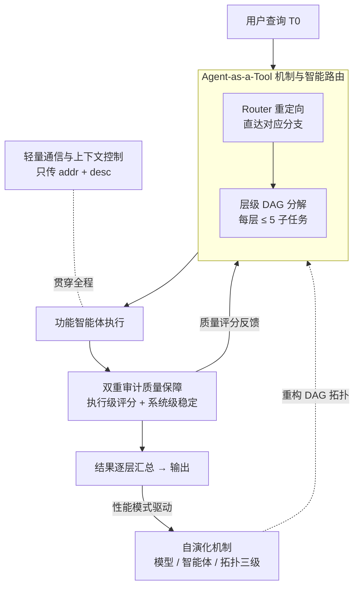

# InfiAgent: Self-Evolving Pyramid Agent Framework for Infinite Scenarios

**会议**: ICLR 2026  
**arXiv**: [2509.22502](https://arxiv.org/abs/2509.22502)  
**代码**: 待公开  
**领域**: LLM Agent  
**关键词**: multi-agent system, DAG, agent-as-a-tool, self-evolution, task decomposition, hierarchical agent

## 一句话总结

提出 InfiAgent，一个基于 DAG 的金字塔式多智能体框架，通过 agent-as-a-tool 机制实现自动化的层级任务分解、双重审计质量保障、智能路由和自演化能力，在多个推理基准上比 ADAS 平均提升 9.9%。

## 研究背景与动机

当前基于 LLM 的智能体系统面临几个核心挑战：

**手工设计瓶颈**：现有智能体需要精心设计的工作流、提示词和迭代调优，这要求同时具备 LLM 技术和领域专业知识，严重限制了跨行业的可扩展性

**协调开销大**：传统多智能体架构采用点对点协作模型，允许智能体之间自由交互，导致协调开销增大、死锁和不可预测的行为

**缺乏自适应性**：现有框架依赖人工编写模板，缺乏系统推理能力，无法自主适应新任务和优化需求

**稳定性问题**：随着系统复杂度增加，智能体间的不可预测交互、资源冲突和涌现行为不稳定性问题日益突出

InfiAgent 旨在提供一个通用框架，无需大量手动配置即可自动适应多样化问题域。

## 方法详解

### 整体框架

InfiAgent 要解决的是：一套智能体系统如何不靠人工搭工作流，就自动适配千变万化的任务。它的答案是把整个系统组织成一张金字塔形的 DAG（有向无环图）——绝大多数智能体并不直接干活，而是专注于**规划和路由**，真正的执行只落在金字塔底层的功能智能体身上。一个用户查询进来，先被顶层 Router 直接重定向到对应分支（避免逐层盲搜），再沿 DAG 一层层分解，每个高层智能体都像"项目经理"，调度手下少数几个更专门的低层智能体、把结果汇总后往上交。这套数据流的两侧还各挂着两套保障机制：双重审计实时盯着每个节点的输出质量与系统稳定，轻量通信与上下文控制让长程任务的上下文不膨胀；而整张 DAG 又能根据历史表现自演化、越跑越强。

### 关键设计

**1. Agent-as-a-Tool 机制与智能路由：把下游智能体当成可调用的工具，再用"深度"换"容量"**

这是整个框架的地基，对应整体框架里"分解 + 路由"那一步。当任务 $T_0$ 提交给顶层智能体 $\alpha$，它做三件事：识别出合适的低层智能体 $\{A_1, A_2, \ldots, A_k\}$，把原任务重新表述成对应的子任务 $\{T_1, T_2, \ldots, T_k\}$，再把每个低层智能体当成一个专门工具去调用。这个逐层分解的过程形式化为

$$T^{(l)} \mapsto \{T_1^{(l+1)}, T_2^{(l+1)}, \ldots, T_{k_l}^{(l+1)}\}$$

若某个被选中的智能体没法直接执行，就用同一套机制继续往下拆，直到任务落到功能层。关键在于框架对每次分解施加了硬约束 $k_l \leq K_{\max}$（$K_{\max}=5$，即扇出远小于智能体总数 $N$）：任何一个智能体最多只拆出 5 个子任务。这样一来，无论系统整体规模怎么膨胀，单个智能体面对的协调复杂度始终有界——它只需照看一小撮下游，而不是在一张巨大的协作网里和所有人自由交互（后者正是传统点对点多智能体架构协调开销大、易死锁的根源）。

正因为每个节点的分支被卡在 5 以内，系统只能靠**加深**来扩容：当平均分支因子为 $b$ 时，深度 $L$ 处可达的功能智能体数约为 $N_{\text{func}} \approx b^L$。这个指数关系意味着顶层智能体哪怕只直管几个下游，整棵树展开后却覆盖海量功能节点，从而拥有极广的泛化能力，而每个中间智能体始终只需对有限子节点做推理——宽度受限保证局部简单，深度无限保证全局强大。

**2. 双重审计质量保障：执行级盯输出、系统级盯稳定**

复杂系统跑久了容易出现涌现性的不稳定，所以 InfiAgent 在两个尺度上同时审计，对应整体框架里挂在执行环节旁边的质量保障。执行级审计持续监控每个智能体 $A_i$ 的输出，用一个滑动平均的质量评分 $Q_i$ 刻画其可靠性：

$$Q_i^{(t+1)} = \alpha \cdot Q_i^{(t)} + (1-\alpha) \cdot \text{validate}(O_i^{(t)})$$

其中 $\text{validate}(O_i^{(t)})$ 是对当前输出 $O_i^{(t)}$ 的验证得分，以权重 $(1-\alpha)$ 不断修正历史评分 $Q_i^{(t)}$，从而让"哪个智能体靠谱"成为一个可量化、随时间演化的量（这个评分也回流给路由与自演化用）。系统级审计则站在更高视角，通过内置的审查机制和回顾性摘要维护整体稳定，并顺手做上下文压缩省 token——一个管局部对错，一个管全局别崩，两者合起来防止错误沿多阶段流程层层传播。

**3. 轻量通信与上下文控制：只传地址不传内容，让上下文长度有界**

长程任务最怕上下文越滚越长，这个设计就是整体框架里那条"贯穿全程"的旁路。InfiAgent 的对策是智能体之间根本不互传大块内容，只在共享工作区里交换文件描述符和元数据

$$M_{i \to j} = (\text{addr}, \text{desc})$$

拿到地址需要时再去取。每个智能体的执行上下文 $C$ 被结构化拆成四块：系统提示上下文 $C_{\text{sys}}$（引导行为的预定义提示）、长期记忆索引 $C_{\text{LM}}$（把工作区文件描述符压缩成索引，$C_{\text{LM}} = \text{compress}(\{d(f_i) \mid f_i \in \mathcal{F}\})$，而不是把完整历史塞进 prompt）、短期共享记忆 $C_{\text{SM}}$（记录当前活跃调用树的动态调用栈）、以及压缩环境交互上下文 $C_{\text{ENV}}$（当 token 长度逼近阈值 $\tau$ 时自动压缩）。靠这套拆分，框架始终保证 $|C| \ll |H|$（$H$ 为完整历史日志），即任一智能体看到的上下文远小于全量历史，从根本上避免了上下文膨胀。

**4. 自演化机制：借鉴 Git 工作流，让系统自己越跑越强**

整体框架里那条从输出绕回 DAG 的反馈回路，就是自演化，它分三层推进。模型级用类 Git 的分支工作流：多个轻量模型并行跑，各自产出改动 $\Delta m_i^{(t)}$，由一个 Judge 模型 $J$ 评判，只有通过的改动（$J(\Delta m_i^{(t)})=1$）才合进主分支

$$B_{\text{main}}^{(t+1)} = \text{merge}\big(B_{\text{main}}^{(t)}, \{\Delta m_i^{(t)} \mid J(\Delta m_i^{(t)}) = 1\}\big)$$

智能体级则反过来用主分支沉淀下来的高质量数据 $D(B_{\text{main}}^{(t)})$ 回训所有并行模型，$m_i^{(t+1)} \leftarrow \text{train}(m_i^{(t)}, D(B_{\text{main}}^{(t)}))$，让整支"模型舰队"一起进步、而不只靠竞争淘汰。最上层是拓扑级演化：长期产出高质量结果的分支逐渐占主导、弱分支被剪枝，相似功能向上融合成领域级专家模型，整张 DAG 的连接拓扑也据此重构——三层叠加，系统就能在无人干预下持续自我优化。

### 训练策略

框架不走传统的单一损失，而是靠上面的质量评分机制和自演化反馈循环来优化，整体目标可概括为：在最大化任务完成质量 $Q_i$ 的同时，把上下文长度 $|C|$ 压到最小。

## 实验关键数据

### 主实验

在五个基准上的表现（均使用 GPT-4o-mini 作为基础模型）：

| 方法 | DROP | HumanEval | MBPP | GSM8K | MATH | 平均 |
|------|------|-----------|------|-------|------|------|
| IO (GPT-4o-mini) | 68.3 | 87.0 | 71.8 | 92.7 | 48.6 | 73.68 |
| CoT | 78.5 | 88.6 | 71.8 | 92.4 | 48.8 | 76.02 |
| CoT SC (5-shots) | 78.8 | 91.6 | 73.6 | 92.7 | 50.4 | 77.42 |
| MedPrompt | 78.0 | 91.6 | 73.6 | 90.0 | 50.0 | 76.64 |
| Self Refine | 70.2 | 87.8 | 69.8 | 89.6 | 46.1 | 72.70 |
| ADAS | 76.6 | 82.4 | 53.4 | 90.8 | 35.4 | 67.72 |
| **InfiAgent** | **82.4** | 89.3 | 71.8 | **93.1** | 35.6 | 74.44 |

### 消融实验

InfiHelper 案例研究——质量评估对比（1-10 分制 peer review）：

| 系统 | 代表论文 | 最佳分数 | 平均分 |
|------|---------|---------|--------|
| AI-Researcher | 多篇 VQ-VAE/GCN | 6 | 4.75 |
| Zochi | Tempest Jailbreak | 6 | 6.0 |
| Sakana-AI | Compositional Regularization | 4 | 4.0 |
| **InfiHelper** | Adaptive Multi-Scale DAS | **7** | **5.67** |

### 关键发现

1. **复杂推理卓越**：DROP 达 82.4%，比最佳基线 CoT SC (78.8%) 高 3.6 个百分点，验证了 agent-as-a-tool 机制在多步推理任务上的优势
2. **数学与代码能力强**：GSM8K 93.1%（最高），HumanEval 89.3% 具有竞争力
3. **专门数学领域受限**：MATH 仅 35.6%，因工具调用框架的 overhead 消耗了本可用于直接数学推演的模型能力
4. **比 ADAS 平均提升 9.9%**：验证层级化分解优于端到端自动生成

## 亮点与洞察

1. **Agent-as-a-Tool 抽象精巧**：将智能体统一视为工具，实现了前所未有的模块化和可重用性，同一框架可处理从科学研究到软件工程的多类任务
2. **金字塔结构 + Router 设计**：通过 Router 直接重定向用户查询避免逐层搜索，显著提升效率
3. **自演化是最大亮点**：类 Git 的模型演化工作流使得系统可自主优化，无需人工干预
4. **轻量通信设计实用**：仅传递 (addr, desc) 对，确保上下文长度有界，解决长期运行任务中的上下文膨胀问题
5. **InfiHelper 生成的论文通过了 IEEE 顶会人工审稿验证**，证明系统在真实科研场景中的实用价值

## 局限性

1. **MATH 基准表现不佳**：对于需要集中推演而非多步分解的挑战性问题，工具调用框架的开销反而成为负担
2. **实验使用统一骨干模型**：为公平比较牺牲了异构模型协作的展示
3. **InfiHelper 案例研究缺乏详细定量评估**：主要依赖 AI 评审打分
4. **自演化机制的收敛性和稳定性未充分分析**
5. **缺乏与更多最新多智能体框架（AutoGen、MetaGPT 等）的直接对比**

## 相关工作与启发

- **ADAS**（Hu et al., 2024）：端到端自动生成智能体框架，InfiAgent 通过结构化分解在平均性能上提升 9.9%
- **AgentGym / EvoAgent**：自我改进和进化智能体，InfiAgent 在此基础上增加了拓扑级演化
- **NADER**（Yang et al., 2025）：协作架构设计框架，强调算法和结构演化对构建弹性系统的重要性
- **启发**：agent-as-a-tool 抽象可推广到更多领域；Git 风格自演化工作流值得在其他系统中借鉴

## 评分

- **创新性**: ⭐⭐⭐⭐ — Agent-as-a-Tool 和金字塔式 DAG 架构是有趣的系统设计创新
- **实用性**: ⭐⭐⭐⭐ — 框架易于扩展部署，InfiHelper 案例展示了真实应用价值
- **实验充分度**: ⭐⭐⭐ — 基准实验充分但案例研究评估偏弱
- **写作质量**: ⭐⭐⭐⭐ — 结构清晰，数学形式化完整，图示直观
- **综合评分**: ⭐⭐⭐⭐ (7.5/10)

<!-- RELATED:START -->

## 相关论文

- [\[ICLR 2026\] Your Agent May Misevolve: Emergent Risks in Self-evolving LLM Agents](your_agent_may_misevolve_emergent_risks_in_self-evolving_llm_agents.md)
- [\[ICLR 2026\] Agentic Context Engineering: Evolving Contexts for Self-Improving Language Models](agentic_context_engineering_evolving_contexts_for_self-improving_language_models.md)
- [\[CVPR 2026\] JarvisEvo: Towards a Self-Evolving Photo Editing Agent with Synergistic Editor-Evaluator Optimization](../../CVPR2026/llm_agent/jarvisevo_towards_a_self-evolving_photo_editing_agent_with_synergistic_editor-ev.md)
- [\[ACL 2025\] Gödel Agent: A Self-Referential Agent Framework for Recursive Self-Improvement](../../ACL2025/llm_agent/gödel_agent_a_self-referential_agent_framework_for_recursive_self-improvement.md)
- [\[ICML 2026\] Self-evolving LLM agents with in-distribution Optimization](../../ICML2026/llm_agent/self-evolving_llm_agents_with_in-distribution_optimization.md)

<!-- RELATED:END -->
