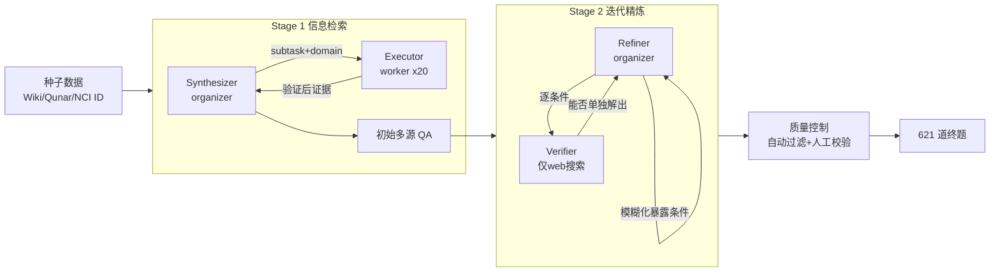

# InfoMosaic-Bench: Evaluating Multi-Source Information Seeking in Tool-Augmented Agents

**会议**: ICLR 2026  
**代码**: [https://github.com/DorothyDUUU/Info-Mosaic](https://github.com/DorothyDUUU/Info-Mosaic)  
**领域**: LLM Agent / 工具增强 / 信息检索基准  
**关键词**: 多源信息检索, MCP 工具, 工具增强 Agent, Benchmark, Agentic 数据合成  

## 一句话总结
InfoMosaic-Bench 是首个专门评测「工具增强 Agent 跨多源信息检索」能力的基准，用 organizer–worker 架构的 InfoMosaic-Flow 流水线合成 621 道必须同时调用通用网页搜索 + 领域专用 MCP 工具才能解的题，揭示出当下最强的 GPT-5 也只有 38.2% 准确率，且领域工具带来的收益不稳定、22.4% 失败源于基本的工具误用。

## 研究背景与动机
**领域现状**：从 PageRank 搜索引擎到 LLM 内化知识，再到 web-search-augmented Agent（各类 Deep Research 产品），信息获取一直是智能系统进步的核心驱动力。如今 Model Context Protocol（MCP）的出现让 Agent 能接入成千上万个异构的领域工具——生物医学数据库、金融行情、地图服务等，看似补齐了通用搜索的短板。

**现有痛点**：当下 Agent 严重依赖开放网页搜索，而网页内容噪声大、格式不一、可靠性差，难以支撑医疗、金融这类高风险场景；许多任务需要的是精确、可验证的领域知识，网页根本给不了。但 MCP 工具铺开后，两个关键问题仍无人回答：(1) Agent 真能在单个领域内有效用好专用工具吗？(2) 更难的是，它能把通用搜索和多个专用工具无缝整合起来解复杂的多源任务吗？

**核心矛盾**：现有基准要么只测通用网页搜索（BrowseComp、WebWalkerQA，单源单工具），要么只测孤立工具调用的正确性（τ-Bench、MCP-Bench），**没有任何基准系统性评测 Agent 跨异构证据源「检索—整合—推理」的全链路能力**。而手工构造这类多源任务又有天然瓶颈：没有单个作者具备跨领域专长，且一道连贯的多源题需要几十次迭代工具调用，人力不可持续。

**本文目标**：构建一个每道题都「锚定在已验证的工具输出之上、且必须跨多源推理才能解」的可靠基准。

**核心 idea**：① 提出 **InfoMosaic-Bench**——621 道题、77 个工具、覆盖医疗/生物、金融、地图、视频、网页、多领域 6 个域；② 提出 **InfoMosaic-Flow**——organizer–worker 双 Agent 自动合成流水线，让任务在工具证据中"生长"出来，再用「网页可解就毙掉」的迭代精炼保证非平凡性。

## 方法详解

### 整体框架
InfoMosaic-Flow 是一条 organizer–worker（指挥官–执行者）双 Agent 的两阶段数据合成流水线。**organizer 负责高层推理（拆解约束、构造验证），保持 tool-agnostic 只选目标领域；worker 是一次 tool-calling 事件，在该领域内自由组合工具、连续调用并返回整合后的证据**。这种功能分离一方面隔离了执行噪声、保住推理深度，另一方面把每个子任务变成对领域工具集的组合搜索，扩大工具多样性。流水线先经 Stage 1（信息检索）把约束锚定到多工具验证输出形成初始 QA，再经 Stage 2（迭代精炼）反复挑战、剪掉单源捷径，只留真正需要多源推理的题。

### 关键设计

**1. 信息检索阶段：让题目从工具证据里"长"出来，而非套模板。** Stage 1 中 organizer 化身 synthesizer，worker 是配齐领域工具的 executor。流程分三步：先 **Scenario Proposing**，从 Wikipedia、百度百科、去哪儿网、NCI 临床试验 ID 等多样种子里提出候选场景，自然地诱发异构工具调用、避免狭窄或刻意的工具流；再 **Domain Information Gathering**，synthesizer 逐步推理并发出高层指令 `executor(subtask, domain)`，executor 选择并组合该域工具检索可验证事实、返回整理后的证据，synthesizer 消化证据、更新计划、发下一条指令；最后 **Integrating**，把验证过的工具结果组织成一道需要多次工具调用 + 跨条件推理的连贯多源题。关键在于"隐藏工具内部细节"——synthesizer 只管题面的连贯与自然，不会为了迁就工具的怪癖而过拟合，同时信息收集循环扩大了探索空间、纳入更多样的工具。

**2. 迭代精炼阶段：用"网页能解就淘汰"的对抗机制保证非平凡。** Stage 1 只保证题"可执行"，但很多题仍可能被单条线索或一次通用网页查询解掉，不反映真实多源挑战。于是引入 Refiner（organizer）与只配网页搜索工具的 Verifier（worker）做三步对抗：**Condition Decomposing** 把合成题拆成独立条件、让 Verifier 逐条尝试；**Condition Fuzzing** 一旦某条件过于"暴露"（单次搜索就能直达答案），Refiner 就改写、增补或与其他条件合并以削减捷径；**Concluding** 直到没有任何单一条件能独立给出答案、且 Verifier 仅靠搜索无法解出，才把精炼后的条件重组为终题。精炼循环持续到两个判据同时满足——「网页搜索单独解不了」且「没有单一条件足以确定答案」，从而硬保证了难度与多源依赖。

**3. 多级质量控制：自动过滤 + 人工校验双保险。** 自动检查有三道关：**Tool-Call Filtering**（Stage 1 设最小工具调用阈值，剔除约束不足、检索量低的平凡题）、**Answer–Evidence Consistency**（只保留最终答案可由收集到的工具输出严格推出的样本，保证可溯源）、**Coherence Filtering**（移除条件矛盾、措辞别扭等语义不连贯的题）。自动过滤后再由人工标注员逐条审查一致性、连贯性与难度，修正或丢弃问题样本，并通过专门的 user study 验证基准对"多源检索"评测的可靠性。

**4. 双指标评测：Accuracy 测整体成败，Pass Rate 测细粒度过程。** Accuracy 衡量严格的端到端任务成功——Agent 能否整体完成检索与推理；Pass Rate 则基于子问题/子目标的测试用例给出更细粒度的视角，反映 Agent 满足了多少条件。评测不只用 exact match，而是用 LLM 判定预测答案是否与参考对齐，缓解语义正确但字符串不匹配的误判。Agent 框架采用最主流的 ReAct，配 OpenAI tool-calling 接口和 Python Sandbox 接收工具执行结果。

## 实验关键数据

### 主实验表格（仅配网页搜索工具，14 个 LLM Agent，单位 %）

| 模型 | 总体 Acc | Pass Rate | Map | Medical/Bio | Video | Web | Finance |
|------|---------|-----------|-----|-------------|-------|-----|---------|
| GPT-5 | **38.18** | **67.48** | 32.59 | 53.10 | 36.00 | 29.00 | 41.00 |
| o3 | 36.35 | 64.96 | 40.74 | 44.79 | 23.00 | 28.71 | 45.00 |
| Grok-4 | 25.42 | 39.44 | 9.63 | 39.02 | 33.00 | 10.00 | 43.88 |
| o4-mini | 24.15 | 61.67 | 24.44 | 25.30 | 24.00 | 8.00 | 39.00 |
| GLM-4.5（开源最佳） | 20.61 | 26.98 | 24.44 | 27.71 | 24.00 | 11.00 | 22.00 |
| Claude-4.0-Sonnet | 15.94 | 36.47 | 17.04 | 20.48 | 18.00 | 3.00 | 27.00 |
| Llama-4-Scout | 4.83 | 21.03 | 0.74 | 4.82 | 0.00 | 0.00 | 22.00 |

### 消融实验表格（领域工具 vs 仅网页，总体 Acc，单位 %）

| 模型 | Map | Medical/Bio | Video | Web | Finance | Multi-domain | Overall |
|------|-----|-------------|-------|-----|---------|--------------|---------|
| GLM-4.5（web） | 24.44 | 27.71 | 24.00 | 11.00 | 22.00 | 14.56 | 20.61 |
| GLM-4.5（domain） | +5.93 | +7.23 | +1.00 | **-4.00** | **-2.00** | **-1.94** | +0.90 |
| GPT-5（web） | 32.59 | 53.10 | 36.00 | 29.00 | 41.00 | 41.75 | 38.18 |
| GPT-5（domain） | +7.41 | **-9.73** | +10.00 | +3.00 | **-9.00** | -1.94 | +0.43 |

### 关键发现
- **网页搜索远不足以应对多源推理**：最强的 GPT-5 也仅 38.2% Acc、67.5% Pass Rate；闭源模型在准确率上领先开源 15–20%，但两者都被网页信息卡住。Pass Rate 普遍高于 Acc，说明 Agent 常满足部分条件却无法整合成正确终答。
- **领域工具收益高度不稳定**：平均仅带来微弱增益（GLM-4.5 +0.90、GPT-5 +0.43），瓶颈不在工具有没有，而在"怎么用"——Map/Video 因依赖结构化独占信号而明显涨分，但 Medical、Finance、Multi-domain 反而掉分；多领域任务工具一多就暴露跨源编排问题（选择与串接抬高规划复杂度、放大错误传播）。
- **22.4% 失败来自基本工具误用**：工具调用结果分为 usage error（函数调用错）、selection error（选错工具）、invalid result（成功但无用）、valid result 四类；工具越复杂误用率越高，工具集越大选择错误率越高，且多数工具结果其实无助于解题。
- **工具调用量存在收益拐点**：Acc/PR 总体随调用次数上升，但 8 次后趋于平台、再多反而因冗余信息掉分；各模型的"有效工具使用上限"与总体准确率中度正相关（R²=0.57）。
- **web-only 失败归因**：GPT-5 失败中 Retrieval Miss 占 39.6% 居首，其次是过度泛化等，凸显检索本身就是主要瓶颈。

## 亮点与洞察
- **"工具证据先行"的合成范式**：先调真工具拿到可验证证据、再围绕证据组题，而非先写题再找答案，从根上保证了每道题可溯源、答案与证据严格一致——这套思路对任何需要"可信标注"的 Agent 基准都有借鉴价值。
- **对抗式精炼把"难度"工程化**：用一个只会网页搜索的 Verifier 当"红队"，凡是它能解的、或单条件能暴露答案的题一律毙掉/模糊化，把"必须多源"从一句口号变成可强制执行的判据。
- **organizer–worker 解耦同时兼顾推理深度与工具多样性**：让规划者 tool-agnostic、执行者在域内自由组合，既避免约束去迁就工具，又把子任务变成对工具集的组合搜索。
- **诊断维度丰富**：condition-level gold label + 工具调用 trace，支持端到端评测之外的细粒度失败归因（四类工具错误 + 六类失败原因），让"为什么错"看得见。

## 局限与展望
- **基准本身揭示而非解决问题**：论文清晰诊断出"会搜网页但用不好领域工具、更不会组合"这一鸿沟，但未给出训练/方法层面的解法，留给后续工作。
- **合成依赖强模型**：organizer–worker 流水线的质量受底层 LLM 能力限制，弱模型合成可能引入偏差；虽有人工校验兜底，但人力规模有限。
- **领域覆盖仍有限**：6 个领域、77 个工具相对真实 MCP 生态仍是小样本，工具版本/接口会随时间漂移，基准的长期可复现性需维护。
- **评测用 LLM-as-judge**：缓解了字符串匹配的死板，但引入评判模型自身的偏差，需关注一致性。
- 展望：缩小这一鸿沟（可靠地用好领域工具并有效组合）是把可信 Agent 部署到医疗、金融、科学发现等高风险领域的前提，方法侧（工具规划、选择、参数化、时机）大有可为。

## 相关工作与启发
- **工具使用 LLM**：ReAct 开创推理与行动交织，Toolformer 自监督学何时调 API，ToolLLM/EasyTool/MCP-Flow 扩大 API 覆盖与鲁棒性，Search-o1/WebThinker/R1-Searcher 聚焦长程网页检索与编排——但都局限单通道。MCP 把工具使用从纯网页扩到异构领域工具生态，带来跨源协调的新挑战，正是本文切入点。
- **工具基准三条线**：API-centric（ToolBench、τ-Bench 测单工具调用正确性）、Web/search-oriented（BrowseComp、WebWalkerQA、MM-BrowseComp 测开放网页推理）、MCP-style（MCP-Universe、MCP-Radar、MCP-Zero、MCP-Bench 测大规模异构工具下的调用正确性/鲁棒性/零样本发现）。三者都止步于"跨工具的信息检索与长程推理"，InfoMosaic-Bench 正是填补这一空白。
- **启发**：对做 Agent 评测的人，"用对抗 Verifier 强制非平凡 + 用真工具证据保证可溯源"这套组合拳很值得复用；对做 Agent 训练的人，"瓶颈在工具使用而非工具可用性""8 次调用后收益递减""选择/参数化错误是主因"这些发现可直接指导改进方向。

## 评分
- **新颖性**: ⭐⭐⭐⭐ 首个面向"多源信息检索"的工具增强 Agent 基准，organizer–worker 合成 + 对抗式精炼的组合是真创新。
- **实验充分度**: ⭐⭐⭐⭐ 14 个 SOTA 模型、6 领域、web-only 与 domain-tool 双设置、四类工具错误与六类失败归因、scaling 分析齐全。
- **写作质量**: ⭐⭐⭐⭐ 动机—问题—方法—发现逻辑清晰，三大发现凝练有力，图表诊断维度丰富。
- **价值**: ⭐⭐⭐⭐⭐ 精准戳中"MCP 时代 Agent 到底会不会用工具"这一关键空白，对高风险领域可信 Agent 落地有直接指导意义。

<!-- RELATED:START -->

## 相关论文

- [\[ICLR 2026\] FlowSearcher: Synthesizing Memory-Guided Agentic Workflows for Web Information Seeking](flowsearcher_synthesizing_memory-guided_agentic_workflows_for_web_information_se.md)
- [\[ICLR 2026\] GPS: Graph-guided Proactive Information Seeking in Large Language Models](gps_graph-guided_proactive_information_seeking_in_large_language_models.md)
- [\[ICLR 2026\] Evaluating Memory in LLM Agents via Incremental Multi-Turn Interactions](evaluating_memory_in_llm_agents_via_incremental_multi-turn_interactions.md)
- [\[CVPR 2026\] VULCAN: Tool-Augmented Multi Agents for Iterative 3D Object Arrangement](../../CVPR2026/llm_agent/vulcan_tool-augmented_multi_agents_for_iterative_3d_object_arrangement.md)
- [\[ICLR 2026\] A Benchmark for Deep Information Synthesis (DeepSynth)](a_benchmark_for_deep_information_synthesis.md)

<!-- RELATED:END -->
