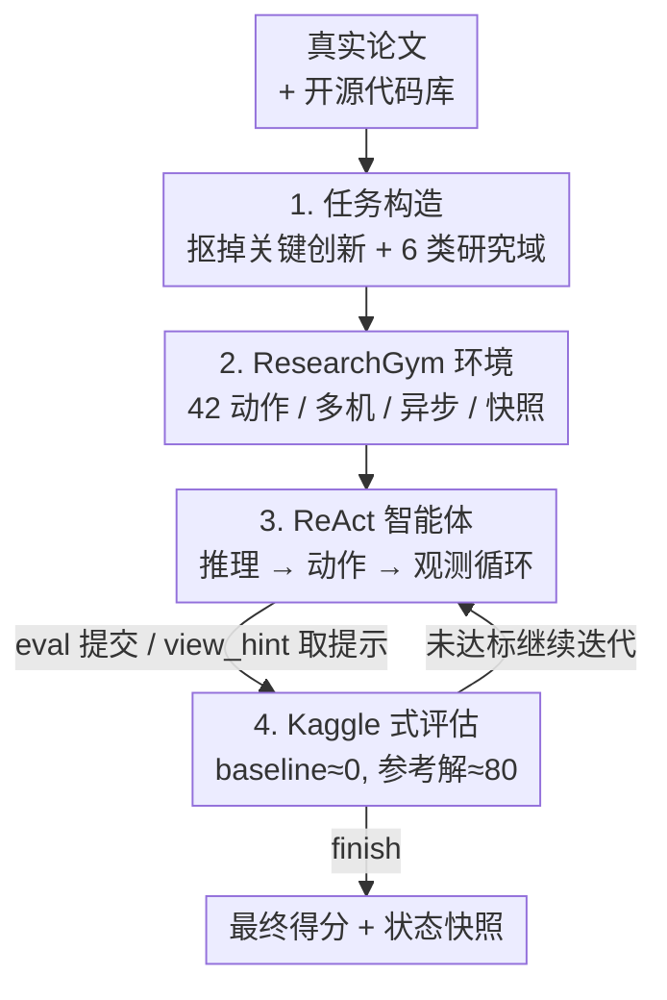

# InnovatorBench: Evaluating Agents' Ability to Conduct Innovative AI Research

**会议**: ICLR 2026  
**OpenReview**: [https://openreview.net/forum?id=w8rZ2Jd6Jo](https://openreview.net/forum?id=w8rZ2Jd6Jo)  
**代码**: https://github.com/GAIR-NLP/InnovatorBench  
**领域**: Agent / LLM 研究自动化 / Benchmark  
**关键词**: AI 研究智能体, 端到端基准, 长时程执行, ResearchGym, ReAct

## 一句话总结
本文提出 InnovatorBench——首个从真实论文+代码库构造、覆盖数据/损失/奖励/脚手架等 6 类 LLM 研究子问题的端到端基准（20 个任务），配套可分布式、可异步、可快照的 ResearchGym 环境，并用 ReAct 智能体测试 Claude-4/GPT-5/GLM-4.5 等前沿模型，发现它们能啃下代码型研究任务但在脆弱的算法设计和长时程决策上频繁翻车（急躁、资源管理差、套模板）。

## 研究背景与动机

**领域现状**：把 LLM 当作"大脑"的智能体被寄望能自动化整条科研流程——提出假设、设计实验、写代码、跑实验、分析结果，即所谓"AI 研究员"。近一两年涌现了一批评估这类智能体的基准（SWE-bench、ScienceAgentBench、PaperBench、RE-Bench、EXP-Bench 等）。

**现有痛点**：这些基准普遍只探测狭窄的单一能力维度。很多任务只看代码实现正确率或调参，而不评估整条研究链路；成功往往被定义为"复现已有结果"，这衡量的是保真度而非创新能力——无法考察智能体能否设计新目标函数、新架构。更要命的是评估环境被严重简化和资源受限：不支持大规模/长时程训练推理、缺乏对跑几小时进程的异步监控、动作空间狭窄（不能管理文件、跑命令、查文献）。

**核心矛盾**：真正的科研既要"高层创造力"（想出新方法），又要"低层工程力"（把方法在大规模实验里跑通），而现有基准在任务设计和运行环境两端都把这两件事砍掉了——既不允许开放式创新，也不提供能跑几十小时分布式实验的平台，于是测不出智能体作为"研究合作者"的真实潜力。

**本文目标**：构造一个能在真实科研实践中端到端评估 AI 研究智能体的基准+平台对，让智能体必须自己提方法、自己实现、根据结果迭代、产出可运行的产物并多次提交接受打分。

**切入角度**：每个任务都从一篇有影响力的真实论文及其开源代码库出发——把论文的关键创新从代码里抠掉、再藏起参考解，逼智能体靠自己的推理重新发明出超越 ground-truth 的方法。这样既锚定了真实科研问题，又留出了开放创新空间。

**核心 idea**：用"真实论文任务（InnovatorBench）+ 长时程分布式环境（ResearchGym）+ Kaggle 式多次提交打分"三件套，把 AI 研究智能体放进尽量逼真的研究场景里端到端考核。

## 方法详解

### 整体框架

InnovatorBench 的核心是一对耦合的组件：**基准 InnovatorBench**（定义"考什么"）和**环境 ResearchGym**（定义"在哪考、怎么操作"）。一条完整评测是这样转起来的：先从一篇真实论文及其代码库构造出一个任务（抠掉关键创新、保留可运行骨架，附带任务描述、初始 workspace、可选 hint、评测脚本、隐藏的参考解）；ResearchGym 加载该任务、把任务描述作为初始观测交给 ReAct 智能体；智能体在 42 个原语动作组成的动作空间里推理并发出工具调用，动作经 HTTP 派发到目标机器（可跨多机分布式、可异步执行长任务），结果被打包成结构化观测返回；智能体可随时用 `eval` 提交产物拿到 Kaggle 式分数反馈、用 `view_hint` 查提示（要扣分），直到调用 `finish`，环境做最终评测并存快照。

### 关键设计

**1. 任务构造：从真实论文"挖空"出可创新的端到端研究任务**

针对"复现型基准只测保真度、测不出创新"的痛点，InnovatorBench 让每个任务都源自一篇有影响力的 AI 论文及其开源代码库（共 20 个任务、取自 14 篇论文，覆盖 NeurIPS/ICLR/COLM/EMNLP/ACL 等顶会）。构造时把论文的**关键创新实现连同 git 提交历史一并删除**、但保持项目可运行（多数任务基于 LlamaFactory 或 Verl），再配上任务描述、完整数据集（含无标签的测试集供提交）、可微调的模型 checkpoint、辅助脚本，以及一份**评测时全程隐藏的参考解**。任务横跨 6 大研究域：数据构造（DC）、数据过滤（DF）、数据增强（DA）、损失设计（LD）、奖励设计（RD）、脚手架构造（SC）。任务描述只给高层目标、不给分步指令，明确要求智能体"无论用什么方法都要超过参考解"，以此鼓励探索、避免过拟合到既定流程。这与"复现已有结果"的旧范式根本不同——它奖励的是创新而非照抄。

**2. ResearchGym：撑起长时程、分布式、异步的真实研究环境**

针对"现有平台单 Docker、同步执行、动作空间窄、跑不动多小时实验"的痛点，ResearchGym 提供 **42 个原语动作**，分成 Command / File / Parse / Web Search / Web Browse 五大族（Parse 还能把图像/音频/视频抽成文本喂给纯文本模型）。它的三个关键能力是：**多机控制**——每台机器跑一个 HTTP server 接收并执行命令，单机上初始化的智能体可经 HTTP 编排跨集群的分布式实验；**异步命令执行**——把"动作执行"和"动作选择"解耦，命令可绑定到具体 session 后台运行，智能体无需等它结束就能继续规划，之后再 `get_session_output` 异步取结果（还专门给了 `sleep` 动作避免训练期间瞎操作）；**快照保存与加载**——快照记录任务规格、智能体上下文、workspace 最终态和剩余时间预算，可周期性保存、从任意快照恢复、并支持分支（从不同点续跑或多分支并行）。正是这套设施让任务的工作时长能达到 2~36 小时、远超 SWE-bench 等基准的分钟~小时级。

**3. Kaggle 式多次提交评估 + 可选惩罚式 hint：在开放任务里给出可比、防作弊的分数**

针对"开放式创新任务难以客观打分、又怕智能体猜答案"的痛点，本文用 Kaggle 式评测：智能体可多次（主实验最多 4 次）用 `eval` 提交产物并立刻拿到测试集分数反馈。提交先查格式合法性（不合法直接 0 分并返回错误），合法提交再用一个**在 baseline（锚在约 0）与参考解（锚在约 80）之间标定的打分函数**评分。打分维度依任务而定——正确率、F1、BLEU，乃至 RL 后预测分布的熵这种"输出不确定性"指标（如某 GRPO 任务把分数定义为 `entropy_score × acc_score × 100`，同时奖励高准确率和防熵坍缩）。整个评测在 workspace 外部、用隐藏脚本和参考数据执行，智能体只拿得到分数和结果描述、拿不到参考解，从而堵死"answer hacking"。每个任务还配一个**可选 hint**：默认主实验关闭，智能体须主动用 `view_hint` 工具调取且会**扣最终分**——消融实验里则在任务描述后立即给 hint，用来拆分"创造力"和"实现力"两种能力。

**4. ReAct 智能体与四类失败模式：用统一脚手架暴露前沿模型的长时程短板**

为了让不同前沿模型可比，本文用一个轻量 **ReAct 风格智能体**统一包装 Claude-4/GPT-5/GLM-4.5/Kimi-K2/Qwen3-32b——显式推理（Think）耦合可执行规划（Action），并加了上下文摘要能力：当上下文接近模型上限时，自动把前半段历史压缩成摘要。这个统一脚手架的价值不只是跑通实验，更在于**把模型在长时程研究里的系统性失效具象化**：作者从 trace 里归纳出四类典型失败——急躁（训练已跑 10 小时、还剩 21 小时预算却嫌慢 kill 掉进程换方法）、资源管理差（先用 1 块 GPU 起推理、50 多步后在同机起占满全部 GPU 的训练导致冲突，且忘了之前有推理在跑）、选库次优（高吞吐场景仍用 Transformers 而非更快的 vLLM，因为时间预算没有可学习的反馈信号、且 vLLM 较新缺训练数据）、套模板推理（合成 CoT 时套用语义空洞的"Let me analyze step by step…"模板机械拼接问答，反映对高层意图缺乏理解）。这四类失败正是 benchmark 难度的来源——也说明 token 级能力的提升尚未自动转化为端到端研究能力。

### 一个完整示例

以源自 DAPO 的一个 GRPO 损失/奖励设计任务为例走一遍：智能体拿到的任务描述里写着"RL 训练常出现**熵坍缩**（输出分布过早变得确定），请为 GRPO 实现新策略既提准确率又防熵坍缩"，附带训练/验证/测试集、checkpoint、conda 环境路径和 `model_merger.py` 等脚本。智能体在 ResearchGym 里读文件、改 `core_algos.py` 的 `compute_policy_loss`、异步起 GPU 训练（绑到 `gpu_train` session 后台跑、自己 sleep 等待），训完用 `eval` 提交得到 `{score, accuracy, entropy}` 反馈；若卡住，可主动 `view_hint` 看到"在 clip 里把上界改成 `1 + ε + δ`"这样的提示（但要扣分）。最终 ResearchGym 用隐藏脚本算出 `entropy_score × acc_score × 100` 的分数、存快照收尾。这个例子能看出：智能体必须自己想出"防熵坍缩"的算法改动、自己把它在数小时训练里跑通，缺创造力或缺工程力都会卡死。

## 实验关键数据

### 主实验

5 个前沿模型用统一 ReAct 智能体在 6 大研究域上的得分（Final = 最后一次提交分，Best = 历史最高分；环境为 Ubuntu 22.04 + 800GB 内存的 Docker，可经 HTTP 调度 8×80GB GPU 的服务器）：

| 模型 | 加权平均 Final | 加权平均 Best | 亮点/短板 |
|------|------|------|------|
| Claude Sonnet 4 | **24.01** | **24.54** | 6 域中 4 域第一，工具使用最可靠 |
| GPT-5 | 12.04 | 12.52 | 脚手架构造 60.07 极强，但训练一起就高频死循环 |
| GLM-4.5 | 11.85 | 13.35 | 中庸，常错配关键工具参数、训练前卡住 |
| Kimi-K2 | 5.35 | 5.45 | 多数情况生成不出正确代码 |
| Qwen3-32b | 0.00 | 0.00 | 上下文窗口太小、摘要时漏关键信息 |

分域看，所有模型在**数据类任务（DC/DF/DA）普遍高于算法类任务（LD/RD）**：数据类对轻微噪声更宽容（数据构造只要找到同主题数据就能拿不低的分），而算法类很脆——奖励/损失稍有瑕疵就可能梯度爆炸或策略系统性失效。Claude 在 LD/RD 上相对领先，根因是其工具使用可靠、能稳定产出可执行代码并在训练时正确挂起。

### 消融实验：有无 ground-truth hint（均为 Claude Sonnet 4）

| 研究域 | 无 hint Final/Best | 有 hint Final/Best | 趋势 |
|------|------|------|------|
| Loss Design | 12.98 / 12.98 | 22.65 / 25.32 | hint 大幅提升 |
| Reward Design | 11.56 / 11.56 | 15.06 / 15.06 | hint 提升 |
| Data Construction | 25.47 / 26.87 | 15.21 / 19.80 | hint 反而拉低 |
| Data Augmentation | 22.73 / 22.73 | 1.00 / 1.00 | hint 严重拉低 |
| **加权平均** | **24.01 / 24.54** | 13.88 / 16.67 | 整体反降 |

### 关键发现

- **创造力和工程力缺一不可**：hint 把"探索"变成了"实现"——在本就需要发明新算法的 LD/RD 上，给了解法就大幅提分；但在数据类任务上，模型机械照抄 hint 时，编码能力成了瓶颈，脚本里的微小不匹配反而严重破坏功能，使得有 hint 比智能体自己用符号化方法做还差。整体加权平均从 24.01 跌到 13.88。
- **可靠的工具使用是算法类任务成败的关键**：GPT-5 训练一起就陷入高频循环导致早停，GLM-4.5 错配工具参数卡在训练前，Kimi-K2 多数生成不出正确代码——只有 Claude 能稳定产出可执行代码并在训练期正确挂起不乱动。
- **GPT-5 的脚手架代码最鲁棒**：靠三个设计——显式复述 prompt 给的选项以防选无效值、超时后最多重试 3 次而非立刻退回 fallback、强制严格输出格式——拿到 60.07 的脚手架分。
- **难度体现在"测试时长"**：智能体在 PaperBench 约 1.75 小时就饱和，但在 InnovatorBench 需 **11+ 小时**才达最佳（达饱和点的时间长约 **6.5×**）。因为 DA、RD 这类任务含漫长训练阶段，任务越复杂、环境交互成本越主导总工时——作者据此认为 InnovatorBench 比 PaperBench 更难、是下一代代码型研究基准。

## 亮点与洞察
- **"挖空真实论文"的任务构造很巧**：删掉关键创新+git 历史但保留可运行骨架，既保证任务真实有依据、又留出开放创新空间，还自带一份可作上界的参考解，一举锚定了"创新"和"可评"两端。
- **把长时程当成一等公民**：多机 HTTP 控制 + 异步 session + 快照分支，让基准敢于设置 2~36 小时的任务，而不是像多数基准被迫缩到分钟级——这是真正逼近科研的关键基础设施。
- **四类失败模式可迁移成诊断清单**：急躁/资源管理差/选库次优/套模板推理，是任何要做"长时程自主智能体"的人都该警惕的故障模式，可直接拿来设计护栏或评测维度。
- **用"测试时长×6.5"量化难度**：不靠主观判断，而用"达到性能饱和需要多久"来横向比较基准难度，是个干净可复用的度量视角。

## 局限与展望
- **任务仅 20 个、聚焦 LLM 研究**：覆盖 6 域但每域任务有限，且全部围绕 LLM（数据/损失/奖励/脚手架），对 CV、多模态架构、理论类研究的代表性有待扩展。
- **分数横向比较需谨慎**：不同研究域任务难度、训练预算、评测轮次（最多 4 次）不同，分域 score 不宜直接比大小；加权平均的权重设定也会影响排名结论。
- **打分函数的标定带主观性**：baseline 锚约 0、参考解锚约 80 是人为设定，"超过 80"代表超越原论文解但具体打分曲线对不同任务的敏感度未充分讨论。
- **成本高昂**：单个任务动辄数小时、花费数十美元（Claude 加权平均一轮约 30+ USD），大规模复现和迭代评测门槛不低。
- **改进思路**：可引入对"时间/资源效率"的可学习反馈信号（论文指出智能体选次优库正因缺这种信号），以及把 ResearchGym 开放给社区贡献新任务、像 HuggingFace 那样共享，逐步扩域。

## 相关工作与启发
- **vs PaperBench / RExBench / EXP-Bench（复现型）**: 它们把成功定义为复现已有论文结果，测的是保真度；InnovatorBench 删掉关键创新逼智能体重新发明、且评测时长达 2~36h（PaperBench 约 1~3h），考的是端到端创新+长时程工程，难度上 6.5× 于 PaperBench。
- **vs SWE-bench（仓库级代码）**: SWE-bench 让智能体解 GitHub issue、跑单元测试（30m~2h、单次评测、无多 GPU/快照），范围窄在代码补丁；InnovatorBench 覆盖整条研究生命周期、支持多机分布式与快照、可多次提交。
- **vs OpenHands / MLGym（环境/脚手架）**: 这类平台提供沙箱与动作空间但常约束实验时长、规模和动作族，缺分布式训练、多小时异步监控和快照；ResearchGym 正是补这些缺口——42 动作、多机、异步、快照分支，且作为通用可扩展平台不绑定单一基准。

## 评分
- 新颖性: ⭐⭐⭐⭐⭐ 首个"挖空真实论文+长时程分布式环境+Kaggle 式打分"的端到端 AI 研究基准
- 实验充分度: ⭐⭐⭐⭐ 5 个前沿模型×6 域+hint 消融+四类失败 case+测试时长分析，但每域任务数有限
- 写作质量: ⭐⭐⭐⭐ 动机与平台设计清晰，失败模式分析有画面感
- 价值: ⭐⭐⭐⭐⭐ 提供逼真、可扩展、社区可贡献的研究智能体评测底座，且 ResearchGym 可独立复用

<!-- RELATED:START -->

## 相关论文

- [\[ICLR 2026\] EXP-Bench: Can AI Conduct AI Research Experiments?](exp-bench_can_ai_conduct_ai_research_experiments.md)
- [\[ICLR 2026\] OpenAgentSafety: A Comprehensive Framework for Evaluating Real-World AI Agent Safety](openagentsafety_a_comprehensive_framework_for_evaluating_real-world_ai_agent_saf.md)
- [\[ICLR 2026\] Open Data Synthesis for Deep Research](open_data_synthesis_for_deep_research.md)
- [\[ICLR 2026\] ST-WebAgentBench: A Benchmark for Evaluating Safety and Trustworthiness in Web Agents](st-webagentbench_a_benchmark_for_evaluating_safety_and_trustworthiness_in_web_ag.md)
- [\[ICLR 2026\] Evaluating Memory in LLM Agents via Incremental Multi-Turn Interactions](evaluating_memory_in_llm_agents_via_incremental_multi-turn_interactions.md)

<!-- RELATED:END -->
