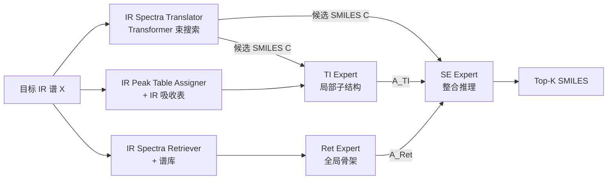

# IR-Agent: Expert-Inspired LLM Agents for Structure Elucidation from Infrared Spectra

**会议**: ICLR 2026  
**OpenReview**: [https://openreview.net/forum?id=6bthH14pD8](https://openreview.net/forum?id=6bthH14pD8)  
**代码**: [https://github.com/HeewoongNoh/IR-Agent](https://github.com/HeewoongNoh/IR-Agent)  
**领域**: LLM Agent / AI for Science（光谱分析）  
**关键词**: 多智能体框架、红外光谱、分子结构解析、SMILES、检索增强、专家工作流模拟  

## 一句话总结
把化学家解读红外光谱（IR）的专家流程拆成三个分工明确的 LLM 智能体——查吸收表抓局部官能团、检索相似谱图补全局骨架、最后整合推理排序候选结构，在真实实验 IR 谱上比单模型和单智能体都更准，且能零训练地吸收各种额外化学信息。

## 研究背景与动机
**领域现状**：红外光谱因便宜、快、易获取，是实验室鉴定未知物质的首选初筛手段，但它不像质谱（MS）/核磁（NMR）那样能直接给出分子量、化学计量、立体化学，解读高度依赖专家经验。已有机器学习方法多停留在「官能团分类」这种粗粒度任务；少数尝试完整结构解析（生成 SMILES）的工作要么依赖 Transformer + 已知化学式，要么用强化学习，**输入格式固定、扩展性差**——想加一种新化学信息（原子类型、碳数、分子骨架）就得重新设计并重训模型。

**现有痛点**：(1) 现实中 IR 谱常伴随各种零散化学线索，但现有模型无法灵活吸收；(2) 真实场景往往**拿不到精确化学式**，而很多 SOTA 方法默认化学式已知，设定不现实；(3) 让单个 LLM 一口气干完「读吸收表 + 检索相似谱 + 整合推理」所有子任务，会因认知负担过重导致信息抽取次优、推理不完整。

**核心矛盾**：IR 解读既需要**精细的局部知识**（峰位→官能团映射，依赖吸收表）又需要**全局结构上下文**（相似化合物的骨架），单一模型难以同时兼顾且无法扩展。

**本文目标**：构建一个模拟专家分析流程、且天然可扩展的结构解析框架，**只用 IR 谱**（不假设化学式可得）就能预测完整 SMILES。

**核心 idea**（**专家工作流分解 + 多智能体协作**）：把专家的两条信息通路——「查 IR 吸收表抓局部子结构」和「检索谱库找全局相似骨架」——各交给一个专精智能体，再由第三个智能体整合二者输出做综合推理排序；额外化学信息只需以一句话追加进 prompt，**无需新增智能体或重训**。这是首个把 LLM 多智能体框架用于 IR 谱分子结构解析的工作。

## 方法详解

### 整体框架
IR-Agent 先用一个 Transformer 翻译器从目标 IR 谱解码出 $K$ 个初始 SMILES 候选 $C$（束搜索），作为下游推理的「种子」；随后三个专家智能体接力：**TI Expert**（Table Interpretation）查吸收表抽局部子结构、**Ret Expert**（Retriever）检索相似谱抽全局骨架、**SE Expert**（Structure Elucidation）整合两者给出 Top-K 排序结果。每个智能体是「现成 LLM + 专用工具」的组合，工具负责精确的数值/检索计算，LLM 负责化学推理。

### 关键设计

**1. Table Interpretation (TI) Expert：用确定性工具补 LLM 读峰短板，再交叉验证去噪。** IR 吸收表是几十年实验沉淀的可靠映射，能捕捉取代模式、顺反异构、共轭等精细局部特征，但 LLM 自己既读不准谱图里的峰位、也无法从上千维数值吸光度直接定峰。作者因此把「找峰」外包给确定性工具 **IR Peak Table Assigner**：它只比较相邻波数的吸光度抽出峰，再按波数区间查吸收表 $T$ 给出候选子结构（如「1200–1000 cm⁻¹ 通常对应氟化物 C–F」）。智能体形式化为 $A_{\text{TI}} = \text{TI Expert}(P_{\text{TI}}, \text{Assigner}(X, T), C)$。但吸收表本身有歧义——噪声和多子结构同区间吸收会导致误指认，所以 prompt $P_{\text{TI}}$ 进一步要求智能体把工具输出和候选 $C$ 做**交叉比对**，只保留二者共有的子结构，并给每个判断打置信度 + 写简短理由（子结构→置信度→依据）。案例里六个候选子结构因只有「异硫氰酸酯（2140–1990 cm⁻¹）」同时出现在翻译器输出中而被保留，其余排除，与真值一致。

**2. Retriever (Ret) Expert：检索相似谱补全局骨架，用相似度加权抽共性。** 局部官能团不足以唯一确定整个分子，因为 IR 只给特定官能团的振动信息而非完整结构映射。模仿专家「遇到未知谱就翻谱库找相似参照物」的习惯，Ret Expert 用 **IR Spectra Retriever** 工具：对目标谱与库中所有谱算余弦相似度，取 Top-N 相似谱及其对应 SMILES，即 $\{cand_1:sim_1,\dots,cand_N:sim_N\} = \text{Retriever}(X)$。智能体 $A_{\text{Ret}} = \text{Ret Expert}(P_{\text{Ret}}, \text{Retriever}(X))$ 自动从这 N 个 SMILES 里提炼共有子结构，并**给相似度更高的谱图更大权重**，从而输出全局结构线索（如「候选都含苯环 + CF₃，目标很可能也是带 CF₃ 的芳香体系」），把局部子结构连接成更完整的骨架。

**3. Structure Elucidation (SE) Expert：整合互补证据做综合排序。** SE Expert 同时吃 $A_{\text{TI}}$、$A_{\text{Ret}}$ 和原始候选 $C$，做 $A_{\text{SE}} = \text{SE Expert}(P_{\text{SE}}, A_{\text{TI}}, A_{\text{Ret}}, C)$，输出 Top-K 排序结构。关键在于**被两个专家一致指认的特征**（如 C–F 高置信 + 检索骨架也含 CF₃）会成为最可靠的线索，让 SE 把局部和全局信息融成连贯的分子结构。这种「分工 + 整合」正是多智能体优于单智能体的根源：单 LLM 同时处理表格、检索 SMILES 等异质输入时，局部特征容易被全局上下文带偏、检索候选利用不充分，且单一上下文窗口的认知负担会导致推理不完整。

**4. 化学信息的轻量注入：一句话扩展，零训练零改架构。** 因为框架基于 LLM 智能体而非固定输入格式的传统模型，任何额外化学信息（原子类型、碳数、分子骨架）都能以自然语言形式融入。作者刻意不为新信息单独建智能体，而是把一句话化学线索**直接追加到各专家的推理 prompt 末尾**，既降低新增智能体和 prompt 工程成本，又让每个专家在原任务上借助新信息推理得更好——这正是 IR-Agent「可扩展性」卖点的具体落地。

## 实验关键数据

**数据集**：NIST 数据库 9,052 条**实验** IR 谱（非模拟，含噪声/峰展宽/真实变异，覆盖固液气三相、不排除立体化学/离子/混合物）。按 80/10/10 划分，翻译器先在训练集上训练。指标为 Top-K 精确匹配准确率（转 InChI 比对），三次实验平均。

### 主实验表格（结构解析整体性能，候选数 K=3）

| 方法 | 模式 | Top-1 | Top-3 | Top-5 | Top-10 |
|------|------|-------|-------|-------|--------|
| Transformer（仅翻译器） | - | 0.098 | 0.169 | 0.176 | 0.176 |
| IR-Agent (GPT-4o-mini) | single | 0.072 | 0.118 | 0.133 | 0.157 |
| IR-Agent (GPT-4o-mini) | **multi** | 0.093 | 0.152 | 0.167 | 0.176 |
| IR-Agent (GPT-4o) | single | 0.083 | 0.135 | 0.165 | 0.194 |
| IR-Agent (GPT-4o) | **multi** | 0.093 | 0.153 | 0.177 | 0.204 |
| IR-Agent (o3-mini) | single | 0.087 | 0.153 | 0.179 | 0.197 |
| IR-Agent (o3-mini) | **multi** | **0.103** | **0.178** | **0.199** | **0.216** |

- 多智能体全面优于单智能体；o3-mini 多智能体在所有 Top-K 上最佳，Top-10 达 0.216（比纯 Transformer 0.176 提升约 23%）。
- 弱模型多智能体可媲美强模型单智能体：GPT-4o multi ≈ o3-mini single，说明框架设计本身贡献显著。

### 消融实验表格（IR-Agent / o3-mini）

| 配置 | Top-1 | Top-3 | Top-5 | Top-10 |
|------|-------|-------|-------|--------|
| No Expert（仅翻译器） | 0.073 | 0.131 | 0.157 | 0.185 |
| TI Expert only | 0.089 | 0.154 | 0.171 | 0.190 |
| Ret Expert only | 0.098 | 0.169 | 0.188 | 0.211 |
| **IR-Agent (TI + Ret)** | **0.103** | **0.178** | **0.199** | **0.216** |

- 去掉所有专家性能骤降；单专家不如双专家；Ret 单独略强于 TI（能借多条检索 SMILES 拿到更丰富的全局结构）。两者互补缺一不可。

### 关键发现
- **化学信息可即插即用**（o3-mini multi，Top-10）：No Knowledge 0.216 → Scaffold 0.258 → Carbon Count 0.252 → **Atom Types 0.278**。任意一种信息都能稳定提升，其中原子类型增益最大（因为单看 IR 最难确定确切组成元素），且全程无需改架构或重训。
- **候选数 C 有甜区**：C 增到 3~5 时最好，再多会引入噪声候选干扰专家推理（尤其 TI 要手动对齐更多候选与吸收表）。
- **翻译器可替换**：换成在大规模模拟数据上预训练的 IR 翻译器（Alberts et al. 2024a），框架仍带来额外增益，证明对翻译器选择鲁棒。

## 亮点与洞察
- **「确定性工具 + LLM 推理」的清晰分工**：把 LLM 不擅长的精确读峰、数值检索交给确定性工具，LLM 只做它擅长的化学语义推理与交叉验证，这种边界划分值得其他科学 agent 借鉴。
- **多智能体优势有可解释来源**：不是玄学涨点，而是单 LLM 在单一上下文里处理异质输入会「局部被全局带偏、检索没用好」，分工显式降低了每个子任务的认知负担。
- **扩展性以最低成本兑现**：用「prompt 追加一句话」而非「新增智能体」实现化学信息注入，把可扩展性从口号落成可复现的轻量操作。
- **设定更贴近现实**：坚持「化学式不可得、用实验谱而非模拟谱」，比假设化学式已知的 SOTA 更有实用价值。

## 局限与展望
- **绝对准确率仍低**：最好 Top-1 仅约 0.10、Top-10 约 0.22，离实用结构解析尚远，说明仅靠 IR 的本征信息上限有限。
- **依赖谱库覆盖**：Ret Expert 的全局线索来自检索库，对库中未覆盖的新颖骨架（罕见/全新化合物）可能失效。
- **吸收表歧义未根治**：交叉验证缓解但未消除多子结构同区间吸收的误指认，噪声谱仍是难点。
- **成本与延迟**：三智能体串行 + 多次 LLM 调用，相比单模型推理开销更大，论文未深入讨论吞吐/成本权衡。
- **展望**：作者把本工作定位为 LLM agent 进入光谱分析的起点，自然延伸是融合 MS/NMR 多模态谱、引入更多外部工具（如理论计算）、以及让智能体规划检索/查表的调用顺序。

## 相关工作与启发
- **IR 谱机器学习**：早期 CNN 做官能团分类、GNN 在 Markov 谱图上做材料分类；Transformer（Alberts 2024a、Wu 2025）做完整结构解析但依赖真值化学式；RL（Ellis 2023）及其 IR+NMR 扩展（Devata 2024）输入格式固定。IR-Agent 区别在于模拟专家流程 + 多智能体架构灵活性，且只用 IR 谱。
- **科学领域 LLM agent**：ChemCrow（用外部工具自动做化学任务）、Coscientist（自主实验设计执行）、材料/药物发现的多智能体框架等。IR-Agent 把这套「agent + 外部工具」范式首次引入光谱分析，启发是——**领域里凡有成熟的查表/检索/计算工具，都可拆成专精 agent 来弥补通用 LLM 的精度短板**。

## 评分
- **新颖性**: ⭐⭐⭐⭐ 首个将 LLM 多智能体框架用于 IR 谱分子结构解析，专家流程分解 + 工具增强的组合清晰且有针对性。
- **实验充分度**: ⭐⭐⭐⭐ 真实实验谱评测，含单/多智能体对比、三种 backbone、消融、候选数敏感性、翻译器可替换、三类化学信息注入与案例分析，较完整；略欠成本/延迟与更多强基线对比。
- **写作质量**: ⭐⭐⭐⭐ 动机—痛点—方法—实验链条顺畅，图 1 框架图和案例图（图 3/4）把抽象推理过程讲得很直观。
- **价值**: ⭐⭐⭐⭐ 设定贴近实验室真实需求，扩展范式对 AI-for-Science 的工具型 agent 有借鉴意义；当前绝对精度偏低限制了即时落地。

<!-- RELATED:START -->

## 相关论文

- [\[CVPR 2026\] Symphony: A Cognitively-Inspired Multi-Agent System for Long-Video Understanding](../../CVPR2026/llm_agent/symphony_a_cognitively-inspired_multi-agent_system_for_long-video_understanding.md)
- [\[NeurIPS 2025\] LLM Agent Communication Protocol (LACP) Requires Urgent Standardization: A Telecom-Inspired Protocol is Necessary](../../NeurIPS2025/llm_agent/llm_agent_communication_protocol_lacp_requires_urgent_standardization_a_telecom-.md)
- [\[ICLR 2026\] Your Agent May Misevolve: Emergent Risks in Self-evolving LLM Agents](your_agent_may_misevolve_emergent_risks_in_self-evolving_llm_agents.md)
- [\[ICLR 2026\] Agent Data Protocol: Unifying Datasets for Diverse, Effective Fine-tuning of LLM Agents](agent_data_protocol_unifying_datasets_for_diverse_effective_fine-tuning_of_llm_a.md)
- [\[ICLR 2026\] Opponent Shaping in LLM Agents](opponent_shaping_in_llm_agents.md)

<!-- RELATED:END -->
