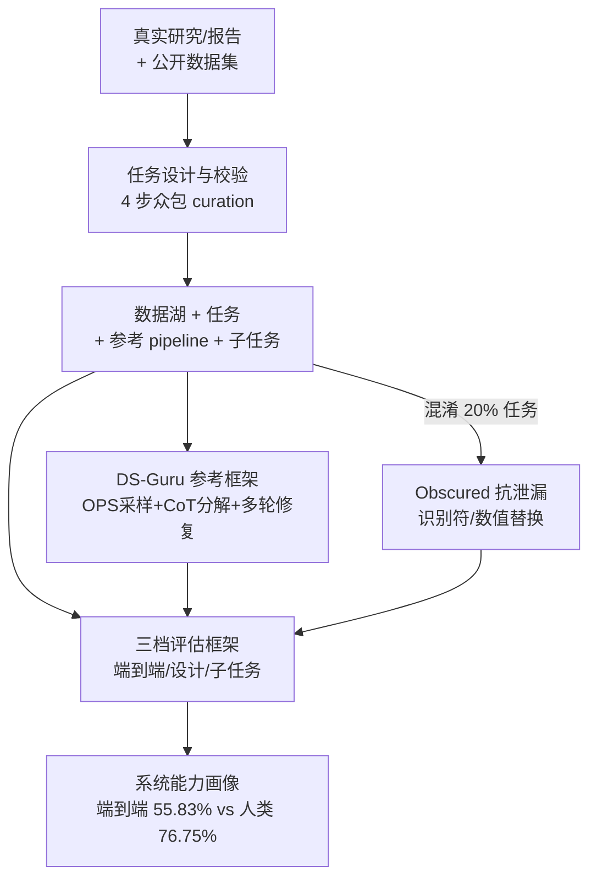

# KRAMABENCH: A Benchmark for AI Systems on Data-to-Insight Pipelines over Data Lakes

**会议**: ICLR 2026  
**OpenReview**: [https://openreview.net/forum?id=fZfUdeCC5X](https://openreview.net/forum?id=fZfUdeCC5X)  
**代码**: https://github.com/mitdbg/Kramabench (有)  
**领域**: Agent / 数据科学 Benchmark  
**关键词**: 数据湖、端到端数据科学、Agentic 系统、Pipeline 设计、评测基准

## 一句话总结
KRAMABENCH 用 6 个真实领域、24 个数据源、1700+ 文件、104 个人工精校任务，构建了一个让 AI 系统从「脏数据湖」一路走到「洞察」的端到端数据科学基准，并配套「端到端自动化 / Pipeline 设计 / 子任务实现」三档评估，结果显示最强系统在全量数据湖下端到端正确率只有 55.83%，离 76.75% 的人类基线还很远。

## 研究背景与动机
**领域现状**：从原始数据中挖掘洞察是数据科学的核心目标，一个真实的数据科学工作流要把数据发现、抽取、清洗、多源整合、分析、建模等一连串异质任务串成一条 pipeline，还得处理动辄上千个文件、半结构化甚至非结构化、带噪声且需要领域知识的数据湖。近年来 LLM 在代码生成、工具调用、问答等单点能力上进步明显。

**现有痛点**：现有数据科学基准（DS-1000、ARCADE、DA-Code、DSBench、BLADE、ScienceAgentBench 等）几乎都只考察孤立步骤——从细粒度 prompt 生成代码、text-to-SQL、给定干净输入做建模等。它们都没有「数据发现」环节，输入通常是已经挑好、清洗好的单/少文件，因此既测不出系统在大规模脏数据湖里的检索与整合能力，也测不出它能否自己把整条 pipeline 设计并跑通。

**核心矛盾**：真实数据科学的难点恰恰在于**端到端的编排**——系统要在没有人逐步喂数据的情况下，自己判断该看哪些文件、怎么清洗、怎么把多步数据依赖的推理接起来；而现有基准把这个最难的「编排」环节直接省略了，导致大家无从知道 agentic 系统到底能不能产出可运行的完整 pipeline。

**本文目标**：造一个能反映真实数据湖复杂度的端到端基准，既给出最终答案，又拆出参考子任务，使得既能评「整条 pipeline 跑没跑对」，又能定位「是哪一环（检索 / 设计 / 实现）出了问题」。

**切入角度**：作者从真实的已发表研究/报告出发，复现其中由数据分析得到的量化结论，把这些结论反推成自然语言任务，并配上专家参考 pipeline 与逐步子任务标注——这样任务天然「有据可查、有正确答案、且必然需要多步异质操作」。

**核心 idea**：把「数据湖 → 洞察」整条链路打包成一个任务，输入是**整个领域的数据湖**、输出是一个数字/字符串/列表答案，并用三档难度递减的评估把端到端失败的原因层层剖开。

## 方法详解

### 整体框架
KRAMABENCH 不是一个模型，而是一套「基准 + 评估框架 + 参考系统」。它要解决的问题是：给定一个真实领域的数据湖（成百上千个脏文件）和一句自然语言任务，系统能不能自己设计并执行一条端到端 pipeline 得到正确洞察。整套东西分四块转：**先用 4 步众包流程把真实研究反推成带参考解的任务**，每个任务再拆成若干**带标准答案的子任务**；评估时按**三档自动化程度**（端到端 / Pipeline 设计 / 子任务实现）打分，用模糊匹配指标容忍数值与字符串的近似；为了给「开箱即用 LLM」一个最小可比基线，作者还做了轻量参考框架 **DS-Guru**；最后为排查「系统是真在算还是在背答案」，对 20% 任务做了 **Obscured（混淆）输入**。

### 关键设计

**1. 4 步众包 curation：把真实研究反推成「有据可查」的端到端任务**

基准最怕任务造得假、答案对不上，或者一句话就能蒙对。KRAMABENCH 的解法是**不凭空造题，而是从已发表的、有量化/图表结论、且基于完整公开数据集的研究报告出发**，覆盖考古、天文、生物医学、环境科学、法律取证、野火防治 6 个领域。具体走 4 步严格校验：(1) **任务编写**——复现报告里的关键发现，把发现改写成问题陈述，编写者同时提供一份具体 pipeline 实现；(2) **跨贡献者交叉验证**——第二个人独立重做一遍解，第三个人对比两版解、消歧问题陈述、签入参考 pipeline 并记录执行时间；(3) **关键功能识别**——任何正确 pipeline 都必须包含的步骤（如「识别出温度所在列是 Temp」），用 GPT-o3 从参考 pipeline 草拟、再人工打磨成与具体实现无关的描述；(4) **子任务编写**——把每个关键功能转写成 prompt（用本地 Gemma3-27B 指令微调辅助 + 人工核验），并人工验证每个子任务的标准答案。最终得到 104 个任务、633 个子任务、横跨 1764 个文件（1.7GB），其中 60.58% 为「硬任务」（需多文件或 >3 步 pipeline）。这套流程保证了任务真实、答案可信、且子任务标注与端到端任务严格对齐。

**2. 三档评估框架：把端到端的「为什么失败」层层拆开**

只看端到端正确率，无法区分系统是「检索没找对文件」「pipeline 设计错」还是「单步实现写错代码」。KRAMABENCH 用一个任务的多级标注，配三档自动化程度递减的评估来定位病灶：(1) **端到端自动化**（最核心）——把整个数据湖丢给系统，输出与参考答案比，按答案类型打 $[0,1]$ 分；系统 $F$ 在领域工作负载 $W$ 上的总分为 $\text{Mean}_{T\in W}\,\text{score}(F(T))$。(2) **Pipeline 设计**——给系统的 pipeline 用「关键功能」做覆盖率打分，即正确 pipeline 必含的功能里被覆盖了几成，由 LLM-as-a-judge 判定。(3) **子任务实现**——直接喂子任务的问题陈述，比对人工标准答案。打分上对不同答案类型用不同的模糊匹配指标（见 Table 3）：字符串精确用 0/1 准确率、字符串近似用 ParaPluie score、数值精确用 0/1、**数值近似用 $1/(1+\text{RAE})$**（RAE 为相对绝对误差）、列表用 F1（近似时 match>0.9 才计）。其中 LLM-as-a-judge 的字符串近似判定与人类标注一致率达 84%。这三档一对照，就能看出系统是栽在检索、设计还是实现哪一环。

**3. DS-Guru 参考框架：给「开箱即用单 LLM」搭最小脚手架**

要公平评测裸 LLM，需要一个轻量、不引入复杂 agent 设计的脚手架。DS-Guru 正是这样一个最小框架，针对裸 LLM 在数据湖上的三个硬伤各下一招：(1) **真实数据湖超出上下文窗口** → 用 **One-Pass Sampling（OPS）检索**，对每个文件做带预算、带类型标注的一次性采样（schema 摘要 + 少量行样本）喂给 LLM，复杂度随数据湖大小线性扩展但只让模型看到采样视图；(2) **任务需要多种数据操作** → 用 **CoT 提示**逼模型先把任务分解再写代码；(3) **脏数据上代码更易出零散错误** → 用 **multi-shot（few-shot）修复**，把上一轮 pipeline 的执行结果与报错回灌让模型自我纠错。它有 no-context / one-shot / few-shot 三个变体（分别是只给文件名路径、给采样片段、给采样片段+执行反馈迭代）。DS-Guru 的定位是「结构化控制流」的代表，与 smolagents 这类「让 agent 自己决定下一步」的 agentic 控制流形成对照——实验正是靠这个对照，得出「agentic 控制流是涨分主力」的核心结论。

**4. Obscured 抗泄漏输入：分清系统是在「算」还是在「背」**

公开数据集可能已进入 LLM 训练语料，系统也许靠记忆而非真做 pipeline 就答对了。作者对全部任务人工构造**混淆输入**：在不改变任务结构的前提下，把真实标识符与数值替换成合成的（如把 Los Angeles 换成虚构的「La-La Land」），保留 20% 任务作为留出集防止被训练。一条正确 pipeline 在混淆输入上仍应得到正确解，而靠记忆的系统则会失灵。实验里 smolagents-single DR 与 DS-Guru few-shot 在混淆输入上比常规/oracle 输入低 15–18%，其中 Claude 作为后端最敏感——Reflexion 基线从 62.81% 暴跌到 12.77%，强烈提示这些变体的解答严重依赖参数化先验知识。这一设计让基准能把「真本事」和「背书」分开。

## 实验关键数据

### 主实验
评估横跨 8 个 LLM、DS-Guru 三变体、smolagents（单/多 agent）以及闭源 Deep Research 系统，绝大多数实验重复 3 次报均值±标准差。全量输入（Full）下各系统总分：

| 系统 | 后端模型 | 总分(%) | 备注 |
|------|---------|---------|------|
| 人类基线* | — | 76.75 | 9 名数据科学从业者 |
| smolagents DR（单 agent） | Claude-3.7 | **55.83** | 全量下最强 |
| smolagents Reflexion（多 agent） | Claude-3.7 | 55.37 | 仅比单 agent 低 0.45% |
| DS-Guru few-shot | GPT-o3 | 24.98 | 结构化控制流最强变体 |
| smolagents PDT | Claude-3.7 | 12.01 | Planner+分解+执行 |
| DS-Guru no-context | GPT-o3 | 5.87 | 只给文件名 |

即使给 Oracle（只喂 gold 文件、免去检索），最强系统也只到 62.81%（Reflexion+Claude-3.7）；Trimmed 设置下 OpenAI 在线 Deep Research 靠联网搜索拿到 58.12%。检索并非头号瓶颈——只给 gold 文件相比全量仅提升 0–7%（DS-Guru 平均 +6.38%）。

### 消融实验

| 配置 | 关键指标 | 说明 |
|------|---------|------|
| OPS 采样行数 10→150 | 总分 22.58~24.68% | 加大采样几乎不涨分，瓶颈不在样本量 |
| Full → Obscured (Claude Reflexion) | 62.81% → 12.77% | 混淆后暴跌，重度依赖参数化知识 |
| Full → Obscured (DS-Guru few-shot GPT-o3) | 24.98% → 23.02% | GPT-o3 相对更稳 |
| 端到端 vs Pipeline 设计 vs 子任务 (GPT-o3 few-shot) | 24.98 / 37.99 / 22.05 | 设计能力 > 端到端 > 实现 |

### 关键发现
- **agentic 控制流是涨分主力**：smolagents DR 在所有领域稳超 DS-Guru（55.83% vs 24.98%）。原因不在单步实现，而在它能「检索-修订-重试」地迭代理解大数据湖、并修正 pipeline 设计选择；DS-Guru few-shot 即便迭代加到 20 轮也只是微涨。
- **简单的多 agent 协调没带来增益**：Reflexion（actor→evaluator→reflection）比单 agent 仅差 0.45%，说明 evaluator 式协调对数据密集型工作流帮助有限，需要更专门的多 agent 设计。
- **能力画像高度异质**：LLM 能在粗粒度上推理 pipeline（设计分最高 41.71%），但细粒度数据依赖推理是软肋——单个简单子任务实现也常失败，子任务实现最高仅 22.05%；GPT-o3 擅长设计（39.75%）却拙于实现（10–22%），DeepSeek-R1 则相反，单模型方案难以可靠覆盖真实数据科学所需的全部异质技能。
- **跨领域差异大**：最强系统（Reflexion）在考古仅 41.67%、野火高达 65.38%，差异主要来自各领域强调的数据任务类型不同。
- **失败两大根因**：① 细粒度数据依赖推理（如没察觉数据里埋的「M」代表缺失值）；② 对数据湖缺乏整体理解——agent 过度依赖先验（混淆输入下最高 43.06% 性能波动）或假设用户会给澄清（24% 失败源于此）。

## 亮点与洞察
- **「从真实研究反推任务」的造题法**很值得复用：天然保证任务有据可查、有唯一正确答案、且必然需要多步异质操作，避免了人工编题易脏、易蒙的问题。
- **三档评估 + 子任务标注**是这篇最巧的设计：用同一套任务的多级标注，把端到端这个黑箱拆成「检索 / 设计 / 实现」三段，直接定位 agentic 系统的真实短板（实现 << 设计），这种「分层诊断」思路可迁移到任何端到端 agent 基准。
- **Obscured 输入**是检测数据泄漏的轻量利器：不改任务结构只换标识符，就把「真做 pipeline」和「背训练语料」干净地区分开，Claude 的 62.81%→12.77% 暴跌极具说服力。
- 一个反直觉结论：检索不是数据湖任务的头号障碍（Oracle 仅 +0~7%），真正卡脖子的是细粒度数据依赖推理与对数据湖的整体理解。

## 局限与展望
- **绝对规模偏小**：104 个任务、6 个领域，虽精校但覆盖面有限，且部分闭源系统结果（带*）因 API 成本/模型下线无法重复 3 次，statistical 稳健性打折。
- **闭源 Deep Research 的联网无法严格关闭**：作者尽力指示其不联网搜索但「无法强制」，OpenAI DR 的 58.12% 部分来自 web search，与 off-line 系统不完全可比。
- **评估依赖 LLM-as-a-judge**：字符串近似与 pipeline 覆盖率都用 LLM 评判（一致率 84%），存在评判噪声；自定义指标如 ParaPluie、$1/(1+\text{RAE})$ 的边界行为需谨慎解读。
- **改进方向**：作者指出 evaluator 式多 agent 收益甚微，提示需要为数据密集型工作流设计更专门的多 agent 分工；以及把「检索-修订-重试」的紧耦合反馈机制做得更系统。

## 相关工作与启发
- **vs DS-1000 / ARCADE / DA-Code / DataSciBench**：它们从细粒度 prompt 生成代码、输入是挑好的少量文件，没有数据发现环节；KRAMABENCH 把整个脏数据湖作为输入、强制端到端编排，难度与现实度都更高。
- **vs DSBench / BLADE / ScienceAgentBench**：这些在数据语义、领域知识、pipeline 设计、端到端等维度只「部分满足」或缺失（见 Table 1）；KRAMABENCH 是首个在数据发现、多文件整合、数据清洗、pipeline 设计、端到端评估上全部打勾的基准。
- **vs smolagents / Reflexion / PDT 等 agent 系统**：本文不提新 agent，而是把它们当被测对象，用统一基准对照「结构化控制流（DS-Guru）」与「agentic 控制流（smolagents DR）」，给出「agentic 控制流是端到端涨分主力、简单 evaluator 协调几乎无增益」的实证结论，对 agent 系统设计有直接指导意义。

## 评分
- 新颖性: ⭐⭐⭐⭐⭐ 首个把「脏数据湖→洞察」整条链路 + 三档分层诊断打包的端到端数据科学基准
- 实验充分度: ⭐⭐⭐⭐⭐ 8 LLM × 多系统 × 三输入模式 × 三档评估 + 抗泄漏混淆 + 人类基线，分析极其扎实
- 写作质量: ⭐⭐⭐⭐☆ 结构清晰、表格信息密度高，但系统/设置命名繁多需反复对照
- 价值: ⭐⭐⭐⭐⭐ 清晰暴露当前 agentic 系统在真实数据科学上的差距（55.83% vs 76.75%），是 data agent 方向的硬基准

<!-- RELATED:START -->

## 相关论文

- [\[ICLR 2026\] CoDA: Agentic Systems for Collaborative Data Visualization](coda_agentic_systems_for_collaborative_data_visualization.md)
- [\[ICLR 2026\] Open Data Synthesis for Deep Research](open_data_synthesis_for_deep_research.md)
- [\[ICLR 2026\] Repurposing Synthetic Data for Fine-grained Search Agent Supervision](repurposing_synthetic_data_for_fine-grained_search_agent_supervision.md)
- [\[ICLR 2026\] Towards Multimodal Data-Driven Scientific Discovery Powered by LLM Agents](towards_multimodal_data-driven_scientific_discovery_powered_by_llm_agents.md)
- [\[ICLR 2026\] Expanding the Capability Frontier of LLM Agents with ZPD-Guided Data Synthesis](expanding_the_capability_frontier_of_llm_agents_with_zpd-guided_data_synthesis.md)

<!-- RELATED:END -->
