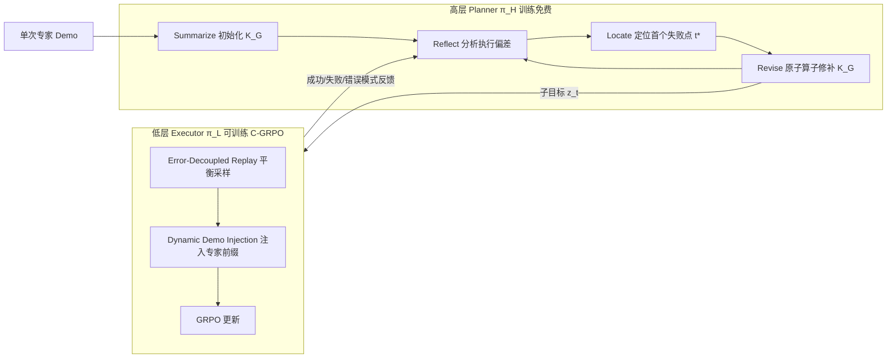

# K²-Agent: Co-Evolving Know-What and Know-How for Hierarchical Mobile Device Control

**会议**: ICLR 2026  
**OpenReview**: [https://openreview.net/forum?id=9BKg0BAWrb](https://openreview.net/forum?id=9BKg0BAWrb)  
**代码**: 待确认  
**领域**: LLM Agent / 移动设备控制 / GUI Agent  
**关键词**: Mobile Device Control, Hierarchical Agent, Declarative & Procedural Knowledge, GRPO, Self-Evolution  

## 一句话总结
K²-Agent 借鉴人类「知道是什么（declarative）」与「知道怎么做（procedural）」两套认知系统，用一个高层 planner 跑 SRLR 自进化循环演化任务知识、低层 executor 用课程式 C-GRPO 学操作技能，二者闭环协同进化，仅靠原始截图和开源 7B/72B 骨干就在 AndroidWorld 上拿到 76.1% 成功率的新 SOTA。

## 研究背景与动机
- **领域现状**：移动设备控制 agent 大致分两派——训练免费派（精心设计 prompt/工作流，把任务知识塞进上下文，开发便宜但性能被闭源基座卡死、改不了顽固错误）和学习派（在大量标注数据上做 SFT/RL，分布内动作稳但长程信用分配难、任务泛化差）。近期趋势是把「推理」与「执行」分层（planner–executor），实践中确实比扁平策略强。
- **现有痛点**：大多数层级化设计只是**结构上的拆分**——要么两层都训练免费，要么两层都用 SFT/RL 统一训练，导致系统要么依赖大量人工设计、要么需要 10k+ 样本和上百张 GPU。把高层策略学习（知道做什么）和低层动作执行（知道怎么做）混在一个单体策略里训练，二者的最优更新规则其实并不一样。
- **核心矛盾**：know-what 是符号化、可言说、能从一两个 demo 里总结并通过回忆精炼的知识；know-how 是隐式的「肌肉记忆」，难以言说、只能靠反复练习获得。把两者强行用同一套更新规则学习，既不高效也不泛化。
- **本文目标**：用一个低成本（每任务 1 个 demo + 单台 8×A100）、纯截图输入的框架，同时把声明性知识和程序性知识学好且能跨模型/跨任务泛化。
- **核心 idea**：**「know-what 与 know-how 天然匹配层级化设计，应该用不同更新规则、并通过持续交互协同进化」**——高层 planner 训练免费、靠 SRLR 循环演化语言形式的任务知识库；低层 executor 可训练、靠 C-GRPO 演化参数化技能；二者通过单步子目标正向通信、通过执行反馈反向修订知识，形成「思考」与「实践」互相强化的闭环。

## 方法详解

### 整体框架
K²-Agent 是两层 Planner–Executor 架构，每层各由一个 VLM 初始化。高层 planner $\pi_H$（Qwen2.5-VL-72B，训练免费）维护一个声明性知识库 $K_G$，不直接操作环境，而是查 $K_G$ 把全局任务 $g$ 分解为一串即时单步子目标 $z_t$；低层 executor $\pi_L$（Qwen2.5-VL-7B，可训练）在增广状态 $s'_t=(o_t,g,z_t)$ 下产出原子动作。两模块闭环协进化：子目标 $z_t$ 是正向通信，executor 的成功/失败/错误模式作为反馈被 planner 用来修订 $K_G$；更准的 $K_G$ 让 planner 生成更可执行的子目标，从而给 executor 提供更结构化的探索问题与更有效的学习信号。整体采用交替更新 $(\text{SRLR}_H)^n \to \text{C-GRPO}_L$，实验取 $n=3$。

### 关键设计
**1. SRLR 自进化循环：让声明性知识从一个 demo 滚雪球。** 高层 planner 通过 Summarize–Reflect–Locate–Revise 四阶段循环演化 $K_G$，整个循环由 VLM 自身完成、只需单条专家轨迹 $T^d$ 启动。Summarize 阶段一次性蒸馏出结构化初始知识库 $K_G^0=\text{Summarize}(T^d,g;\theta_H)$，把核心逻辑、关键 UI 元素及其功能写成规则/分步 checklist。执行新轨迹 $T^e$ 后，Reflect 在两个粒度上工作：步级持续核对每个动作结果是否符合 $K_G$ 预期以即时发现偏差；任务级在 episode 失败时生成根因解释 $M_{case}$（如「没认出 Rename 按钮」）。Locate 把执行轨迹与 $K_G$ 对齐，找出第一个产生意外结果的决策点 $t^*=\min\{t\mid \text{Verify}(s^e_{t+1},a^e_t,K_G,t;\theta_H)=\text{False}\}$。最后 Revise 用四个原子算子（Add 补缺步、Delete 删错误指令、Update 改参数、Highlight 强调约束）对 $K_G$ 做局部「手术」，得到 $K'_G$。循环迭代让任务知识越用越准。

**2. Error-Decoupled Replay Balancing：按错误类型分池采样治样本失衡。** C-GRPO 观察到动作级错误可解耦为**类型错误**（该 click 却预测 swipe）和**参数错误**（click 了但坐标不准）。对输入 $i$ 让 $\pi_L$ 生成 $G$ 个候选，用二值奖励 $r(a,\hat a)=\mathbb{1}[\text{type}(a)=\text{type}(\hat a)\wedge\|\text{coord}(a)-\text{coord}(\hat a)\|_2<\epsilon]$ 估出两个错误率：类型错误率 $\eta_{type}(i)$ 和（类型对但坐标偏）参数错误率 $\eta_{param}(i)$。据此把每个输入动态分到三个回放池——常规池 $D_{con}$、类型探索池 $D_{type}$、精度优化池 $D_{param}$，再按预设比例 $\{\beta_{con},\beta_{type},\beta_{param}\}$ 组 mini-batch，保证模型在不同弱点上均衡进步，缓解 click 等常见操作远多于 long-press/swipe 的偏置。

**3. Dynamic Demonstration Injection：用退火的专家前缀引导稀疏奖励下的探索。** 在 (V)LLM 巨大的文本×屏幕动作空间里，光靠回放平衡仍难自发发现正确动作序列、奖励长期稀疏。该机制给输入前置可变长度的专家原子动作前缀，注入长度 $l=L_h(k,d_i)=L\cdot\sigma(k)\cdot f_{gate}(d_i)$，其中 $\sigma(k)=\max(0,1-k/K_{max})$ 是随训练步 $k$ 线性退火的调度器，$f_{gate}(d_i)=\tanh(d_i/T)$ 是温度 $T$ 控制的难度门控，难度分 $d_i=\eta_{type}(i)+\eta_{param}(i)$。直觉是：对当前难样本给更多引导、随训练推进逐步断奶。这显著提高生成成功轨迹的概率，为策略优化提供更密更优的信号，最终 C-GRPO 目标把这些课程策略接进标准 GRPO 的 clip 目标 $J_{C\text{-}GRPO}$，优势 $\hat A_{i,t}$ 来自基于式(5)稠密二值专家匹配奖励的组内相对估计。

## 实验关键数据

### 主实验表格（AndroidWorld，116 任务 / 20 app，人类专家约 80%）

| 类型 | Agent | 基座 | 输入 | SR (%) |
|------|-------|------|------|--------|
| 训练免费 | Agent S2 | Claude-3.5-Sonnet | Screenshot | 54.3 |
| 训练免费 | MobileUse | Qwen2.5-VL-72B | Screenshot | 62.9 |
| 训练免费 | FinalRun | GPT-5 | Screenshot+A11y | 76.7 |
| 学习派 | UI-Venus | Qwen2.5-VL-72B | Screenshot | 65.9 |
| 学习派 | Mobile-Agent-v3 | Qwen-VL based | Screenshot | 73.3 |
| 学习派 | UI-TARS-2 | Seed-thinking-1.6 | Screenshot | 73.3 |
| 学习派 | AutoGLM-Mobile | AutoGLM-Mobile | Screenshot+A11y | 75.8 |
| **Ours** | **K²-Agent** | **Qwen2.5-VL (72B+7B)** | **Screenshot** | **76.1 ± 1.0** |

仅用原始截图就超过所有开源学习派和受限于截图输入的闭源模型，与用 A11y tree 额外信息的 FinalRun(GPT-5) 持平。

### 消融实验表格（AndroidWorld）

| 配置 | SR (%) |
|------|--------|
| No Hierarchy（扁平端到端） | 35.3 |
| No Hierarchy + SRLR | 58.6 |
| SRLR + SFT-Low | 62.0 |
| SRLR + GRPO-Low | 68.9 |
| K²-Agent (Full, SRLR + C-GRPO) | 76.1 |

逐级提升清晰隔离了各组件贡献：加 SRLR 声明知识 +23.3，引入层级结构 +3.4，GRPO 交互学习 +6.9，C-GRPO 课程策略再 +7.2。

### 关键发现
- **双重泛化**：声明性知识 $K_G$ 是语言形式、模型无关——直接复用到 Qwen-2.5-72B/32B、GPT-4o、Gemini-2.5-Pro 四种骨干上均显著涨点（如 Qwen-2.5-72B 35.0→76.7，+41.7）；程序性技能可跨基准——AndroidWorld 训练的 executor 零样本迁移到 ScreenSpot-v2 拿 91.3% 总精度、到 AitW-General 拿 86.5%，超过 DigiRL 等 RL/SFT 方法。
- **C-GRPO 两组件**：Dynamic Demonstration Injection 影响最大，去掉后奖励大幅下降且训练剧烈震荡，说明专家前缀对早期发现成功行为、稳定后续自生 rollout 至关重要；去掉 Error-Decoupled Replay Balancing 则收敛变慢、终值略低。
- **效率**：planner 每任务仅 1 个 demo，executor 基于 7B 开源骨干、单台 8×A100 训练，远低于动辄 10k+ 样本、上百 GPU 的同类方法。

## 亮点与洞察
- 把认知科学中 declarative/procedural 双系统的区分，干净地映射到 planner/executor 的「不同更新规则 + 协同进化」上，理论动机和工程实现罕见地一致。
- SRLR 的 Locate 用「第一个 Verify 失败点」做精确定位，再用 Add/Delete/Update/Highlight 四原子算子做局部手术，让非参数知识演化既可控又可解释。
- C-GRPO 把动作误差解耦成类型 vs 参数两类、分池均衡采样，是对 GUI grounding 场景奖励信号的一个很贴合的工程洞见。

## 局限与展望
- 高层 planner 用 72B 闭源/重型 VLM 推理，部署成本仍不低；声明知识依赖每类任务一条人工录制的 demo，全新任务类型的冷启动仍需人介入。
- 协同进化采用固定的 $(\text{SRLR}_H)^3\to\text{C-GRPO}_L$ 交替模式，$n$ 与交替节奏靠经验设定，缺少自适应调度。
- 评测主要集中在 AndroidWorld 及其迁移，真机环境的动态干扰、弹窗、网络波动等鲁棒性未充分检验；ScreenSpot-v2 上 icon 类（尤其 Mobile-Icon 80.6）仍落后于专精 grounding 的 UI-Venus-Ground-72B。

## 相关工作与启发
- **训练免费 agent**（AppAgent、Agent S2 等）擅长利用基座固有知识，但自我改进多为非参数的记忆编辑，性能被基座封顶；K²-Agent 用非参数 SRLR 演化声明知识、同时用 C-GRPO 参数化提升执行技能，是混合路线。
- **学习派 agent**（UI-TARS、UI-Venus、CogAgent 等）多训练单体策略，把 know-what 和 know-how 混在一起学；本文核心区别就是显式解耦两套学习过程、各用专门更新规则，从而更数据高效且泛化更好。
- 对 GUI/具身 agent 的启发：当任务同时需要「想清楚做什么」和「精确做出来」时，与其堆一个大模型端到端硬学，不如按知识类型分层、让可言说的部分走轻量自进化、让肌肉记忆部分走 RL，并让二者闭环互喂。

## 评分
- 新颖性: ⭐⭐⭐⭐ 认知双系统映射到层级 agent 的「不同更新规则 + 协同进化」框架清晰且少见，SRLR 与 C-GRPO 各有具体创新。
- 实验充分度: ⭐⭐⭐⭐ AndroidWorld SOTA + 双重泛化（跨骨干/跨基准）+ 逐级消融 + 参数敏感性，证据链完整；真机鲁棒性与更广 benchmark 覆盖可加强。
- 写作质量: ⭐⭐⭐⭐ 动机—方法—实验逻辑顺畅，公式与图示到位，知识演化案例放附录略影响主文自洽。
- 价值: ⭐⭐⭐⭐ 纯截图 + 开源骨干 + 单服务器达 SOTA，对低成本可泛化的移动 GUI agent 有较强实用与方法论价值。

<!-- RELATED:START -->

## 相关论文

- [\[ICLR 2026\] Do Large Language Models Know What They Are Capable Of?](do_large_language_models_know_what_they_are_capable_of.md)
- [\[ICLR 2026\] How Dark Patterns Manipulate Web Agents](how_dark_patterns_manipulate_web_agents.md)
- [\[ICLR 2026\] MobileRL: Online Agentic Reinforcement Learning for Mobile GUI Agents](mobilerl_online_agentic_reinforcement_learning_for_mobile_gui_agents.md)
- [\[ICLR 2026\] AlphaAgentEvo: Evolution-Oriented Alpha Mining via Self-Evolving Agentic Reinforcement Learning](alphaagentevo_evolution-oriented_alpha_mining_via_self-evolving_agentic_reinforc.md)
- [\[ICLR 2026\] M²-Miner: Multi-Agent Enhanced MCTS for Mobile GUI Agent Data Mining](m2-miner_multi-agent_enhanced_mcts_for_mobile_gui_agent_data_mining.md)

<!-- RELATED:END -->
