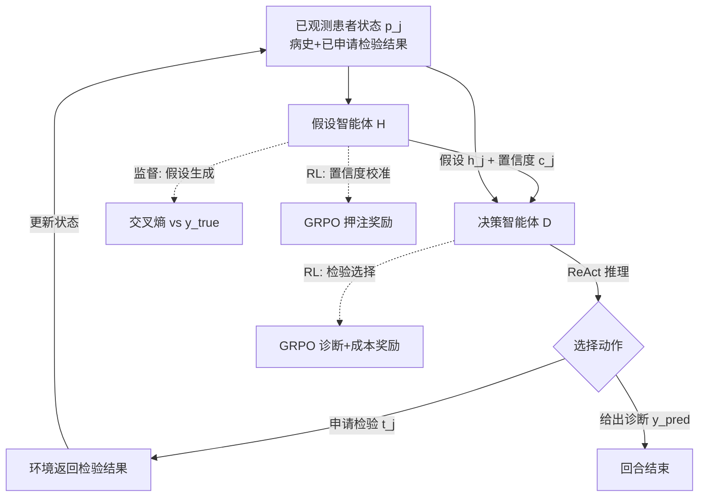

# Language Agents for Hypothesis-driven Clinical Decision Making with Reinforcement Learning

**会议**: ICLR 2026  
**OpenReview**: [https://openreview.net/forum?id=7vHUQCMAzG](https://openreview.net/forum?id=7vHUQCMAzG)  
**代码**: [https://github.com/dharouni/LA-CDM](https://github.com/dharouni/LA-CDM)  
**领域**: LLM Agent / 临床决策  
**关键词**: 临床决策, 鉴别诊断, 假设驱动, 不确定性校准, GRPO, 多智能体  

## 一句话总结
把临床鉴别诊断建模成"假设智能体 + 决策智能体"的两体循环系统，用监督 + 强化学习的混合范式同时训练准确假设生成、置信度校准与高效检验选择，让 LLM 像医生一样边查边推、在最低检验成本下逼近正确诊断。

## 研究背景与动机
**领域现状**：LLM 在医学执照考试、病例挑战上已展现强劲表现，且大多数医学信息（病史、影像报告、化验结果）都能用文本表达，天然适合 LLM 处理，因此把 LLM 用于临床决策支持成为热门方向。

**现有痛点**：现有工作几乎都落入两个极端之一。一类（如 McDuff、Chen 的工作）假设**所有患者信息在诊断之初就全部可得**，完全不建模真实临床里"逐步揭示信息"的交互过程；另一类（如 Hager、Nori 的工作）则**只依赖大模型开箱即用的零样本能力**，不做任何任务特定训练，结果诊断表现明显逊于临床医生。

**核心矛盾**：真实临床决策是一个**动态、迭代、循环**的鉴别诊断过程——医生先对患者形成若干假设，再通过申请并解读检验来逐步降低不确定性、收窄可能疾病空间，直到置信度足够高才下诊断。研究设定与真实流程的这种错位，限制了 LLM 真正落地临床。

**本文目标**：显式建模并训练 LLM 执行临床决策，让模型学会"在合适时机申请最有信息量的检验、并在足够自信时给出诊断"，同时把检验成本纳入考量。

**核心idea**：**【假设驱动 + 不确定性感知】** 受医生认知研究启发，设计双智能体系统复刻临床两大认知任务——假设智能体形成最可能诊断并估计置信度，决策智能体据此决定继续检验还是下诊断；**【混合训练范式】** 用监督微调教假设准确性、用强化学习教置信度校准与高效检验选择，因为最优检验路径无法事先标注，只能靠经验式试错学习。这是已知首个显式训练 LLM 做临床决策的方法。

## 方法详解

### 整体框架
LA-CDM 由两个共享 LLM 权重的语言智能体构成，在一个临床决策强化学习环境中循环运行：每个时间步，**假设智能体** $H$ 读入当前已观测患者状态 $p_j$，输出最可能诊断 $h_j$ 及 0–10 的置信度 $c_j$；**决策智能体** $D$ 拿到 $\{p_j, h_j, c_j\}$，用 ReAct 先产出推理链再决定是申请新检验 $t_j$（更新患者状态进入下一步）还是直接给出诊断 $y_{pred}$ 结束本回合。训练围绕临床决策的三大原则展开：假设生成（监督）、置信度校准（RL）、高效检验选择（RL），三者**循环交替单独训练**而非同时优化，以换取更稳定的收敛。

### 关键设计

**1. 临床决策环境与双智能体分工：把"边查边诊"建模成可交互的 RL 环境**。每位患者由 $n$ 份文本检验记录 $[t_i]_{i=1}^n$（临床笔记、影像报告、化验面板）描述，初始状态 $p_0$ 仅含症状、病史与家族史，模型每申请一项检验，环境就把对应结果追加进观测状态。假设智能体负责"想"——基于有限信息映射 $H: p_j \to \{h_j, c_j\}$，按"Hypothesis: $h_j$, Confidence: $c_j$"格式输出；决策智能体负责"行"——映射 $D: \{p_j, h_j, c_j\} \to t_j \text{ 或 } y_{pred}$，是真正推进环境的执行者。由于是回顾性数据、并非每位患者每项检验都齐全，当模型申请到不存在的检验时，环境会告知不可用并要求改选其他动作；输出格式越界或申请表外检验/疾病同样会被要求重选。两个智能体共享权重，因此训练其中一个也会牵动另一个。

**2. 假设生成的监督微调：用真实诊断当锚点教模型"先猜对最可能的病"**。准确假设是好决策的基线——一旦模型知道最可能的候选诊断，就能针对性地设计检验去快速确认或排除它。训练时收集一个患者批次内所有回合里展示给模型的对话上下文（通常每位患者含多个假设生成步），把这些上下文与正确假设 $y_{true}$ 拼成目标序列做监督微调，计算交叉熵损失，但**忽略置信度位置的 token**（置信度交给 RL 校准，不在此处强行监督）。这样模型在面对各种不同检验子集组合的患者状态时，都能从有限信息里给出尽量正确的假设。

**3. 置信度校准的押注式 RL：让"说 60% 把握"真的对应 60% 正确率**。LLM 常见自信地说错的问题，临床场景尤其危险。本文沿用 Stangel 等人的"下注博弈"建模并改用 GRPO 训练：模型对自身答案正确性押注，押对且高置信得大奖、押错且高置信则重罚，答案错时反而以低置信获最大奖励。奖励函数为
$$R(y_{pred}, c, j) = \begin{cases} \log(c), & \text{若 } J(y_{pred}) \text{ 为真} \\ \log(1-c), & \text{若 } J(y_{pred}) \text{ 为假} \end{cases}$$
其中 $c$ 是缩放裁剪后的置信度，$J(\cdot)$ 为正确性判定（这里定义为预测假设 $h_j$ 是否等于真实诊断 $y_{true}$），奖励再归一化到 $[-1, 1]$。该设计的好处是无需人工构造"标准置信度"数据集，只要有正确性度量即可，且理论上最优策略产出完美校准的置信表达。

**4. 高效检验选择的成本感知 RL：在"诊断要对"和"检验要省"之间学权衡**。由于最优检验序列无法事先标注，决策智能体只能靠 GRPO 试错学习。诊断奖励对终局正确诊断给固定正奖 $r_{pos}$、错误给 $r_{neg}$、越格输出给 $r_{invalid}$：
$$R_{diag}(y_{pred}) = \begin{cases} r_{pos} & y_{pred} = y_{true} \\ r_{neg} & y_{pred} \neq y_{true} \\ r_{invalid} & \text{格式越界} \end{cases}$$
同时为了避免滥用昂贵检验（CT 远贵于一次血检），追加按成本惩罚检验使用的奖励
$$R_{cost}(T) = -\sum_{t_j \in T} c(t_j),$$
其中 $T$ 是本回合所有已做检验、$c(t_j)$ 为其成本。三个目标的相互作用，使模型学会申请那些"能最大提升假设置信度、并以最低成本导向正确诊断"的最有信息量检验。

## 实验关键数据

数据集为 **MIMIC-CDM**（MIMIC-IV 子集），含 2,400 名腹部疾病患者（阑尾炎/胆囊炎/憩室炎/胰腺炎四类），5,959 份影像报告 + 143,191 条化验结果，且提供跨患者的检验名称标准化映射（使"同一检验可跨病例查询"成为可能）。指标含各类准确率及其均值、micro/macro F1、置信度校准误差 ECE。

### 主实验表格

| 方法 | 均值准确率 | Micro F1 | Macro F1 | 平均检验成本 |
|------|-----------|----------|----------|------------|
| OASST*（零样本，不同框架） | 54.9 | - | - | - |
| SFT-all（用全部信息，近似上界） | 92.8 | 93.6 | 92.9 | $3792.79 |
| SM-DDPO†（仅表格数据） | 37.0 | 45.4 | 31.8 | - |
| ReAct（零样本决策） | 74.9 | 79.1 | 74.8 | $1480.32 |
| LA-CDM (ZS)（未训练） | 64.5 | 65.3 | 64.5 | $1521.73 |
| **LA-CDM** | **81.3** | **84.1** | **81.3** | **$1295.61** |

\* OASST 在不同测试集/框架下评测，仅供参考；† SM-DDPO 仅能处理表格数据，因缺影像信息几乎崩溃。

LA-CDM 比零样本 ReAct 准确率提升约 6 个点且**检验成本反降约 $185**；相比近似上界 SFT-all，在仅用约 1/3 检验成本下保持有竞争力的准确率。假设生成准确率由训练前 75.7% 提升到 81.9%，置信度校准 ECE 由 0.069 降到 0.037。

### 消融实验表格

| 消融设置 | 均值准确率 | Macro F1 | 平均检验成本 |
|----------|-----------|----------|------------|
| 无成本奖励 $R_{cost}$ | 82.3 | 82.4 | $1427.85 |
| **完整 LA-CDM（含 $R_{cost}$）** | 81.3 | 81.3 | **$1295.61** |
| 仅决策智能体（去掉假设智能体） | 78.5 | 78.6 | $1410.01 |
| **假设 + 决策双智能体** | **82.3** | **82.4** | $1427.85 |

成本奖励几乎不损精度却显著压低检验成本；去掉假设智能体后全指标下滑，证明假设驱动设计的价值。

### 关键发现
- **患者自适应检验策略**：疑似胆囊炎时模型 64.9% 选超声（金标准检验），疑似阑尾炎时 85.1% 选 CT，均与临床诊疗指南一致，说明模型学到了符合最佳实践的个性化检验路径。
- **显式训练 > 开箱即用**：从 LA-CDM(ZS) 到 LA-CDM 的巨大跃升，直接证明"训练临床决策"本身比依赖预训练模型固有能力更关键。
- **效率即价值**：检验成本下降直接对应更低医疗开支、更快诊断、更少患者负担。

## 亮点与洞察
- **认知科学驱动的架构设计**：双智能体精准对应医生"形成假设"与"决定行动"两大认知任务，把鉴别诊断的循环本质显式编码进系统结构，而非堆 prompt。
- **三目标循环交替训练**：作者发现同时优化三个目标不稳定，改成每个目标单独训练若干 episode 再轮换，是一个朴素却实用的稳定化技巧。
- **置信度校准纳入闭环**：把"知道自己不知道"作为决策依据而非附属指标，置信度直接服务于"何时停止检验下诊断"的决策，思路干净。
- **效率与精度的真实权衡**：在回顾性临床数据上把检验成本作为一等公民，结果既贴近真实医疗经济约束又可解释（ReAct 推理链让检验路径可追溯）。

## 局限与展望
- **回顾性数据的探索受限**：训练数据中不同患者缺不同检验，且可用检验仅限当年主诊医生实际做过的那些，模型只能在"专家演示过的检验协议"内学得更高效（如跳过冗余检验），**无法发现全新临床策略**。
- **缺失检验无法满足**：模型申请到数据集中不存在的检验时只能被告知不可用并改选，限制了可探索的检验路径广度；作者提出用模拟生成不可得检验数据来构建更完整的决策环境。
- **窄疾病空间**：实验仅四类腹部疾病，向更大、更复杂的鉴别诊断空间扩展时的可扩展性仍待验证。
- **部署需强约束**：作为医疗决策支持系统，需可解释、对齐医学指南、监控训练数据偏见，且定位应是辅助而非替代临床医生。

## 相关工作与启发
- **RL 做成本高效临床决策**：SM-DDPO 用 Q-learning 迭代申请化验并兼顾成本，但仅限表格数据、忽略笔记与影像；ED-Copilot 用语言模型编码序列化化验值并两阶段训练，但语言模型并不直接申请检验、同样只用表格化验。LA-CDM 的差异在于**让 LLM 直接以文本形式申请并解读多模态检验**。
- **LLM 零样本临床决策**：Hager 等人构建 MIMIC-CDM 评测框架，揭示开箱即用 LLM 表现逊于医生；Vaid、Liu 等人用工具调用/多智能体零样本 prompting 比较 GPT-4(o)。这些工作**均未尝试显式训练临床决策**，正是本文填补的空白。
- **置信度校准与 RL**：借鉴 Stangel 等人的押注式校准奖励并改用 GRPO，把"诚实表达不确定性"无监督地训进模型，对任何需要可信置信度的高风险决策任务都有迁移价值。
- **启发**：把"领域专家的认知流程"显式拆解为可训练子目标 + 用 RL 解决"无最优标注路径"的序列决策，是一条可推广到法律、金融等高风险交互决策场景的范式。

## 评分
- **新颖性**: ⭐⭐⭐⭐ — 首个显式训练 LLM 做临床决策的方法，双智能体 + 三目标混合训练的组合在医疗 LLM 中是清晰的新设定，尽管各组件（GRPO、ReAct、押注校准）多为已有技术的巧妙拼装。
- **实验充分度**: ⭐⭐⭐⭐ — 在真实 MIMIC-CDM 上对比零样本/训练/表格基线，含成本奖励与双智能体两组消融、校准曲线与患者自适应检验证据；但仅四类腹部疾病、单数据集，规模偏窄。
- **写作质量**: ⭐⭐⭐⭐ — 动机与临床认知映射叙述清晰，方法与奖励函数定义严谨，图示直观；偏算法工程化表达。
- **价值**: ⭐⭐⭐⭐ — 在保持准确率的同时把检验成本压到上界的约 1/3，直接对应医疗降本提效，且检验路径可解释、契合临床指南，落地潜力明确。

<!-- RELATED:START -->

## 相关论文

- [\[ICLR 2026\] LLMs are Greedy Agents: Effects of RL Fine-tuning on Decision-Making Abilities](llms_are_greedy_agents_effects_of_rl_fine-tuning_on_decision-making_abilities.md)
- [\[AAAI 2026\] MoralReason: Generalizable Moral Decision Alignment For LLM Agents Using Reasoning-Level Reinforcement Learning](../../AAAI2026/llm_agent/moralreason_generalizable_moral_decision_alignment_for_llm_agents_using_reasonin.md)
- [\[ICLR 2026\] MobileRL: Online Agentic Reinforcement Learning for Mobile GUI Agents](mobilerl_online_agentic_reinforcement_learning_for_mobile_gui_agents.md)
- [\[ICLR 2026\] CoMind: Towards Community-Driven Agents for Machine Learning Engineering](comind_towards_community-driven_agents_for_machine_learning_engineering.md)
- [\[ICLR 2026\] WebSailor-V2: Bridging the Chasm to Proprietary Agents via Synthetic Data and Scalable Reinforcement Learning](websailor-v2_bridging_the_chasm_to_proprietary_agents_via_synthetic_data_and_sca.md)

<!-- RELATED:END -->
