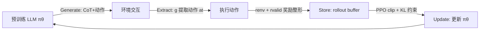

# LLMs are Greedy Agents: Effects of RL Fine-tuning on Decision-Making Abilities

**会议**: ICLR 2026  
**OpenReview**: [https://openreview.net/forum?id=weUP6H5Ko9](https://openreview.net/forum?id=weUP6H5Ko9)  
**代码**: BanditBench 环境基于 Nie et al. (2024) 开源实现  
**领域**: llm_agent  
**关键词**: LLM agent, 决策制定, 探索-利用, RL 微调, Chain-of-Thought, 贪婪偏置, knowing-doing gap  

## 一句话总结
本文系统剖析了 LLM 在简单决策场景（多臂老虎机、上下文老虎机、井字棋）中表现欠佳的三种核心失败模式——贪婪、频率偏置、知行差距，并证明在自生成 CoT 推理上做 RL 微调（RLFT）能显著增加探索、缩小知行差距。

## 研究背景与动机

**领域现状**：LLM 的成功催生了将其用作智能体（agentic AI）的热潮，一个关键假设是 LLM 凭借"世界知识"和 Chain-of-Thought（CoT）推理，无需大量环境交互就能高效探索并解决复杂决策问题。

**现有痛点**：然而现实并非如此。Krishnamurthy et al. (2024)、Nie et al. (2024) 等工作发现，LLM 智能体并不能稳健地进行探索，在 grid-world、Atari 等交互环境中表现常常只比随机策略略好。前人把这些缺陷笼统归因于 **knowing-doing gap（知行差距）**——模型"知道"该怎么做（能描述行为后果），但"做"的时候却用不上这份知识。

**核心矛盾**：问题在于前人只是观察到"表现差"这个现象，缺乏对**为什么差**的细粒度、可量化的诊断。决策能力的缺陷究竟是一种笼统的失败，还是由几种可分离、可定位的具体偏置叠加而成？如果不拆开看，就无从对症下药。

**本文目标**：系统性地解释 LLM 为何在简单决策场景中表现欠佳，把模糊的"探索不足"拆解为可量化的具体失败模式，并验证 RL 微调能否缓解这些模式。

**核心 idea**：作者用最干净的多臂老虎机（MAB）作为放大镜，精确量化出三种**相互独立**的失败模式——**贪婪（greediness）**、**频率偏置（frequency bias）**、**知行差距（knowing-doing gap）**；并提出在**模型自生成的 CoT 推理**上施加 RL 微调（RLFT），把高奖励的推理-动作模式强化回模型，从而拓宽探索、弥合知行差距。**【定位：这是一篇以"诊断 + 验证"为主、而非"刷性能"的分析型工作。】**

## 方法详解

### 整体框架
本文方法分两条线：**诊断线**用受控的 MAB 上下文精确测量三种失败模式；**干预线**用 RLFT 在自生成 CoT 上做强化微调来缓解这些模式。RLFT 的核心循环是：让预训练 LLM $\pi_\theta$ 在环境中以 CoT 形式生成"推理 + 动作"，把交互轨迹存入 rollout buffer，再用带 KL 约束的 PPO 目标，把通往高奖励的推理-动作模式强化回模型。

### 关键设计

**1. 三种失败模式的可量化诊断：把"探索不足"拆成三把尺子。** 作者拒绝把决策缺陷当成一团模糊的"表现差"，而是用 MAB 这一只隔离了探索-利用权衡的最简设定，定义三个可计算的指标分别度量三种偏置。**贪婪**用动作覆盖率 $C_t = \frac{|\{a\in A: N_t(a)>0\}|}{|A|}$ 衡量——即到第 $t$ 步为止被选过至少一次的动作占全部动作的比例；实验发现 Gemma2 2B 仅覆盖 40% 的动作、9B/27B 覆盖 65%，且 10 步后覆盖率就停滞，说明模型过早锁定到当前已知最优动作。**频率偏置**通过构造重复历史（把某动作重复 0–100 次）观察动作熵的变化来量化：2B 模型熵随重复次数单调下降（相关系数 −0.67，96% 的动作是"最频繁动作"），即不管奖励高低都倾向复制上下文里出现最多的动作；27B 则基本摆脱了频率偏置（仅 14%）。**知行差距**用一个混淆矩阵刻画：让模型先算出 UCB 量（"knowing"）、再据此选动作（"doing"），结果 87% 的推理是正确的，但即便推理正确，模型仍有 58% 的概率选"贪婪动作"而非真正最优动作（仅 21%）。这三把尺子让后续干预的效果变得可测。

**2. 在自生成 CoT 上做 RLFT：强化"推理→动作"而非死记动作。** 干预的关键在于强化的对象是模型**自己生成**的 CoT 推理链，而非外部专家动作。每步交互时模型生成 $z_t = [z^{CoT}_t; a_t]$，既含推理 token 又含待执行动作，用正则提取函数 $a_t = g(z_t)$ 抽出动作（提不出则随机执行）。微调目标采用带额外 KL 约束的 PPO clip 目标：

$$\max_\theta \mathbb{E}_{(c,z)\sim D}\Big[\min\big(\tfrac{\pi_\theta(z|c)}{\pi_{\theta_{old}}(z|c)}A_{adv},\ \text{clip}_\epsilon(\tfrac{\pi_\theta(z|c)}{\pi_{\theta_{old}}(z|c)})A_{adv}\big) - \beta D_{KL}(\pi_\theta(\cdot|c)\|\pi_{ref}(\cdot|c))\Big]$$

其中 $\pi_{ref}$ 是冻结的预训练模型。对固定回合长度的老虎机，用 Monte-Carlo 的 rewards-to-go 估计优势 $A_{adv}$ 以节省显存；对变长回合的井字棋，则在最后一层加状态值头并用 GAE。消融实验（Figure 9b）显示，去掉 CoT 后 RLFT 几乎只能勉强追平"带 CoT 的 ICL"，证明 CoT 是探索与理性化的核心机制——RLFT 强化的正是"先推理再行动"这条链路。

**3. 有效动作的奖励整形：用 −5 惩罚把模型钉在合法动作上。** 由于 LLM 生成的动作可能不符合输出模板（导致无法解析），作者在环境奖励之外加了一个整形项 $r_t = r^{env}_t + r^{valid}_t$，其中 $r^{valid}_t = -5 \cdot \mathbb{1}(g(a_t)\notin A)$——只要提取不出合法动作就扣 5 分。为避免这个惩罚过度主导优化，对环境奖励做归一化。这一设计看似工程细节，却在后续"探索机制"实验里被进一步放大成方法论洞见：仅给"未尝试动作"加 +1 探索奖励（exploration bonus），就能把动作覆盖率从 50% 拉到 70% 并显著降低 regret，凸显**奖励整形对引导 LLM 决策行为的关键作用**。

## 实验关键数据

实验在 Gemma2（2B/9B/27B）上展开，环境为高斯/伯努利多臂老虎机（5/10/20 臂，低/中/高噪声）、上下文老虎机、文本版井字棋；Llama3、Qwen2.5 上的复现见附录，结论一致。

### 主实验：RLFT 降低累积 regret（中噪声 σ=1）

| 设置 | 现象 |
|------|------|
| MAB 5/10/20 臂 | LLM 明显优于随机基线；RLFT 进一步降低 2B 和 9B 的累积 regret |
| 2B + RLFT | 缩小了与更大模型及 UCB 上界的差距 |
| 上下文老虎机 | 2B 经 RLFT 后取得类似的性能提升 |
| 井字棋（vs 随机对手） | 平均回报从 0.15（胜率 15%）提升到 0.75 |
| 井字棋（vs 最优 MCTS） | 从 −0.95 提升到 0.0（能逼平最优对手） |

### 三种失败模式的量化诊断

| 失败模式 | 关键数据 |
|----------|----------|
| 贪婪 | 10 臂下 2B 仅覆盖 40% 动作、9B/27B 覆盖 65%；20 臂下最大模型仅覆盖 45%；无 CoT 时全部仅探索 25% |
| 频率偏置 | 2B 96% 动作为"最频繁动作"（相关 −0.67）；27B 仅 14%，基本摆脱但转为贪婪 |
| 知行差距 | 87% 推理正确，但推理正确时仍有 58% 选贪婪动作、仅 21% 选最优动作 |

### 干预 / 消融关键发现
- **RLFT 缓解贪婪**：2B 经 30K 步微调后动作覆盖率 +12%（中途 10K 步先降后升）。
- **RLFT 抵消频率偏置**：0–10 重复区间"频繁动作"占比 70%→35%，"其他动作"8%→35%；但高重复区仍偏高，未完全消除。
- **探索机制对比**：try-all（先试所有动作）带来大幅提升；exploration bonus（未试动作 +1）把覆盖率 50%→70%。
- **CoT 不可或缺**：去掉 CoT 的 RLFT 几乎只能追平带 CoT 的 ICL。
- **专家数据有效**：用 UCB 专家数据（32K rollout / 1.6M transition）做 SFT，无论带不带 CoT 都能逼近 UCB 的 regret。
- **思考时间**：生成预算 G 从 256 增到 512，2B 性能可达"9B + RLFT"水平，但 rollout 生成会主导训练耗时。

## 亮点与洞察
- **把"LLM 不会探索"这句空话钉成三根可测的钉子**。贪婪/频率偏置/知行差距三者相互独立、各有量化指标，这种"诊断学"框架本身比 RLFT 涨点更有价值，为后续智能体设计提供了可对症的靶点。
- **知行差距首次被精确量化**：87% 知道 vs 58% 做错，这个对比把"模型不是不知道、而是不肯做最优动作"这一直觉变成了硬数据。
- **强化自生成 CoT 而非克隆专家**：RLFT 强化的是模型自己的推理链，配合 CoT 消融（去掉就退化到 ICL 水平）说明 CoT 在决策中扮演"探索 + 理性化"的双重角色。
- **奖励整形的杠杆效应**：一个简单的 +1 探索 bonus 就能把覆盖率拉 20 个百分点，提示 LLM 智能体的探索短板很大程度上能用环境侧的奖励设计弥补。
- **直接的工程启示**：作者明确指出，做工具调用 / 代码智能体时，初期应**限制可用工具的广度**，以规避模型预先存在的贪婪偏置。

## 局限与展望
- **模型规模受限**：仅在 2B–27B 的中小模型上验证，作者承认前沿大模型上的行为仍需研究。
- **horizon 偏短**：MAB 仅 50 步交互，对 5/10 臂够用，对 20 臂明显不足，导致部分 regret 比较出现"假象"。
- **RLFT 非万灵药**：作者反复强调本文目标是诊断而非刷性能，RLFT 后探索仍然次优于经典老虎机算法，远未"解决"问题。
- **计算成本**：增加思考 token 虽提升性能，但因决策任务的多步特性，rollout 生成会占据大部分训练时间；作者建议探索 Mamba/RWKV 类高效推理架构。
- **展望**：把诊断推广到需要"定向探索"的有状态环境、computer-use benchmark，以及引入内在奖励（curiosity）机制驱动自主探索。

## 相关工作与启发
- **探索机制谱系**：与 RL 经典探索（ε-greedy、计数、内在好奇心、最大熵）和 LLM 特定探索（self-correction、self-consistency、context summary）一脉相承，本文把两类机制放进统一对比。
- **与 Krishnamurthy et al. (2024) / Nie et al. (2024) 的区别**：前者研究 LLM 作为策略的 in-context 探索、后者研究在专家轨迹上微调，本文则聚焦 **RLFT** 对探索能力的影响并追问"为何失败"。
- **copycat bias 的呼应**：小模型的频率偏置与行为克隆里的 copycat bias 同源，暗示这是监督预训练的产物，正是用 RL 反制的动机。
- **对 agent 设计的启发**：失败模式诊断 + 奖励整形的组合，给"如何让 LLM 智能体真正会探索"提供了可操作的设计原则，而非又一个黑箱方法。

## 评分
- **新颖性**: ⭐⭐⭐⭐ 把模糊的"LLM 决策差"系统性拆解为三种可量化的独立失败模式，诊断学视角新颖；RLFT 本身是已有技术的组合，但"强化自生成 CoT"的分析角度有价值。
- **实验充分度**: ⭐⭐⭐⭐ 跨三类环境、三种模型规模、多种噪声/臂数，外加 Llama3/Qwen2.5 复现与 7 种探索机制对比，诊断指标设计严谨；扣分在 horizon 偏短、未上前沿大模型。
- **写作质量**: ⭐⭐⭐⭐ 逻辑清晰（先诊断后干预），三个失败模式的定义和图示干净易懂，诚实地把自己定位为分析型工作而非刷榜。
- **价值**: ⭐⭐⭐⭐ 为 LLM 智能体研究提供了可对症的"病理学"框架和直接的工程建议（限制初始工具广度、重视奖励整形），对构建会探索的 agent 有实际指导意义。

<!-- RELATED:START -->

## 相关论文

- [\[ICLR 2026\] AgentGym-RL: An Open-Source Framework to Train LLM Agents for Long-Horizon Decision Making via Multi-Turn RL](agentgym-rl_an_open-source_framework_to_train_llm_agents_for_long-horizon_decisi.md)
- [\[ICLR 2026\] Language Agents for Hypothesis-driven Clinical Decision Making with Reinforcement Learning](language_agents_for_hypothesis-driven_clinical_decision_making_with_reinforcemen.md)
- [\[ICLR 2026\] Agent Data Protocol: Unifying Datasets for Diverse, Effective Fine-tuning of LLM Agents](agent_data_protocol_unifying_datasets_for_diverse_effective_fine-tuning_of_llm_a.md)
- [\[ICML 2026\] Post-Training LLMs as Better Decision-Making Agents: A Regret-Minimization Approach](../../ICML2026/llm_agent/post-training_llms_as_better_decision-making_agents_a_regret-minimization_approa.md)
- [\[CVPR 2026\] CGL: Advancing Continual GUI Learning via Reinforcement Fine-Tuning](../../CVPR2026/llm_agent/cgl_advancing_continual_gui_learning_via_reinforcement_fine-tuning.md)

<!-- RELATED:END -->
