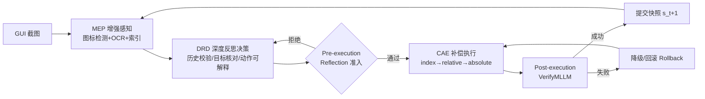

# LongHorizonUI: A Unified Framework for Robust Long-Horizon Task Automation of GUI Agent

**会议**: ICLR 2026  
**OpenReview**: [https://openreview.net/forum?id=BK7Mk5d4WE](https://openreview.net/forum?id=BK7Mk5d4WE)  
**代码**: [https://kane2kang.github.io/LongHorizonUI/](https://kane2kang.github.io/LongHorizonUI/)  
**领域**: GUI Agent / LLM Agent / 长程任务自动化  
**关键词**: GUI Agent, Long-Horizon, MLLM, 增强感知, 反思决策, 补偿执行  

## 一句话总结
LongHorizonUI 用「增强感知 + 三层闭环反思决策 + 多级补偿执行」三件套，把无需训练的 MLLM GUI agent 在 15 步以上长程任务里的成功率拉高，并配套发布了平均 22 步的长程基准 LongGUIBench。

## 研究背景与动机
**领域现状**：多模态大模型（MLLM）驱动的 GUI agent 在点击搜索框、跳转页面这类短程任务上已相当成熟，AndroidControl 上 5 步以内任务平均成功率超过 90%。

**现有痛点**：作者在 AndroidControl 上按序列长度分桶评测多个 SOTA（InfiGUI-R1、UI-TARS-1.5、AgentCPM-GUI 等），发现性能随步数呈**非线性塌缩**——超过 10 步跌破 75%，超过 15 步只剩约 60%。同时主流基准（AndroidControl 平均 6.8 步、AITW 8.2 步）几乎都是短程任务，根本无法暴露这个问题。近期用在线 RL 试错来提升适应性的路线，反而会放大动作空间、让长程上的累积误差雪上加霜。

**核心矛盾**：长程任务的本质难点是**跨步上下文一致性**——agent 一旦丢失对历史状态依赖的把握，单步小错就会沿轨迹指数放大，最终整个系统崩溃；而现有方法既缺乏可靠的状态表征，也缺乏执行出错后的自纠机制。

**本文目标**：设计一个能在长程动作序列中维持上下文连贯与决策精度的 GUI agent，并提供能真正考核长程能力的评测基准。

**核心 idea**：**免训练、纯推理时增强**——不去微调 backbone，而是在「感知—决策—执行」三个环节都加入显式的结构化约束与容错回路：感知端给 UI 元素打稳定索引、决策端强制三层校验、执行端用多级坐标降级 + 回滚兜底。

## 方法详解

### 整体框架
LongHorizonUI 是一条免训练的闭环流水线：先由 **Multimodal Enhanced Perceiver (MEP)** 融合图标检测与 OCR，把截图抽象成带唯一索引的元素集合；再由 **Deep Reflection Decider (DRD)** 用严格 JSON Schema 驱动 MLLM 做「历史校验—目标核对—动作可解释」三层闭环推理并输出候选动作；最后由 **Compensating Action Executor (CAE)** 按 index→relative→absolute 三级降级把动作落到具体像素，配合实时进度监控，出错时补偿或回滚。

### 关键设计

**1. Multimodal Enhanced Perceiver：把截图变成带稳定锚点的索引化元素表**。长程任务里界面会反复变化，纯视觉 grounding 容易因为微小布局抖动而失锚，因此 MEP 让图标检测器与 OCR 并行跑，检测器产出 $E_{ui}=\{(id_i, b_i, c_i)\}_{i=1}^{N}$（唯一空间标签、bbox、置信度），OCR 产出 $E_{text}=\{(t_j, b_j)\}_{j=1}^{M}$。针对「图标+文字」这类复合控件，用语义绑定函数把两者缝合：$\hat{e}_i=\Phi(e_i, E_{text})$，当最大重叠文本框满足 $\text{IoU}(b_i, b_{j^*})\geq\tau$ 时绑定文本，否则保留纯图标项。索引 $id_i$ 作为跨步稳定锚点，使后续决策可以直接用「点 index 13」而非脆弱的坐标来指代元素。为防止弹窗关闭键这类关键元素漏检，还设了一个**模板兜底匹配器**：仅在弹窗角、底栏等高优先区域 $A_{priority}$ 触发修复函数 $R$，用关闭/确认/返回等标准图标模板库 $T$ 补回被漏掉的元素，避免单个漏检卡死整条轨迹。

**2. Deep Reflection Decider：用 JSON Schema 把决策拆成三层闭环反思**。MLLM 直接生成动作时容易级联误传，于是 DRD 强制 MLLM 按固定字段（`historical_status / import_contents / think / Execute_goal / action`）输出，前三个字段做反思、后两个字段做决策。三层分别是：①**历史校验**——`historical_status` 借 OCR/图标检测核对 UI 状态迁移（按钮是否激活、文本是否输入成功），检测到报错弹窗或无响应元素就触发根因分析；②**目标核对**——`import_contents` 抽取屏幕关键信息、过滤噪声，验证 MLLM 对当前环境的理解；③**动作可解释**——`think` 要求 MLLM 依次分析当前 UI、失败原因、定位依据（如「按钮 #12 交互置信度最高」）。落地前还有一道**准入门**：$\phi(s_t, a\mid G_t, T)=\mathbb{1}[g_{tg}(a)\in G_t]\wedge\mathbb{1}[K(d_{action})\subseteq K(T)]=1$，即只有当目标元素存在于当前屏幕、且动作语义被任务描述蕴含时才放行，否则拒绝并触发一次轻量修订。

**3. Compensating Action Executor：三级坐标降级 + 进度触发回滚**。MLLM 的自由文本输出与可执行像素坐标之间存在「语义—物理」鸿沟，CAE 用一套优先级降级策略来兜底。归一化坐标经设备感知缩放矩阵 $S=\text{diag}(W_{screen}, H_{screen})$ 映射为物理像素 $p=S\cdot(x_{norm}, y_{norm})^\top$，保证同一指令在不同分辨率下落点一致。执行时按 $\Pi=[\text{index}\to\text{relative}\to\text{absolute}]$ 三级尝试：先点元素质心 $p_0$（index）；若失败，在 bbox 内按 $\lambda_w,\lambda_h\sim U[0,1]$ 均匀采样落点（relative）；再失败则用绝对屏幕坐标并加有界扰动 $\|\epsilon\|_\infty\leq 5\text{px}$ 以逃离边缘/遮挡（absolute）。每次执行后由 DRD 做后验校验 $v_t=\text{VerifyMLLM}(s_t, a, p_t, I_{t+1})\in\{0,1\}$，成功则提交快照 $(s_{t+1}, p_t)$，全部候选失败时调用 $\text{Rollback}(s_{t-1}, p_{t-1})$ 退回上一个已提交状态，维持长程鲁棒性。

### LongGUIBench 基准
作者同时构建了 LongGUIBench：371 个场景（13 款游戏的 207 个 + 15 个 App 的 147 个任务链），全部要求 ≥15 步（平均 22.1 步，最长 37 步），由 6 名专业测试人员通过动作-录屏同步采集、跨模态对齐与标准化解析得到。每个任务含高层（HL，宏观目标）与低层（LL，原子操作）两级指令，并标注控件类型、bbox、状态属性等细粒度 UI 元数据。

## 实验关键数据

### 主实验表格（LongGUIBench 长程任务，SR=成功率，TM=轨迹匹配）

| 模型 | General-Low SR | General-High SR | Game-Low SR | Game-High SR | Avg |
|------|------|------|------|------|------|
| GPT-4o | 20.8 | 4.2 | 23.9 | 3.7 | 49.1 |
| Gemini2.5 | 73.3 | 25.7 | 57.7 | 25.7 | 67.3 |
| Qwen2.5-VL-7b | 82.7 | 29.3 | 72.8 | 27.4 | 67.4 |
| AgentCPM-GUI | 81.2 | 37.1 | 66.5 | 25.8 | 68.6 |
| UI-TARS-1.5 | 79.2 | 21.8 | 69.5 | 18.9 | 65.8 |
| **LongHorizonUI** | **85.3** | **52.3** | **83.9** | **52.1** | **77.3** |

相比 SOTA（UI-TARS-1.5），General 场景下低层指令 +6.1%、高层指令 +30.5%；高层指令上的巨大提升说明结构化反思对宏观目标分解尤其关键。

### 其他基准
- **ScreenSpot grounding**：平均 90.4%，超过前 SOTA UI-TARS 2.9%，在 mobile/desktop/web 的 Text/Icon 子项上大多领先。
- **导航（AndroidControl + GUI-Odyssey）**：平均 SR 65.5%，AndroidControl-High SR 54.2%（较 Qwen2.5-VL-7B +6.4%），GUI-Odyssey +6.1%，较强基线 GUI-R1-7B 平均 +2.3%，证明长程增强未牺牲短程能力。

### 消融实验表格

| 配置 | 对完成率影响 |
|------|------|
| 完整（Icon + OCR + 自适应网格） | 基线最高 |
| 去掉图标检测器 | 步完成率 −6.1% |
| 去掉 OCR | −2.3%（复合控件频繁出错） |
| 去掉自适应网格 | 高分辨率小元素易漏检 |
| 仅 index 执行 | 81.4%（已优于其它单一动作模式） |
| + relative | +1.2% |
| + absolute | +2.5% |
| + historical 坐标 | +3.9% |

### 关键发现
- 现有方法在 >15 步时塌缩到约 60%，而 LongHorizonUI 把临界衰减点延后、在 18 步内仍保持竞争力。
- 补偿动作是叠加增益：index 已是最强单模式，逐级加 relative/absolute/historical 坐标持续提升，验证「容错坐标变换 + 历史空间线索」的互补性。
- 全程免微调，纯推理时增强即可超越经过 GUI 专门训练的基线。

## 亮点与洞察
- **问题定义到位**：用「序列长度分桶 + 非线性塌缩曲线」量化了长程崩溃现象，并配套造了真正长程（平均 22 步）的基准，把一个被短程基准掩盖的问题暴露出来。
- **索引化状态表征**：以稳定 `index` 替代脆弱坐标作为跨步锚点，是让长程指代保持一致的关键工程抽象。
- **三级降级 + 回滚的工程鲁棒性**：把「点不准」这一执行层失败显式建模为可降级、可回滚的闭环，而非寄希望于模型一次到位。
- **零训练落地友好**：所有组件即插即用、不依赖微调，迁移成本低。

## 局限与展望
- **延迟问题**：整条流水线高度依赖 MLLM 多次调用（决策 + 多次后验校验），继承了 MLLM pipeline 的延迟，长程任务下调用次数可观；作者计划用蒸馏、量化、上下文感知的 prompt 压缩来提效。
- **基准规模与多样性**：LongGUIBench 371 个场景由少数专业测试者采集，覆盖面与标注一致性仍有扩展空间。
- **依赖外部感知模块**：图标检测器/OCR 的质量直接决定索引可靠性，弱感知场景下模板兜底也可能失效。
- **高层指令仍是短板**：Game-High/General-High 的绝对成功率仍仅 ~52%，宏观目标分解的长程一致性远未解决。

## 相关工作与启发
- **对比在线 RL 路线**：与靠环境交互生成训练数据的 RL 方法（试错放大动作空间、累积误差）不同，本文走推理时结构化约束 + 容错执行的免训练路线，对长程更友好。
- **延续 GUI grounding 工作**：感知层借鉴 OmniParser 等的元素解析思路，但补充了 ID 中心抽象与高优先区域模板修复。
- **启发**：①把「执行失败」当一等公民显式建模（降级 + 回滚）是长程 agent 的通用范式，可迁移到 web/desktop agent；②用 JSON Schema 强制 MLLM 分离「反思」与「决策」字段，是低成本提升决策可控性的有效手段；③评测基准的步长分布决定了能否暴露长程问题，做 agent 研究需警惕短程基准的幸存者偏差。

## 评分
- **新颖性**: ⭐⭐⭐⭐ — 单个组件（索引化感知、结构化反思、坐标降级）多为已有思路的工程组合，但「免训练三件套专攻长程崩溃 + 配套长程基准」的整体框架定位清晰、问题切口新。
- **实验充分度**: ⭐⭐⭐⭐ — 覆盖自建长程基准 + ScreenSpot + AndroidControl + GUI-Odyssey 四套评测，主实验/消融/案例齐全；但缺少延迟开销的定量分析、backbone 仅用单一 MLLM。
- **写作质量**: ⭐⭐⭐⭐ — 动机与方法叙述清晰、图表完整，公式与算法伪代码到位；个别拼写与排版小瑕疵。
- **价值**: ⭐⭐⭐⭐ — 长程 GUI 自动化是落地刚需，免训练 + 即插即用使其工程价值较高，LongGUIBench 也为社区补上了长程评测缺口。

<!-- RELATED:START -->

## 相关论文

- [\[ICLR 2026\] The Tool Decathlon: Benchmarking Language Agents for Diverse, Realistic, and Long-Horizon Task Execution](the_tool_decathlon_benchmarking_language_agents_for_diverse_realistic_and_long-h.md)
- [\[CVPR 2026\] MMBench-GUI: A Unified Hierarchical Evaluation Framework for Multi-Platform GUI Agents](../../CVPR2026/llm_agent/mmbench-gui_a_unified_hierarchical_evaluation_framework_for_multi-platform_gui_a.md)
- [\[ACL 2026\] Don't Act Blindly: Robust GUI Automation via Action-Effect Verification and Self-Correction](../../ACL2026/llm_agent/don39t_act_blindly_robust_gui_automation_via_action-effect_verification_and_self.md)
- [\[ICLR 2026\] MEM1: Learning to Synergize Memory and Reasoning for Efficient Long-Horizon Agents](mem1_learning_to_synergize_memory_and_reasoning_for_efficient_long-horizon_agent.md)
- [\[ICLR 2026\] Unlocking Long-Horizon Agentic Search with Large-Scale End-to-End RL](unlocking_long-horizon_agentic_search_with_large-scale_end-to-end_rl.md)

<!-- RELATED:END -->
