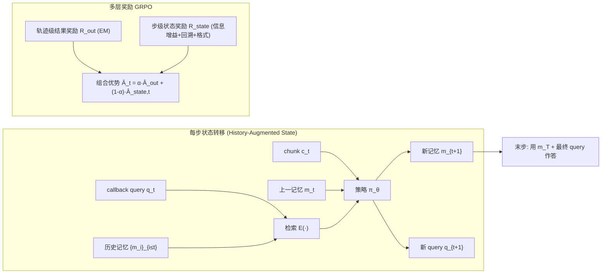

# Look Back to Reason Forward: Revisitable Memory for Long-Context LLM Agents

**会议**: ICLR 2026  
**OpenReview**: [https://openreview.net/forum?id=1cymflI2Lh](https://openreview.net/forum?id=1cymflI2Lh)  
**代码**: [https://github.com/syr-cn/ReMemR1](https://github.com/syr-cn/ReMemR1)  
**领域**: llm_agent  
**关键词**: long-context QA, memory agent, memory callback, GRPO, multi-level reward, non-linear reasoning  

## 一句话总结
ReMemR1 在"边读边记"的内存智能体里塞进一个可回溯的记忆检索机制——智能体每步在更新当前记忆的同时还生成一条 callback query 去搜自己的历史记忆，再配一套轨迹级+步级的多层奖励来稠密化 RL 信号，从而以可忽略的算力代价（<0.2% 时间开销）把长上下文多跳推理的错误率降了 20%+。

## 研究背景与动机

**领域现状**：长上下文 QA 里关键证据可能散落在数百万 token 中，注意力的二次复杂度让 LLM 很难追踪长程依赖。两条主流路线：一是 **全文检索（Full-Text Retrieval）**，把相关 chunk 拉进 prompt，但给模型的是碎片化局部信息且向量索引存储负担重；二是 **"边读边记"（memorize while reading）**，让记忆智能体顺序消化文档，每步把上一记忆 $m_t$ 和当前 chunk $c_t$ 压缩成新记忆 $m_{t+1}$，单次线性扫描后用最终记忆 $m_T$ 作答，把复杂度压到线性。

**现有痛点**：作者指出"边读边记"范式有三个内生缺陷——
- **潜在证据被过早剪枝**：标准内存智能体只凭当前记忆状态 $m_t$ 判断当前 chunk 重要性，但多跳推理常常要等读到后文（第 $t+k$ 步）才意识到早期证据（第 $t$ 步）的价值，此时它早被覆盖丢掉了。这无法靠改进更新策略解决——证据相关性本身依赖尚未出现的未来上下文。
- **覆盖式更新导致渐进信息丢失**：固定长度记忆缓冲区逼迫不断压缩，越往后早期证据被压缩、丢弃得越狠，难以综合跨远距离段落的证据。
- **稀疏延迟的监督信号**：训练这类智能体一般只用"最终答案对不对"这一个奖励，对中间一长串记忆更新几乎没有指导，优化低效。

**核心矛盾**：MDP 结构假设 $m_t$ 是历史的充分统计量，强制单向前进、不可回头——但长程多跳推理本质需要"回看"。

**本文目标**：在保持线性扫描效率的前提下，让智能体能按需回溯历史记忆、构造非线性推理路径，并解决 RL 监督稀疏问题。

**核心 idea**：**[把检索机制嵌入记忆更新过程]** 把状态从 $s_t=m_t$ 扩展为 $s_t=(m_t,q_t)$，其中 $q_t$ 是一条对全部历史记忆 $\{m_i\}_{i\le t}$ 做检索的 callback query；同时 **[设计多层奖励]** 用轨迹级结果奖励 + 步级状态奖励稠密化训练信号。

## 方法详解

### 整体框架
ReMemR1 把传统单向 MDP 记忆智能体升级为"带回溯的记忆智能体 + 多层奖励 GRPO 训练"两件套。每步智能体既更新记忆又生成 callback query 去检索历史记忆，检索结果并入下一步状态；训练时把最终答案正确性的轨迹奖励和衡量每步信息增益的步级奖励分别归一化后组合成 GRPO 优势。

### 关键设计

**1. 历史增强状态：把"回溯检索"塞进 MDP 转移函数。** 传统记忆智能体的转移是 $m_{t+1}=\pi_\theta(Q,c_t,m_t)$，记忆一旦被覆盖就再也找不回来。ReMemR1 给状态加上一个 query 分量 $s_t=(m_t,q_t)$，并配一个检索函数 $\mathcal{E}$，转移变为 $s_{t+1}=(m_{t+1},q_{t+1})=\pi_\theta\big(Q,c_t,m_t,\mathcal{E}(\{m_i\}_{i\le t},q_t)\big)$。检索用的是基于词重叠的轻量 recall——$\mathcal{E}(X,b)=\arg\max_{x\in X}\mathrm{recall}(b,x)$，其中 $\mathrm{recall}(a,b)$ 是 $a$ 中也出现在 $b$ 里的词的比例。这样智能体每步不仅基于新 chunk 更新记忆，还生成下一步的 callback query $q_{t+1}$ 去够到过去的记忆 $\{m_i\}_{i\le t}$，检索到的内容并入上下文参与下一次状态更新。query 随记忆一起演化，让智能体能逐步精炼自己的检索策略，从而打破不可逆的前向约束、构造非线性推理路径，把早期被忽略的关键事实重新捞回来与新证据连接。

**2. 步级状态奖励：用"信息增益"和"回溯收益"做稠密 behavior shaping。** 针对监督稀疏，作者从两个观察出发：GRPO 对同一 query 有多条 rollout 探索不同路径；同一步 $t$ 不同轨迹看到的外部上下文 $(Q,c_t)$ 相同但内部状态 $s_t$ 不同。于是设计三类步级奖励。**信息增益奖励**衡量记忆从 $m_{t-1}$ 更新到 $m_t$ 时对 ground-truth 答案 $Y$ 的召回变化：$r_{\text{memory},t}=\max_{y\in Y}\mathrm{recall}(m_t,y)-\max_{y\in Y}\mathrm{recall}(m_{t-1},y)$，若新记忆装进更多与答案直接相关的信息就给正奖励，直接对抗渐进信息丢失。**回溯奖励**衡量 callback 检索到的内容相对"当前记忆+当前上下文"额外带来的召回：$r_{\text{callback},t}=\max_{y\in Y}\mathrm{recall}\big(y,\mathcal{E}(\{m_i\}_{i\le t},q_t)\cup m_t\cup c_t\big)-\max_{y\in Y}\mathrm{recall}(y,m_t\cup c_t)$，鼓励有意义的检索而非无脑回看。再加一个 **格式奖励** $r_{\text{format},t}$ 检查中间步 `<callback>`/`<memory>` 标签和末步 `\box{}` 答案标签。三者求和得 $R_{\text{state},t}=r_{\text{memory},t}+r_{\text{callback},t}+r_{\text{format},t}$。

**3. 轨迹级结果奖励 + 双尺度归一化的 GRPO 优势组合。** 结果奖励用精确匹配衡量最终答案：$R_{\text{out}}^{(g)}=\max_{y\in Y}\mathbb{I}(\hat y^{(g)}=y)$。关键在于两类奖励按各自尺度归一化——结果奖励在组内跨轨迹归一化得 $\hat A_{\text{out}}^{(g)}$，状态奖励则在**同一时间步 $t$ 的所有轨迹之间**归一化得 $\hat A_{\text{state},t}^{(g)}$（利用了"文档 chunk 序列在所有 rollout 同一步完全相同"这一隔离性质，可精准分离出记忆更新与回溯动作的贡献而不受环境噪声干扰），均省去标准差项以免引入难度偏置。最终优势 $\hat A_t^{(g)}=\alpha\hat A_{\text{out}}^{(g)}+(1-\alpha)\hat A_{\text{state},t}^{(g)}$，超参 $\alpha$ 平衡全局结果与局部步级监督，默认 $\alpha=0.8$。

## 实验关键数据

### 主实验表格（HotpotQA ID + 2WikiMultiHopQA OOD，准确率 %）

| 数据集 | 模型 | 方法 | 50 docs | 400 docs | 1600 docs | 6400 docs |
|---|---|---|---|---|---|---|
| HotpotQA (ID) | 3B | MemAgent | 70.3 | 68.8 | 60.2 | 58.8 |
| HotpotQA (ID) | 3B | **ReMemR1** | **70.9** | **74.0** | **65.0** | **66.1** |
| HotpotQA (ID) | 7B | MemAgent | 81.8 | 77.0 | 72.1 | 75.8 |
| HotpotQA (ID) | 7B | **ReMemR1** | **82.3** | **78.9** | **79.7** | **80.8** |
| 2Wiki (OOD) | 3B | MemAgent | 41.4 | 39.4 | 28.9 | 25.9 |
| 2Wiki (OOD) | 3B | **ReMemR1** | **53.5** | **41.7** | **36.2** | **37.8** |
| 2Wiki (OOD) | 7B | MemAgent | 61.7 | 47.6 | 44.5 | 44.7 |
| 2Wiki (OOD) | 7B | **ReMemR1** | **63.9** | **54.5** | **45.4** | **50.3** |

各尺度/数据集/上下文长度全面领先，相比 MemAgent 在 3B/7B 上最高分别提升 7.3%/7.6%；上下文越长优势越明显（长文档里关键证据更易被覆盖/忽略），OOD 上提升更大说明学到的是真正的检索推理能力而非数据集模式记忆。

### 消融实验表格（α 取值对 HotpotQA 准确率的影响，3B）

| α | 50 | 200 | 400 | 800 | 6400 |
|---|---|---|---|---|---|
| 1.0（仅结果奖励） | 70.3 | 61.5 | 59.6 | 60.9 | 63.3 |
| **0.8（默认）** | 70.9 | **63.8** | **74.0** | **65.4** | **66.1** |
| 0.5 | 71.7 | 62.2 | 66.1 | 63.0 | 65.4 |
| 0.2 | 68.8 | 55.9 | 62.5 | 53.5 | 52.0 |

$\alpha=0.8$ 在各长度上整体最优：纯结果奖励（1.0）丢掉稠密步级指导，过度步级（0.2）又分散对最终正确性的优化。

**RL-driven vs 规则回溯**：用问题 $Q$ 本身作固定 query 的规则回溯（MemAgent + rule-based callback）反而常常拖累 MemAgent（HotpotQA 6400 docs：规则 60.9 vs ReMemR1 66.1），证明"学出来的自适应 query"远胜固定规则。

### 关键发现
- **算力开销可忽略**：6400 文档下回溯延迟 <2s、额外内存 <1MB（<0.2% 时间开销），因为存的是紧凑的模型生成摘要而非原始文档；训练时每步延迟略增（1467 vs 1247 s）、峰值显存基本持平（131 vs 125 GB）。
- **远距离证据挑战**：把证据按推理顺序逆排、强制相邻证据间隔 >半数文档，MemAgent 因无法回看急剧退化，ReMemR1 大幅领先，证明回溯设计在需要跨长跨度协调证据时尤其稳健。
- **以边际算力换鲁棒推理**：<5% 绝对准确率提升对应 ~20% 错误率下降。

## 亮点与洞察
- **问题诊断精准**：把"边读边记"的失败拆成"过早剪枝/覆盖丢信息/监督稀疏"三条，且指出前两条无法靠单纯改更新策略解决——必须打破 MDP 单向性，这个 framing 很到位。
- **轻量但对症**：回溯检索用的是 word-overlap recall 这种朴素手段，存的是压缩摘要而非全文，所以几乎零额外存储/延迟，却恰好补上了固定长度记忆的最大短板。
- **奖励归一化的巧思**：利用"同一步外部上下文在所有 rollout 完全相同"的隔离性质，把状态奖励在**同一时间步跨轨迹**归一化，干净地分离出记忆更新与回溯的贡献——这是把领域结构吃进 RL 设计里的好例子。

## 局限与展望
- **检索函数过于朴素**：基于词重叠的 recall 在同义/跨语言/语义改写场景下可能失效，换成语义检索能否进一步提升值得探。
- **奖励依赖 ground-truth 实体召回**：信息增益/回溯奖励都用 $\mathrm{recall}(\cdot,y)$ 计算，训练时需要可枚举的答案集 $Y$，在答案开放或生成式任务上如何泛化是开放问题。
- **评测局限于 HotpotQA/2Wiki 两个多跳 QA**：上下文靠随机文档 padding 构造，与真实长文档（法律/科研文献）的证据分布是否一致、长程依赖的真实结构性是否被覆盖，仍需更多数据集验证。

## 相关工作与启发
- **vs MemAgent（边读边记的代表）**：本文是其直接升级——保留线性扫描，但在更新里加回溯检索 + 多层奖励，证明"加一条 callback query"就能把单向记忆变成可回溯记忆。
- **vs 全文检索 RAG**：把"检索"从外部语料挪进智能体自己的记忆历史，省掉向量索引存储负担，且检索目标是模型已压缩的摘要而非原始 chunk。
- **对 RL 训练记忆/Agent 的启发**：当环境观测序列在不同 rollout 间固定时，可以在"同一步跨轨迹"层面做奖励归一化来稠密化信号、隔离动作贡献——这个技巧可迁移到其他确定性观测的多步 agent 任务。

## 评分
- **新颖性**: ⭐⭐⭐⭐ — "把检索嵌入记忆更新打破 MDP 单向性"虽是 MemAgent 的增量，但 callback query + 步级信息增益奖励的组合干净有效，问题 framing 有洞见。
- **实验充分度**: ⭐⭐⭐⭐ — 覆盖 3B/7B、ID/OOD、50–6400 文档全谱，含远距离证据专项、算力开销、α 消融、RL vs 规则对比，5 个 RQ 闭环；略欠的是只在两个多跳 QA 上、检索仅用词重叠未试语义版。
- **写作质量**: ⭐⭐⭐⭐ — 三大痛点→两大贡献的结构清晰，公式与图配合到位，符号一致。
- **价值**: ⭐⭐⭐⭐ — 以可忽略算力换 20%+ 错误率下降，对长上下文 agent 的记忆设计有实用参考价值，代码开源。

<!-- RELATED:START -->

## 相关论文

- [\[ACL 2026\] OCR-Memory: Optical Context Retrieval for Long-Horizon Agent Memory](../../ACL2026/llm_agent/ocr-memory_optical_context_retrieval_for_long-horizon_agent_memory.md)
- [\[ICLR 2026\] MEM1: Learning to Synergize Memory and Reasoning for Efficient Long-Horizon Agents](mem1_learning_to_synergize_memory_and_reasoning_for_efficient_long-horizon_agent.md)
- [\[ICML 2026\] ACON: Optimizing Context Compression for Long-horizon LLM Agents](../../ICML2026/llm_agent/acon_optimizing_context_compression_for_long-horizon_llm_agents.md)
- [\[ACL 2026\] MemSearcher: Training LLMs to Reason, Search and Manage Memory via End-to-End RL](../../ACL2026/llm_agent/memsearcher_training_llms_to_reason_search_and_manage_memory_via_end-to-end_rein.md)
- [\[ICLR 2026\] AgentFold: Long-Horizon Web Agents with Proactive Context Folding](agentfold_long-horizon_web_agents_with_proactive_context_folding.md)

<!-- RELATED:END -->
