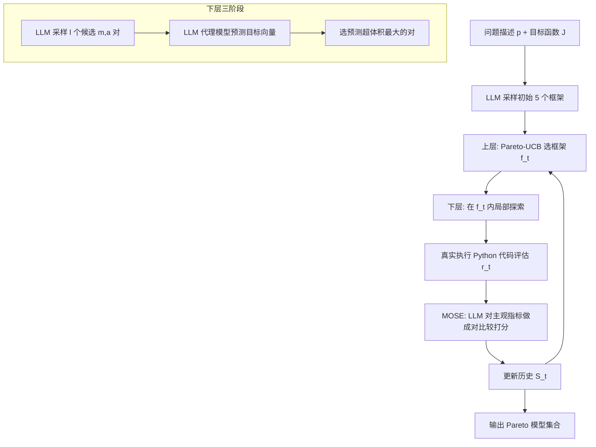

# MATHMO: Automated Mathematical Modeling Through Adaptive Search

**会议**: ICLR 2026  
**OpenReview**: [https://openreview.net/forum?id=t2fZ2GOwAT](https://openreview.net/forum?id=t2fZ2GOwAT)  
**代码**: 待确认  
**领域**: LLM Agent / 自动数学建模 / 多目标搜索  
**关键词**: 数学建模自动化, 双层自适应搜索, LLM 搜索算子, Pareto 前沿, 代理模型评估, 主观偏好建模  

## 一句话总结
把"数学建模"形式化成一个不确定性下的序贯决策问题，用 LLM 当生成算子+代理评估器，配合一个"上层选框架、下层调模型"的双层自适应搜索，自动产出一组在多个（含主观）目标上构成 Pareto 前沿的数学模型。

## 研究背景与动机
数学建模——把真实世界现象翻译成可计算的数学语言——长期依赖专家手工迭代：先选一类方法（深度学习？整数规划？动力系统？），再写出具体模型，再配算法求解，最后看效果回头改。这套流程慢且门槛高，自动化它能极大加速科学发现并降低分析建模的使用门槛。

但这件事难就难在它有三个内生特性，恰恰是常规 AutoML 处理不了的。**第一，根本性的不确定性**：哪种框架、哪种模型设定最优事先并不知道，必须靠"建模—测试—修正"的反馈循环去摸索。**第二，目标天然冲突**：求解质量 vs. 运行时间、精度 vs. 可解释性往往此消彼长，人们要的不是单一"最优模型"，而是一条代表不同权衡的模型前沿。**第三，主观品质难以量化**：Occam 剃刀、可解释性、与领域认知的契合度都影响模型的真实价值，但这些"美感"指标通常是框架专属的（线性模型的稀疏性 ≠ 符号回归的复杂度），跨框架无法直接比较。

现有工作要么是 AutoML——在**预先定义好的**狭窄搜索空间（超参、神经结构）里搜；要么是"LLM 写数学公式"——但都**假设框架已知**（已知要做凸优化/博弈论模型，只是生成具体公式）。

> **核心矛盾**：自动建模需要在一个开放、嵌套、异构、且事先无法用 DSL 定义清楚的巨大空间里搜索，同时还要平衡多个冲突目标并容纳主观偏好；而传统搜索方法既给不出这种搜索空间，也处理不了主观评价。

> **本文目标**：给定一个建模问题描述和一组目标函数，自动发现一组在这些目标上构成高效权衡（Pareto 前沿）的数学模型。

> **核心 idea**：把建模拆成"框架 f → 模型 m → 算法 a"的序贯决策，用 LLM 作为能从自然语言/代码空间采样的"生成算子"和"代理评估器"，并利用"框架间差异 > 框架内差异"这一结构先验，设计**双层**搜索——上层用 Pareto-UCB 在框架间分配探索资源，下层在选定框架内做类贝叶斯优化的局部精修。

## 方法详解

### 整体框架
MATHMO 把每一步建模视作在结构化搜索空间 $\Omega = \{(f, m, a)\}$ 上的决策，目标是最小化 $k$ 维目标向量 $J(m,a) = [J_1, \dots, J_k]^T$、求 Pareto 非支配解。它的关键观察是：可选的高层**框架**数量远小于具体模型/算法的组合，且**框架间**的性能差异（精确解 vs. 近似启发式）通常远大于同一框架**内部**的差异。于是搜索被分解成两层嵌套循环——上层决定"这一轮探索哪个框架"，下层决定"在该框架内试哪个具体 (模型, 算法) 对"，每轮评估结果回填进历史 $S$ 指导下一轮。

### 关键设计

**1. 双层自适应搜索：把"选范式"和"调细节"分开管，让反馈信号更有用。** 与其在 $(f,m,a)$ 这个嵌套异构空间里用一个扁平策略乱搜，MATHMO 显式地把上层框架决策和下层模型决策拆开。上层在每轮 $t$ 选一个框架 $f_t = \arg\max_{f} \alpha(f; S_{t-1})$，$\alpha$ 是衡量"此刻探索框架 $f$ 价值"的效用函数；下层在选定框架内求 $(m_t, a_t) = \arg\max_{(m,a)} \beta_{f_t}(m,a; S^{f_t}_{t-1})$。这种切分镜像了人类建模者的认知流程，好处是双重的：一方面不同框架往往占据 Pareto 前沿的不同区域，显式探索框架层能系统地把这些权衡都挖出来；另一方面同一框架内的建模选择结构相似（给一个动力系统加 logistic 增长项的经验，更容易迁移到另一个动力系统，而非迁移到深度网络的结构设计），所以框架内的反馈信号更纯、更可复用。

**2. LLM 作为搜索算子：用预训练先验替代无法定义的 DSL。** 一般数学建模的对象空间太大太杂，根本写不出一个完备的 DSL 或结构化搜索空间。MATHMO 干脆把 LLM 当核心算子，扮演两个角色。**生成采样器**：框架以文本描述表示、具体模型与算法以可执行 Python 代码表示，LLM 条件于问题 $p$ 采样框架 $f \sim p_\theta(\cdot \mid p)$，再条件于框架和该框架历史采样具体实现 $(m,a) \sim p_\phi(\cdot,\cdot \mid p, f, S^f)$。**代理模型**：为避免每个候选都真跑一遍，LLM 先预测候选的目标值 $\hat r \sim p_{SM}((m,a) \mid p, f, S^f)$，用低成本预测来筛选，类似贝叶斯优化里的代理函数。LLM 在海量文本+代码上预训练得到的隐式领域先验，正是引导它"在合理且可能有效的建模选择里探索"的关键。

**3. 上层 Pareto-UCB：在框架间做多目标的探索—利用平衡。** 上层效用 $\alpha$ 用 Pareto-UCB 实现：对每个框架 $f$，用其历史性能向量估计经验均值 $\hat\mu_f$ 和方差 $\hat\sigma_f^2$，再算出 UCB 向量，第 $j$ 个目标分量为

$$\text{UCB}_{f,j} = \hat\mu_{f,j} + c\sqrt{\frac{\hat\sigma_{f,j}^2 \ln(N_{t-1})}{N_{f,t-1}}} + d\sqrt{\frac{\ln(N_{t-1})}{N_{f,t-1}}}$$

其中 $N_{f,t-1}$ 是框架 $f$ 被评估的次数、$N_{t-1}$ 是总探索步数，$c,d$ 控制探索奖励。初始时每个框架被赋予无穷大 UCB，保证至少被探索一次。所有框架的 UCB 向量里取**非支配**的子集（乐观意义上的 Pareto 前沿框架），再从中随机选一个去探索——这样既照顾近期高产的框架，也给探索不足、可能藏着新前沿区域的框架机会。

**4. 下层超体积引导 + MOSE 主观评价：让局部精修有方向、让"美感"可比较。** 下层是三阶段的类贝叶斯优化：先用 $p_\phi$ 采样 $l$ 个多样候选对，再用代理模型逐个预测 $k$ 维目标向量，最后选**预测超体积**最大的那个——$\text{HV}(\tilde m, \tilde a; r_\text{ref})$ 直观上度量该候选能在归一化目标空间里支配多大区域（参考点取 $1_k$）。而对可解释性这类**主观目标**，MATHMO 设计了 MOSE（Surrogate Model Of Subjective Evaluations）：维护一个搜索开始时固定的参考模型集 $M_\text{ref}$，评估新模型时让 LLM 与每个参考模型做**成对比较**（更好记 1，否则记 0），取平均得到一个落在 $[0,1]$ 的一致分数 $\hat r = \frac{1}{|M_\text{ref}|}\sum_i p_\text{MOSE}(m_t \succ m_i \mid p)$。用成对偏好而非绝对打分，借鉴了 RLHF 的思路，既让跨框架的主观品质可比，又缓解了对参考基准选择的敏感性。

## 实验关键数据

**任务设置**：4 个真实建模任务，两个规约型（prescriptive）、两个预测型（predictive）——旅行商 TSP（路径成本 ↓ vs. 运行时间 ↓）、作业车间调度 JSS（完工时间 ↓ vs. 运行时间 ↓）、生态 Ecology（RMSE ↓ vs. 可解释性 ↑）、流行病 Epidemiology（COVID-19 意大利数据，RMSE ↓ vs. 可解释性 ↑）。每次跑 20 轮，初始 5 个框架，每次模型评估限时 300 秒，MOSE 参考集 3 个模型，LLM 用 gpt-4o-2024-05-13。

### 主实验：框架主导权衡
MATHMO 在四个任务上都成功发现了横跨多个框架的 Pareto 前沿（Figure 2）。关键现象是**不同框架占据前沿的不同区域**：JSS/TSP 上，数学优化、约束规划等精确方法逼近最优但运行时间高，元启发式/自定义启发式则速度快但解质量略低；Ecology/Epidemiology 上，向量自回归等时序预测方法预测强但可解释性低，符号回归/规则模型可解释性高。这验证了"必须跨框架探索才能拿到完整权衡前沿"的核心假设。

### 消融实验（超体积，越高越好）

| 变体 | TSP | JSS | Ecology | Epidemiology | 相对劣化 |
|------|-----|-----|---------|--------------|----------|
| **MATHMO（完整）** | **0.998** | **0.994** | 0.992 | **0.967** | — |
| MATHMO-RAN（随机选框架） | 0.972 | 0.948 | 0.992 | 0.939 | 2.55% |
| MATHMO-FLAT（去掉双层、扁平搜索） | 0.987 | 0.945 | 1.000 | 0.792 | 5.85% |
| MATHMO-NAIVE（去掉代理/超体积引导） | 0.977 | 0.973 | 0.894 | 0.713 | 10.10% |

### 关键发现
- **代理引导贡献最大**：NAIVE 变体（去掉代理模型 + 超体积选择）平均劣化 10.10%，说明下层"先预测再筛选"对样本效率至关重要。
- **双层结构有效**：FLAT 变体平均劣化 5.85%，尤其在 Epidemiology 上从 0.967 掉到 0.792，证明分层探索在难任务上价值更大。
- **Pareto-UCB 优于随机**：RAN 变体劣化 2.55%，自适应资源分配比均匀/随机分配更优。
- **MOSE 与结构复杂度负相关**：MOSE 可解释性分数与参数量、排列熵等结构/功能复杂度指标呈负相关（Spearman 最高达 -0.68），说明它确实捕捉到了"更简单 = 更可解释"的人类直觉。

## 亮点与洞察
- **问题形式化本身是贡献**：第一个把"自动数学建模"明确定义为不确定性下的序贯决策（致敬 Box's Loop），把模糊的"建模是门艺术"落成可优化的多目标搜索问题。
- **"框架间差异 > 框架内差异"这个结构先验用得巧**：它直接为双层分解提供了理论动机，也解释了为什么下层反馈信号能更有效复用。
- **MOSE 把"主观美感"工程化**：用固定参考集 + 成对比较把不可比的跨框架主观品质压成一个 $[0,1]$ 的一致分数，是这套系统能统一处理"精度 vs. 可解释性"这类混合目标的关键拼图。
- **LLM 同时身兼三职**（生成器、代理评估器、主观评判者），把"搜索空间难以定义"和"评估昂贵"两个瓶颈一起绕开。

## 局限与展望
- **代理评估的可靠性存疑**：用 LLM 预测目标值（尤其数值型如 makespan/RMSE）本身有偏差，论文虽用超体积选择缓解，但代理误差对最终前沿的影响缺乏深入量化。
- **主观评价仍是 LLM 自评**：MOSE 用 gpt-4o 模拟人类偏好，虽有少量专家对齐研究，但"LLM 认为可解释"是否等于"人类认为可解释"在大规模上未充分验证。
- **规模与成本**：20 轮、每轮多次 LLM 采样+代理+真实执行（限时 300s），整体 LLM 调用与计算开销不小，论文未系统报告成本/可扩展性。
- **任务数量有限**：核心实验仅 4 个任务（附录补了 NHANES/SEER 医疗风险预测），框架库与问题多样性还需更大规模检验。
- **单一 LLM 依赖**：全程 gpt-4o，换更弱/更强模型时系统鲁棒性如何未知。

## 相关工作与启发
- **vs. AutoML**：传统 AutoML（超参优化、NAS、特征工程）在预定义 DSL 上搜；MATHMO 搜的是开放的、跨范式的数学模型空间，用 LLM 先验替代 DSL。
- **vs. LLM 写数学公式**：此前用 LLM 生成统计模型、博弈论模型、动力系统、凸优化公式的工作都**假设框架已知**；MATHMO 把框架选择也纳入搜索，去掉了这个先验假设。
- **vs. LLM 作为优化器/搜索算子**：延续了 LLM 当零阶优化器、奖励函数搜索（Eureka）、符号表达式/算法发现（FunSearch）的思路，但把它系统性地嵌入一个多目标、双层、含主观偏好的搜索框架。
- **启发**：这套"LLM 生成 + LLM 代理评估 + 显式探索-利用平衡"的范式，可迁移到任何"搜索空间难定义 + 评估昂贵 + 多目标含主观"的科学发现场景（实验设计、材料配方、算法工程等）。

## 评分
- **新颖性**: ⭐⭐⭐⭐⭐ 首次把自动数学建模形式化为序贯决策，并设计双层自适应搜索 + LLM 算子 + MOSE 主观评价，问题定义和方法都开创性强。
- **实验充分度**: ⭐⭐⭐⭐ 4 个核心任务覆盖规约/预测两类，消融拆解清晰（验证了双层、代理、Pareto-UCB 各自贡献），附录还补了医疗大规模任务与专家对齐；但任务总数和成本分析仍偏薄。
- **写作质量**: ⭐⭐⭐⭐⭐ 问题动机—形式化—结构先验—方法—实验逻辑链条非常顺，三个"关键挑战"贯穿全文，叙述清晰。
- **价值**: ⭐⭐⭐⭐⭐ 开辟了"自动数学建模"这一新问题方向，方法范式可迁移到广泛的科学建模/发现任务，对降低分析建模门槛有实际意义。

<!-- RELATED:START -->

## 相关论文

- [\[ICLR 2026\] WebSeer: Training Deeper Search Agents through Reinforcement Learning with Self-Reflection](webseer_training_deeper_search_agents_through_reinforcement_learning_with_self-r.md)
- [\[ICLR 2026\] Modeling Others' Minds as Code](modeling_others_minds_as_code.md)
- [\[ICLR 2026\] TaskCraft: Automated Generation of Agentic Tasks](taskcraft_automated_generation_of_agentic_tasks.md)
- [\[ICLR 2026\] MC-Search: Evaluating and Enhancing Multimodal Agentic Search with Structured Long Reasoning Chains](mc-search_evaluating_and_enhancing_multimodal_agentic_search_with_structured_lon.md)
- [\[ICLR 2026\] WebFactory: Automated Compression of Foundational Language Intelligence into Grounded Web Agents](webfactory_automated_compression_of_foundational_language_intelligence_into_grou.md)

<!-- RELATED:END -->
