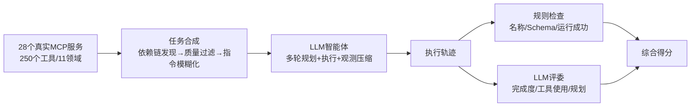

# MCP-Bench: Benchmarking Tool-Using LLM Agents with Complex Real-World Tasks via MCP Servers

**会议**: ICLR 2026  
**OpenReview**: [https://openreview.net/forum?id=fe8mzHwMxN](https://openreview.net/forum?id=fe8mzHwMxN)  
**代码**: [https://github.com/Accenture/mcp-bench](https://github.com/Accenture/mcp-bench)  
**领域**: LLM Agent / Tool Use / Benchmark  
**关键词**: MCP, 工具调用智能体, 多跳规划, 跨服务编排, LLM-as-a-Judge, 任务合成  

## 一句话总结
MCP-Bench 把智能体接到 28 个真实生产级 MCP 服务（共 250 个工具、覆盖金融/科研/旅行等 11 个领域），用自动合成的「模糊指令、多目标、跨域」复杂任务，加上「规则检查 + LLM 评委」两层评估，系统性地暴露了 20 个主流 LLM 在长程规划与依赖推理上的真实短板。

## 研究背景与动机
- **领域现状**：LLM 工具智能体已经能解读自然语言、规划多步流程、调用外部工具，被部署到旅行、医疗、金融等真实场景，而衡量这类能力需要靠工具调用 benchmark。
- **现有痛点**：早期 ToolBench、BFCL v3 把大量 API 堆在一起，但这些 API 功能孤立、输入输出难以自然衔接，任务往往退化成「几步孤立调用」或「人工拼接的假流水线」；τ-Bench 虽然挑了一小批接口相对兼容的 API，却只覆盖两个域，难以扩展任务多样性；新近基于 MCP 的 MCP-RADAR、MCPEval 虽用上了标准化调用协议，但只接了几个服务、至多几十个工具，工作流大多很短（检索一次再总结），而且**任务里把执行步骤写得明明白白**，根本没逼智能体在指令含糊时自己推断该用哪些工具。
- **核心矛盾**：真实世界的工具使用充满「模糊指令、多目标、跨域依赖、需要基于中间结果取证」的复杂性，而现有 benchmark 用「显式工具名 + 浅层几步流程 + 孤立单域操作」根本测不出这些能力，导致 leaderboard 上的高分掩盖了智能体真正的规划缺陷。
- **本文目标**：构建一个大规模、生态级、贴近真实的工具使用 benchmark，既要覆盖足够多的真实工具与依赖链，又要在任务里去掉「保姆式」执行说明，并配一套能区分「执行正确性」和「策略推理质量」的评估框架。
- **核心 idea**：**真实生态 + 模糊化任务 + 双层评估**——直接接入 28 个真实 MCP 服务暴露 250 个互补工具，从工具 I/O 签名自动发现依赖链合成多跳任务，再把任务改写成只剩高层目标的「模糊变体」，最后用规则检查叠加 rubric 驱动的 LLM 评委来打分。

## 方法详解

### 整体框架
MCP-Bench 是一条「服务采集 → 任务合成 → 智能体执行 → 双层评估」的流水线：先把 28 个真实 MCP 服务接进来形成工具生态，再由 o4-mini 从工具依赖链自动合成并模糊化任务，然后让被测智能体在多轮交互中调用工具产出执行轨迹，最后用规则指标和 LLM 评委联合给轨迹打分。其评估对象不是单次调用，而是整条「规划—执行—取证」轨迹。

### 关键设计

**1. 真实 MCP 生态与干扰服务：把「工具天然成套」当作压力源**。不同于把孤立 API 硬拼在一起，MCP-Bench 直接接入 28 个生产级 MCP 服务，每个服务内部的工具本就是为协同而设计的（如科学计算服务自带数据加载、矩阵运算、可视化三件套），天然形成服务内依赖链；而 MCP 协议统一了跨服务的调用 schema，又让跨服务多跳工作流成为可能。更关键的是，每个任务除了真正需要的服务外，还会被**额外挂上 10 个干扰服务**，让智能体面对超过 100 个多余工具，从而把「从一大堆工具里检索出对的那几个」变成真实的考验。整个 benchmark 形式化为一个 POMDP 元组 $(S, A, O, T, R, U, \Sigma)$，其中 $\Sigma=\{\sigma_1,\dots,\sigma_n\}$ 是可用服务集合，每个服务 $\sigma_i$ 暴露工具集 $T_i$，一次结构化调用写作 $a_{\text{tool}}=\langle\sigma_i, \text{tool\_name}, \text{parameters}\rangle$。

**2. 多轮规划—执行—压缩的执行范式**。智能体采用多轮决策：第 $t$ 轮由规划策略 $\pi_{\text{plan}}(s_t)$ 基于此前所有观测产出当前工具计划 $a_t$（一个 $a_t$ 里可包含多个并行工具调用），执行策略 $\pi_{\text{exec}}(a_t)$ 实际调用工具得到观测 $o_t$，再由压缩策略 $\pi_{\text{compress}}(o_t)$ 把冗长的工具返回压成简洁摘要——这一步至关重要，因为很多真实工具会吐出超长输出，不压缩就会撑爆上下文窗口。压缩后的 $(a_t, o_t)$ 记入轨迹并更新内部状态 $s_{t+1}$，直到智能体发出终止信号或达到上限 $T_{\max}=20$ 轮，最后由 $\pi_{\text{final}}(u, \text{trajectory})$ 从完整轨迹产出答案。这样的设计既支持「一次性全局规划」也支持「边走边看」的多轮规划两种范式。

**3. 三阶段任务合成：从工具签名长出真实任务**。合成的核心难题是「怎么把一堆真实工具变成可解、有结构、又够难的任务」，作者拆成三步：先做**依赖链发现**，分析工具间「上游输出自然流入下游输入」的序列，既挖工具天然的内在依赖，也构造有意义的场景依赖，对多服务配置则刻意强调跨服务依赖，从而得到线性、并行、混合等多种结构骨架，再让合成 LLM 据此生成任务；接着做**自动质量过滤**，对每个任务从「可解性」和「实用性」两维打分，分别卡在 9.0/10 和 5.0/10 的硬阈值上，宁可牺牲数量也要保证只有真任务进入 benchmark；最后做**任务模糊化**，把带明确操作步骤的指令改写成只说高层目标的自然商业请求，逼智能体自己推断工具序列，但对科学计算、单位换算这类需要精确输入的领域，模糊变体会**完整保留所有数值和具体参数**，确保任务在数学上仍可解。最终合成 56 个单服务、30 个双服务、18 个三服务任务，并经过人工审查。

**4. 规则 + LLM 评委的双层评估**。规则层从执行轨迹里抽取三个客观指标：工具名有效率 $R_{\text{valid}}=\frac{|\{e\in E:\text{tool}(e)\in T_{\text{available}}\}|}{|E|}$（罚幻觉工具）、Schema 合规率 $C_{\text{schema}}=\frac{|\{e:\text{valid\_tool}(e)\wedge\text{valid\_schema}(e)\}|}{|\{e:\text{valid\_tool}(e)\}|}$（查参数类型是否匹配）、执行成功率 $R_{\text{success}}=\frac{|\{e\in E:\text{success}(e)\}|}{|E|}$（查是否运行无错）。LLM 评委层（默认 o4-mini）则沿三条轴打分：任务完成质量（目标达成、信息取证、相关性）、工具使用质量（工具恰当性、参数准确性）、规划有效性（依赖意识、并行与效率），每个子维度 1–10 分取均值再归一化到 $[0,1]$。为对抗评委对 rubric 顺序的敏感性，作者用**提示词洗牌**随机置换评估轴和子维度的顺序（但语义不变），每个任务跑 5 次独立洗牌再平均，显著降低评分方差。

## 实验关键数据

### 主实验（Leaderboard，单/多服务平均）

| 模型 | 工具名有效率 | Schema 合规 | 执行成功 | 总分 |
|---|---|---|---|---|
| gpt-5 | 100.0% | 99.3% | 99.1% | **0.749** |
| o3 | 99.3% | 99.9% | 97.1% | 0.715 |
| gpt-oss-120b | 97.7% | 98.8% | 94.0% | 0.692 |
| gemini-2.5-pro | 99.4% | 99.6% | 96.9% | 0.690 |
| claude-sonnet-4 | 100.0% | 99.8% | 98.8% | 0.681 |
| qwen3-235b-a22b-2507 | 99.1% | 99.3% | 94.8% | 0.678 |
| glm-4.5 | 99.7% | 99.7% | 97.4% | 0.668 |
| gpt-4o | 98.9% | 98.3% | 92.8% | 0.595 |
| llama-3-1-8b-instruct | 96.1% | 89.4% | 90.9% | 0.428 |

### 关键子维度对比（节选）

| 模型 | 依赖意识 | 并行与效率 | 任务完成 |
|---|---|---|---|
| gpt-5 | 0.649 | 0.339 | 0.677 |
| o3 | 0.592 | 0.359 | 0.641 |
| llama-3-1-8b | 0.221 | 0.141 | 0.261 |

### 关键发现
- **基础执行已趋于收敛**：强模型（o3、gpt-5、gpt-oss-120b、qwen3-235b、gpt-4o）的 Schema 合规与工具名有效率普遍超 98%，这一层已不再是区分点。
- **高层推理才是分水岭**：总分差距主要来自规划与依赖推理——gpt-5（0.749）领先，而 llama-3-1-8b（0.428）在依赖意识和并行效率上明显落后，尽管它的执行成功率并不低。
- **并行与效率是全场最弱项**：即便最强的 gpt-5，并行与效率子维度也只有 0.339，o3 仅 0.359，说明所有模型都不擅长识别可并行机会、减少冗余调用。
- **多服务比单服务更难**：弱模型在跨服务设置下退化更明显，印证跨域编排是真实复杂度的主要来源。

## 亮点与洞察
- **「真实生态」而非「拼凑 API」是这篇 benchmark 的灵魂**：直接用生产级 MCP 服务，工具天然成套、依赖天然存在，避免了人工拼接流水线的失真。
- **模糊化任务设计戳中了旧 benchmark 的盲区**：去掉显式工具名和执行步骤，把「跟着说明书填空」变成「从含糊需求推断工具序列」，更贴近真实用户提问方式；同时对精确输入领域保留数值，兼顾了可解性。
- **干扰服务 + POMDP 形式化**让工具检索成为可量化的压力测试，而不是默认智能体已知道用哪些工具。
- **提示词洗牌 + 多次平均**是对 LLM-as-a-Judge 顺序偏置的务实修补，提升了评估可复现性。

## 局限与展望
- **任务规模偏小**：仅 104 个任务，且严格质量过滤（可解性 9.0、实用性 5.0）以数量换质量，统计稳健性受限。
- **依赖 LLM 评委**：核心策略评分用 o4-mini 当评委，存在评委模型本身的能力与偏好上限，洗牌只能缓解顺序偏置而非根本偏差。
- **服务可能漂移**：接入「live」真实服务虽真实，但服务接口、可用性会随时间变化，影响 benchmark 的长期可复现性。
- **合成 + 人审的成本**：任务合成与人工审查流程较重，扩展到更多域或更长程任务需要持续投入。
- **展望**：可向更多领域、更长 horizon、含真实失败/重试的任务扩展，并探索减少对单一评委依赖的评估方式。

## 相关工作与启发
- **API 工具 benchmark**：ToolBench、BFCL v3 聚合大量孤立 API；τ-Bench 引入模拟用户和终态检查但域窄；C3-Bench 压测工具间依赖推理；ComplexFuncBench 用 rubric + 执行验证打分——它们共同的局限是依赖定制工具集、缺乏真实生态。
- **MCP 类 benchmark**：MCP-RADAR、MCPWorld、MCPEval 率先用 MCP 标准化交互，但服务少、需手动搭建、任务短，MCP-Bench 在规模（28 服务/250 工具）和复杂度（跨服务多跳、模糊指令）上显著扩展。
- **Agent 评估**：AgentBench、WebArena、REALM-Bench 测决策与规划，但多依赖手工工具集；本文把「工具天然成套」作为复杂度来源是一个值得借鉴的设计取向。
- **启发**：对任何想评估 agent 的工作，「真实依赖 + 去保姆化指令 + 客观规则与策略评委分层」这套组合，比单纯追求任务数量更能逼出模型的真实短板。

## 评分
- **新颖性**: ⭐⭐⭐⭐ — 「真实 MCP 生态 + 自动依赖链合成 + 任务模糊化 + 干扰服务」的组合，把工具 benchmark 从拼凑 API 推进到生态级，设计取向新颖。
- **实验充分度**: ⭐⭐⭐⭐ — 评测 20 个主流 LLM、覆盖单/多服务设置、规则 + 评委双层指标并做了洗牌稳健性验证；但任务仅 104 个，规模偏小。
- **写作质量**: ⭐⭐⭐⭐ — POMDP 形式化清晰、流水线三阶段叙述完整、表格对比到子维度，可读性强。
- **价值**: ⭐⭐⭐⭐⭐ — 直击「leaderboard 高分掩盖规划缺陷」的真问题，为 agent 工具能力评估提供了标准化、可扩展、贴近真实的平台，社区价值高。

<!-- RELATED:START -->

## 相关论文

- [\[ICLR 2026\] OSWorld-MCP: Benchmarking MCP Tool Invocation in Computer-Use Agents](osworld-mcp_benchmarking_mcp_tool_invocation_in_computer-use_agents.md)
- [\[ICLR 2026\] MCP Security Bench (MSB): Benchmarking Attacks Against Model Context Protocol in LLM Agents](mcp_security_bench_msb_benchmarking_attacks_against_model_context_protocol_in_ll.md)
- [\[ICLR 2026\] VitaBench: Benchmarking LLM Agents with Versatile Interactive Tasks in Real-world Applications](vitabench_benchmarking_llm_agents_with_versatile_interactive_tasks_in_real-world.md)
- [\[ACL 2026\] MCP-Flow: Facilitating LLM Agents to Master Real-World, Diverse and Scaling MCP Tools](../../ACL2026/llm_agent/mcp-flow_facilitating_llm_agents_to_master_real-world_diverse_and_scaling_mcp_to.md)
- [\[ICML 2026\] MCP-Persona: 用环境模拟评估 LLM agent 在真实个人化应用上的能力](../../ICML2026/llm_agent/mcp-persona_benchmarking_llm_agents_on_real-world_personal_applications_via_envi.md)

<!-- RELATED:END -->
