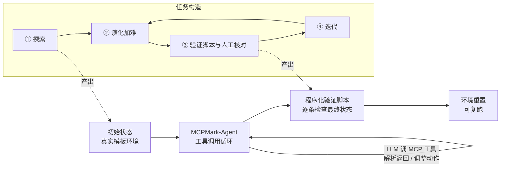

# MCPMark: A Benchmark for Stress-Testing Realistic and Comprehensive MCP Use

**会议**: ICLR 2026  
**OpenReview**: [https://openreview.net/forum?id=uobROwBsJm](https://openreview.net/forum?id=uobROwBsJm)  
**代码**: [eval-sys/mcpmark](https://github.com/eval-sys/mcpmark) · [mcpmark.ai](https://mcpmark.ai)  
**领域**: LLM Agent / MCP / Benchmark  
**关键词**: Model Context Protocol, Agent Benchmark, Tool Use, CRUD, Programmatic Verification, pass^4  

## 一句话总结
MCPMark 构造了 127 个跨 5 类真实 MCP 环境（Notion / GitHub / Filesystem / PostgreSQL / Playwright）、由专家与 agent 协作打磨、带程序化验证脚本的高难度任务，强调多步 CRUD 工作流，结果最强的 gpt-5-medium 也只有 52.56% pass@1、33.86% pass^4，把当前 agent 在真实 MCP 使用上的能力上限狠狠压了一把。

## 研究背景与动机
**领域现状**：Model Context Protocol（MCP）把 LLM 与外部工具、API、数据库、资源的交互方式标准化，被广泛视为「agent 时代」的基础设施层——它给模型装上了在真实环境里行动的「眼睛和手」。围绕 MCP 已经涌现出一批评测基准（MCPEval、LiveMCPBench、MCP-Universe、LiveMCP-101 等）。

**现有痛点**：这些基准普遍「窄」。任务要么偏读取（read-heavy）、要么交互深度有限，平均交互轮数普遍只有 3～7 轮，覆盖的任务模式单一，无法还原真实工作流里那种「多步、有状态、需要规划」的复杂度。

**核心矛盾**：当我们想知道「现在的模型到底能不能胜任真实 agent 任务」时，需要的是能同时压测推理、规划、长上下文处理、工具使用的高保真任务；但既有基准要么任务模式受限，要么验证不严谨（LLM-as-judge），探不到模型的真实性能边界。同时，纯靠人写任务太贵、纯靠 agent 生成任务又不可靠。

**本文目标**：做一个更真实、更全面的 MCP 评测基准——任务要覆盖完整 CRUD（增删改查）、跑在真实/镜像容器环境里、用程序化脚本可靠自动验证、并且足够难。

**核心 idea**：
- **真实环境 + 程序化验证**：直接对接官方 MCP server 与真实 API（而非自定义 wrapper），每个任务配一份「初始状态 + 任务指令 + 验证脚本」三件套，沙箱执行后用脚本判定是否满足全部检查。
- **人机协作造数据**：用「专家 + 任务创建 agent + 任务执行 agent」的四步流水线（探索→演化→验证→迭代）逐步把任务做难、做真、做可验证。
- **pass^4 主指标**：用「连续 4 次独立运行全部成功」这一严格指标衡量稳定性，比 pass@1/pass@4 更贴近真实部署对可靠性的要求。

## 方法详解

### 整体框架
MCPMark 由两部分构成：一是**基准本身**（127 个任务，38 个精心设计的初始状态，分布在 5 个 MCP 环境），二是**评测框架 MCPMark-Agent**（一个最小化、通用的工具调用循环 agent）。每个任务从一个真实初始状态出发，MCPMark-Agent 执行工具调用循环直到模型不再调工具，再由程序化验证脚本检查最终环境状态，最后重置环境以便复跑。

### 关键设计

**1. 五类真实 MCP 环境 + 真实初始状态：把「真实」做到底**。MCPMark 不像以往工作那样从「空白/最小初始化」环境起步，而是为每个环境精心构造贴近真实使用场景的初始状态——Notion 用广泛采用的模板实例化文档与数据库；GitHub 取自带有真实开发历史与 CI/CD、issue、分支、PR、commit 配置的仓库；Filesystem 是模拟日常用户场景的目录结构；PostgreSQL 是带真实 schema 的代表性模板库；Playwright 一部分是自建网页（如 Cloudflare Turnstile 登录），一部分改编自 WebArena 的 localhost 页面。这样设计的核心是抓住 SWE-Bench（真实但单域）、AppWorld/WebArena（多样但靠自定义 wrapper、不反映生产系统的有状态行为）都做不到的那种工作流复杂度——CI/CD 跑在活仓库上、数据库事务真实生效、文件系统多文件组织真实可见。

**2. 人机协作的四步任务构造流水线：解决「纯人贵、纯 agent 不可靠」**。单靠人或单靠 agent 都难以批量产出「真实 + 可验证 + 够难」的任务，于是设计了专家 + 创建 agent + 执行 agent 的协同流程：**① 探索**——专家带着创建 agent 在给定初始状态里既看全局又挖细节，为后续任务打底；**② 演化**——创建 agent 提出新任务或在已有任务上加难（拉长输入、增加信息检索难度、增加交互步数），专家保证任务仍然实用、可验证、够挑战；**③ 验证**——创建 agent 起草程序化验证脚本，专家在执行 agent 协助下亲自完成任务并反复跑脚本校准，还会手动篡改最终状态来确认脚本能同时识别成功与失败；**④ 迭代**——重复 ②③ 持续加难。即便有 agent 帮忙，10 位不同背景的专家（CS 博士、前端、全栈/AI infra、AI 投资人）每个任务仍要花 3～5 小时。最终所有任务经交叉评审和长达一个月的社区检查，对「无模型能解」的任务额外核验有效性。

**3. CRUD-diverse + 程序化验证：拉开与既有基准的代差**。如对比表所示，既有 MCP 基准要么任务模式受限（read-heavy / synthetic），要么验证靠 LLM-as-judge 不够严谨，平均轮数普遍 3～7 轮。MCPMark 同时做到 CRUD 全覆盖、程序化验证、更长工作流（平均 16.2 轮）。127 个任务平均指令 288.6 词、验证脚本 209.8 行代码，任务形态包括 Notion 嵌套属性更新、GitHub commit/PR 管理、Playwright 交互式表单自动化、Filesystem 复杂目录组织、PostgreSQL 事务性更新等。

**4. MCPMark-Agent：刻意「极简」以测真实能力**。评测框架基于 LiteLLM + MCP Python SDK 构建：MCP server 经 SDK 接入并把工具暴露给 agent，LiteLLM 把工具转成 OpenAI function-call 格式并路由到各家官方 API（保留模型原生能力，含 Anthropic 扩展思考的 native path）。Agent 执行经典工具调用循环——模型迭代调用 MCP 工具、解析 server 返回、调整动作，直到不再调工具为止。框架刻意不加任何任务特定启发式或针对模型的优化（单次最多 100 轮、3600 秒超时），目的就是避免引入偏置、从而更干净地衡量模型在 MCP 环境下的**内禀 agentic 能力**。有意思的是，这种朴素迭代调用反而比 ReAct、Codex 更强（见实验）。

## 实验关键数据

### 主实验：模型在 127 个任务上的表现
Pass@1 为 4 次独立运行均值；FS=Filesystem, GH=GitHub, NT=Notion, PW=Playwright, PG=PostgreSQL。

| 模型 | FS | GH | NT | PW | PG | pass@1 | pass@4 | pass^4 |
|------|----|----|----|----|----|--------|--------|--------|
| **gpt-5-medium** | 57.50 | 47.83 | 41.96 | 43.00 | 76.19 | **52.56** | **68.50** | **33.86** |
| grok-4 | 50.83 | 14.13 | 2.68 | 35.00 | 58.33 | 31.69 | 44.88 | 18.11 |
| claude-opus-4.1 | 33.33 | 21.74 | 35.71 | 24.00 | 33.33 | 29.92 | – | – |
| claude-sonnet-4 | 27.50 | 16.30 | 21.43 | 26.00 | 53.57 | 28.15 | 44.88 | 12.60 |
| o3 | 35.83 | 14.13 | 24.11 | 15.00 | 36.90 | 25.39 | 43.31 | 12.60 |
| gemini-2.5-pro | 24.17 | 9.78 | 4.46 | 15.00 | 26.19 | 15.75 | 29.92 | 4.72 |
| gpt-4.1-nano | 0.00 | 0.00 | 0.00 | 0.00 | 0.00 | 0.00 | 0.00 | 0.00 |
| qwen3-coder-plus (开源最强) | 13.33 | 19.57 | 19.64 | 30.00 | 47.62 | 24.80 | 40.94 | 12.60 |
| kimi-k2-instruct | 14.17 | 16.30 | 8.04 | 30.00 | 47.62 | 21.85 | 31.50 | 12.60 |
| deepseek-v3.1 | 15.83 | 9.78 | 12.50 | 7.00 | 42.86 | 16.73 | 28.35 | 7.87 |
| glm-4.5 | 7.50 | 22.83 | 21.43 | 13.00 | 14.29 | 15.55 | 24.41 | 6.30 |

### 推理努力（reasoning effort）消融

| 模型 | Reasoning | Overall pass@1 | GH | NT |
|------|-----------|---------------|----|----|
| gpt-5 | Low | 46.85 | 27.17 | 36.61 |
| gpt-5 | Medium | **52.56** | 47.83 | 41.96 |
| gpt-5 | High | 51.57 | 50.00 | **44.64** |
| gpt-5-mini | Low → High | 8.27 → 30.32 | 8.70 → 19.57 | 5.36 → 20.54 |
| gpt-5-nano | Low → High | 4.33 → 5.12 | 0 → 8.70 | 0 → 0.89 |
| claude-sonnet-4 | Low → High | 27.36 → 28.35 | 25.00 → 28.26 | 22.32 → 19.64 |

### MCP server / 框架对比（同模型不同实现差异巨大）
- **Server 实现**：claude-sonnet-4 跑 GitHub，KlavisAI server 31.5% vs 官方 16.3%；Notion 34.8% vs 21.4%。PostgreSQL 上 InsForge(54.8%)/Supabase(52.4%) 均超官方(48.8%)。
- **Agent 框架**：朴素迭代工具调用（MCPMark-Agent，gpt-5-medium 52.6%）反超 ReAct(37.8%) 与 Codex(36.2%)。

### 关键发现
- **前沿模型仍被压制**：最强 gpt-5-medium 仅 52.56% pass@1、33.86% pass^4；多数专有模型落在 15～30% pass@1，不少开源模型 < 10%。平均每任务需 16.2 轮、17.4 次工具调用，kimi-k2 等超 20 轮。
- **本地 > 远程的「环境鸿沟」**：本地服务（PG/FS/PW）成功率显著高（gpt-5-medium 在 PG 上 76.19%），远程服务（NT/GH）大多 < 25%；归因于远程 API 交互轨迹稀缺、训练覆盖不足。
- **稳定性远落后于能力**：pass@4 普遍 > 30% 但 pass^4 常掉到 5～15%，说明「偶尔做对」容易、「次次做对」难，对真实部署是大风险。
- **轮数 / 成本都不是越多越好**：强模型靠精准决策少而准地调工具；kimi-k2 常陷入「过度调用」超 30 轮反而成功率下降。成本也不与准确率正相关。
- **失败以隐性为主**：跨模型隐性失败（任务跑完但未过验证）常超 50%，gpt-5-high / kimi-k2 超 80%；显性失败（上下文溢出、超轮数、放弃、过早停止、malformed 调用）则因模型而异。

## 亮点与洞察
- **pass^4 这个主指标选得很狠也很对**：它把「靠采样碰运气」的水分挤掉，直接逼问模型的一致性与稳定性，比 pass@1/pass@4 更贴近「能不能放心交给它干活」。
- **基准不止测模型，还能横评 server 实现与 agent 框架**：同一模型在不同 MCP server 上能差出近一倍，说明 schema 暴露方式、错误信息、工程细节对 agent 成功率有实质影响——这是一条很有产品价值的发现。
- **「结构化 scaffold 反而拖后腿」反直觉但有说服力**：ReAct/Codex 不如朴素循环，提示在真实 MCP 设置里冗余约束可能害大于利。
- **真实环境 + 程序化验证**避开了 LLM-as-judge 的不可靠，也避开了 wrapper 模拟环境的失真，是当前 MCP 评测里少见的高保真组合。

## 局限与展望
- **MCPMark-Agent 刻意极简**，没有上生产级优化（记忆、子任务规划、工具检索等），作者把更强 scaffold 留作 future work；因此分数反映的是「裸能力」而非「能调到多好」。
- **127 个任务、5 个环境**虽精但规模仍有限，且初始状态构造成本极高（每任务 3～5 小时专家工时），扩展性是现实瓶颈。
- **环境鸿沟暴露训练数据问题而非纯能力问题**：远程服务表现差很大程度源于训练覆盖少，单看分数可能低估模型潜力。
- 不测 ≤100B 小开源模型（太难做不出来），对小模型能力刻画缺失。

## 相关工作与启发
- **与既有 MCP 基准（MCPEval / LiveMCPBench / MCP-Universe / LiveMCP-101）的区别**：MCPMark 在任务模式（CRUD-diverse）、验证严谨度（程序化）、工作流长度（16.2 轮）三个维度同时领先。
- **与通用工具/agent 基准（SWE-Bench / WebArena / AppWorld）的关系**：MCPMark 直接建在官方 MCP server 与真实 API 上，捕捉到 wrapper 模拟环境无法复现的工作流复杂度（活仓库 CI/CD、事务行为、多文件组织），是对它们的补充而非替代。
- **启发**：① 评测要从「偶尔成功」转向「稳定成功」（pass^k 思路值得推广到更多 agent 任务）；② agent 性能瓶颈不只在模型，server 工程与 scaffold 设计同样关键，三者要联合优化；③ 远程服务的数据稀缺是当前真实 agent 落地的硬约束，提示数据采集而非单纯堆模型规模可能是更重要的撬动点。

## 评分
- **新颖性**: ⭐⭐⭐⭐ 真实 MCP 环境 + 程序化验证 + 人机协作造数据 + pass^4 主指标的组合在 MCP 评测里独树一帜，server/框架横评也是少见角度。
- **实验充分度**: ⭐⭐⭐⭐⭐ 覆盖 20+ 前沿专有/开源模型、reasoning effort 消融、server 与 scaffold 对比、失败模式细分，分析维度非常完整。
- **写作质量**: ⭐⭐⭐⭐ 结构清晰、图表信息密度高，发现总结到位；任务构造与环境细节交代充分。
- **价值**: ⭐⭐⭐⭐⭐ 给「agent 能否胜任真实 MCP 工作流」提供了高保真、可复现、可横评的标尺，对模型评测、server 选型与 agent 框架设计都有直接指导意义。

<!-- RELATED:START -->

## 相关论文

- [\[ICLR 2026\] OSWorld-MCP: Benchmarking MCP Tool Invocation in Computer-Use Agents](osworld-mcp_benchmarking_mcp_tool_invocation_in_computer-use_agents.md)
- [\[ICLR 2026\] SCUBA: Salesforce Computer Use Benchmark](scuba_salesforce_computer_use_benchmark.md)
- [\[AAAI 2026\] SoMe: A Realistic Benchmark for LLM-based Social Media Agents](../../AAAI2026/llm_agent/some_a_realistic_benchmark_for_llm-based_social_media_agents.md)
- [\[ICLR 2026\] MCP Security Bench (MSB): Benchmarking Attacks Against Model Context Protocol in LLM Agents](mcp_security_bench_msb_benchmarking_attacks_against_model_context_protocol_in_ll.md)
- [\[ICLR 2026\] MCP-Bench: Benchmarking Tool-Using LLM Agents with Complex Real-World Tasks via MCP Servers](mcp-bench_benchmarking_tool-using_llm_agents_with_complex_real-world_tasks_via_m.md)

<!-- RELATED:END -->
