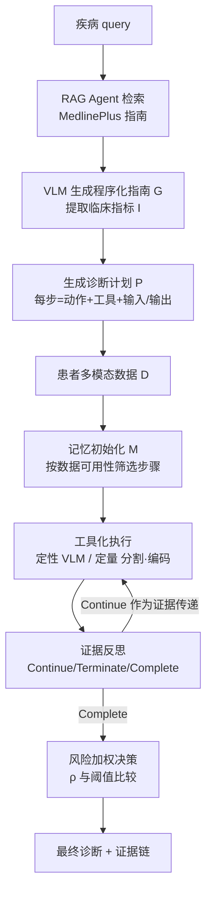

# MedAgent-Pro: Towards Evidence-based Multi-modal Medical Diagnosis via Reasoning Agentic Workflow

**会议**: ICLR 2026  
**OpenReview**: [https://openreview.net/forum?id=ZOuU0udyA4](https://openreview.net/forum?id=ZOuU0udyA4)  
**代码**: 待确认（论文复现声明中给出匿名链接）  
**领域**: LLM/VLM Agent · 医疗多模态诊断  
**关键词**: 医疗诊断、Agentic Workflow、RAG、工具调用、证据驱动推理、VLM  

## 一句话总结
MedAgent-Pro 把现代临床"循证诊断"流程拆成**疾病级标准化计划生成**和**患者级逐步证据推理**两层 agentic workflow，用 RAG 对齐医学指南、用视觉/编码工具做量化分析、用证据反思机制逐步剔除不可靠中间结论，让 VLM 从"凭经验一跳作答"变成"有指标、有证据、可追溯"的诊断系统。

## 研究背景与动机
- **领域现状**：医学诊断本质是综合多模态患者数据、按医学指南逐步推理的过程。VLM 和医疗 agent 近来把多模态信息整合进诊断，医学 VQA 成了主流 benchmark。
- **现有痛点**：① 普通 VQA 是"一跳问答"，VLM 直接吐出经验性结论，缺乏量化指标和临床证据支撑；② GPT-o1/DeepSeek-R1 这类推理模型视觉细粒度感知差，做不了定量分析；③ 现有医疗 agent 把工具**静态拼装**成固定 pipeline，不会根据疾病动态编排工具，也就无法支撑可靠决策。
- **核心矛盾**：临床监管要求**患者安全 + 证据可追溯**，但现有方法把诊断当成经验性一跳 QA，只调用 VLM 内部知识做定性判断——与医学实践强调的"循证诊断 + 结构化推理 + 临床指标"根本相悖。
- **本文目标**：设计一个对齐现代医学准则的 workflow，用医学指南和量化分析为决策提供可追溯支撑，覆盖多解剖区域、多模态、多疾病的通用诊断。
- **核心 idea**：**【分层模拟临床流程】** 疾病级生成标准化诊断计划，患者级按计划逐步分析个性化数据；**【证据驱动】** 每一步都靠工具量化 + 反思校验，确保每个结论都有据可依。

## 方法详解

### 整体框架
MedAgent-Pro 以一个 VLM $V$ 作为编排器（orchestrator），构建分层推理 workflow：**疾病级知识规划**先借 RAG agent 读医学指南、生成疾病专属的标准化诊断计划 $P$；**患者级证据推理**再针对每个病例，按计划逐步调用视觉/编码工具做定性定量分析，并通过证据反思动态调整记忆，最终用风险加权得出诊断。

### 关键设计

**1. 疾病级 RAG 规划：用指南把"诊断步骤"标准化成可执行计划。** 医生靠指南制定标准化流程，MedAgent-Pro 用一个 RAG agent $R$ 把这套流程搬进规划阶段。它建了一个基于 MedlinePlus 的大型知识库 $K$（1000+ 疾病、4000+ 经 NIH/NLM 认证的专家指南），并用**两步检索**提效：先用每篇文章的元数据摘要（器官、疾病）过滤出候选子集，再把全文切成 300-token 的 chunk、用 PubMedBERT 嵌入存入向量索引，取 top-5 最相关 chunk。VLM 据此总结出程序化指南 $G=V(R(K))$，进一步提炼出疾病专属临床指标 $I=\{I_1,\dots,I_m\}$。随后结合动作集 $A$（每个动作 $a$ 通过映射 $\psi(a)=t$ 绑定一个工具，如分割模型）生成诊断计划 $P=P_1,\dots,P_n$，每步形式为 $P_i: r_i = a_i(o_i),\ a_i\in A$，其中 $o_i/r_i$ 可以是原图、中间分割掩码或最终指标。$P$ 以 JSON 存储，每步含一个动作 $a_i$（toolset 里行为固定的 Python 函数）和预期输入输出数据属性——由此每个疾病都拿到一份对齐指南的标准化诊断流程。

**2. 患者级工具化执行 + 记忆初始化：按数据可用性裁剪计划，定量分析交给专业工具。** 面对患者个性化多模态数据 $D$，VLM 先做一次编排，从 $P$ 里挑出可执行步骤、过滤掉缺输入的步骤，形成长期记忆 $M=\{P_i\in P\mid o_i\in D\}$（公式 2）——例如青光眼诊断只有眼底图时，就跳过需要 OCT 的步骤。推理时 VLM 检查当前输入的数据属性，若匹配某 $o_i$ 就执行对应步骤：**定性分析**直接由 VLM 完成，**定量分析**则交给 toolset 里的专业工具，如用 MedSAM/Cellpose 分割视杯视盘、再用编码工具（Copilot）基于分割结果计算 cup-to-disc ratio 这类关键指标。这样把 VLM 不擅长的精确测量外包给专家工具，弥补了 VLM 细粒度感知不足。

**3. 证据反思机制：每步打质量标签，不可靠的中间结果直接剔除。** 为保证多步推理的严谨性，系统对每步输出 $r_i$ 评一个状态 $s_i\in\{\text{Continue, Terminate, Complete}\}$ 作为短期记忆（公式 3）：当 $r_i\in I$（已得到目标指标）记 Complete；当 $r_i\notin I$ 且状态评估函数 $\phi(r_i,o_i,G)=\text{false}$（结果不可靠）记 Terminate，立即中止该链路以免污染后续；当 $r_i\notin I$ 但 $\phi$ 判定可靠则记 Continue，把 $r_i$ 当作证据 $e$ 传给下一步 $o_{i+1}$。$\phi$ 由 VLM 实现，综合输入数据质量与结果合理性判断。案例里"是否有视盘出血"难以判定时就直接 Terminate、不纳入诊断，避免靠猜误导结论。

**4. 风险加权决策：把可信指标按临床重要性加权汇成风险分。** 反思后得到可信指标集合 $R_{final}=\{r_i\mid s_i=\text{Complete}\}$。VLM 依据医学指南为每个指标按临床重要性赋权 $W=V(R_{final}\mid G)$，最终风险分为加权和 $\rho=\sum_{i=0}^{l} w_i r_i$（公式 4，$w_i\in W,\ r_i\in R_{final}$），再与风险阈值 $\theta$ 比较得出诊断。如青光眼案例中 vCDR/RT/PPA 三指标权重 [0.5, 0.3, 0.2]，风险分 0.75 超过阈值 0.4 即判定患病——整条决策都附带每个指标"为什么正常/异常"的证据说明。

## 实验关键数据

### 主实验表格
在青光眼（REFUGE2）、心脏病（MITEA）、NEJM 真实病例上对比通用 VLM 与医疗 agent（均以 GPT-4o 为底座，公平比较）：

| 方法 | 青光眼 bAcc | 青光眼 F1 | 心脏病 bAcc | 心脏病 F1 | NEJM Acc(All) |
|---|---|---|---|---|---|
| GPT-4o | 56.4 | 21.1 | 56.8 | 28.1 | 70.9 |
| LLaVA-Med | 50.0 | 0.0 | 50.0 | 0.0 | 26.2 |
| Qwen2.5-7B-VL | 54.3 | 16.3 | 50.0 | 0.0 | 41.8 |
| MedAgents (ACL'24) | 52.1 | 8.9 | 51.1 | 15.9 | 66.1 |
| MMedAgent (EMNLP'24) | 52.4 | 16.3 | 55.0 | 26.7 | 71.7 |
| MDAgent (NeurIPS'24) | 56.8 | 22.2 | 57.2 | 30.3 | 73.8 |
| **MedAgent-Pro** | **90.4** | **76.4** | **77.8** | **72.3** | **81.7** |

相比 GPT-4o，青光眼 bAcc/F1 提升 34.0%/55.3%，心脏病提升 21.0%/44.2%；NEJM 整体提升 7.9%（即便在无视觉工具支撑的病例上也保持强健）。与任务专用模型比（Table 3），青光眼 AUC 达 95.1，超过 REFUGE2 榜首 VUNO（88.3）6.8%，且 VLM 部分仍是 zero-shot。

### 消融实验表格
三大组件逐级累加（青光眼/心脏病 bAcc/F1）：

| Planning | Action | Reflection | 青光眼 bAcc/F1 | 心脏病 bAcc/F1 |
|---|---|---|---|---|
| - | - | - | 56.4 / 21.1 | 56.8 / 28.1 |
| ✓ | - | - | 75.9 / 36.5 | 63.3 / 45.9 |
| ✓ | ✓ | - | 88.5 / 71.0 | 73.4 / 66.6 |
| ✓ | ✓ | ✓ | **90.4 / 76.4** | **77.8 / 72.3** |

工具可达性消融（Table 6）：直接把同样的 toolset 给 baseline，GPT-4o 仅到 74.4/52.3（青光眼），仍远低于 MedAgent-Pro 的 90.4/76.4——证明增益来自精心设计的 workflow 而非"多塞工具"，baseline 即便有分割模型和编码模块也写不出计算 CDR 的代码。

### 关键发现
- **工具化定量分析是涨点主力**：加入 Action 让青光眼/心脏病 F1 分别再涨 34.5%/20.7%，cup-to-disc ratio、LVEF 这类需精确测量的指标受益最大。
- **定性分析用通用 VLM 即够**：用眼科专用模型 VisionUnite 替 GPT-4o 做定性分析仅边际提升（90.4→92.9 bAcc），说明指南引导下通用 VLM 的定性判断已足够。
- **分割精度越高诊断越准**：模拟噪声掩码实验显示量化精度直接影响最终诊断，凸显工具化定量 + 证据反思的鲁棒性价值。
- **步骤数与临床难度正相关**：在 12 个胸片任务上，MedAgent-Pro 的执行步数与医生评定的诊断难度排名呈明显正相关，说明 workflow 贴近真实临床流程。

## 亮点与洞察
- **把"循证医学"翻译成 agent 架构**：疾病级标准化计划 + 患者级个性化执行的分层结构，精准映射了"先按指南定流程、再按病例逐步循证"的真实诊断范式，可解释性和可追溯性是核心卖点。
- **定性归 VLM、定量归工具的分工很务实**：明确承认 VLM 测不准量化指标，把 CDR/LVEF 这类计算外包给分割+编码工具，既补短板又省去训练专用大模型。
- **证据反思 = 多步推理的"刹车"**：用状态机式的 Continue/Terminate/Complete 主动剔除不可靠中间结论，避免错误在多跳推理中累积放大，这是相比静态 pipeline 的关键差异。
- **覆盖面广**：10+ 模态、20+ 解剖区域、50+ 疾病的评测，且对无工具支撑场景仍保持泛化，说明范式而非单点技巧。

## 局限与展望
- **强依赖工具质量**：定量分析准确度直接受分割模型精度制约，掩码噪声会传导到诊断，无视觉工具支撑的模态（如日常照片）优势明显缩水。
- **指南覆盖与时效**：知识库基于 MedlinePlus（1000+ 疾病），对罕见病或指南未覆盖/更新滞后的情况，规划质量难以保证。
- **风险权重由 VLM 给定**：临床指标权重 $W$ 依赖 VLM 对指南的理解，缺乏与真实临床赋权的系统校准，可能引入偏差。
- **底座成本与封闭性**：默认用 GPT-4o 作编排器，实际部署在数据隐私、推理成本与可复现性上仍有挑战；多步工具调用的整体延迟未充分讨论。

## 相关工作与启发
- **多模态医学诊断**：从分类/检测/分割到医学 VQA 再到医疗 VLM，但 VQA 相比真实诊断过于简化——本文正是要补上"结构化、循证"这一缺口。
- **VLM-based Agent**：通用 agent 在工业、科研、具身、游戏等领域进展显著，但在医疗因细粒度感知不足受限，本文用专业工具弥补。
- **医疗 agentic 系统**：现有两派——靠多 agent 辩论/投票精炼答案，或用编排 agent 拼接专用模型——共同缺陷是工具静态聚合而非临床流程驱动。MedAgent-Pro 的"指南驱动动态编排 + 证据反思"是对这一缺陷的直接回应，启发后续把领域 SOP 显式编码进 agent workflow。

## 评分
- **新颖性**: ⭐⭐⭐⭐ 把现代循证医学流程系统性映射为分层 agentic workflow，"疾病级 RAG 规划 + 患者级工具化证据推理 + 反思剔除"组合在医疗 agent 里属首次成体系，工具可达性消融有力证明增益来自架构而非堆工具。
- **实验充分度**: ⭐⭐⭐⭐ 覆盖 4 个数据集、10+ 模态、50+ 疾病，对比通用 VLM/医疗 agent/任务专用模型三类基线，含组件消融、工具可达性、定性定量精度与临床专家评估，较全面；但部分量化分析依赖附录。
- **写作质量**: ⭐⭐⭐⭐ 动机—矛盾—方法逻辑清晰，公式与案例（青光眼/心脏病）结合直观，图示完整。
- **价值**: ⭐⭐⭐⭐ 可解释、可追溯、对齐临床监管要求，对临床可用的 AI 辅助诊断有现实意义，范式可迁移到其他需 SOP 的高风险决策领域。

<!-- RELATED:START -->

## 相关论文

- [\[ACL 2025\] MAM: Modular Multi-Agent Framework for Multi-Modal Medical Diagnosis via Role-Specialized Collaboration](../../ACL2025/llm_agent/mam_modular_multi-agent_framework_for_multi-modal_medical_diagnosis_via_role-spe.md)
- [\[ICLR 2026\] OrchestrationBench: LLM-Driven Agentic Planning and Tool Use in Multi-Domain Scenarios](orchestrationbench_llm-driven_agentic_planning_and_tool_use_in_multi-domain_scen.md)
- [\[ICLR 2026\] Evaluating Memory in LLM Agents via Incremental Multi-Turn Interactions](evaluating_memory_in_llm_agents_via_incremental_multi-turn_interactions.md)
- [\[ICLR 2026\] A$^2$FM: An Adaptive Agent Foundation Model for Tool-Aware Hybrid Reasoning](a2fm_an_adaptive_agent_foundation_model_for_tool-aware_hybrid_reasoning.md)
- [\[ICLR 2026\] TaskCraft: Automated Generation of Agentic Tasks](taskcraft_automated_generation_of_agentic_tasks.md)

<!-- RELATED:END -->
