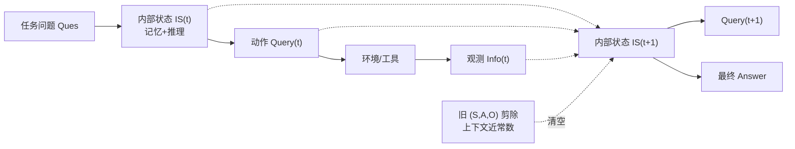

# MEM1: Learning to Synergize Memory and Reasoning for Efficient Long-Horizon Agents

**会议**: ICLR 2026  
**OpenReview**: [https://openreview.net/forum?id=XY8AaxDSLb](https://openreview.net/forum?id=XY8AaxDSLb)  
**代码**: [https://github.com/MIT-MI/MEM1](https://github.com/MIT-MI/MEM1)  
**领域**: LLM Agent / 长程推理 / 强化学习  
**关键词**: 长程智能体, 记忆整合, 强化学习, 上下文压缩, 多目标任务  

## 一句话总结
MEM1 用端到端强化学习训练 LLM 智能体把"记忆整合"嵌进"推理"本身——每一轮只保留一个不断被改写的紧凑内部状态，旧观测用完即丢，从而在任意长的多轮任务里维持近乎常数的上下文，做到性能更高、显存更省、推理更快。

## 研究背景与动机
**领域现状**：现代语言智能体越来越多地处理需要多轮交互的长程任务——搜文档、调工具、根据不断变化的环境反馈回答一连串相互依赖的问题（深度搜索、网页导航、购物助手等）。主流做法（ReAct 范式）是每一步把过去所有的观测、思考、动作统统拼回 prompt。

**现有痛点**：这种"全上下文拼接"带来三个结构性问题。其一，推理成本和显存随上下文长度 $N$ 线性甚至平方增长（Transformer 是 $O(N^2)$ 计算、$O(N)$ 显存），部署时被迫预留大量 GPU。其二，一旦上下文超过训练时见过的长度，模型就被推到分布外，推理可靠性骤降。其三，冗余无关内容稀释注意力，模型即便信息"技术上还在上下文里"也会遗忘关键细节。

**核心矛盾**：已有的外部记忆方案（摘要器、检索器、向量库 A-MEM 等）虽能压上下文，但它们是**和智能体策略分开训练的独立模块**，记忆与推理彼此脱节，还得多维护一个模型、多一份工程开销；而现有的 RL 训练智能体（Search-R1、DeepResearcher）又干脆放任 prompt 无界增长，把记忆管理这件事完全留白。

**本文目标**：让一个语言模型**把记忆整合当成推理的一部分自己学会**，只保留解题真正必需的信息，从而在不加任何外部模块、不改架构的前提下维持近常数显存。

**核心 idea**：作者的关键洞察是——**推理本身就是双用途的**：模型在为当前查询做推理时，顺手就能把未来需要的关键信息抽取并写进内部状态。于是 MEM1（Memory-Efficient Mechanism via 1-step integrated reasoning and consolidation）让每一轮的内部状态 $S_i$ 同时承担"记忆"与"推理"，旧的 $(S_i, A_i, O_i)$ 三元组用完即从上下文剪除，并用**带掩码轨迹的强化学习**端到端训练这一行为。

## 方法详解

### 整体框架
MEM1 把多轮交互建模为 MDP：每一轮 $i$ 智能体先把上一轮的内部状态 $S_{i-1}$、动作 $A_{i-1}$、环境观测 $O_{i-1}$ 整合成新的内部状态 $S_i$，再产出动作 $A_i$（发新查询或给出最终答案）；若发查询，则环境返回观测 $O_i$ 拼到末尾。关键在于：每轮结束后旧三元组 $(S_i, A_i, O_i)$ 立刻被剪掉，上下文里**最多只留两个 $S$、两个 $A$、一个 $O$**，因此显存恒定。这套行为不是 prompt 工程而是用 PPO 端到端训练出来的——但裁剪后的"拼接轨迹"无法直接算策略梯度，于是引入二维注意力掩码来正确回传梯度。

### 关键设计

**1. 记忆即推理：用单一内部状态吞掉历史。** MEM1 不给智能体任何完整历史，而是逼它在每一轮把"上一状态 + 上一动作 + 上一观测"压成一个新的内部状态 $S_i$，这个 $S_i$ 既是它对过去的全部记忆，也是它推理下一步的工作区。因为旧观测用完即丢、上下文被人为剪到只剩最近的状态，智能体若想拿到奖励就**不得不**在推理时主动把未来要用的关键信息写进 $S_i$——记忆整合不是额外任务，而是解题路径上被奖励信号自然逼出来的副产物。作者把它类比人类做数独、填字游戏时"选择性记关键信息并在其上推进"的认知策略。

**2. 带掩码的拼接轨迹，让裁剪后的轨迹也能算策略梯度。** 这是把"动态裁剪上下文"和"标准 RL 训练"调和起来的核心技术难点。常规 RL 框架靠一次 prefill 把整条轨迹 $\tau$ 过一遍模型来算所有 $\nabla_\theta \pi_{\theta}(a_t, s_t)$，但 MEM1 里各个 $S_i$、$A_i$ 根本不属于同一条 rollout；若把每轮拆成子轨迹 $\tau_i=(S_i,A_i,O_i)$ 单独算，又会在跨子轨迹算时序差分 $\delta_t = r(s_t) + V(s_{t+1}) - V(s_t)$ 时卡住（$V(s_{t+1})$ 在另一条子轨迹里）。作者的办法是把 $n$ 轮压成一条**拼接全轨迹** $\tau_{\text{full}} = (S_1,A_1,O_1,\dots,S_n,A_n)$，再对它施加一个二维注意力掩码，让每个 token 只能注意到它"被生成那一刻还留在记忆里的 token"：$\text{Attn}_t = \mathbb{1}_{a\in\{S_{i-1},A_{i-1},O_{i-1},S_i,A_i,O_i\}} \times \mathbb{1}_{a\in\{a_k|k\le t\}}$。这样既保留了完整轨迹便于计算价值函数和优势，又严格复现了推理时的记忆受限状态，使 $\pi_{\theta,\tau_i}(a_t,s_t)=\pi_{\theta,\tau_{\text{full}}}(a_t, s_t\times\text{Attn}_t)$ 成立。策略更新时再叠一层 information mask，把不是模型自己生成的 $O$ token 屏蔽掉，不让环境返回的内容污染梯度。

**3. 多目标 QA 任务设计：人造长程压力测试。** 现有所谓"多跳"数据集（HotpotQA、Bamboogle、2wiki）其实只需两步检索，撑不起对记忆管理的考验。作者把原 QA 语料里多个多跳问题**交织拼成一个复合任务**，要求智能体在一条交互里依次回答全部子问题（用分号分隔答案）。这迫使它发多条针对不同子问题的查询、并把各子答案组织成连贯的最终回复。训练时**只用 2-objective** 任务，测试时却推到 4、8、16 个目标，专门考察"训练视野之外的泛化"。

## 实验关键数据

三类环境：内部检索 QA（Wiki RAG）、开放域 Web QA、多轮网页购物（WebShop）。所有 MEM1 变体从 Qwen2.5-7B **Base** 用 PPO 微调（作者发现从 base 用 RL 训练比 instruct/SFT 泛化更好）。

### 主实验：多目标多轮 QA（部分摘录，Peak 单位 ×10²）

| 模型 | 16-Obj EM ↑ | 16-Obj F1 ↑ | 16-Obj Peak ↓ | 16-Obj Time(s) ↓ |
|------|------|------|------|------|
| Qwen2.5-14B-Inst | 0.567 | 0.703 | 38.4 | 29.7 |
| Qwen2.5-7B-Inst | 0.165 | 0.213 | 43.3 | 15.5 |
| Search-R1 (2-obj 训练) | 0.520 | 0.647 | 24.8 | 23.4 |
| DeepResearcher | 0.071 | 0.106 | 48.9 | 15.8 |
| **MEM1-QA** | **1.97** | **2.39** | **10.4** | **8.70** |

（EM 可 >1 是因为按子问题逐个匹配累加计数。）在 16-objective 上 MEM1 EM 是同尺寸 7B 模型的 10× 以上，峰值上下文砍掉 70%+，延迟减半；相比双倍参数的 14B 模型，EM 达 3× 而峰值 token 仅 27.1%、推理时间仅 29.3%。随目标数增加，其他模型的峰值 token 近线性增长甚至崩溃，MEM1 几乎恒定。

### WebShop 网页导航

| 模型 | Avg Reward ↑ | Peak(×10³) ↓ | Dependency(×10⁶) ↓ | Time/Traj(s) ↓ |
|------|------|------|------|------|
| AgentLM-7B | 63.60 | 2.24 | 0.28 | 3.91 |
| AgentLM-13B | 70.80 | 2.36 | 0.30 | 5.23 |
| **MEM1-WebShop** | **70.87** | **0.81** | **0.15** | **2.61** |

MEM1-7B 奖励超过最强基线 AgentLM 且超过双倍参数的 AgentLM-13B，同时 Peak Token 提升 2.8×、Dependency 1.9×、推理时间 1.5×。

### 关键发现
- **泛化超出训练视野**：仅在 2-objective 上训练，却能稳健泛化到 16-objective，说明学到的是真正的记忆-推理能力而非过拟合 horizon。
- **迁移到未见环境**：RAG-QA 上训练的 MEM1 直接迁到在线 Web-QA（Google Search API），效率全面更优、效果相当，证明不是过拟合本地 Wiki 库。
- **消融**：(a) 纯截断 prompt（无 RL）只能拿到部分效率收益，性能远不如训练后；(b) SFT 用 GPT-4o 轨迹训练虽有提升但泛化明显输给 RL；(c) 显式分离记忆与推理反而不如把二者整合，验证"记忆即推理"的整合设计同时利好性能与效率。
- **涌现行为**：MEM1 学会为多个问题分别维护结构化记忆、在一题卡住时切换到更易解的目标、把检索到的关键信息显式编织进下一步查询。

## 亮点与洞察
- **观念转变**：把"记忆管理"从一个外挂模块降维成"推理的天然副产物"，不加参数、不改架构、不维护第二个模型，却让显存从无界变常数——这是工程上极优雅的简化。
- **技术贡献**：二维注意力掩码 + 拼接轨迹的设计，干净地解决了"动态裁剪上下文如何端到端做 RL"这个看似矛盾的难点，是可复用的训练 trick。
- **小模型打大模型**：7B 在长程任务上反超 14B，说明在长 horizon 下"会忘"的能力比"参数多"更重要，为高效部署提供了新论据。

## 局限与展望
- 多目标任务由现有 QA 语料人工交织合成，与真实世界自然长程任务的分布仍有差距，复合方式相对规整。
- 内部状态是单一紧凑表示，存在信息瓶颈——一旦早期错误地丢弃了后期才发现有用的信息，无法回溯（论文附录 G 也分析了此类失败案例）。
- 奖励为可验证的规则型（EM / 环境奖励），迁移到开放式、无明确可验证答案的长程任务（如开放写作、复杂决策）时如何设计奖励仍待探索。
- 实验集中在 7B 与 Qwen 系列，更大模型、其他架构上的可扩展性未充分验证。

## 相关工作与启发
- **多轮智能体**：ReAct 开创"推理+行动"交织范式，后续 Reflexion、Self-Refine 等加入自然语言反馈迭代；训练侧分行为克隆（SFT 模仿专家轨迹）与 RL（奖励激励）两条路。MEM1 属 RL 路线但首次把记忆压缩纳入策略本身。
- **上下文管理**：从全历史拼接，到外部记忆框架（RAG、摘要模块、分层工作记忆）与向量库（A-MEM）。MEM1 的不同在于记忆与推理共享同一表示空间、端到端联合优化，而非独立外挂。
- **启发**：对任何需要长程交互的智能体系统，"让模型学会主动遗忘"可能比"无限扩上下文窗口"更可持续；二维掩码训练范式也可迁移到其它需要动态修改上下文的 RL 场景。

## 评分
- **新颖性**: ⭐⭐⭐⭐⭐ "记忆即推理"的整合视角 + 拼接轨迹二维掩码训练，把一个工程痛点转成优雅的学习问题，思想清晰且少见。
- **实验充分度**: ⭐⭐⭐⭐ 覆盖三类环境、强基线、多目标缩放曲线、迁移与消融齐全；略欠更大模型/更多架构的验证。
- **写作质量**: ⭐⭐⭐⭐ 动机—洞察—方法—实验逻辑顺畅，图 1 把上下文演化和掩码机制讲得直观。
- **价值**: ⭐⭐⭐⭐⭐ 直击长程智能体的显存与遗忘瓶颈，7B 反超 14B，对高效部署有直接现实意义。

<!-- RELATED:START -->

## 相关论文

- [\[ICLR 2026\] Solving the Granularity Mismatch: Hierarchical Preference Learning for Long-Horizon LLM Agents](solving_the_granularity_mismatch_hierarchical_preference_learning_for_long-horiz.md)
- [\[CVPR 2026\] SAGE: Training Smart Any-Horizon Agents for Long Video Reasoning with Reinforcement Learning](../../CVPR2026/llm_agent/sage_training_smart_any-horizon_agents_for_long_video_reasoning_with_reinforceme.md)
- [\[ACL 2026\] OCR-Memory: Optical Context Retrieval for Long-Horizon Agent Memory](../../ACL2026/llm_agent/ocr-memory_optical_context_retrieval_for_long-horizon_agent_memory.md)
- [\[ACL 2026\] StructMem: Structured Memory for Long-Horizon Behavior in LLMs](../../ACL2026/llm_agent/structmem_structured_memory_for_long-horizon_behavior_in_llms.md)
- [\[ICLR 2026\] REMem: Reasoning with Episodic Memory in Language Agents](remem_reasoning_with_episodic_memory_in_language_agent.md)

<!-- RELATED:END -->
