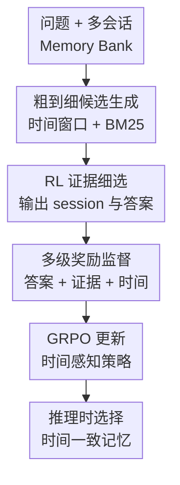

# Memory-T1: Reinforcement Learning for Temporal Reasoning in Multi-session Agents

**会议**: ICLR2026  
**OpenReview**: [https://openreview.net/forum?id=vQf2YR2Kpd](https://openreview.net/forum?id=vQf2YR2Kpd)  
**论文**: [OpenReview](https://openreview.net/forum?id=vQf2YR2Kpd)  
**代码**: https://github.com/Elvin-Yiming-Du/Memory-T1/  
**领域**: LLM Agent / 长期记忆 / 强化学习  
**关键词**: 多会话智能体, 时间推理, 记忆检索, GRPO, 奖励设计  

## 一句话总结
Memory-T1 把多会话对话里的“找哪段记忆”建模成时间感知的证据选择问题，先用时间窗口和相关性检索粗筛，再用 GRPO 训练的策略模型在候选会话中选择证据并回答，从而让 3B/7B 开源模型在 Time-Dialog 时间推理 benchmark 上达到约 67% 的整体分数。

## 研究背景与动机
**领域现状**：长期对话智能体越来越依赖 memory bank 来承接跨天、跨周甚至跨月的交互。用户问“上次 Emi 提到 Golden Globes 是哪一天”这类问题时，模型不能只看当前轮，还要回到历史会话，找到相关 utterance，解析“last night”“the previous day”等相对时间表达，再把它们锚定到对应 session 的绝对时间。

**现有痛点**：主流长上下文 LLM 往往把多会话历史当成一整段扁平文本处理。上下文变长后，语义相似但时间不对的片段会越来越多，模型容易被“看起来像”的句子吸引，却忽略问题真正限定的时间范围。传统 RAG 虽然能缩短上下文，但通常按文本相关性排序，不能保证检索出来的 session 在时间上也对。

**核心矛盾**：多会话时间推理同时要求“语义相关”和“时间正确”。只优化最终答案会让训练信号过稀疏，因为答案错了时很难知道是找错 session、解析错相对时间，还是推理步骤错了；只做规则化时间过滤又会漏掉含糊表达和跨 session 依赖，无法处理真实对话里的噪声。

**本文目标**：作者希望训练一个能显式选择证据 session 的智能体，让它在长而噪的 memory bank 中先缩小搜索范围，再学会挑出真正支持答案的时间一致证据。这个目标拆成三个子问题：如何高召回地产生候选 session，如何让模型把 cited evidence 和 answer 绑定起来，如何用比答案对错更密的奖励指导时间推理。

**切入角度**：论文的关键观察是，多会话对话天然带有 session timestamp，而训练阶段还可以标注问题时间范围、证据 session 和 utterance 级事件时间。虽然这些标注不能在推理时暴露给模型，但它们可以作为 verifier 的信号，用来训练一个更会选择时间一致记忆的策略。

**核心 idea**：Memory-T1 用“时间过滤 + 文本检索 + RL 细选”的粗到细框架替代直接长上下文问答，并用答案准确性、证据 grounding、时间一致性三类奖励共同训练记忆选择策略。

## 方法详解

### 整体框架
Memory-T1 的输入是一道时间相关问题 $q$ 和一整个多会话 memory bank $M=\{(\tau_i,S_i)\}_{i=1}^{N}$，其中每个 session $S_i$ 有自己的时间戳 $\tau_i$ 和若干 utterance。模型最终要输出两件事：一组被选中的证据 session ID，以及基于这些证据得到的答案。

整体流程分两段。第一段是候选生成：先预测问题对应的目标时间范围，再按 session 时间戳做硬过滤，随后用 BM25 在剩余 session 中按文本相关性取 top-$k$。第二段是 RL 细选：策略模型读取问题和候选池，生成形如 `{selected_memory: [...], answer: ...}` 的结构化输出，训练时由多级奖励评估它选的证据和答案是否同时正确。

这个框架的重点不是让模型记住更多上下文，而是让模型少看但看准。时间过滤负责把明显不在范围内的 session 去掉，BM25 负责保留语义上可能相关的候选，RL 策略再处理更细的歧义，例如两个 session 都提到同一事件，但只有一个 session 的“last night”能落到问题要求的时间段内。

### 关键设计
**1. 粗到细候选生成：先用时间窗口保召回，再用 BM25 控制上下文**

多会话 memory bank 的直接难点是规模和噪声。Memory-T1 没有让策略模型面对完整历史，而是先让一个 LLM 从问题中预测目标时间窗口 $(t_{start},t_{end})$，再保留时间戳与该窗口重叠的 session，得到 $M_{temp}$。这一步相当于把“时间上不可能”的历史先排除掉，避免后续检索被大量旧片段稀释。

在时间过滤之后，论文再用 BM25 对 $M_{temp}$ 里的 session 按文本相关性排序，取 top-$k$ 构成候选池 $C$：$C=\arg\operatorname{top-k}_{(\tau_i,S_i):t_{start}\leq\tau_i\leq t_{end}}\operatorname{Retriever}(q,S_i)$。这个组合很朴素，但恰好对应任务的两个必要条件：时间窗口保证候选不偏离问题范围，词面相关性保证候选里仍有能回答问题的文本证据。实验里 top-$k=10$ 时证据召回接近 90%，说明这一阶段的目标是“别漏”，不是最终判定。

**2. 结构化动作空间：让模型同时学会引用证据和生成答案**

如果只训练模型输出答案，它可能答对但引用错，也可能在错误证据上蒙对。Memory-T1 把策略模型的动作定义为一个复合字符串，里面同时包含 `selected_memory` 和 `answer`。例如模型需要生成 `{selected_memory: [session_3, session_16], answer: 19 days}`，训练脚本会解析出证据集合 $S\subseteq C$ 和答案 $a$。

这个设计把“我为什么这么答”显式纳入学习目标。证据 session 被放进输出后，verifier 才能对它计算 grounding reward 和 temporal reward；反过来，模型也会被迫学习“选哪些 session 才能支持这个答案”。在多会话时间推理里，这一点很关键，因为错误常常不是语言生成能力不足，而是把同名人物、相似事件或相邻日期混在一起。

**3. 多级奖励：用答案、证据和时间一致性共同缓解稀疏监督**

Memory-T1 的总奖励为 $R=w_aR_a+w_gR_g+w_tR_t$，解析失败时直接给 $-0.5$。其中 $R_a$ 评估答案是否正确，但它针对不同题型采用不同指标：选择题用 exact match，时间戳用 unit-aware accuracy，持续时间用允许误差的 $\epsilon$-EM，事件排序用 Hamming accuracy。这让答案奖励既覆盖多种时间问答形式，又不会把所有问题都粗暴压成二分类。

更有区分度的是 $R_g$ 和 $R_t$。$R_g$ 比较模型选择的 session 集合与 gold evidence set，论文正文说用 Jaccard 缩放到 $[-1,1]$，附录算法里用 F1 思路，核心都是奖励“证据选对”。$R_t$ 再进一步看证据是否时间一致，由 session 级 chronological proximity $R_s$ 和 utterance 级 chronological fidelity $R_f$ 组成。$R_s$ 用 logistic penalty 衡量选中 session 与问题时间范围 $I_Q$ 的距离，给近邻 session 更高分；$R_f$ 则检查相关 utterance 中事件时间是否落入 $I_Q$，完全重叠给 $+1$，部分重叠给 $+0.5$，不重叠给 $-1$。这样，模型不只被鼓励“找同一话题”，还被鼓励“找同一时间语境下的话题”。

**4. 训练期标注只服务奖励：推理时仍是普通多会话问答**

论文为 Time-Dialog 增补了三类标注：问题目标时间范围 $I_Q$、gold evidence session/utterance，以及 utterance 级事件时间。这些标注来自 GPT-4 初标和人工校验，session 级证据准确率超过 95%，utterance 级超过 85%。它们不会在推理时给模型看，只用于训练阶段计算奖励。

这个分离让方法更接近真实部署：线上智能体仍只拿到历史对话和问题，不依赖外部时间解析工具或人工证据标签；但训练时，reward model 可以利用细粒度 annotation 告诉策略“你选的证据虽然语义相关，但时间跨度不对”。这也是 Memory-T1 相比纯规则时间框架更灵活的地方，规则只过滤候选，而学习到的策略会在候选内部处理相对时间、事件顺序和共时关系。

### 一个完整示例
假设用户问：“Fact1 是 Emi 提到前一天讨论过护发建议，Fact2 是 Emi 建议 Elise 瑜伽课前保持水分、穿舒适衣服、不要吃太饱，哪个更早？”完整 memory bank 里可能有几十个 session 都出现 Emi、Elise、haircare 或 yoga。

第一步，时间过滤会根据问题中的两个事实和当前对话上下文推测一个较宽的时间范围，先把明显太早或太晚的 session 排掉。第二步，BM25 会把包含 hair tips、hydrated、yoga class 等词的 session 排到前面，形成例如 10 个候选 session。第三步，策略模型需要从候选里选择真正的证据 session：护发建议可能对应 session 13，而瑜伽建议对应 session 17。它不能只看到 “previous day” 就回答，还要把这个相对表达锚定到 session 的绝对时间。

如果模型选中了 session 13 和 session 17，并回答 Fact1 更早，它会同时得到答案奖励、证据 grounding 奖励和时间一致性奖励。若模型选中了包含类似护发话题但时间不对的 session，即使最终答案侥幸正确，$R_g$ 和 $R_t$ 也会压低总奖励，促使策略逐渐学会选择时间上更干净的证据。

### 损失函数 / 训练策略
Memory-T1 使用 GRPO 训练策略模型。对每个问题和候选池 $(q,C)$，模型采样 $G$ 个输出，每个输出解析为 $(S_j,a_j)$，再由多级奖励得到 $R_j$。GRPO 的 advantage 使用组内均值作 baseline：$\hat{A}_j=R_j-\frac{1}{G}\sum_{j=1}^{G}R_j$，这样可以降低 reward variance。

训练目标沿用 PPO 风格的 clipped ratio，并加入对 frozen reference policy $\pi_{ref}$ 的 KL 正则，防止策略更新过猛。论文实现基于 VERL，主实验用 Qwen2.5-3B-Instruct 和 Qwen2.5-7B-Instruct，batch size 为 32，学习率 $1\times10^{-6}$，每个 prompt 采样 $K=8$ 个 rollout，KL 系数为 0.1，最大序列长度 16k tokens。奖励权重的最佳配置是 $(w_a,w_g,w_t)=(0.6,0.2,0.2)$，也就是以答案正确为主，同时保留足够的证据和时间监督。

## 实验关键数据

### 主实验
论文主要在 Time-Dialog 上评估，测试集覆盖 11 类时间推理子任务，包括定位、持续时间比较、顺序推理、范围推理、共时关系、timeline 排序等。Memory-T1 的 3B 和 7B 版本都达到约 67% 的 overall 分数，超过 Qwen2.5-14B、MemAgent-7B、Time-R1 以及 GPT-4 的普通 full prompt / ReAct 设置。

| 模型 / 设置 | Overall | OR. 顺序推理 | RR. 范围推理 | CTF. 上下文时间过滤 | Co-tmp. 共时 | 备注 |
|--------|--------|--------|--------|--------|--------|------|
| GPT-4 Oracle Evidence | 86.2 | 88.9 | 93.8 | 83.3 | 100.0 | 给定 gold evidence，上界参考 |
| GPT-4 Full Prompt | 64.8 | 55.6 | 81.3 | 50.0 | 77.8 | 直接喂完整上下文 |
| GPT-4 ReAct | 62.8 | 72.2 | 70.8 | 68.5 | 84.3 | 工具式推理框架 |
| Time-R1 | 49.4 | 27.8 | 44.4 | 55.6 | 66.7 | 时间推理模型零样本 |
| MemAgent-7B | 49.9 | 38.9 | 62.5 | 38.9 | 72.2 | 记忆智能体基线 |
| Qwen2.5-14B Instruct | 60.7 | 66.7 | 75.0 | 69.7 | 94.4 | 更大基座模型 |
| Memory-T1 3B | 66.9 | 66.7 | 87.5 | 88.9 | 94.4 | 3B 已超过 14B 基线 |
| Memory-T1 7B | 67.0 | 83.3 | 87.5 | 88.9 | 94.4 | 非 Oracle 模型中最强 |

OOD 泛化在 LoCoMo 上也有提升。Memory-T1 3B 在 Non-RAG 设置 overall 为 37.7%，比 Qwen2.5-3B Instruct 的 33.5% 高 4.2 个点；在 Temporal 子任务上从 24.5% 提升到 31.5%，说明它学到的不只是 Time-Dialog 的表面格式，而是更通用的时间记忆选择能力。

| 模型 | 设置 | Single-Hop | Multi-Hop | Temporal | Adversarial | Overall |
|------|------|------|------|------|------|------|
| Qwen2.5-3B Instruct | Non-RAG | 49.8 | 28.7 | 24.5 | 16.6 | 33.5 |
| Qwen2.5-3B Instruct | RAG | 46.0 | 22.0 | 27.3 | 19.5 | 31.9 |
| Memory-T1 3B | Non-RAG | 51.2 | 30.2 | 31.5 | 26.0 | 37.7 |
| Memory-T1 3B | RAG | 48.9 | 25.8 | 30.7 | 29.8 | 36.7 |

### 消融实验
奖励消融说明，Memory-T1 的提升主要来自多级奖励协同，而不是简单 RL 微调。只用答案奖励 $R_a$ 时 overall 从 66.9 降到 51.9，Category B/C 的复杂推理明显崩塌；去掉证据 grounding $R_g$ 也会让定位和抽取类任务掉分，因为模型更容易引用语义相似但不支持答案的 session。

| 配置 | Category A | Category B | Category C | Overall | 说明 |
|------|------|------|------|------|------|
| Memory-T1 3B | 49.5 | 79.5 | 80.3 | 66.9 | 完整奖励 |
| w/o $R_t$ | 45.6 | 75.1 | 64.3 | 63.5 | 去掉时间一致性，C 类任务降幅最大 |
| remove $R_s$ only | 61.1 | 34.8 | 66.3 | 66.3 | 简单任务变好，但复杂顺序推理崩塌 |
| remove $R_f$ only | 50.0 | 56.5 | 63.0 | 64.8 | utterance 级时间密度缺失后，复杂任务明显下降 |
| w/o $R_g$ | 40.9 | 75.3 | 75.9 | 60.8 | 证据 grounding 对定位与抽取特别重要 |
| $R_a$ only | 43.6 | 57.5 | 59.0 | 51.9 | 只看答案奖励，监督过稀疏 |

候选生成消融显示，top-$k$ 需要足够大来保证证据召回，但光有召回还不够。即使在同样无时间过滤的上下文下，Memory-T1 3B 也优于 Qwen2.5-3B，说明 RL 策略确实学到了候选内部的证据细选。加上时间过滤后，候选池更干净，Memory-T1 才达到 66.9 的最终分数。

| 分析项 | 关键数字 | 含义 |
|------|------|------|
| 最佳奖励权重 | $(0.6,0.2,0.2)$ 得到约 67.0 overall | 答案为主，证据和时间奖励不可太弱 |
| accuracy 偏置权重 | $(0.8,0.1,0.1)$ 降到 64.0 | 过分依赖答案奖励会削弱推理过程约束 |
| 均匀权重 | $(1/3,1/3,1/3)$ 降到 62.2 | 不充分突出任务正确性也会变差 |
| GRPO vs PPO | 3B 上 PPO overall 比 GRPO 低 18.5% | GRPO 在该类组采样 RL 微调中更稳定 |
| 推理延迟 | Memory-T1 平均 1.26s/query，检索约 0.01s | 性能提升几乎不带来额外检索开销 |

### 关键发现
- Memory-T1 的最大价值在复杂时间推理上，而不是简单扩展模型规模。3B 版本 overall 66.9，已经超过 Qwen2.5-14B 的 60.7，这说明“选对记忆”比“把更大模型直接喂长上下文”更有效。
- 时间一致性奖励对 Category C 这类结构化时间任务尤其重要。去掉 $R_t$ 后 Category C 从 80.3 降到 64.3，说明共时、反事实时间过滤、timeline 之类任务需要显式时间监督。
- 长上下文鲁棒性是本文最有说服力的实验之一。在 64k-128k token 档，普通 Qwen2.5 基线明显受到注意力稀释影响，而 Memory-T1 仍维持稳定优势，7B 版本在最长上下文段领先约 25 个 F1 点。
- 对时间标签噪声的敏感性可控。5% 噪声下 overall 仍为 67.0，10% 和 20% 噪声下降到 63.4 和 60.0；CTF 和 Co-temporality 在 20% 噪声下仍保持 88.9 以上，说明 reward 对现实标注误差有一定容忍度。

## 亮点与洞察
- 这篇论文把“长期记忆推理”中的核心瓶颈从生成答案转移到选择证据。对 agent 系统而言，这个视角很实用：很多失败不是 LLM 不会推理，而是 memory manager 给了它一堆时间上互相干扰的片段。
- 奖励设计比模型结构更值得借鉴。$R_a$、$R_g$、$R_t$ 的组合把最终答案、可解释证据和时间一致性连在一起，为其他 agent 任务提供了一个模板：当最终 reward 太稀疏时，可以把中间决策显式输出并验证。
- 时间奖励的 session / utterance 两级拆分很巧。session 级 proximity 解决“日期远近”，utterance 级 fidelity 解决“同一个 session 里哪句话才真的在目标时间范围内”，这正好击中多会话对话中相对时间表达的常见错误。
- 方法工程上很克制。候选生成只用 LLM 时间窗口预测和 BM25，没有引入复杂 retriever；推理时检索开销约 0.01 秒，说明这套思路可以比较自然地接到现有长期记忆 agent 里。
- 对 OpenReview-only 的 ICLR agent 方向来说，这篇更像“记忆控制策略”论文，而不是纯 RL 论文。RL 是把时间一致性信号注入记忆选择策略的训练工具，最终贡献落在多会话 agent 的可靠性上。

## 局限与展望
- 训练依赖细粒度标注，虽然推理时不需要，但构造 Time-Dialog 增强标注需要 GPT-4 和人工校验。迁移到真实产品对话时，如何低成本获得问题时间范围、证据 session 和 utterance 事件时间仍是门槛。
- 候选生成的第一步依赖 LLM 预测时间窗口，如果问题的时间范围本身很隐晦，硬过滤可能提前丢掉关键 session。论文图 3 显示时间过滤总体不损害召回，但极端模糊问题仍值得单独分析。
- 目前最终动作主要是选择 session 级证据。对于需要跨多个 utterance 做复杂组合、或者需要维护可更新结构化时间线的任务，session 粒度可能仍偏粗。
- Timeline 和 Comparison 相关任务仍有明显短板。附录提到模型在 Comp 和 TL 上接近零或较低，说明当前策略更擅长“找对时间一致证据”，但不一定解决深层组合排序和多事件全局规划。
- 与真实长期记忆系统相比，Time-Dialog 的 memory bank 和 annotation schema 仍较规整。未来可以把 Memory-T1 扩展到持续写入、遗忘、冲突记忆修正和用户隐私约束下的在线 agent 记忆管理。

## 相关工作与启发
- **vs 长上下文 LLM**: 长上下文模型把历史直接放进 prompt，优势是简单通用，但在噪声和长度增加时容易 lost in the middle。Memory-T1 不试图让模型“看完全部”，而是训练它在候选池里选时间一致的证据。
- **vs 标准 RAG**: 标准 RAG 主要优化语义相关性，时间范围通常只是隐式包含在 query 文本里。Memory-T1 在 RAG 前加入时间过滤，并在 RAG 后用 RL 细选证据，使检索从“相关片段”升级为“可支持时间答案的 session”。
- **vs TReMu**: TReMu 这类 time-aware memory framework 更依赖 timeline summary 或显式时间处理，容易受 timestamp 和摘要误差影响。Memory-T1 的优点是通过 reward 学会隐式选择，不把所有时间逻辑都写成规则。
- **vs Time-R1**: Time-R1 关注 LLM 时间推理能力，但对多会话非结构化 dialogue memory 的证据选择不够直接。Memory-T1 把 temporal reasoning 放回 agent memory retrieval 场景，强调“先找对历史，再推理”。
- **vs MemAgent**: MemAgent 使用 RL 做长期上下文记忆管理，但若主要依赖答案奖励，时间推理信号仍偏稀疏。Memory-T1 的启发是给 memory agent 增加任务特定 verifier，尤其是 evidence grounding 和 temporal consistency 这类中间 reward。

## 评分
- 新颖性: ⭐⭐⭐⭐☆ 把 RL 记忆选择和细粒度时间一致性奖励结合得比较自然，单个模块不复杂，但组合切中了多会话 agent 的真实痛点。
- 实验充分度: ⭐⭐⭐⭐☆ Time-Dialog 主实验、奖励消融、候选生成、OOD、长上下文、噪声和效率都覆盖到了；不足是 Timeline/Comparison 失败模式还可以更深入。
- 写作质量: ⭐⭐⭐⭐☆ 论文结构清楚，公式和 reward 解释完整，部分正文与附录在 $R_g$ 的 Jaccard/F1 表述上略有不一致，需要读者留意。
- 价值: ⭐⭐⭐⭐⭐ 对长期记忆 agent 很有实践价值，尤其适合启发“训练一个会选记忆的模型”，而不是不断加长上下文窗口。

<!-- RELATED:START -->

## 相关论文

- [\[ICLR 2026\] Reducing Belief Deviation in Reinforcement Learning for Active Reasoning of LLM Agents](reducing_belief_deviation_in_reinforcement_learning_for_active_reasoning.md)
- [\[ACL 2026\] Temp-R1: A Unified Autonomous Agent for Complex Temporal KGQA via Reverse Curriculum Reinforcement Learning](../../ACL2026/llm_agent/temp-r1_a_unified_autonomous_agent_for_complex_temporal_kgqa_via_reverse_curricu.md)
- [\[ICLR 2026\] MEM1: Learning to Synergize Memory and Reasoning for Efficient Long-Horizon Agents](mem1_learning_to_synergize_memory_and_reasoning_for_efficient_long-horizon_agent.md)
- [\[AAAI 2026\] MoralReason: Generalizable Moral Decision Alignment For LLM Agents Using Reasoning-Level Reinforcement Learning](../../AAAI2026/llm_agent/moralreason_generalizable_moral_decision_alignment_for_llm_agents_using_reasonin.md)
- [\[ICLR 2026\] Tree Search for LLM Agent Reinforcement Learning](tree_search_for_llm_agent_reinforcement_learning.md)

<!-- RELATED:END -->
