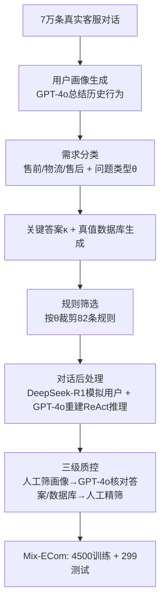

# Mix-ECom: Towards Mixed-Type E-Commerce Dialogues with Complex Domain Rules

**会议**: ICLR 2026  
**OpenReview**: [https://openreview.net/forum?id=ECTv9t8kTJ](https://openreview.net/forum?id=ECTv9t8kTJ)  
**代码**: 数据集承诺公开（待确认链接）  
**领域**: LLM Agent / 电商客服对话 / Benchmark  
**关键词**: 电商 Agent, 混合类型对话, 复杂领域规则, ReAct, Plan-and-Solve, 工具调用, 幻觉抑制  

## 一句话总结
本文构建了首个"一段对话里混合四种对话类型 + 82 条真实电商领域规则"的客服 Benchmark **Mix-ECom**，并提出在 ReAct / Plan-and-Solve 前面挂一个**动态规则筛选模块**来抑制复杂规则带来的幻觉，揭示出当前最强的多模态 LLM Agent 在真实电商客服上的总分仍只有 62%。

## 研究背景与动机

**领域现状**：LLM Agent 已经成为电商客服的主力，覆盖售前、物流、售后全流程；为了评测这些 Agent，社区陆续推出了 EcomScriptBench、CBYS、RECBENCH-MD、τ-retail、ECom-Bench 等基准。

**现有痛点**：这些 Benchmark 几乎都"切片化"——要么只测产品问答（CBYS），要么只测推荐（RECBENCH-MD），要么领域策略被极度简化、脱离真实业务（τ-retail）。它们普遍假设"一段对话只解决一类任务、规则简单"，而真实客服里用户需求是**动态切换**的：一通对话里可能先投诉（任务型）、再让你推荐（推荐型）、顺便问个发货时间（问答）、最后还要安抚情绪（闲聊）。

**核心矛盾**：真实电商规则极其繁杂（本文整理出 82 条细粒度规则，比如"运费险最高补贴 ¥9，超出用户自付""生鲜类只退款不退货"），而现有评测既不考察 Agent 在单段对话内处理**混合类型对话**的能力，也不考察它能否**严格遵守复杂领域规则**——后者恰恰是 Agent 出幻觉的重灾区。

**本文目标**：造一个贴近真实业务、同时压测"混合对话 + 复杂规则 + 多模态"三重难度的 Benchmark，并给出一个能缓解规则幻觉的 Agent 框架基线。

**核心 idea**：① **从 7 万条真实客服对话里蒸馏**出 4,799 条带 CoT、去隐私的高质量样本，每段对话天然混合多任务类型；② 提出**动态规则筛选**——在每次用户开口后，先按当前上下文把 82 条规则裁剪成"相关子集"，再喂给 ReAct/Plan-and-Solve，从源头压缩搜索空间、削减无关规则的干扰。

## 方法详解

### 整体框架
工作分两块：**数据集构建**（一条把真实对话清洗成可评测样本的流水线）和 **动态电商 Agent 框架**（在经典 Agent 范式上加挂规则筛选模块）。每个样本被形式化为七元组 $\{\upsilon, \tau, \alpha, o, \delta, \kappa, \theta\}$，分别是用户画像、参考解决方案、动作链、动作响应、数据库、关键答案、问题类型；Agent 看不到数据库 $\delta$，只能通过工具集 $T$ 间接读写。

### 关键设计

**1. 七元组样本表示与"混合类型"的天然来源：** 数据集不是凭空合成对话，而是从真实客服记录里挑那些"一段聊天解决了多个诉求"的会话，因此每个样本天然横跨 QA、推荐、任务型、闲聊四种类型。每条样本用七元组刻画：用户画像 $\upsilon=\{u_a, u_d\}$（基础信息 + 具体诉求）驱动用户/客服双 Agent 模拟；问题类型 $\theta$ 由画像与订单/物流状态推导；关键答案 $\kappa$ 是客服**必须**传达给用户的信息（如"退货运费 10 元"）；数据库 $\delta$ 对 Agent 不可见，只能经工具读写。这套表示让"混合对话"既可生成又可客观评判——评测时只需检查 $\kappa$ 是否全部说到、$\delta$ 是否被正确改写。

**2. 三阶段数据构建与质控流水线：** 从 7 万条对话起步，先用 GPT-4o 结合用户历史画像生成 $\upsilon$，物流类因诉求简单会**人为拼接多个需求**提升复杂度，售后保留用户实拍图、售前保留商品详情图和直播切片作为多模态文件 $F$；接着按 $\theta$ 生成 $\kappa$ 和真值数据库；然后做对话后处理——用 DeepSeek-R1 扮演用户、GPT-4o（ReAct 架构）扮演客服，把真实人工回复**重写成 ReAct 格式的 `<Thought>/<Action_input>/<Observation>/<Final_Answer>` 推理链**并脱敏。最后三级质控：人工筛掉劣质画像、GPT-4o 自动核对"关键答案是否齐全 + 数据库是否与真值一致"、人工精筛纠正遗漏并剔除违反基本电商逻辑（如不合理定价、政策矛盾）的样本。7 万 → 4,500 训练 + 299 测试，100 条人工评分的 Fleiss Kappa 达 0.76，86% 样本拿满分。

**3. 动态规则筛选模块（方法核心）：** 真实痛点是 82 条规则一次性塞进 prompt 会让模型"被无关规则带偏"产生幻觉。该模块挂在 ReAct/Plan-and-Solve 推理循环**之前**，每当 Agent 执行 $\alpha_i = \text{talk\_to\_user}$ 收到新的用户话语，就先触发一次：输入三元组 $\{C, P, H_t\}$（当前对话上下文、完整规则集、已有轨迹），输出一个**任务聚焦的规则子集** $P_f \subseteq P$ 和一条**过滤后的轨迹** $H_f^t$，把无关法条和已经产生的幻觉推理步剔掉，从而收缩搜索空间。其中轨迹 $H_t = (\tau_0, \alpha_0, o_0, \tau_1, ..., \tau_{t-1}, \alpha_{t-1}, o_{t-1})$ 是思考-动作-观察的累积序列。这一步在每轮用户交互后反复执行，得到随上下文自适应的推理过程。

**4. E-ReAct 与 E-Plan&Solve 双范式落地：** 动态模块以两种方式嵌入。**E-ReAct** 把更新后的 $\{F, Q, P_f, T, H_f^t\}$ 喂回 ReAct 循环，靠规则+轨迹双重剪枝缓解后续推理幻觉。**E-Plan&Solve** 则更进一步——它不仅裁剪规则，还在用户需求变化时**重写计划** $P^f$：给定 $\{C, P, H_t\}$ 输出聚焦规则子集和修订计划，让"先规划后执行"的范式能动态响应用户的新诉求，对付"用户中途改主意"的场景。两者都在每次 `talk_to_user` 后重新触发，形成上下文自适应的规划-执行闭环。

## 实验关键数据

### 主实验（299 测试样本，KA=关键答案分，DB=数据库分，Score=两者都对的比例，%）

| Model | Framework | Logistics | After-sales | Pre-sales | Total Score |
|---|---|---|---|---|---|
| GPT-4o | ReAct | 46.7 | 32.9 | 49.0 | 43.1 |
| GPT-4o | **E-ReAct** | 54.6 | 36.2 | 55.0 | **49.2** |
| Gemini-2.5-pro | ReAct | 53.7 | 48.3 | 58.0 | 53.5 |
| Gemini-2.5-pro | **E-ReAct** | 67.9 | 50.5 | 62.0 | **60.5** |
| Gemini-2.5-pro | **E-Plan&Solve** | 66.7 | 53.8 | 65.0 | **62.2** |
| Claude-4-Sonnet | E-ReAct | 69.4 | 57.1 | -（不支持视频） | - |
| Qwen-VL-MAX | E-ReAct | 44.4 | 46.1 | 57.0 | 49.2 |
| Qwen-2.5-VL-7B | ReAct | 0.9 | 0.0 | - | - |
| Qwen-2.5-VL-7B* (微调后) | ReAct | 19.3 | 17.7 | - | - |

最强组合 Gemini-2.5-pro + E-Plan&Solve 总分仅 62.2，**离解决基准还很远**；动态模块对每个模型都带来稳定提升，物流任务增益最大（查询简洁、规则筛选很少误删）。

### 消融实验（GPT-4o，去掉多模态/规则，Table 5）

| Multi-modal | Rule | Logistics | After-sales | Pre-sales |
|---|---|---|---|---|
| ✓ | ✓ | 46.7 | 32.9 | 49.0 |
| ✘ | ✓ | 46.7 | 28.9 | 43.0 |
| ✓ | ✘ | **2.2** | 17.6 | 37.0 |

去掉多模态输入分数只掉 3.3/6.0，说明模型几乎没真正利用视觉线索；去掉规则后物流分从 46.7 暴跌到 2.2、售后跌 11.3，**规则才是任务可解性的命脉**。

### 关键发现
- **幻觉根因是规则违反**：失败案例分析中 63% 来自违反细粒度规则（如改地址需同时更新订单地址+快递目的地+重置物流状态），15% 多模态误读，12% 过早转人工，5% 其他。
- **多模态利用率极低**：去掉图片/视频几乎不掉分，暴露当前 Agent 对复杂多模态内容的理解仍是短板。
- **数据集有效性**：Qwen-2.5-VL-7B 裸跑物流仅 0.9 分，用本数据 SFT 后涨到 19.3，验证训练集价值。
- **人工评测**：Gemini-2.5-pro 在拟人度/信息量/关键答案三维都最高，但与 Ground Truth（82.6/91.8/100）仍有明显差距。

## 亮点与洞察
- **"混合类型 + 复杂规则"两个被忽视维度合并压测**：是首个在单段对话内同时考察四种对话类型、三类电商任务、82 条规则、图+视频多模态的基准，难度设定贴近真实业务。
- **规则数量本身就是 Benchmark 的护城河**：消融显示规则是分数的决定性因素，把 82 条真实规则结构化引入，让评测从"会不会说话"升级到"敢不敢按业务规矩办事"。
- **动态规则筛选是一个轻量却普适的插件**：不改 backbone、不重训，仅在每轮交互前裁剪规则与轨迹，就能给所有模型稳定加分，思路可迁移到任何"长策略 + 多轮"的领域 Agent。
- **诚实的负面结论**：作者明确指出即便最强模型也远未解决基准，且多模态几乎没被用上，为后续研究指明了"规则遵循"和"多模态决策"两个明确缺口。

## 局限与展望
- **动态模块依赖 GPT-4o 做筛选/评判**：规则子集质量、关键答案打分、数据库等价判断都由 LLM 充当裁判，可能引入评测偏差与成本。
- **微调只覆盖物流+售后**：因售前含视频、资源受限，Qwen-2.5-VL 没在售前训练，开源模型能力上限未被充分探索。
- **测试集偏小**：299 条测试样本相对四种类型×三类任务的组合空间略显单薄，统计稳健性有待加强。
- **规则筛选可能误删**：在售前/售后这类查询更模糊的任务上，动态模块增益明显小于物流，暗示在歧义场景下"裁剪"本身也可能裁错。
- **展望**：作者承诺公开数据集，后续可在更大规模、更强多模态 grounding、以及"何时转人工"这类边界判断上继续推进。

## 相关工作与启发
- **Agent 框架**：直接站在 ReAct、Plan-and-Solve 肩上做领域定制，并对比 LangChain、AutoGPT 等通用框架，说明通用范式在电商客服这种强规则场景需要专门的规则治理层。
- **电商 Benchmark**：与 EcomScriptBench、CBYS、RECBENCH-MD、τ-retail、ECom-Bench 系统对比（Table 1），凸显本文在"混合类型 + 规则数量 + 多模态"上的全覆盖。
- **启发**：对做"领域 Agent"的研究者，本文给出两条可复用经验——(1) 把真实业务规则结构化、并按任务动态裁剪，是抑制长策略幻觉的有效手段；(2) 评测要直接对齐业务真值（关键答案 + 数据库状态），而非只看对话流畅度，才能暴露 Agent 真正的能力缺口。

## 评分
- **新颖性** ⭐⭐⭐⭐：首个"单段对话混合四类型 + 82 条真实规则 + 多模态"的电商客服基准，动态规则筛选虽是 ReAct/Plan&Solve 的轻量增强但切中规则幻觉痛点，问题设定新。
- **实验充分度** ⭐⭐⭐⭐：覆盖 4 闭源 + 1 开源（含 SFT）×2 框架×3 任务，含规则/多模态消融、人工评测、四类失败模式归因，证据链完整；测试集仅 299 条、裁判依赖 GPT-4o 略减分。
- **写作质量** ⭐⭐⭐⭐：动机—数据—方法—实验逻辑清晰，图表（构建流水线图、框架图）到位；个别句子有语法瑕疵（疑似赶稿）。
- **价值** ⭐⭐⭐⭐：数据集承诺公开、贴近真实业务、揭示当前 Agent 在规则遵循与多模态决策上的明确缺口，对电商 Agent 与领域 Agent 研究都有实用参考价值。

<!-- RELATED:START -->

## 相关论文

- [\[ICLR 2026\] Type-Compliant Adaptation Cascades: Adapting Programmatic LM Workflows to Data](type-compliant_adaptation_cascades.md)
- [\[ICLR 2026\] OrchestrationBench: LLM-Driven Agentic Planning and Tool Use in Multi-Domain Scenarios](orchestrationbench_llm-driven_agentic_planning_and_tool_use_in_multi-domain_scen.md)
- [\[ICLR 2026\] Code Driven Planning with Domain-Adaptive Selector](code_driven_planning_with_domain-adaptive_selector.md)
- [\[ICLR 2026\] FeatureBench: Benchmarking Agentic Coding for Complex Feature Development](membership_privacy_risks_of_sharpness_aware_minimization.md)
- [\[ACL 2026\] Shopping Companion: A Memory-Augmented LLM Agent for Real-World E-Commerce Tasks](../../ACL2026/llm_agent/shopping_companion_a_memory-augmented_llm_agent_for_real-world_e-commerce_tasks.md)

<!-- RELATED:END -->
