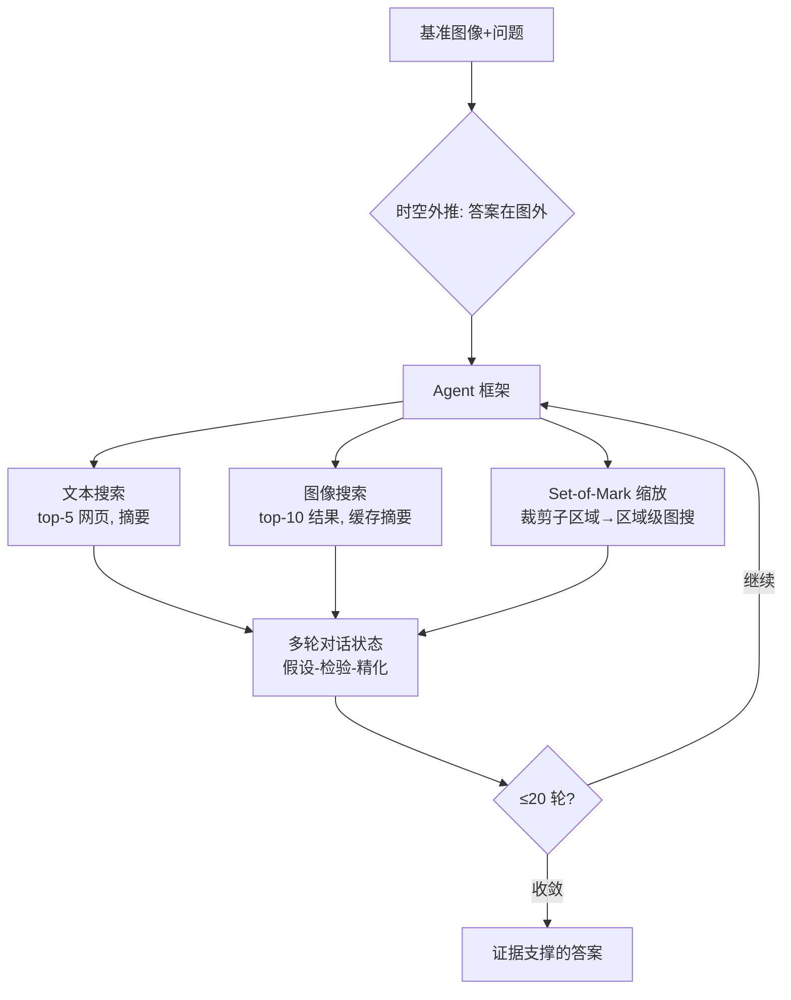

# MMSearch-Plus: Benchmarking Provenance-Aware Search for Multimodal Browsing Agents

**会议**: ICLR 2026  
**OpenReview**: [https://openreview.net/forum?id=VGYgG2GH0d](https://openreview.net/forum?id=VGYgG2GH0d)  
**代码**: 待确认  
**领域**: 多模态智能体 / Agent Benchmark  
**关键词**: 多模态浏览智能体, Set-of-Mark, 时空外推, provenance-aware search, MLLM Agent  

## 一句话总结
MMSearch-Plus 提出一个 311 题的多模态浏览基准，通过"时空外推"强制要求 agent 从图中细粒度视觉线索外推到图外事实，并配套一个含 Set-of-Mark 缩放检索的模型无关 agent 框架，揭示当前最强 MLLM 端到端准确率仅 36%。

## 研究背景与动机
- **领域现状**：MLLM 越来越多以 agent 身份整合视觉、语言与网络搜索来回答信息检索类问题，已有 MMSearch 等基准把图像与浏览/图搜工具配对来考察这种能力。
- **现有痛点**：现有多模态浏览基准"形似神不似"——很多任务用纯文本启发式即可解决，无需把视觉真正放进推理回路。一张图里常有单一显著实体，一次强图搜就能命中包含答案的网页，多模态退化成窄化的"图-源交叉验证"，细粒度视觉推理几乎不起作用。
- **核心矛盾**：纯文本浏览任务（如 BrowseComp）强调持久性、多步取证与复杂搜索策略，SOTA MLLM 带浏览工具得分不到 2%；而多模态浏览基准却远比文本版简单——尽管真实多模态任务往往需要更深的推理。这种难度落差暴露了基准设计的根本缺陷。
- **本文目标**：构造一个既能匹配 BrowseComp 长程难度、又**无法被一次强图搜绕过**的多模态浏览基准，逼出（i）局部、穷尽的细粒度视觉推理，（ii）噪声/冲突检索下的鲁棒验证，（iii）交织图文搜索与区域级视觉分析的多步工具使用。
- **核心 idea**：**时空外推（Spatial-Temporal Extrapolation）**——不问图里直接可见的内容，而问"上下文隐含但物理不在场"的事实（如比赛日期、下一回合、画面外人物），迫使模型把零散视觉碎片传播进迭代搜索并在检索噪声中验证 provenance（来源）。

## 方法详解

### 整体框架
MMSearch-Plus 由两部分组成：一是用"时空外推"原则构造的 311 题硬基准（含对抗过滤防止参数化捷径），二是一个模型无关的 web agent 框架，交织文本搜索、图搜与基于 Set-of-Mark 的缩放检索通路。评测用 LLM-as-a-judge 比对模型输出与可接受答案集，五种搜索模式（无搜索 / 图搜 / 文搜 / Full Rollout / Full Rollout+SoM）逐级放开工具权限。

### 关键设计

**1. 时空外推：把答案推到画面与时刻之外。** 这是基准的灵魂。BrowseComp 式任务的核心难点在于"软模糊约束"导致中间搜索空间膨胀，需要非平凡的交叉验证才能锁定目标。本文不重混文本语料，而是从绑定真实事件的少量视觉碎片出发（精神上类似 GeoGuessr），让 agent 先假设底层源事件再用检索证据验证。空间外推针对画面外/背对镜头/被遮挡的实体（如台下观众、被挡的标牌），时间外推针对所示时刻前后的事件（如下一个进球、下一集剧情）。解题要求 agent 先精确定位事件（时间、比赛、剧集），再从多源整合更广的上下文知识。即便单次裁剪也能让候选集急剧扩大，诱发迭代"假设-检验-精化"的长轨迹。

**2. 对抗过滤 + 时间漂移维护：守住"必须检索"的底线。** 收集时聚焦新近/罕见事件，但 GPT-4o、GPT-5、Gemini-2.5-Pro 等闭源模型偶尔能无搜索作答。为此采用三道对抗过滤：标注者设计**自己知识库之外**的问题、并在至少两个闭源 MLLM 上验证可解性；模糊或遮挡关键视觉子区域；对仍可平凡解出的问题反复丢弃精化。论文图截图须满足"含模糊/噪声信息、罕见实体、无法被 Google 图搜直接命中"三条件，确保答案既不在训练语料也不能被一跳图搜拿到。作者还承诺定期刷新基准以压制新模型因更新训练数据带来的内部知识捷径（temporal drift）。

**3. Set-of-Mark 缩放检索：让 agent "用图思考"。** 为实现精确、provenance-aware 的视觉检视，框架引入 SoM 模块——为每张任务图提供人工验证的 bounding box 列表，首轮同时给出原图与叠加了框线和索引的版本（避免遮挡又便于交叉引用）。agent 可调缩放工具检视子区域 $r \subseteq I$，再用该子区域 $r$ 发起区域级图搜，把局部细粒度线索（微文本、logo、关键实体）当作检索 query。这把"整图搜索"升级为"区域种子检索（zoom-and-retrieve）"，在搜索空间膨胀前先用细粒度线索锚定推理。

**4. 长程上下文管理与检索摘要压缩。** 框架维护线程化对话状态（工具调用、裁剪视图、摘要、假设）支持长程推理，并缓存图搜返回（排序 URL/缩略图）及其 MLLM 摘要以降低延迟与 token 成本。检索网页被 Gemini 摘要为两个字段：`web info`（任务条件化的页面语义摘要）与 `related info`（把结果缩略图/首图与查询图关联的证据，如匹配的标牌、布局、微文本）。这套摘要专为有限上下文窗口压缩交互历史，让 agent 在 ≤20 轮内做上下文化评测。

## 实验关键数据

### 主实验（端到端准确率 %，节选）

| 模型 / 搜索模式 | Avg | Geo. | Sports | Acad. | Easy | Hard |
|---|---|---|---|---|---|---|
| 人类 + 浏览器 | 22.8 | 20.3 | 25.9 | 20.0 | 34.0 | 18.0 |
| **o3** Without Search | 15.1 | 31.2 | 14.8 | 6.0 | 50.0 | 0.0 |
| o3 Image Search | 19.3 | 28.1 | 14.8 | 18.0 | 63.8 | 0.0 |
| o3 Text Search | 37.0 | 43.8 | 35.2 | 48.0 | 50.0 | 31.3 |
| o3 Full Rollout | 36.0 | 35.9 | 24.1 | 50.0 | 54.3 | 28.1 |
| **o3 Full Rollout + SoM** | **37.6** | 45.3 | 29.6 | 46.0 | 62.8 | 26.9 |
| GPT-5 Full Rollout + SoM | 35.4 | 35.9 | 27.8 | 48.0 | 56.4 | 26.3 |
| Gemini-2.5-Pro Full Rollout | 23.8 | 39.1 | 14.8 | 12.0 | 46.8 | 13.8 |
| Gemini-2.5-Pro Full Rollout+SoM | 27.7 | 40.6 | 22.2 | 24.0 | 54.3 | 16.1 |
| Qwen-2.5-VL-72B Without Search | 0.0 | 0.0 | 0.0 | 0.0 | 0.0 | 0.0 |
| Qwen-2.5-VL-72B Full Rollout+SoM | 7.1 | 10.9 | 3.7 | 4.0 | 18.1 | 2.3 |

最强系统（o3 Full Rollout+SoM）端到端仅 36~37.6%，远未饱和；困难子集上所有模型都很弱。

### 消融与子集分析

| 设置 | 关键结论 |
|---|---|
| 加 SoM (vs Full Rollout) | o3 +1.6、Gemini **+3.9**、Qwen +1.0，一致正增益 |
| Image Search 单独 | o3 +4.2、GPT-5 +6.1、Gemini +5.8、Qwen +13.5（粗消歧有用，多跳仍是瓶颈）|
| MMSearch-Plus-lite (239 题，无搜索不可解) | 最佳为 o3 纯文搜 31.4%；多数方法贴近 y=x 对角线，说明趋势非源于参数化记忆 |
| Easy 子集 | Image→Full Rollout **不升反降**：o3 有 23 题图搜对、全展开错（-7.4 点）|

### 关键发现
- **Easy 掉分根因是"少用图搜"而非"过度检索"**：抽查 10 个掉分案例，9 个 full rollout 轨迹**根本没调图搜**，模型误以为已看懂图而只靠文搜/先验，错失细粒度线索——属策略级工具决策错误。
- **不同模型的工具使用模式迥异**：o3 能撑 10+ 轮、协调 50+ 检索项；Gemini 总在第 9 步前作答、更省调用。$P(\text{image}\mid\text{zoom})$ 差异巨大——Gemini 25.37%、Qwen 10.56%、o3 仅 2.87%，o3 常只为"看清楚"而缩放，不把缩放区域当检索 query。
- **更多工具调用 ≠ 更对**：错误轨迹通常比正确轨迹包含更多搜索调用。
- **人机互补优势**：无搜索时 o3 地理 31.2% 超人类 20.3%（闭源模型保留广博地理知识），但体育/Vlog 上人类反超 MLLM。
- **Qwen 工具不稳定**：45/311 任务中出现 421 次无效图搜调用，空转重试无质量提升。

## 亮点与洞察
- **"时空外推"是巧妙的难度引擎**：把答案系统性地推到画面与时刻之外，从机制上杜绝了"一跳图搜命中答案文本"的捷径，让多模态推理无法被绕过——这是相对 MMSearch 等基准的本质改进。
- **基准的"活态维护"承诺**：明确意识到 MLLM 训练数据更新会侵蚀"必须检索"假设（temporal drift），承诺定期刷新，这对长期可用的 agent 基准很关键。
- **SoM 给出可解释的失败画像**：通过 Markov 工具转移概率量化"缩放后是否接图搜"，把模型能力差异落到可测量的行为层面，而非只看终点准确率。
- **lite 子集 + y=x 可视化**严谨地剥离了内部知识与外部工具的贡献，证明观察到的趋势源于真实工具使用而非记忆。

## 局限与展望
- **SoM 依赖人工验证 bounding box**：当前 Set-of-Mark 是人工标注的框，未实现端到端自动区域提议，限制了框架在开放场景的可扩展性。
- **规模偏小**：311 题、441 张图，类别虽均衡但统计功效有限，困难子集上模型普遍接近地板，难以细分能力差距。
- **评测依赖 LLM-as-a-judge**：虽与 GPT-4o 人工一致性高，但答案集与判定仍可能引入系统偏差。
- **未训练只评测**：论文止于诊断当前 MLLM 的工具决策缺陷（尤其"该用图搜时不用"），未提出针对性训练/策略改进来闭环。
- **展望**：自动化 SoM、扩大规模、把"工具使用策略"作为可训练目标，是顺理成章的后续方向。

## 相关工作与启发
- **多模态浏览基准**：MMSearch（Jiang et al., 2024）是直接对标对象，本文指出其多被固定工作流解决；并发工作 BrowseComp-VL、MM-BrowseComp 在数据源与 agent 框架上与本文不同，MMSearch-Plus 更强调持久的细粒度视觉推理。
- **文本浏览基准**：BrowseComp（Wei et al., 2025）提供了长程难度参照，本文把这种难度迁移到多模态。
- **Set-of-Mark**：复用 Yang et al. (2023) 的 SoM 视觉提示思想，将其改造为 provenance-aware 的缩放检索通路。
- **启发**：对做 agent benchmark 的研究者，本文给出一个可复用范式——**用"答案外推到模态可见范围之外"来强制工具回路真正被使用**，并配合对抗过滤 + 活态维护对抗参数化捷径。

## 评分
- **新颖性**: ⭐⭐⭐⭐ 时空外推 + provenance-aware 缩放检索的组合切中现有多模态浏览基准"视觉可绕过"的真问题，思路新颖。
- **实验充分度**: ⭐⭐⭐⭐ 覆盖闭源/开源 4 模型 × 5 搜索模式 + lite 子集 + Markov 工具转移 + 细致错误分析，诊断扎实；规模偏小略减分。
- **写作质量**: ⭐⭐⭐⭐ 动机层层递进、设计原则清晰、失败分析有洞见，图表组织得当。
- **价值**: ⭐⭐⭐⭐ 为下一代 agentic MLLM 提供了一个难度高、抗捷径、可持续维护的严格基准，并暴露了"工具决策"这一关键短板。

<!-- RELATED:START -->

## 相关论文

- [\[ICLR 2026\] MC-Search: Evaluating and Enhancing Multimodal Agentic Search with Structured Long Reasoning Chains](mc-search_evaluating_and_enhancing_multimodal_agentic_search_with_structured_lon.md)
- [\[ACL 2025\] Browsing Like Human: A Multimodal Web Agent with Experiential Fast-and-Slow Thinking](../../ACL2025/llm_agent/browsing_like_human_a_multimodal_web_agent_with_experiential_fast-and-slow_think.md)
- [\[ACL 2026\] BAPO: Boundary-Aware Policy Optimization for Reliable Agentic Search](../../ACL2026/llm_agent/bapo_boundary-aware_policy_optimization_for_reliable_agentic_search.md)
- [\[ICLR 2026\] Towards Multimodal Data-Driven Scientific Discovery Powered by LLM Agents](towards_multimodal_data-driven_scientific_discovery_powered_by_llm_agents.md)
- [\[ICLR 2026\] SimuHome: A Temporal- and Environment-Aware Benchmark for Smart Home LLM Agents](simuhome_a_temporal-_and_environment-aware_benchmark_for_smart_home_llm_agents.md)

<!-- RELATED:END -->
