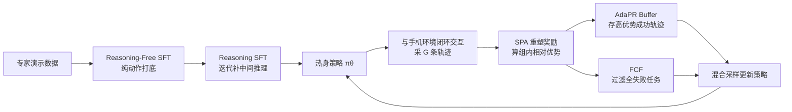

# MobileRL: Online Agentic Reinforcement Learning for Mobile GUI Agents

**会议**: ICLR 2026  
**OpenReview**: [https://openreview.net/forum?id=C3F0G9nXhl](https://openreview.net/forum?id=C3F0G9nXhl)  
**代码**: [https://github.com/THUDM/MobileRL](https://github.com/THUDM/MobileRL)  
**领域**: LLM Agent / Mobile GUI Agent / 智能体强化学习  
**关键词**: GUI Agent, Agentic RL, GRPO, 难度自适应, 经验回放, 课程过滤, 奖励重塑  

## 一句话总结
MobileRL 用"两阶段推理 SFT 热身 + 难度自适应 GRPO（AdaGRPO）"的在线智能体 RL 框架训练手机 GUI 智能体，靠正样本回放、失败课程过滤、最短路径奖励三招稳住稀疏奖励下的多轮训练，让 9B 模型在 AndroidWorld 上success rate 冲到 80.2%、AndroidLab 53.6%，刷新 SOTA。

## 研究背景与动机
**领域现状**：视觉语言模型（VLM）让 GUI 智能体能零样本地操作网页和手机界面，但要把它们做强，主流路线还是在静态专家演示上做监督微调（SFT）或离线模仿学习。这类方法行为覆盖窄、出错后几乎无法自我恢复——演示里没出现过的状态，模型一旦走错就回不来。

**现有痛点**：带可验证奖励的强化学习（RLVR）看起来是更好的替代，但把它搬到手机这种交互式模拟器上做"智能体 RL"（需要多步规划与推理）时会撞上三堵墙：

- **稀疏正信号下的复杂指令跟随**：手机模拟器跑一次 rollout 又慢又贵，base 模型本来就难稳定输出正确的 GUI 动作命令，正确完成的轨迹极其稀少，早期探索严重低效。
- **重尾且不稳定的任务难度谱**：有的任务多采几次就能成功，有的对模型来说几乎永远解不出。朴素均匀采样既浪费算力，又用不上那些稀少但极有信息量的成功轨迹。
- **大规模手机环境的采样瓶颈**：同时部署管理上百个并发手机实例资源消耗巨大、还难以复现，采样吞吐低进一步限制了 RL 的规模和效率。

**核心矛盾**：手机智能体 RL 的奖励是稀疏二值的、只在任务最终成功时才给，而任务难度呈重尾分布、采样代价又极高——**标准 GRPO 的均匀采样和统一奖励广播在这种设定下既不稳又低效**。

**本文目标**：构建一个能在手机交互环境里高效、稳定、可复现地扩展智能体 RL 的框架，把开源 VLM 训成 SOTA 级手机 GUI 智能体。

**核心 idea**：先用**两阶段 SFT（无推理 + 推理）热身**给 RL 一个强初始策略，再用 **难度自适应 GRPO（AdaGRPO）** 三件套——按难度回放成功轨迹、过滤掉永远解不出的任务、按完成长度重塑奖励——把稀疏奖励、重尾难度、昂贵采样三个问题一并按住。

## 方法详解

### 整体框架
MobileRL 把训练拆成两大块：**推理热身**（无推理 SFT + 推理 SFT，给 RL 一个会输出动作、也会写中间推理的策略初始化）和**在线智能体 RL**（用 AdaGRPO 让热身后的策略与手机环境闭环交互、采轨迹、更新）。任务被建模成有限步 MDP：状态是截图 + 解析出的 UI 层级 XML + 历史 think/action 文本，动作是 Tap/Swipe/Type/Launch/Back/Finish 等原子操作，奖励只在任务成功时给二值 1、否则 0。整个 RL 跑在 Verl 框架上，底层用上百个 Docker 化的 Android 虚拟设备（AVD）并发，撑起 1000+ 环境的可复现采样。

### 关键设计

**1. 两阶段推理热身：先学会动手，再学会想清楚。** 直接从 base 模型起跑在线 RL 在虚拟设备里太慢，所以先做 **Reasoning-Free SFT**——用专家演示 + AndroidControl 训练集打动作基础，但这批数据只有最终动作序列、没有中间推理，纯靠它训出来的是"黑箱"策略。于是再叠一层 **Reasoning SFT**：用现成 Instruct 模型对每条任务 $x$（专家答案 $a^*$）采样多组"推理-动作"候选 $(c_k, a_k)$，只保留那些动作命中 $a^*$ 的样本 $(x, c_k, a^*)$ 进数据集 $D_R$，先训出初始推理策略 $\pi_0^R$，再迭代精炼——每轮让 $\pi_t^R$ 重新提候选、挑出最佳解释 $c^*$ 加入数据集再微调。两阶段下来让模型既有可靠的动作基础，又有透明的中间推理，把"长且组合"的复杂指令跟随能力提上去，也大幅减少 RL 阶段昂贵的 on-policy 试错。

**2. 最短路径奖励调整（SPA）：别让成功的长轨迹白占便宜。** 手机环境只在终点给二值奖励 $r\in\{0,1\}$，常规做法把它广播到每一步 $R(s_t,a_t)=r$。问题在于：成功轨迹越长贡献的梯度项越多，这等于**变相奖励冗长**。SPA 按轨迹长度对成功奖励做缩放：

$$R_{\text{SPA}}(s_t,a_t) = r(\tau_i)\left(1 - \alpha\frac{T_i - T_{\min}}{T_i}\right),\quad T_{\min}=\min_{\tau_j\in\mathcal{T}_{\text{succ}}}|\tau_j|,\ \alpha\in(0,1]$$

其中 $T_i$ 是轨迹 $\tau_i$ 的长度，$T_{\min}$ 是当前任务实例下最短成功轨迹的长度，$\alpha$ 控制惩罚强度。注意它只对**成功**轨迹生效，失败的提前终止仍拿 0 分——所以短不等于好、不会诱导模型为了短而草草 Finish。这跟文本 RLVR 里的 token 级长度惩罚不同，SPA 作用在多步 GUI 动作轨迹上，重塑后的奖励照旧广播到每一步去算组内相对优势，引导策略偏好"更短的成功路径"而不牺牲成功率。

**3. 难度自适应正样本回放（AdaPR）：把稀少又珍贵的成功攒下来反复用。** 稀疏奖励下"又难又成功"的轨迹极少但信息量极大，扔掉太可惜。AdaPR 借鉴经验回放的思路：每轮迭代 $t$ 在当前策略 $\pi_{\theta_t}$ 下采到轨迹集 $\mathcal{T}_t$，算出轨迹级优势后把 top-$\kappa$ 条高价值成功轨迹存进回放缓冲 $B$。更新时每个 mini-batch 从混合分布里采 $M$ 条：

$$q(\tau) = \gamma\, p_B(\tau) + (1-\gamma)\, p_{\text{on}}(\tau)$$

其中 $p_{\text{on}}$ 是 on-policy 分布、$p_B$ 是缓冲区经验分布。为了不让回放盖过新探索，最多从 $B$ 里取当前优势最高的 $\gamma M$ 条，剩下保留 on-policy 多样性。这样那些"难得一见的成功"被反复利用来强化学习信号、稳住策略更新。

**4. 失败课程过滤（FCF）：别在死胡同上反复烧算力。** 鉴于手机基准的难度重尾分布，总有一批任务模型怎么采都是全 0 奖励，反复采它们既浪费算力又收集不到正优势数据。FCF 用在线难度统计动态降权：任何任务若连续两个 epoch 全 0 奖励就进入三 epoch 冷却期，期间采样概率按 $w_{\text{task}}=\exp(-f)$ 衰减（$f$ 是连续失败 epoch 数），冷却后仍解不出就**永久移除**。它是课程采样的资源感知简化版——不像"由易到难"课程假设探索廉价，FCF 专门剔掉昂贵手机交互下持续无解的死任务，同时保留还能恢复的失败信号。关键是 FCF **只作用于训练采样分布，所有评测仍在完整测试集上跑、不删任何任务**。

## 实验关键数据

### 主实验表格
在 AndroidWorld（116 任务/20 应用）和 AndroidLab（138 任务/9 应用）两个交互式基准上对比闭源与开源模型（success rate %）：

| 模型 | #参数 | AndroidWorld | AndroidLab |
|---|---|---|---|
| GPT-4o-2024-11-20 | - | 34.5 | 31.2 |
| Claude-Sonnet-4-thinking | - | 41.0 | 40.6 |
| UI-Tars-1.5 | - | 64.2 | 38.3 |
| AutoGLM-2024-10 | - | – | 36.2 |
| Qwen2.5-VL-7B-Instruct | 7B | 27.6 | 10.1 |
| GLM-4.1V-9B-Thinking | 9B | 41.7 | 24.6 |
| V-Droid | 8B | 59.5 | 38.3 |
| UI-Genie-Agent | 72B | - | 41.2 |
| **MobileRL w/ Qwen2.5-VL-7B** | 7B | **72.0** | **42.5** |
| **MobileRL w/ GLM-4.1V-9B** | 9B | **80.2** | **53.6** |

MobileRL-9B 把前 SOTA 的 64.2% / 41.2% 抬到 80.2% / 53.6%；MobileRL-7B 也以小搏大，比 72B 的 UI-Genie-Agent 在 AndroidWorld 上高出约 16%。

### 消融实验表格
**框架逐阶段增益**（success rate %，下标为相对上一阶段提升）：

| 模型 | AndroidWorld | AndroidLab |
|---|---|---|
| Qwen2.5-VL-7B-Instruct | 27.6 | 10.1 |
| + Reasoning-Free SFT | 50.2 (+22.6) | 36.9 (+26.8) |
| + Reasoning SFT | 56.8 (+6.6) | 38.7 (+1.8) |
| + AdaGRPO (MobileRL-7B) | 72.0 (+15.2) | 42.5 (+3.8) |
| GLM-4.1V-9B-Base | 7.7 | 10.1 |
| + Reasoning-Free SFT | 48.1 (+40.4) | 42.7 (+32.6) |
| + Reasoning SFT | 66.2 (+18.1) | 45.0 (+2.3) |
| + AdaGRPO (MobileRL-9B) | 80.2 (+14.0) | 53.6 (+8.6) |

**AdaGRPO 三件套消融**（AndroidWorld 测试集，三次平均）：

| 变体 | AndroidWorld |
|---|---|
| MobileRL（全量） | 71.1 |
| w/o AdaPR | 63.6 |
| w/o SPA | 69.1 |
| w/o AdaPR & SPA | 58.5 |
| w/o FCF | 64.8 |
| w/o AdaGRPO（仅 Reasoning SFT） | 56.8 |

### 关键发现
- **每一招都有用**：去掉 AdaPR 掉 7.5 分、去掉 FCF 掉 6.3 分、去掉 SPA 掉 2 分，同时去掉 AdaPR 和 SPA 直接掉到 58.5——回放和课程过滤是稳训练的主力，奖励重塑是锦上添花。
- **SFT 热身是大头**：两阶段 SFT 就把 GLM-4.1V 从 7.7 拉到 66.2，AdaGRPO 在此基础上再贡献 +14。说明 RL 离不开一个够强的初始策略。
- **训练曲线更稳更高**：完整 MobileRL 的训练轨迹级奖励曲线持续高于各消融变体，去掉 AdaPR/SPA 后曲线明显走低，验证三件套对训练稳定性的作用。

## 亮点与洞察
- **把"难度"显式建进 RL**：AdaPR 重用难成功、FCF 剔死任务、SPA 偏好短成功，三招都围绕"任务难度异质 + 采样昂贵"这个手机场景的真痛点设计，而非照搬文本 RLVR。
- **工程也是贡献**：基于 Verl 编排上千个 Docker 化 AVD 并发采样，解决了手机模拟器"难并发、难复现"的老大难，让大规模在线智能体 RL 在 Android 上真正可跑可复现。
- **以小搏大**：7B 模型超过 72B 的对手，说明数据/算法设计比堆参数对 GUI 智能体更关键。

## 局限与展望
- **依赖较重的 SFT 热身**：方法链路是"无推理 SFT → 推理 SFT → RL"，推理 SFT 还要靠现成 Instruct 模型 bootstrap 推理标注，初始化成本不低，纯从 base 直接 RL 的可行性未充分展示。
- **奖励仍是二值终端信号**：SPA 只是对成功轨迹做长度缩放，本质还是稀疏奖励，对极长程、子任务繁多的任务，过程级奖励的缺失可能仍是瓶颈。
- **基准局限于 Android**：框架与环境都绑定 Android OS，迁移到 iOS / 桌面 / 网页等其他 GUI 形态的泛化性有待验证。
- **FCF 的永久移除略激进**：连续失败即永久剔除，可能误伤"当前太难但后期能解"的任务，冷却/移除阈值对最终覆盖面的影响值得更细的分析。

## 相关工作与启发
- **GRPO 与 RLVR**：本文建立在 GRPO（用组内相对优势替代价值基线）之上，把它从单轮文本推理扩展到多轮 GUI 智能体，为"如何在稀疏多轮设定下用好 GRPO"提供了一套可复用的难度自适应改造。
- **经验回放与课程学习**：AdaPR 取经典经验回放思想、FCF 取课程采样思想，但都按"采样昂贵 + 奖励稀疏"重新裁剪，提示我们把成熟 RL 组件搬进 LLM 智能体时需按新约束重新设计而非直接套用。
- **对 GUI Agent 的启发**：这套"强 SFT 初始化 + 难度感知在线 RL + 大规模并发模拟"的配方，对网页智能体、桌面自动化等其他交互式智能体任务有直接借鉴价值。

## 评分
- **新颖性**: ⭐⭐⭐⭐ AdaPR/FCF/SPA 三件套虽各有渊源，但针对手机智能体 RL 的难度重尾与昂贵采样做了贴合的组合式创新，AdaGRPO 是有辨识度的整体方案。
- **实验充分度**: ⭐⭐⭐⭐ 双基准 + 双 backbone + 逐阶段/逐组件消融 + 训练曲线，证据链完整；测试集三次平均也较严谨，略欠跨 OS 泛化验证。
- **写作质量**: ⭐⭐⭐⭐ 问题-挑战-方法对应清晰，三件套动机讲得明白，公式与图表配合到位。
- **价值**: ⭐⭐⭐⭐⭐ 开源、刷新 AndroidWorld/AndroidLab SOTA、7B 超 72B，且工程上打通大规模可复现手机 RL，对 GUI 智能体社区实用价值高。

<!-- RELATED:START -->

## 相关论文

- [\[ICLR 2026\] AlphaAgentEvo: Evolution-Oriented Alpha Mining via Self-Evolving Agentic Reinforcement Learning](alphaagentevo_evolution-oriented_alpha_mining_via_self-evolving_agentic_reinforc.md)
- [\[CVPR 2026\] CGL: Advancing Continual GUI Learning via Reinforcement Fine-Tuning](../../CVPR2026/llm_agent/cgl_advancing_continual_gui_learning_via_reinforcement_fine-tuning.md)
- [\[ICLR 2026\] Language Agents for Hypothesis-driven Clinical Decision Making with Reinforcement Learning](language_agents_for_hypothesis-driven_clinical_decision_making_with_reinforcemen.md)
- [\[ACL 2026\] SOLAR-RL: Semi-Online Long-horizon Assignment Reinforcement Learning](../../ACL2026/llm_agent/solar-rl_semi-online_long-horizon_assignment_reinforcement_learning.md)
- [\[ICLR 2026\] M²-Miner: Multi-Agent Enhanced MCTS for Mobile GUI Agent Data Mining](m2-miner_multi-agent_enhanced_mcts_for_mobile_gui_agent_data_mining.md)

<!-- RELATED:END -->
