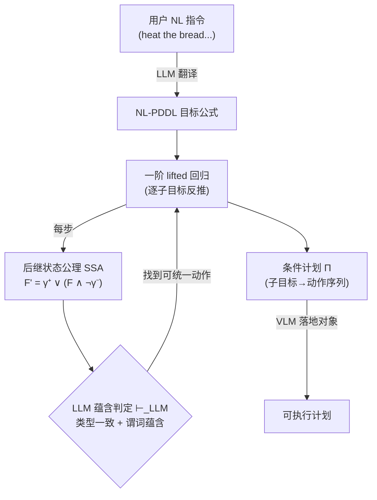

# Natural Language PDDL (NL-PDDL): Open-world Goal-oriented Commonsense Regression Planning in Embodied AI

**会议**: ICLR 2026  
**代码**: [https://github.com/D3Mlab/NL-PDDL](https://github.com/D3Mlab/NL-PDDL)  
**领域**: LLM Agent / 具身规划  
**关键词**: PDDL, 回归规划 (regression planning), 开放世界规划, 常识蕴含, 具身 AI, 提升式规划 (lifted planning)  

## 一句话总结
把经典 PDDL 的符号谓词替换成"带类型的自然语言谓词"，再用 LLM 蕴含判断驱动一阶回归规划，从而在部分可观测、目标与动作描述不对齐的开放世界里既保住符号规划的正确性，又获得 LLM 的常识泛化能力。

## 研究背景与动机
- **领域现状**：具身智能体要在开放世界（部分可观测 + 领域知识不完整）里规划，主流有两条路——LLM/VLM 直接生成计划，或经典 PDDL 符号规划器。
- **现有痛点**：LLM/VLM 缺少跟踪状态变化、推演动作后果的机制，长程规划易幻觉、多约束复杂目标常崩、黑盒不可验证；经典 PDDL 虽可证明正确，但预设完整模型、依赖对所有对象做穷举 grounding，且无法跨越"目标说法"和"动作说法"之间的语义错位（goal "heat the bread" vs action "toast the bread"），也不跨模态。
- **核心矛盾**：**正确性 vs 灵活性/常识** 二选一——符号规划有保证但僵硬，神经规划灵活但不可靠。
- **本文目标**：构造一个既享受符号回归规划的可靠性、又能用 LLM 做常识蕴含来消解目标-动作错位、并避免穷举 grounding 的开放世界规划框架。
- **核心 idea**：**用自然语言谓词替换 PDDL 符号谓词**，让"动作效果 ⊢ 目标字面量"这种本来要靠精确匹配的回归步骤，松弛成"LLM 判断蕴含关系"，并保留一阶变量做 lifted（提升式）回归，使复杂度与对象数量解耦。

## 方法详解

### 整体框架
NL-PDDL 沿用经典 PDDL 的形式骨架（谓词、变量、对象、动作的前置/添加/删除效果），但把所有符号替换成**带类型的自然语言串**，例如把 `isToasted(bread)` 写成 `"the (bread) is toasted" | "bread":"food"`，lifted 形式为 `"the (?o:food) is toasted"`。规划自顶向下做回归：从目标出发，反推每个动作执行前必须成立的子目标公式，递归构造一个把"子目标公式 → 动作序列"对应起来的条件计划 $\Pi$。整个过程在三处接入基础模型——LLM 把用户 NL 指令翻成 NL-PDDL 目标、LLM 在回归时判断蕴含、VLM 把 lifted 计划里的 NL 对象名落地到初始状态图像里的具体实体。

### 关键设计

**1. 类型化自然语言谓词替换：把符号 PDDL 升级成 NL-PDDL。** 经典 PDDL 用刚性符号表示谓词/对象/变量，NL-PDDL 把它们换成带类型注解的自然语言串：`?o:food` 表示变量 `?o` 类型为 food。NL-PDDL 问题定义为 $P = \langle G, A, F, h\rangle$，$G$ 是目标合取式，$F$ 是 lifted NL 谓词集，每个动作 $a(\vec{y})$ 带前置 `pre`、添加效果 `add`、删除效果 `del`，$h$ 是规划地平线。这层替换是后续一切的基础——因为谓词现在是自然语言，LLM 才能直接对它们做常识推理（例如推出 `isToasted(bread)` 蕴含 `isHeated(bread)`，而经典求解器除非有人手工编码否则无从得知）。同时它降低了非专家用户的描述负担，并容忍语义不完整、句法不完美的领域/状态描述。

**2. 基于蕴含的统一 + 后继状态公理驱动的 lifted 回归。** 回归规划的引擎是后继状态公理（SSA）：谓词 $F$ 在动作 $a_i$ 后为真，当且仅当它被正效果置真、或本来为真且未被负效果置假，
$$F'_{a_i}(\vec{x}) \equiv \gamma^+_{F,a_i}(\vec{x}) \lor \big(F(\vec{x}) \land \lnot\gamma^-_{F,a_i}(\vec{x})\big).$$
经典 PDDL 里目标谓词只能匹配同名动作效果，但 NL 里几乎不会出现精确同名匹配。NL-PDDL 把"统一(unification)"从句法等价松弛为**常识蕴含统一**：谓词 $F(\vec{z})$ 与目标 $P'(\vec{x})$ 可统一，需满足 (i) 每对对应类型满足 $t_x \vdash_{LLM} t_z$，(ii) 代入后 $F(\vec{z})\theta \vdash_{LLM} P'(\vec{x})\theta$。于是正谓词的回归写成 $\mathrm{Regr}_\vdash(P'(\vec{x}), a_i) \equiv F'_{a_i}(\vec{z})\theta$。这正是"heat the bread"目标能回归到"toast"动作的关键——LLM 判出"bread is toasted ⊢ bread is heated"，符号规划器做不到的语义桥接被 LLM 补上了。

**3. 负谓词回归的蕴含方向反转。** 删除效果带来的负谓词 $\lnot P'(\vec{x})$ 回归时，统一条件 (ii) 的蕴含方向要**反过来**：要求 $P'(\vec{x})\theta \vdash_{LLM} F(\vec{z})\theta$（目标蕴含前置，而非前置蕴含目标），回归结果取负 $\mathrm{Regr}_\vdash(\lnot P'(\vec{x}), a_i) \equiv \lnot F'_{a_i}(\vec{z})\theta$。直觉上：要保证"agent 不再持有 bread"，需要的是一个其效果蕴含"持有 bread"的动作（如 put），逻辑上正好对偶。这个方向区分保证了带删除效果的回归在 NL 蕴含下依旧 sound。

**4. 多重蕴含聚合 + DNF 回归。** 一个目标谓词可能被多个谓词蕴含（"cooked" 可由 "toasted" 或 "boiled" 蕴含）。NL-PDDL 把所有蕴含谓词聚合成析取：$\mathrm{Regr}_\vdash(P'(\vec{x}), a_i) \equiv \bigvee_{j=1}^m F'_{a_i,j}(\vec{x})$（负谓词同理，蕴含方向反向）。完整一阶公式则用 Algorithm 1 处理：先转成析取范式（DNF），对每个析取项里的每个字面量做上面的回归，再增量合并回 DNF。关键是这套回归全程操作 **lifted 变量**（"存在某个 x 能 toast bread"）而非具体对象（toaster1），只在找到合适对象时才实例化——因此规划的时间/空间复杂度**与对象、状态、动作的数量无关**，规避了经典 PDDL 的穷举 grounding 爆炸。论文也提醒：蕴含过多会在 DNF 展开时引发笛卡尔积爆炸、拖慢回归。

## 实验关键数据

三个域：闭世界 Blocksworld（含 Mystery/Randomized/Misalignment 变体）、开世界 ALFWorld Text、ALFWorld Vision；指标为成功率 SR 与 token 消耗。

### 主实验（RQ1，无错位）

| 数据集 | 方法 | Token | 专家轨迹 | SR |
|---|---|---|---|---|
| ALFWorld Text | GPT-4o (Direct) | 1.36M | 0 | 21% |
| | ReAct (w examples) | 5.51M | 0 | 81% |
| | Reflexion-10 | NA | 0 | 91% |
| | BUTLER (微调) | NA | 100K | 26% |
| | **NL-PDDL** | **443K** | **0** | **94%** |
| ALFWorld Vision | GPT-4o (Direct) | 1.82M | 0 | 8% |
| | EMMA-10 (微调) | NA | 15K | 82% |
| | **NL-PDDL** | **679K** | **0** | **84%** |

闭世界 Blocksworld：NL-PDDL 在 Blocksworld / Mystery / Randomized 三变体上稳定 **70% SR 且 0 token**；直接 LLM 规划器在 Mystery/Randomized 上 ≤1%（GPT-4o 0%）；Fast Downward 三个变体均 100%（但在错位场景崩）。

### 消融 / 错位实验（RQ2，目标-动作描述错位）

| 方法 | ALFWorld Text | ALFWorld Vision | Misalign Blocksworld |
|---|---|---|---|
| GPT-4o | 17% (↓5%) | 7% (↓1%) | 27% (↓7%) |
| ReAct w/ model | 23% (↓11%) | N/A | N/A |
| Fast Downward | N/A | N/A | **0%** |
| **NL-PDDL** | **91% (↓3%)** | **80% (↓4%)** | **70%** |

### 关键发现
- NL-PDDL 用 **1/10 的 token、零专家轨迹**，在 ALFWorld Text 达到 94% SR，超过所有微调模型和反思式规划器（Reflexion-10 需重复同一任务 10 次，不实用）。
- **错位是分水岭**：Fast Downward 在对齐符号任务上 100%，但 Misalignment Blocksworld 直接掉到 0%，因为它不做常识蕴含；NL-PDDL 几乎不掉（仅 ↓3~4%）。
- **复杂度鲁棒性**（RQ3）：NL-PDDL 在最优计划深度 ≤6 时完美，深度 8 降到 84%，深度 10+ 因运行时上限失败；但 LLM 规划器在所有深度都持续退化。目标约束数增加时 NL-PDDL 平均仅掉 3%。
- **跨模态泛化**：同一套回归框架在 Text 与 Vision 上都生效，视觉版只是把对象落地从文本匹配换成 VLM 接地，框架本身无需重训或改动，体现了 NL 表示对模态的解耦。

## 亮点与洞察
- **把"语义匹配"外包给 LLM、把"逻辑骨架"留给符号回归**，是一种干净的神经-符号分工：LLM 只做局部蕴含判定（可验证、可解释的小决策），全局正确性由回归框架保证。
- **错位（misalignment）这个问题被显式建模并解决**——现实里用户说法和系统动作命名几乎永远对不上，这是经典规划落地的真实障碍，本文给出了系统性答案。
- **lifted 回归让复杂度与对象数解耦**，配合 0-token 闭世界规划，token 效率碾压神经基线，对成本敏感的具身应用很有吸引力。

## 局限与展望
- **深度可扩展性**：运行时上限下深度 10+ 失败，长程任务仍受限于回归搜索的组合膨胀（多重蕴含的 DNF 笛卡尔积爆炸是明确瓶颈）。
- **依赖 LLM 蕴含判定的可靠性**：每个回归步的 sound 性建立在 $\vdash_{LLM}$ 判对的前提上，LLM 误判蕴含方向/类型一致会传播错误，论文未深入量化这部分错误率。
- **VLM 落地是单独环节**：视觉版靠 VLM 把 NL 对象名匹配到图像实体，感知错误会独立拖累成功率（Vision 84% vs Text 94%）。

## 相关工作与启发
- **LLM 推理增强**（CoT / ToT / ReAct / Reflexion）：靠提示和自反思激发推理，但在多约束、长程任务上不可靠、对 prompt 敏感、黑盒不可验证——本文正是针对这些短板。
- **LLM + 符号规划器**：一类工作让 LLM 生成 PDDL 再交给经典求解器；本文不同点在于不退回纯符号求解，而是把 NL 一路贯穿到回归内部，用蕴含统一直接解决错位。
- **启发**：神经-符号系统里，"把哪个决策交给 LLM"很关键——把 LLM 限制在局部、可被框架校验的蕴含判定上，比让它端到端生成整条计划要稳得多。

## 评分
- **新颖性**: ⭐⭐⭐⭐ 把 NL 谓词嵌入一阶回归、用 LLM 蕴含松弛统一条件并显式处理目标-动作错位，是干净且有形式化支撑的新组合。
- **实验充分度**: ⭐⭐⭐⭐ 三域 + 文本/视觉双模态 + 错位变体 + 深度/约束维度，对比覆盖直接/反思/微调/经典规划器，token 与 SR 双指标，较全面。
- **写作质量**: ⭐⭐⭐⭐ 形式化定义清晰、图示（回归流程、错位统一例子）到位，但符号密度高、对非规划背景读者门槛偏陡。
- **价值**: ⭐⭐⭐⭐ 给开放世界具身规划提供了可靠、低成本、抗错位的可落地方案，对 agent 与机器人规划方向有实际参考价值。

<!-- RELATED:START -->

## 相关论文

- [\[ICLR 2026\] ChinaTravel: An Open-Ended Travel Planning Benchmark with Compositional Constraint Validation for Language Agents](chinatravel_an_open-ended_travel_planning_benchmark_with_compositional_constrain.md)
- [\[CVPR 2025\] TANGO: Training-free Embodied AI Agents for Open-world Tasks](../../CVPR2025/llm_agent/tango_training-free_embodied_ai_agents_for_open-world_tasks.md)
- [\[ACL 2026\] GOAT: A Training Framework for Goal-Oriented Agent with Tools](../../ACL2026/llm_agent/goat_a_training_framework_for_goal-oriented_agent_with_tools.md)
- [\[ICLR 2026\] GTool: Graph Enhanced Tool Planning with Large Language Model](gtool_graph_enhanced_tool_planning_with_large_language_model.md)
- [\[ICLR 2026\] OpenAgentSafety: A Comprehensive Framework for Evaluating Real-World AI Agent Safety](openagentsafety_a_comprehensive_framework_for_evaluating_real-world_ai_agent_saf.md)

<!-- RELATED:END -->
