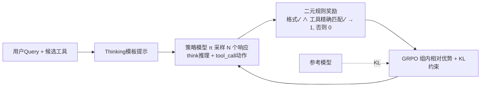

# Nemotron-Research-Tool-N1: Exploring Tool-Using Language Models with Reinforced Reasoning

**会议**: ICLR 2026  
**OpenReview**: [https://openreview.net/forum?id=yiE16lWzDj](https://openreview.net/forum?id=yiE16lWzDj)  
**代码**: 已开源（NVIDIA）  
**领域**: LLM Agent / 工具调用 / 强化学习  
**关键词**: 工具调用, 规则化强化学习, GRPO, 推理, 二元奖励, BFCL  

## 一句话总结
用一个只看「格式是否合规 + 工具调用是否精确匹配」的二元奖励做 R1 风格 GRPO 训练，无需任何蒸馏推理轨迹，就把 Qwen2.5-7B/14B 训成超过 GPT-4o 的工具调用推理模型。

## 研究背景与动机
**领域现状**：让 LLM 调用外部工具（搜索、Python 解释器、API）已是扩展模型能力的主流路线。主流做法是用更强的模型合成大量工具调用轨迹，再对学生模型做监督微调（SFT）。

**现有痛点**：合成数据往往只标注「该调哪个工具」这一动作步，缺少显式的推理过程；即便有人蒸馏出推理轨迹再 SFT，学生模型也只是模仿表层 pattern，产生「伪推理」（pseudo reasoning）——记住了轨迹却没内化决策逻辑，导致泛化能力受限。更糟的是 SFT 走 next-token 精确匹配，把参数顺序不同但语义等价的工具调用也当成错误，强迫模型做僵硬的字符串级模仿。

**核心矛盾**：工具调用需要的是「功能正确」而非「字符级一致」，而 SFT 的监督信号既贵（要蒸馏推理轨迹）又僵（强制 token 对齐），二者根本错位。

**本文目标**：回答两个问题——规则化 RL 能否有效训练工具调用模型？这套 RL 流水线该怎么设计？

**核心 idea**：**用二元规则奖励替代 SFT 监督**——奖励只评估推理格式合规性和工具调用的精确匹配（容许参数乱序），不监督任何中间推理轨迹，让模型在 GRPO 下自主习得推理策略。**轻量监督 + 结构灵活**正是它优于 SFT 的根源。

## 方法详解

### 整体框架
从标准 SFT 工具调用数据（用户 query + 候选工具）出发，让模型按固定模板先在 `<think>` 里推理、再在 `<tool_call>` 里输出调用；rollout 后用一个二元奖励函数打分（格式对且工具调用精确匹配才给 1，否则给 0），用 GRPO 做组内相对优势的策略优化。整条管线不需要任何带推理标注的轨迹。

### 关键设计

**1. 二元规则奖励：只奖励「完全正确」，反而最稳。** 奖励函数 $r(c_t, O_t)\in\{0,1\}$ 只在两个条件同时满足时给 1：格式正确（输出同时被 `<think></think>` 和 `<tool_call></tool_call>` 正确包裹）且工具调用精确匹配（预测的工具名与全部参数键值对与 ground-truth 完全一致）。形式化为 $r=\mathbb{1}[\text{FormatCorrect}(O_t)\wedge \text{ToolCallMatch}(a_t,a_t^*)]$。这种「全对才给分」的设计看似严苛，却比给部分分（0.2 给格式、再 0.2 给工具名）的细粒度奖励效果更好，作者归因于细粒度奖励容易诱发 reward hacking——模型只学会迎合格式或工具名等表层线索而不保证整体执行正确。消融里二元奖励在更真实的 Live 子集上以 80.38% vs 76.61% 明显胜出。

**2. 字典级匹配替代字符级对齐：把僵硬的 token 监督松绑成功能正确性。** 工具调用输出被解析成字典，与 ground-truth 做结构化精确匹配，只校验工具名是否对、必需参数是否齐全且键值对应。相比 SFT 的 next-token 精确预测，这套字典匹配天然容许参数顺序变化而不惩罚，逼模型关注「调用语义是否正确」而非「token 序列是否记得住」，这正是它在 OOD 输入上泛化更好的机制来源。

**3. 显式推理格式约束：先想后调，逼出内生推理。** Thinking 模板强制模型把推理放进 `<think>` 标签、把工具调用放进 `<tool_call>` 标签，且二者必须在同一条回复里。这个结构约束阻止模型「抄近路直接给答案」，鼓励它在调用前显式推理。消融证明这一约束至关重要：在二元奖励下去掉推理格式要求，Live 子集性能从 80.38% 直接掉到 76.24%。模板本身刻意保持轻量，避免过度僵硬的格式规则导致对特定 prompt pattern 过拟合，也便于训练后的模型接入 ReAct 等更复杂的提示策略。

**4. GRPO 组内相对优势优化：免价值网络的稳定 RL。** 对每个输入采样 $N$ 个候选响应得到奖励集 $\{r_1,...,r_N\}$，用组内标准化计算优势 $A_i = (r_i - \text{mean})/\text{std}$，再以 PPO 式裁剪目标加 KL 正则做更新：$L_{\text{GRPO}}=\mathbb{E}[\min(\rho_i A_i, \text{clip}(\rho_i,1-\epsilon,1+\epsilon)A_i) - \beta\,\text{KL}(\pi_\theta\|\pi_{\text{old}})]$。无需单独的价值网络，二元奖励配合组内相对比较即可给出稳定的学习信号。数据上统一清洗 xLAM 与 ToolACE 子集，过滤掉调用了候选列表外工具、JSON 解析失败的样本，多轮轨迹按单步切片成「当前目标调用 + 前序上下文」的单步预测实例。

## 实验关键数据

骨干为 Qwen2.5-7B/14B-Instruct，用 Verl 训练（batch 1024，lr 1e-6，温度 0.7，熵系数 0，KL 系数 1e-3，4 节点 × 8×H100）。

### 主实验（BFCL Overall 准确率）

| 模型 | Non-live | Live | Overall |
|------|---------:|-----:|--------:|
| GPT-4o | 88.10 | 79.83 | 83.97 |
| GPT-4o-mini | 86.77 | 76.50 | 81.64 |
| Gemini-2.0-Flash | 84.48 | 81.39 | 82.94 |
| DeepSeek-R1 | 87.35 | 74.41 | 80.88 |
| Hammer2.1-7B (FC) | 88.65 | 75.11 | 81.88 |
| ToolACE-8B (FC) | 87.54 | 78.59 | 82.57 |
| xLAM-2-70b-fc-r | 88.44 | 72.95 | 80.70 |
| **Tool-N1-7B** | 89.25 | 80.38 | **84.82** |
| **Tool-N1-14B** | 90.52 | 81.42 | **85.97** |

Tool-N1-7B 仅 7B 就超过 GPT-4o（+0.85%）和专用模型 Hammer2.1-7B（+2.97%）；Tool-N1-14B 比 GPT-4o 高约 2%。另在 API-Bank（7B 81.28 vs GPT-4o 77.16）和 ACEBench（14B 87.00 vs GPT-4o 87.00、7B 较基座 +30%）上同样大幅领先。

### 消融实验

**训练配方（5,518 条 DeepSeek-R1 蒸馏轨迹，等数据预算）**

| 配方 | Non-Live | Live | Avg |
|------|---------:|-----:|----:|
| No-Reason SFT (100%) | 86.40 | 76.54 | 81.47 |
| Reason-SFT (100%) | 87.54 | 77.87 | 82.71 |
| Reason-SFT+RL (50/50) | 88.19 | 78.16 | 83.17 |
| **RL (100%)** | 88.23 | 78.24 | **83.24** |

**奖励设计（Tool-N1-7B）**

| 奖励方案 | Non-Live | Live | Avg |
|----------|---------:|-----:|----:|
| 细粒度（格式部分分） | 87.83 | 79.64 | 83.74 |
| 细粒度（+函数名部分分） | 88.54 | 76.61 | 82.58 |
| 二元 w/o 推理格式 | 87.63 | 76.24 | 81.94 |
| **二元 w/ 推理格式** | 89.25 | 80.38 | **84.82** |

### 关键发现
- **Finding 1**：R1 风格训练随模型规模放大收益越大（0.5B/1.5B 几乎无提升，7B/14B 大幅增益），且跨骨干泛化好，同规模 Qwen 优于 LLaMA（推理底子更强）。
- **Finding 2**：常被奉为最佳实践的「SFT-then-RL」在工具调用上**并不优于纯 RL**（83.17% vs 83.24%），SFT 甚至可能拖累——印证 SFT 易诱发伪推理。
- **Finding 3**：二元奖励 > 细粒度奖励（尤其真实输入），且强制结构化推理至关重要（去掉掉 4 个点）。
- 训练中响应长度并未像其他 R1 工作那样持续增长——更长推理链未必带来更好工具调用，存在一个「够用即可」的长度。

## 亮点与洞察
- **「少即是多」的奖励哲学**：最简单的 0/1 二元奖励反而最抗 reward hacking，给部分分会让模型学偏到表层线索，这对所有想做规则化 RL 的人是反直觉但实用的教训。
- **挑战 SFT-then-RL 教条**：在工具调用这一可验证场景下，纯 RL 直接超过「先蒸馏推理再 SFT 再 RL」，质疑了跨领域照搬的训练范式假设。
- **把 SFT 数据变可验证信号**：核心贡献是把已有的标准工具调用数据（无需推理标注）直接转成完全可验证的 RL 训练信号，几乎零额外标注成本。
- **字典匹配的工程巧思**：用结构化字典匹配松绑参数顺序，既保证功能正确又给模型泛化空间，比字符串匹配优雅。

## 局限与展望
- **仅限单轮 / 单步评测**：BFCL/API-Bank/ACEBench 都排除了多轮场景，多轮工具调用（长程依赖、错误恢复）下规则奖励是否仍奏效未验证。
- **依赖可精确匹配的 ground-truth**：二元奖励要求有标准答案做字典匹配，对开放式 / 无唯一正确调用的任务难以直接套用。
- **骨干依赖性强**：方法对 Qwen 的推理底子高度依赖，LLaMA 上明显逊色，说明 RL 更多是「激发」而非「凭空赋予」推理能力。
- **小模型几乎无收益**：0.5B/1.5B 提升有限，方法的红利集中在中大模型。

## 相关工作与启发
- **R1 / DeepSeek-R1（Guo et al. 2025）**：本文直接把「只奖励最终答案 + 格式」的规则化 RL 思路从数学推理迁移到工具调用，是核心灵感来源。
- **GRPO（Shao et al. 2024）**：提供免价值网络、组内相对优势的 RL 优化骨架。
- **ToolACE / xLAM**：提供可复用的工具调用数据源，本文证明同源数据下 RL 优于其原生 SFT 模型（xLAM 上 +6.36%，ToolACE 上 +1.62%）。
- **启发**：任何「答案可程序化验证」的能力（代码、SQL、结构化抽取）都可能用同款二元规则奖励 + GRPO 绕开昂贵的轨迹蒸馏，把已有监督数据回收成 RL 信号。

## 评分
- **新颖性**: ⭐⭐⭐⭐ — 把规则化 RL 系统迁移到工具调用并非全新范式，但「二元奖励最优 + SFT-then-RL 未必更好」的系统性结论有真实价值。
- **实验充分度**: ⭐⭐⭐⭐⭐ — 三大 benchmark + 训练配方/奖励/数据组成/scaling/骨干多维消融，Findings 清晰，证据扎实。
- **写作质量**: ⭐⭐⭐⭐ — 动机—方法—发现逻辑顺畅，图表配合好；少量笔误但不影响理解。
- **价值**: ⭐⭐⭐⭐⭐ — 7B 超 GPT-4o 且完全开源、recipe 透明，对工业界训练工具调用模型有直接可复制的指导意义。

<!-- RELATED:START -->

## 相关论文

- [\[ICLR 2026\] ToolWeaver: Weaving Collaborative Semantics for Scalable Tool Use in Large Language Models](toolweaver_weaving_collaborative_semantics_for_scalable_tool_use_in_large_langua.md)
- [\[ICLR 2026\] A$^2$FM: An Adaptive Agent Foundation Model for Tool-Aware Hybrid Reasoning](a2fm_an_adaptive_agent_foundation_model_for_tool-aware_hybrid_reasoning.md)
- [\[ACL 2026\] Don't Adapt Small Language Models for Tools; Adapt Tool Schemas to the Models](../../ACL2026/llm_agent/don39t_adapt_small_language_models_for_tools_adapt_tool_schemas_to_the_models.md)
- [\[ACL 2026\] Meta-Tool: Efficient Few-Shot Tool Adaptation for Small Language Models](../../ACL2026/llm_agent/meta-tool_efficient_few-shot_tool_adaptation_for_small_language_models.md)
- [\[ICLR 2026\] Benchmarking LLM Tool-Use in the Wild](benchmarking_llm_tool-use_in_the_wild.md)

<!-- RELATED:END -->
