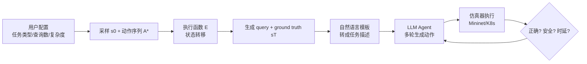

# NetArena: Dynamic Benchmarks for AI Agents in Network Automation

**会议**: ICLR 2026  
**OpenReview**: [https://openreview.net/forum?id=BPVPOtzoOz](https://openreview.net/forum?id=BPVPOtzoOz)  
**代码**: [https://github.com/Froot-NetSys/NetArena](https://github.com/Froot-NetSys/NetArena)  
**领域**: LLM Agent / 网络系统自动化 / 动态基准评测  
**关键词**: AI Agent, Network Automation, Dynamic Benchmark, 状态-动作抽象, 安全评测, 网络仿真器  

## 一句话总结
NetArena 用一套统一的「状态-动作」抽象 + 网络仿真器集成，把网络运维任务变成可无限动态生成查询、并能在仿真中自动核验正确性/安全性/时延的活基准，揭示当前 AI agent 在真实大规模网络任务上正确率仅 13–38%。

## 研究背景与动机

**领域现状**：LLM agent 正在向网络/系统运维这类高风险领域扩张——从数据中心容量规划、路由故障根因分析到策略合成。这些任务天然是评测 agent 能力的好"压力测试"：要求 agent 在部分可观测、操作有风险的约束下推理，不只追求答对，还要鲁棒、高效。

**现有痛点**：现有网络运维基准都是**静态、专家手工标注**的，即便投入数月也往往只有不到 300 条查询。小而静的基准带来三重问题：(1) 统计方差大，agent 之间的对比置信区间高度重叠、无法可靠区分谁强谁弱；(2) 容易被预训练数据污染（contamination）；(3) 泛化性存疑——一个任务上成功的 agent，换个拓扑/位置/负载就可能完全失败，且静态数据集难以枚举罕见但关键的边界场景。

**核心矛盾**：自然的解法是**动态生成查询**，但已有动态生成工作（DyVal、KIEval、LatestEval 等）主要面向算术/逻辑/程序合成这类"有确定性符号结构"的任务，无法迁移到网络域：一是网络问题没有确定性结构，难以合成真实查询和可靠的 ground truth（排障不是一步到位，要多轮观测-假设-动作）；二是网络任务的"成功"不止是输出匹配，agent 还必须避免有害副作用、遵守安全与时延约束——一条误配命令就可能让健康路径瘫痪、引发级联故障。

**本文目标**：构建一个能**按需无限生成**真实网络运维查询、并能在**仿真环境中自动多轮核验正确性、安全性、时延**的动态基准框架。

**核心 idea**：**统一状态-动作抽象 + 仿真器执行核验**——把异构网络任务统一建模成有限状态转移系统，通过"执行动作序列"自动产出查询和 ground truth；再把 agent 部署进高保真仿真器（Mininet、Kubernetes）里端到端执行，用仿真反馈而非预设答案来评判每一步。

## 方法详解

### 整体框架

NetArena 的核心是把千差万别的网络运维任务压成一个共同结构：所有任务都跑在某个网络/系统拓扑（图）之上，每步交互都是在分析或修改该拓扑的状态。于是任务被建模成有限状态转移系统 $(S, A, E)$——$S$ 是状态空间，$A$ 是原子动作函数集合，$E$ 是应用相关的执行函数。开发者接入新任务只需定义 $S$（如带连通性状态的路由拓扑）和 $A$（如 $\text{IP}(u)$ 表示链路 $u$ 的 IP 错误）。一条查询就是从初始状态 $s_0$ 出发、施加一串带参动作把系统推到目标状态的"执行剧本"，运行时通过随机采样初始状态与动作就能无限造题，再用仿真器在真实执行中核验 agent 的每一步。

### 关键设计

**1. 统一状态转移抽象：把异构任务塞进同一个生成管线**——这是整个框架的地基。任务目标被写成 $(S, A, E)$ 三元组，每个动作 $a_t \in A$ 由任务相关操作数 $\theta_t$ 参数化记作 $a_t(\theta_t)$；一条查询定义一段从 $s_0$ 出发、施加 $T$ 个带参动作的执行 episode：$s_{t+1} = E(s_t, a_t(\theta_t))$，$t=0,\dots,T-1$。关键好处是 ground truth 不再靠人标，而是**由执行函数本身确定性地算出来**，并能通过控制动作序列长度/动作类型来连续缩放任务复杂度，这正是已有符号化动态基准做不到的"既真实又可验证"。

**2. 区分 Constructive 与 Reactive 两类任务的造题与判分**——网络任务的交互形态本质不同，NetArena 据此设计两套生成逻辑。**Constructive（建构型，白盒）**任务意图明确（如数据中心容量规划"为新交换机找最优位置"），从已知初始状态 $s_{init}$ 出发，ground truth 是一段预定义动作序列 $A^* = \{a_0^*, \dots, a_{T-1}^*\}$，按执行函数复合得到目标态：$E(s_0, A^*) \triangleq (E(\cdot, a_{T-1}^*) \circ \cdots \circ E(\cdot, a_0^*))(s_0) = s_T$，判分时比对 agent 终态是否等于 $s_T$，还可额外对照其动作序列考察推理过程。**Reactive（反应型，黑盒）**任务（如路由误配"h1 连不上 h4，帮我修"）则反过来：先对健康态 $s_0$ 施加一段**对 agent 隐藏**的故障注入序列 $A_{inj}$ 得到 faulty 态 $s_{faulty}=E(s_0, A_{inj})$ 作为查询输入，要求 agent 把系统恢复到 $s_0$。由于恢复路径不唯一，判分只看是否复原到 $s_0$，**不**强求匹配具体注入序列——这让多轮排障的评测变得可行。

**3. 仿真器集成下的三维核验（正确性/安全性/时延）**——光对终态不够，NetArena 把 agent 嵌进 Mininet、Kubernetes 这类高保真仿真器端到端跑，用执行反馈做三类度量。**正确性**：$\text{CORRECT}(Q) = \mathbb{I}(\hat{s}_{LLM} \equiv s_T^*)$，其中 $\equiv$ 是应用相关的状态等价（可以是图同构这样的句法等价，也可以是"连通性恢复"这样的功能等价）。**安全性**是亮点——它**把每步安全从最终正确性解耦**，逐步核验：$\text{SAFE}_{all}(Q) = \mathbb{I}\big(\forall t \in [1,T],\, s_t = E(s_{t-1}, \hat{a}_{t-1}(\hat{\theta}_{t-1})) \wedge s_t \models C_Q\big)$，约束 $C_Q$ 覆盖结构不变量（如不跨层违规）和操作保证（如不擅改、不中断服务）。**时延**则统计 agent 发了多少条命令、端到端耗时，刻画"修得又快又省"的能力。这样同一个 agent 会暴露出"答对了但违反约束"或"很安全但修不好/太慢"的权衡，是静态只看正确性的基准看不到的。

**4. 配置驱动的随机采样造题，天然抗污染**——用户只需给高层配置（查询数量、复杂度、任务类型），NetArena 每轮评测都用随机采样动态生成全新查询集，保证覆盖广度的同时，让 agent 始终被测在"没见过"的题上，从机制上压低数据污染风险（基准从 High contamination 降到 Low/Dynamic）。

## 实验关键数据

**Setup**：基于 GPT-4o 与 Qwen2.5-72B 两个底座，各配 CoT 与 Few-shot 两种 prompting，外加 GPT-4o + ReAct，共 5 个 agent；落地到三个代表性任务：容量规划（CP，Google 多层数据中心抽象，12 种动作）、路由误配（Routing，Mininet）、微服务策略部署（K8s，Google 微服务 demo）。

### 主实验表格（基准对比）

| Benchmark | 规模 | 正确率(95% CI) | 安全/时延 | 污染风险 | 泛化性 |
|---|---|---|---|---|---|
| NeMoCopilot | 33 | 94% [-] | N/A | High (静态) | Low (管理) |
| AI4OpsLab | 48 | 59% [-] | N/A | High (静态) | Low (DevOps) |
| NetConfEval | 3200 | 100% [-] | N/A | High (静态) | Low (配置) |
| **NetArena (Ours)** | **9,250 (无限)** | **44% [0.01, 0.14]** | **35% / 18s** | **Low (动态)** | **High (管理/K8s/路由等)** |

### 消融实验（查询规模对统计可靠性的影响）

| 设置 | 小查询集 | 大查询集 | 效果 |
|---|---|---|---|
| CP | 100 | 5000 | 置信区间重叠从 >50% → 0 |
| Routing | 150 | 2250 | 误差棒大幅收窄 |
| K8s | 150 | 2000 | 暴露 GPT+ReAct 安全率显著偏低 |
| 整体 | <200 | >4000 | CI 重叠从 85% → 0% |

### 关键发现
- **Agent 表现惊人地差**：三任务平均正确率仅 24%，最好的 agent 也低于 60%；大规模真实查询下各 agent 平均仅 13–38%，最低仅 3%。
- **小基准统计不可靠**：<200 条查询时平均正确率虚高到 38%、误差棒重叠严重，无法可靠区分 agent 强弱；扩到 5000 条后 GPT+ReAct 才显现为明确赢家。
- **只看正确性会漏判**：K8s:150 上 GPT+ReAct 与 QWen+Fewshot 难分伯仲，但 K8s:2000 上 GPT+ReAct 安全率明显更低——正确率相近时安全维度才是关键区分。
- **失败模式多样**：跨任务可归为安全违规（如删掉运行中的 pod）、控制逻辑错误（如先配 IP 再激活接口、命令顺序错）、操作错误（如幻觉不存在的节点属性、漏写 K8s namespace）。
- **SFT 行为不一致**：正确性上 SFT 模型容易过拟合训练数据复杂度，只有跨全难度训练的模型泛化好；安全性上反而是最简单难度训练的 SFT 模型泛化最佳——这类细粒度结论得益于 NetArena 的复杂度可控 + 多维度量。

## 亮点与洞察
- **把"动态基准"真正带进网络系统域**：以往动态生成局限于算术/逻辑/程序，本文用执行函数自动产 ground truth，解决了网络任务"无确定性结构、ground truth 难自动化"的核心障碍。
- **安全与正确性解耦、逐步核验**：在高风险运维场景里，"过程是否每步都安全"比"最后答没答对"更重要，这一度量设计直击 agent 真实部署的命门。
- **统计可靠性论证扎实**：用 Bernoulli SEM 计算置信区间，定量展示"小基准不可信"（CI 重叠 85%→0%），把"基准要够大"从直觉变成可度量的结论。
- **超越评测的用途**：同一框架可挂奖励模型做 on-policy RL 微调，也能定向生成对抗性查询去探测模型在罕见角落 case 的弱点。

## 局限与展望
- **仅 3 个任务、5 个 agent**：虽宣称统一抽象可泛化，但当前仅在 CP/Routing/K8s 三类任务、GPT-4o 与 Qwen 两个底座上验证，对更复杂运维场景（如跨域路由、大规模故障级联）和更新模型（o1/R1 类推理模型）的覆盖仍有限。
- **接入新任务的工程成本**：开发者需手工定义状态空间 $S$、动作空间 $A$ 和执行函数 $E$，对动作语义和安全约束的建模质量直接决定基准质量，存在主观设计空间。
- **仿真 ≠ 生产**：高保真仿真器逼近但不等于真实生产环境，部分真实世界的硬件故障、性能抖动、复杂依赖难以完全复现。
- **展望**：作者已指出 RL 微调与对抗查询生成两个方向；进一步可扩展到更多任务族、引入更强推理 agent，并研究如何从仿真评测结果安全迁移到真实部署。

## 相关工作与启发
- **通用 agent 基准**（SWE-Bench、MLE-Bench、RE-Bench、CORE-Bench）测代码/ML 工程能力，但不触及网络部署级可靠性。
- **网络/系统域 LLM 评测**（AIOpsLab 48 任务、NetConfEval、WebArena、OSWorld、BFCL）多为静态、专家手工标注，可扩展性差、污染风险高。
- **动态基准生成**（DyVal、KIEval、LatestEval、Dysca）面向通用推理，难迁到 ground truth 依赖系统执行的网络域——NetArena 正是补上了这块空白。
- **启发**：对任何"高风险、多轮交互、副作用敏感"的 agent 评测（运维、机器人、金融操作等），"统一状态-动作抽象 + 执行环境核验 + 安全与正确性解耦"是一套可复用的方法论。

## 评分
- **新颖性**: ⭐⭐⭐⭐ 把动态基准生成首次系统性地落到网络运维域，统一状态-动作抽象 + 仿真器核验的组合切中了"ground truth 难自动化"和"安全难评测"两个真问题。
- **实验充分度**: ⭐⭐⭐⭐ 三任务、五 agent、置信区间定量分析、SFT 泛化研究都有，论证"小基准不可信"很有说服力；扣分在任务族与模型覆盖仍偏窄。
- **写作质量**: ⭐⭐⭐⭐ 动机层层递进、抽象形式化清晰、图表（统一抽象图、失败模式表、CI 对比图）配合到位。
- **价值**: ⭐⭐⭐⭐ 给 AI agent 进入高风险网络运维提供了可无限造题、可核验安全的评测底座，并能延伸到 RL 微调与对抗探测，对 agent 可靠性研究有实际推动作用。

<!-- RELATED:START -->

## 相关论文

- [\[ICLR 2026\] CoLLMLight: Cooperative Large Language Model Agents for Network-Wide Traffic Signal Control](collmlight_cooperative_large_language_model_agents_for_network-wide_traffic_sign.md)
- [\[ICLR 2026\] LongHorizonUI: A Unified Framework for Robust Long-Horizon Task Automation of GUI Agent](longhorizonui_a_unified_framework_for_robust_long-horizon_task_automation_of_gui.md)
- [\[CVPR 2025\] Visual Agentic AI for Spatial Reasoning with a Dynamic API](../../CVPR2025/llm_agent/visual_agentic_ai_for_spatial_reasoning_with_a_dynamic_api.md)
- [\[ICLR 2026\] EXP-Bench: Can AI Conduct AI Research Experiments?](exp-bench_can_ai_conduct_ai_research_experiments.md)
- [\[ICLR 2026\] Gaia2: Benchmarking LLM Agents on Dynamic and Asynchronous Environments](gaia2_benchmarking_llm_agents_on_dynamic_and_asynchronous_environments.md)

<!-- RELATED:END -->
