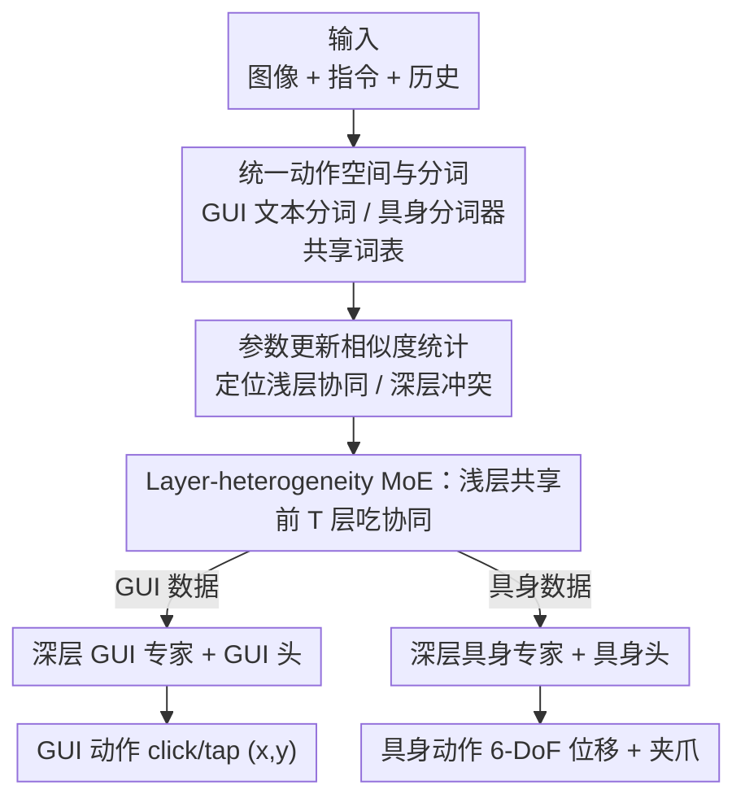

# OmniActor: A Generalist GUI and Embodied Agent for 2D&3D Worlds

**会议**: ICLR 2026  
**OpenReview**: [https://openreview.net/forum?id=oJAIjUDxkZ](https://openreview.net/forum?id=oJAIjUDxkZ)  
**代码**: 无  
**领域**: Agent / 多模态VLM  
**关键词**: 通用智能体, GUI Agent, 具身智能, MoE, 参数冲突

## 一句话总结
针对「把 GUI 操作数据和具身机器人数据混在一起训练反而互相拖后腿」的现象，本文发现两类数据在浅层协同、深层冲突（类比人脑「大脑—小脑」分工），提出 Layer-heterogeneity MoE——浅层共享参数吃协同、深层分离参数避冲突，再统一两类任务的动作空间收集大规模数据，训出一个在 GUI 和具身任务上都超过各自专用 SOTA 的通用智能体 OmniActor。

## 研究背景与动机
**领域现状**：多模态大模型正从「会看会说」走向「能主动干活」的多模态智能体。目前这类工作分成两条互不相通的支线：一条是 GUI Agent，在 2D 数字世界里点按钮、填表单、跨 App 操作（如 UI-TARS、OS-Atlas、Aguvis）；另一条是具身智能体，在 3D 物理世界里控制机械臂抓取、摆放（如 OpenVLA、π0）。两边各自卷各自的 benchmark。

**现有痛点**：现实任务常常要求智能体在两个世界之间来回切换——比如「先在手机 App 上下单买菜，再让机械臂把菜从袋子里拿出来」。但现有通用智能体（Magma、GEA、NaviMaster）虽然能同时干两类活，在各自单项任务上的成绩却普遍低于专用智能体。作者自己做的第一个实验更直接：把 GUI 数据和具身数据简单混在一起训练，结果两边性能都掉了。

**核心矛盾**：问题根源在于两类数据既冲突又协同，而现有方法缺乏机制去区分对待。冲突来自动作形态差异巨大——GUI 动作是文本描述的离散操作（如 `click(x, y)`），具身动作是连续的 6 自由度末端位移；协同则来自任务结构相同——都是「观察环境 + 理解指令 + 输出动作」，对环境和指令的理解能力本应互相增强。一刀切地共享或分离全部参数，都只能抓住一头。

**本文目标**：造一个既能吃到协同红利、又能避开冲突的通用智能体，让它在 GUI 和具身任务上都不输于专用模型。

**切入角度**：作者从「参数更新方向」这个优化视角去量化冲突与协同——如果 GUI 数据和具身数据对某个参数的更新方向一致，就该共享；方向相悖，就该分离。统计后发现：**浅层参数的更新方向高度一致，深层参数则明显发散**。这恰好对应人脑的「大脑—小脑」机制：靠近感官输入的大脑（浅层）做通用的环境/指令理解，靠近运动输出的小脑（深层）负责执行各异的具体动作。

**核心 idea**：浅层共享、深层分离——用一个按层异构的 MoE 结构吃协同、避冲突，再统一动作空间喂大规模数据。

## 方法详解

### 整体框架
OmniActor 以 Qwen2-VL / Qwen2.5-VL 作为基座 MLLM，从「数据」和「结构」两个角度同时改造。数据侧：把 GUI 和具身两类样本统一成同一种格式（系统提示 + 图像 + 任务指令 + 动作），其中 GUI 动作直接用文本分词器处理，具身动作经专门的「具身分词器」离散化后映射进同一套词表，形成统一动作空间。结构侧：把 Transformer 按深度切成两段——前 $T$ 层（浅层）所有参数共享，处理任意一类数据；$T$ 层之后（深层）注意力、FFN、LayerNorm 乃至预测头全部按任务分成两套专家（GUI 专家 / 具身专家），推理时已知任务类型，直接走对应分支。

整体数据流是一条清晰的串行管线：

### 关键设计

**1. Layer-heterogeneity MoE：浅层共享吃协同、深层分离避冲突**

这是本文的核心结构，直接针对「混合训练掉点」的痛点。作者把基座 LLM 的 $L$ 层按一个深度阈值 $T$ 切两段。**浅层** $\ell \in \{1,\dots,T\}$ 所有参数共享，GUI 和具身数据走同一套注意力与 FFN：

$$x'_\ell = \mathrm{MSA}(\mathrm{LN}(x_{\ell-1})) + x_{\ell-1}, \qquad x_\ell = \mathrm{FFN}(\mathrm{LN}(x'_\ell)) + x'_\ell$$

**深层** $\ell \in \{T+1,\dots,L\}$ 则按数据类型分流到两套独立参数——GUI 数据走 $\mathrm{MSA}_{gui}/\mathrm{FFN}_{gui}/\mathrm{LN}_{gui}$，具身数据走对应的 $\mathrm{rob}$ 版本，连最后的预测头 $h_{gui}$ 与 $h_{rob}$ 也分开。为什么有效：浅层做的是「看懂环境、读懂指令」这种两类任务共通的理解，共享反而让数据互相增益；深层做的是「吐出 click 坐标 / 吐出连续位移」这种形态迥异的动作生成，分离才能避免两类梯度互相打架。这个设计让 OmniActor 不仅超过现有通用智能体，甚至在各自单项上压过只用单一数据训的 OmniActor-GUI 和 OmniActor-EA。

**2. 参数更新相似度：用数据驱动的方式找到该在哪一层切开**

阈值 $T$ 不是拍脑袋定的，作者提出了 **parameter update similarity** 这个指标来量化每个参数「该共享还是该分离」。做法：对某个参数（如第一个 FFN 的 gate proj），分别只用 GUI 数据训练得到参数变化量 $d_{gui}$、只用具身数据训练得到 $d_{robot}$，两者的余弦相似度就是该参数的更新相似度。相似度高说明两类数据想往同一个方向推它、可以共享；相似度低说明方向相悖、应当分离。作者对 FFN 的 gate/up/down proj 和注意力的 q/k/v/o proj 逐层统计（图 4），发现浅层相似度显著高于深层，据此把阈值经验性地设为 $T=8$。这把「大脑—小脑」的类比从一个直觉锚定成了可测量的依据，也是整个结构设计的合法性来源。

**3. 统一动作空间与具身动作分词：让一套词表同时表达点击和位移**

要喂大规模混合数据，前提是 GUI 和具身动作能进同一个模型。作者把所有样本统一成 ShareGPT 格式（系统提示 + 图像 + 指令 + 动作）。GUI 动作本就是文本（如 `pyautogui.click(x=0.634, y=0.927)`），直接用基座 MLLM 的文本分词器即可。具身动作是 7 维向量——6-DoF 末端位移 $(pos_x,pos_y,pos_z,rot_x,rot_y,rot_z)$ 加一维夹爪开合，各维归一化到 $[-1,1]$，作者把该区间均匀离散成 $K$ 个桶，并从基座词表里挑出 $K$ 个**最低频**的 token ID 分配给这些桶（避免占用常用语义 token）。于是一条具身动作 `[0.043, -0.075, -0.579, 0.0, -0.147, -0.080, 1.0]` 被映射成 token 序列 `[151510, 151500, 151482, 151515, 151515, 151516, 151642]`。两类动作共享同一套词表、形成统一动作空间后，就能在 706K GUI + 669K 具身（重采样 5 倍后约 1:5）的大规模数据上联合训练。

### 损失函数 / 训练策略
两阶段训练：先在 GUI grounding 数据（OS-Atlas + UGround + Aguvis + Aria-UI，约 3.4M 样本）上训练，让模型先学会精准定位 GUI 元素（具身场景元素简单，跳过此阶段）；再用轨迹数据训练成可执行任务的智能体，GUI 用 Aguvis、具身用 LIBERO，轨迹训练阶段总量约 4.1M。由于具身动作是连续点序列、与 MLLM 常规输出差异大，作者把具身数据**重采样 5 次**以保证充分学习，使 GUI:具身比例约 1:5。推理时假设任务类型已知，直接选对应分支。

## 实验关键数据

### 主实验
LIBERO-90 为具身（机械臂控制）benchmark，AndroidControl 与 GUI Odyssey 为 GUI benchmark，指标均为成功率（%）。

| 智能体 | LIBERO-90 | AndroidControl-Low | AndroidControl-High | GUI Odyssey |
|--------|-----------|--------------------|--------------------|-------------|
| UI-TARS-7B（GUI 专用，闭源） | - | 90.8 | 72.5 | 87.0 |
| ScaleTrack-7B（GUI 专用） | - | 86.6 | 77.9 | 65.3 |
| π0（具身专用） | 87.3 | - | - | - |
| OpenVLA（具身专用） | 73.5 | - | - | - |
| Magma（通用） | 34.7 | 52.1 | 32.7 | 51.0 |
| GEA（通用） | - | - | 57.3 | - |
| OmniActor-GUI（仅 GUI 训练） | - | 88.4 | 74.5 | 63.0 |
| OmniActor-EA（仅具身训练） | 63.4 | - | - | - |
| **OmniActor** | **69.5** | **87.5** | **77.1** | **66.0** |

关键对比：相比只用具身数据训的 OmniActor-EA，OmniActor 在具身任务上成功率高 6.1%（63.4 → 69.5）；相比只用 GUI 数据训的 OmniActor-GUI，OmniActor 在 GUI 任务上平均高 1.3%，且在长链轨迹的 AndroidControl-High（74.5 → 77.1）和 GUI Odyssey（63.0 → 66.0）上提升尤为明显——说明协同对「长链路规划」帮助最大。

### 消融实验
参数共享/分离策略的对比（Avg 为四项均值）：

| 配置 | LIBERO-90 | AndroidControl-Low | AndroidControl-High | GUI Odyssey | Avg |
|------|-----------|--------------------|--------------------|-------------|-----|
| OmniActor-EA&GUI（直接混合） | 50.5 | 86.3 | 71.0 | 60.8 | 67.2 |
| OmniActor hard（全层分离） | 59.5 | 85.6 | 75.2 | 63.9 | 71.1 |
| **OmniActor（浅共享深分离）** | **69.5** | **87.5** | **77.1** | **66.0** | **75.0** |
| OmniActor router（加路由的 MoE） | 64.0 | 86.0 | 72.6 | 66.1 | 72.2 |

### 关键发现
- **直接混合是最差解**（Avg 67.2）：具身任务从 63.4 暴跌到 50.5，证实冲突真实存在且代价高。
- **全分离能避冲突但丢协同**（Avg 71.1）：比混合好，但因为浅层也被切开、吃不到协同，仍不如浅共享深分离的完整模型。
- **完整模型最优**（Avg 75.0）：浅共享深分离同时拿下协同与避冲突两份收益。
- **提升来自任务划分而非 MoE 容量**：OmniActor router（让 token 自己学路由）只有 72.2，反而不如按任务硬分流，说明关键是「按任务正确切分」，不是单纯堆专家容量。
- **跨基座泛化**：换成更强的 Qwen2.5-VL 7B，平均成功率从 75.0 升到 79.3（+4.3%），GUI 任务逼近闭源 SOTA UI-TARS-7B，验证该结构不绑定特定基座。

## 亮点与洞察
- **「大脑—小脑」类比 + 可测量指标的双重论证**：先用 parameter update similarity 量化出「浅层协同、深层冲突」，再用人脑分工类比给出直觉，把一个结构设计同时讲成了「有数据支撑」和「符合直觉」，说服力强。
- **router 对照实验很点睛**：很多 MoE 工作默认「让模型自己学路由更好」，本文却用实验反证——在这个场景里，已知任务类型的硬分流优于软路由，说明收益来自正确的归纳偏置而非容量，这个 negative result 很有价值。
- **统一动作空间的小 trick**：用词表里最低频的 token ID 来承载离散化的具身动作，既复用了现成词表、又避免污染常用语义 token，是个可直接迁移到其他「连续动作 → 离散 token」任务的实用做法。
- **「该共享还是该分离」可以量化**：用参数更新方向的余弦相似度来决定网络哪部分共享、哪部分分离，这个思路可推广到任意多任务/多领域联合训练中去定位冲突层。

## 局限与展望
- **推理时假设任务类型已知**：模型靠「已知是 GUI 还是具身」来选分支，但真正交错的现实任务（边操作 App 边控制机械臂）中任务类型边界模糊，缺少自动判别机制，这是离「真·无缝交错」最大的一步差距。
- **只有两类世界、两套专家**：当前是 GUI / 具身二分。若要扩展到更多模态（导航、游戏、多机器人形态），是否还能保持「浅共享深分离」的干净二分、专家数增多后冲突结构是否依旧，论文未验证。
- **阈值 $T=8$ 偏经验**：虽有相似度统计支撑，但具体切点仍是手工设定的单一阈值，没有探索按参数/按模块的更细粒度自适应切分。
- **协同对 GUI 的增益其实偏小**：GUI 平均仅 +1.3%，主要红利集中在长链任务和具身侧；对短链 GUI 任务，混合训练带来的协同并不显著。

## 相关工作与启发
- **vs Magma**：Magma 把 GUI 和具身动作统一成 set-of-mark / trace-of-mark 并用视频增广动作监督，本文不改动作表示而是改**网络结构**（按层异构 MoE），直接从优化冲突的根源入手，主任务成绩也明显更高（如 LIBERO-90 34.7 → 69.5）。
- **vs GEA**：GEA 用连续多形态分词器做混合动作预测并叠加在线 RL，本文走纯 SFT 路线，靠结构设计而非 RL 来调和冲突，更轻量。
- **vs NaviMaster**：NaviMaster 把 GUI 和具身都建模成 MDP、用 RL + 距离感知奖励提升泛化，本文不靠 RL，而是用「参数更新相似度」这一离线统计来指导参数共享/分离，思路更偏「先诊断冲突、再对症下药」。

## 评分
- 新颖性: ⭐⭐⭐⭐ 「参数更新相似度量化冲突 + 浅共享深分离」是干净且有洞察的结构设计，类比与实证并重。
- 实验充分度: ⭐⭐⭐⭐ 覆盖 GUI/具身/通用三类对手 + 共享分离策略消融 + 跨基座验证，但缺真正交错任务的端到端评测。
- 写作质量: ⭐⭐⭐⭐ 动机—诊断—设计的逻辑链清晰，图 1/4 直观，叙事流畅。
- 价值: ⭐⭐⭐⭐ 给「多领域联合训练如何调和冲突」提供了可量化、可迁移的范式，对通用智能体方向有实际推动。

<!-- RELATED:START -->

## 相关论文

- [\[ICLR 2026\] GTA1: GUI Test-time Scaling Agent](gta1_gui_test-time_scaling_agent.md)
- [\[ICLR 2026\] M²-Miner: Multi-Agent Enhanced MCTS for Mobile GUI Agent Data Mining](m2-miner_multi-agent_enhanced_mcts_for_mobile_gui_agent_data_mining.md)
- [\[ICLR 2026\] AgentSynth: Scalable Task Generation for Generalist Computer-Use Agents](agentsynth_scalable_task_generation_for_generalist_computer-use_agents.md)
- [\[ICLR 2026\] LongHorizonUI: A Unified Framework for Robust Long-Horizon Task Automation of GUI Agent](longhorizonui_a_unified_framework_for_robust_long-horizon_task_automation_of_gui.md)
- [\[ECCV 2024\] Agent3D-Zero: An Agent for Zero-shot 3D Understanding](../../ECCV2024/llm_agent/agent3d-zero_an_agent_for_zero-shot_3d_understanding.md)

<!-- RELATED:END -->
