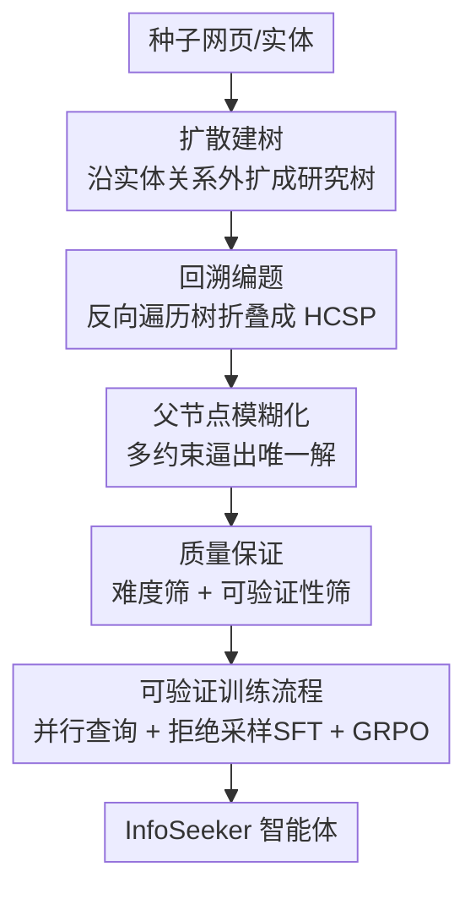

# Open Data Synthesis for Deep Research

**会议**: ICLR 2026  
**OpenReview**: [https://openreview.net/forum?id=2c9TjRbAib](https://openreview.net/forum?id=2c9TjRbAib)  
**代码**: 开源（论文称配套发布代码与数据集）  
**领域**: Agent / LLM 推理 / 数据合成  
**关键词**: 智能体搜索, 深度研究, 数据合成, 层级约束满足, 可验证 QA

## 一句话总结
本文提出 InfoSeek 数据合成框架，把"深度研究"任务形式化为**层级约束满足问题（HCSP）**，用"扩散—回溯"两阶段从种子网页自动长出研究树并反向编织成需要多层推理、答案唯一可验证的问答对，用合成的 5 万+ QA / 1.65 万条轨迹训练出仅 3B 的 InfoSeeker 智能体，在多跳与 BrowseComp-Plus 等基准上超过一众更大的开源乃至部分闭源系统。

## 研究背景与动机

**领域现状**：LLM 正成为信息获取的主入口，RAG（检索增强生成）在事实型问答上已被验证有效。但面对需要反复检索、拆解子问题、跨异构证据多步推理的复杂任务，单轮 RAG 力不从心。于是出现了**智能体搜索（agentic search）**范式：让 LLM 像研究员一样，迭代地"规划—检索—精炼—整合"，逐步逼近答案。其中越来越主流的做法是用强化学习端到端优化智能体，让模型在探索推理轨迹中靠奖励反馈进步。

**现有痛点**：RL 这条路对训练数据极度敏感——数据必须**够深**（能激励模型真正"深挖"而非浅尝辄止），答案必须**可验证**（才能给出可靠奖励）。但现有资源恰恰两头不靠：Natural Questions、HotpotQA 这类经典数据集监督信号太浅（单跳或浅多跳）；新近的合成数据要么仍停在多跳 QA 层面，要么干脆不公开。表 1 一栏栏对比下来，能同时给出大规模 QA、推理轨迹且开源框架的，此前几乎是空白。

**核心矛盾**：真实深度研究任务的结构复杂度（多层、既并行又串行的约束嵌套）无法被"扁平约束"或"线性多跳"这两种简单结构刻画，而现有合成方法恰恰只能造出这两类简单题，于是训练出的智能体学不到真正的深搜能力。

**本文目标**：① 给复杂信息检索任务一个统一、可控复杂度的形式化定义；② 据此造一个能自动、可扩展地批量生产"结构复杂且真实"训练数据的框架；③ 用最朴素透明的训练流程（SFT + 轻量 RL）验证数据本身的价值。

**切入角度**：作者观察到，真正的深度研究答案"不可直达"，必须逐层满足相互依赖的约束、在每一层剪掉与已积累证据矛盾的候选，最终收敛到唯一解——这天然是一棵树。既然目标结构是树，就可以**先正向把树长出来（扩散），再反向把树折叠成题（回溯）**。

**核心 idea**：用"扩散—回溯"在知识图谱式的网页关系上**正向生成、反向编题**，把每道题都构造成一个层级约束满足问题（HCSP），从而显式控制题目的结构复杂度，并保证答案唯一可验证。

## 方法详解

### 整体框架

InfoSeek 的核心是先给"深度研究"下一个数学定义，再围绕这个定义造数据。

**形式化（HCSP）**：给定问题 $x$，它含一组约束 $C_x=\{c_1,\dots,c_k\}$ 和一组子问题 $Y_x=\{y_1,\dots,y_m\}$，层级分解定义为

$$H(x)=\bigcap_{i=1}^{k} S(c_i)\ \cap\ \bigcap_{j=1}^{m} H(y_j),\qquad \bigcap \varnothing := U,$$

其中 $S(c_i)$ 是满足约束 $c_i$ 的实体集合，$U$ 为全集，最终答案 $A=H(q_H)$。这个定义统一了两类经典问题：当所有约束扁平独立时退化为**约束满足问题（CSP）** $A=\bigcap_i S(c_i)$（如"1938 年在普林斯顿读博 + 生于伦敦 + 毕业于剑桥"三个独立条件交集唯一指向 Alan Turing）；当约束串成依赖链时退化为**多跳问题（MHP）** $A=S^{(k)}(c)$（如先定位"破解 Enigma 的科学家"→ 其出生地伦敦 → 伦敦是哪国首都）。HCSP 则同时嵌套并行与串行依赖，更贴近真实深度研究。

**数据合成（Diffusion–Retrospection）**：拿到定义后，InfoSeek 用两阶段把 HCSP 实例造出来。**扩散阶段**从一个种子实体出发，沿实体关系不断向邻接网页外扩，长成一棵研究树 $T=(V,E)$，节点是知识实体或琐碎事实、边是语义关系；**回溯阶段**从树里采子树、反向遍历，把结构依赖和层级约束编织成一道自然语言问题，并对父节点做"模糊化"以拔高难度，最后经质量保证过滤，得到答案唯一可验证的 HCSP 题目。造好题后，再用并行查询模板 + 拒绝采样 SFT + GRPO 强化学习把数据喂给模型。

### 关键设计

**1. HCSP 形式化：给"深度研究"一个可控复杂度的统一定义**

针对"现有合成方法只能造扁平 CSP 或线性多跳"的痛点，本文把复杂信息检索抽象成层级约束满足问题：答案不可直达，必须逐层满足相互依赖的约束、在每层剪枝候选直至收敛到唯一解。其分解式 $H(x)=\bigcap_i S(c_i)\cap\bigcap_j H(y_j)$ 的妙处在于，CSP（$\bigcap_i S(c_i)$，约束扁平独立）和 MHP（$S^{(k)}(c)$，约束串成依赖链）都成了它的特例，而 HCSP 通过把"子问题"递归嵌进交集里，显式要求并行约束 + 串行依赖同时存在。这一步不只是换个说法——它让"题目难度/结构"变成**可设计、可控制**的量（后面用顶点数衡量复杂度），是整套数据合成能"按需造深题"的根基。

**2. 扩散建树：从种子正向长出富含层级依赖的研究树**

针对"如何系统性地造出又宽又深的依赖结构"，扩散阶段从单个种子根 $r$ 出发，递归地采样与已有实体 $v$ 相关的新实体 $w$ 并挂上新边，形如 $T'=(V\cup\{w\},\,E\cup\{(v,w)\})$。具体用两种算子控制形状：**模糊父节点（Blurring Parent Node）**——当某节点 $v$ 只有单个孩子或约束不足以唯一确定它时，从 $v$ 的源页面挑 $k$ 条候选集非空且互不包含（$S(c_i)\not\subseteq S(c_j),\ \forall i\neq j$）的声明，各自生成一个子节点，逼得"只有联合满足所有孩子约束才能锁定 $v$"，这增加了**并行约束的宽度**；**深度扩展（Expanding Depth）**——给带实体的节点按其文档里抽到的关系 $r(v,w)$ 接一个全新孩子 $w$，拉长推理链，制造**串行依赖的深度**。两个算子一宽一深，恰好对应 HCSP 定义里的并行与串行两种依赖。

**3. 回溯编题：反向折叠研究树成唯一可验证的 HCSP 题目**

针对"有了树怎么变成一道真正逼人多层推理的题"，回溯阶段与扩散方向相反——向内收缩、逆序遍历树。对节点 $v$，其叶子孩子 $\{w_1,\dots,w_k\}$ 产出约束 $C_v$，内部孩子产出递归子问题，于是

$$q_v=Q\big(C_v\cup\{Q(w_j)\mid w_j\ \text{是 }v\text{ 的内部孩子}\}\big),$$

其中 $Q(\cdot)$ 是把一组约束/子问题转成自然语言问题的递归函数；走到根 $r$ 就得到整道 HCSP 实例 $q=Q(r)$。这样模糊化步骤保证了足够的并行约束、深度扩展保证了串行依赖，编出的题既需层级推理、又因约束联合收敛而答案唯一。

**4. 双重质量保证：同时堵住"欠定"与"过定"**

针对树式构造天然会引入的两类质量问题——**欠定**（多约束合起来答案仍不唯一，留有歧义）与**过定**（单个约束就足以锁定答案，层级推理形同虚设），本文设计了两道把关。**难度筛**：用 Qwen2.5-32B-Inst 在无检索上下文下答题，全集仅 2% 正确，证明题目难以靠参数记忆蒙对，并把这 2% 答对的样本直接剔除以进一步拔高难度。**可验证性筛**：给 Gemini 2.5 Flash 提供真值支撑网页 + 干扰文档，要求它据此推出答案，凡返回错误、多解或无解的题一律过滤——这一步既挡掉欠定题，又确保每道留存题都有唯一可验证解。最终用 DeepSeek-V3 作算子模型造出 5 万+ 样本，总成本仅 \$571.8，大多数题落在 4–6 个顶点区间。

### 损失函数 / 训练策略

模型优化走"先模仿、后强化"的透明两段式：

- **可验证 rollout 模板**：每步以 `<think>` 反思已有证据、识别缺口，再在 `<search>` 里一次性产出多个多样化查询做**并行检索**；检索结果不直接注入，而是先经一个轻量精炼器（Qwen2.5-7B-Inst）抽取要点、压成与查询意图对齐的摘要，包进 `<information>`，信息够了才在 `<answer>` 给最终答案——既统一了推理痕迹格式，又降低了原始检索噪声。
- **拒绝采样 SFT**：让教师模型（Qwen2.5-72B）按上述模板答题，只保留**真正完成任务且最终答案正确**的轨迹，再用 Gemini 2.5 Flash 查掉走捷径的轨迹，得到纯净监督集，给后续 RL 一个稳定起点（缓解稀疏奖励下直接 RL 的冷启动不稳）。
- **GRPO 强化**：从 SFT checkpoint 出发，用 Group Relative Policy Optimization，奖励设计极简——格式与抽取答案都对则 $R=1$，否则 $R=0$。正因为 InfoSeek 的答案天然可验证，这个二元奖励才足够可靠。

## 实验关键数据

### 主实验

经典知识密集型 QA（单跳 NQ/TQA/PopQA + 多跳 HQA/2Wiki/MSQ/Bamb），指标为 Exact Match：

| 模型 | NQ | TQA | PopQA | HQA | 2Wiki | MSQ | Bamb | Avg |
|------|----|-----|-------|-----|-------|-----|------|-----|
| Vanilla RAG | 34.8 | 54.4 | 38.7 | 25.5 | 22.6 | 4.7 | 8.0 | 27.0 |
| AutoRefine-3B | 43.6 | 59.7 | 44.7 | 40.4 | 38.0 | 16.9 | 33.6 | 39.6 |
| InForage-3B | 42.1 | 59.7 | 45.2 | 40.9 | 42.8 | 17.2 | 36.0 | 40.6 |
| **InfoSeeker-3B** | 41.7 | 56.1 | **46.5** | **44.6** | **50.0** | **20.5** | **39.2** | **42.7** |

InfoSeeker-3B 平均 42.7 超过所有基线，多跳上优势尤其明显（2Wiki 50.0、Bamb 39.2 均为最佳）。

更难的 BrowseComp-Plus（830 题、固定 10 万网页语料）：

| 模型 | 检索器 | Acc | 平均调用数 |
|------|--------|-----|-----------|
| GPT-4.1 | BM25 | 14.6 | 11.22 |
| Sonnet 4 | BM25 | 14.3 | 9.95 |
| Qwen3-32B | BM25 | 3.5 | 0.92 |
| SearchR1-32B | BM25 | 3.9 | 1.78 |
| **InfoSeeker-3B** | BM25 | **15.3** | 8.24 |

仅 3B 的 InfoSeeker 达 15.3%，反超 GPT-4.1、Sonnet 4 等闭源系统，更远超 Qwen3-32B（3.5）、SearchR1-32B（3.9）等大得多的开源基线。

### 消融实验

| 配置 | 现象 | 说明 |
|------|------|------|
| Vanilla RAG | 各基准均最低 | 无智能体搜索 |
| + SFT（InfoSeek） | 明显优于 RAG | SFT 提供强初始化，缓解冷启动 |
| + RL（InfoSeeker-3B） | 全面提升 | 在 SFT 基础上进一步强化 |
| InfoSeeker-7B | 再涨一截 | 验证可扩展性 |
| 仅 NQ+HQA 训练 | BrowseComp 上几乎没深搜、调用次数少 | 浅数据学不出深搜行为 |
| <5 顶点子集 | 精度与调用次数双增 | 复杂度本身驱动深搜 |

### 关键发现
- **数据复杂度直接决定深搜行为**：只用 NQ+HotpotQA 训练，模型没动力发展真正的"深搜"，BrowseComp-Plus 上表现差、搜索调用次数也少；换上 InfoSeek，随着更复杂样本引入，搜索行为逐步变深——哪怕只用 <5 顶点的子集也能在精度和调用数上同时获益。
- **数据质量/结构可与模型架构同等重要**：InfoSeeker 用最朴素的训练协议就压过一众精心设计优化技巧的智能体基线，说明"造好数据"这件事的杠杆不亚于"调好模型"。
- **小模型也能被蒸出深研究能力**：3B 模型在 search-heavy 的 BrowseComp-Plus 上反超数十 B 的开源模型与部分闭源系统，凸显 pipeline 把深度研究能力压进紧凑 LLM 的效率。

## 亮点与洞察
- **把"造数据"升格成"造问题结构"**：HCSP 的真正价值不是又一个数据集，而是把题目的结构复杂度变成一个可设计、可度量（顶点数）的量，从源头控制智能体能学到多深——这套"先定义结构、再正反生成"的思路可迁移到任何需要可控难度训练数据的 agentic 任务。
- **扩散—回溯的对称性很巧**：正向扩散保证证据真实可溯（每个约束都来自真实网页），反向回溯保证题目唯一可验证（约束联合收敛），两者一长一折，天然解决了"合成数据既要真实又要可验证"的老难题。
- **模糊父节点是制造"必须联合推理"的关键机关**：要求 $k$ 条声明的候选集互不包含，逼得任何单约束都不足以锁定答案，从机制上消灭了"过定"捷径。
- **奖励可以做得极简，前提是数据可验证**：二元奖励 $R\in\{0,1\}$ 能跑通 GRPO，根源在于 InfoSeek 的答案唯一可验证——这提示"奖励工程"的负担可以前移到"数据构造"上。

## 局限与展望
- **作者承认**：当前只用了最基础的 RL（GRPO + 二元奖励），而数据集保留的中间步骤、检索标签等元信息其实能支撑更精细的 RL 目标，留作未来工作。
- **依赖强算子模型与外部裁判**：建树用 DeepSeek-V3，可验证性筛用 Gemini 2.5 Flash，难度筛用 Qwen2.5-32B，教师轨迹用 Qwen2.5-72B——整条 pipeline 对大模型 API 依赖较重，迁移到资源受限场景的成本未充分讨论。
- **可验证性以"唯一短答案"为前提**：答案平均仅 5–6 token，框架天然偏向有唯一实体答案的问题，对开放式、无唯一解的真实研究任务（如综述、权衡判断）覆盖有限。
- **网页/Wikipedia 语料的事实噪声与时效**：约束直接从网页声明抽取，若源页面本身有错或过时，可能注入到"可验证"答案中；框架虽宣称可扩展到 web 之外的领域，但跨域有效性主要靠论述而非充分实证。

## 相关工作与启发
- **vs 经典 QA 数据集（NQ / HotpotQA）**：它们只提供单跳或浅多跳的扁平监督，InfoSeek 用 HCSP 显式造层级依赖，深度与可控复杂度都不在一个量级。
- **vs 多跳合成数据（WebShaper / WebSailor 等）**：多数停在多跳 QA 或不公开，InfoSeek 是该领域首个完整开源（代码 + 5 万 QA + 1.65 万轨迹）且显式控制结构复杂度的框架。
- **vs RL 智能体搜索（Search-R1 / ZeroSearch / AutoRefine / InForage）**：这些工作聚焦优化算法/奖励/精炼 token，InfoSeek 把杠杆放在"训练数据的结构与质量"上，证明用最朴素的 SFT+轻量 RL 也能凭好数据反超它们。

## 评分
- 新颖性: ⭐⭐⭐⭐⭐ HCSP 形式化 + 扩散-回溯生成，把深度研究数据合成抬到结构可控的新高度
- 实验充分度: ⭐⭐⭐⭐ 覆盖单跳/多跳/BrowseComp 多基准 + 复杂度与规模消融，但 RL 仅用最基础设置
- 写作质量: ⭐⭐⭐⭐⭐ 定义—框架—方法—实验层层递进，CSP/MHP/HCSP 对比清晰
- 价值: ⭐⭐⭐⭐⭐ 首个开源深度研究数据合成框架，3B 反超大模型，数据与代码均放出，复现与延展性强

<!-- RELATED:START -->

## 相关论文

- [\[ICLR 2026\] WebWeaver: Structuring Web-Scale Evidence with Dynamic Outlines for Open-Ended Deep Research](webweaver_structuring_web-scale_evidence_with_dynamic_outlines_for_open-ended_de.md)
- [\[ICLR 2026\] A Benchmark for Deep Information Synthesis (DeepSynth)](a_benchmark_for_deep_information_synthesis.md)
- [\[ICLR 2026\] Deep Ignorance: Filtering Pretraining Data Builds Tamper-Resistant Safeguards into Open-Weight LLMs](deep_ignorance_filtering_pretraining_data_builds_tamper-resistant_safeguards_int.md)
- [\[ICML 2026\] Hunt Instead of Wait: Evaluating Deep Data Research on Large Language Models](../../ICML2026/llm_agent/hunt_instead_of_wait_evaluating_deep_data_research_on_large_language_models.md)
- [\[ICLR 2026\] Expanding the Capability Frontier of LLM Agents with ZPD-Guided Data Synthesis](expanding_the_capability_frontier_of_llm_agents_with_zpd-guided_data_synthesis.md)

<!-- RELATED:END -->
