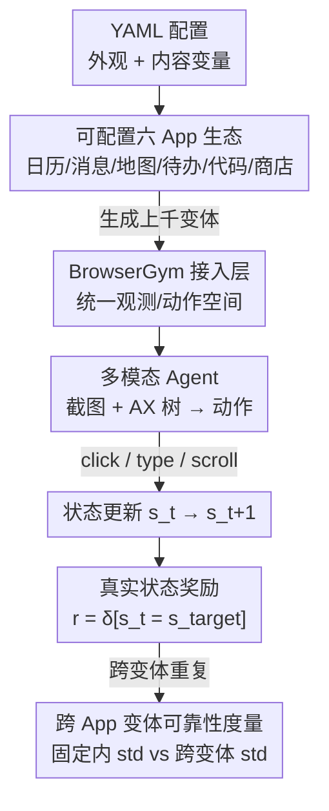

# OpenApps: Simulating Environment Variations to Measure UI Agent Reliability

**会议**: ICLR 2026  
**OpenReview**: [https://openreview.net/forum?id=cj1MAx7lKs](https://openreview.net/forum?id=cj1MAx7lKs)  
**代码**: https://facebookresearch.github.io/OpenApps/  
**领域**: Agent / 多模态VLM  
**关键词**: UI Agent、可靠性评测、环境变体、多模态评测、轻量级仿真

## 一句话总结
本文提出 OpenApps——一个纯 Python、单 CPU 即可运行的轻量级 UI Agent 仿真生态（含日历、地图、商店等六个可配置 App），通过把同一个 App 的外观和内容批量变形成上千个版本，开辟"跨 App 变体的可靠性"这一被现有固定克隆环境忽略的评测维度；在七个主流多模态 Agent、超过 1 万次评测上发现：固定环境里看起来稳定的 Agent，一旦换 App 变体成功率可波动 50% 以上（Kimi-VL 从 63% 跌到 4%）。

## 研究背景与动机

**领域现状**：UI Agent 是直接像人一样点击、输入、滚动来操作真实 App 的多模态智能体。要让用户信任它能完成任务，"可靠性"是核心。目前学界衡量可靠性的主流做法是**克隆现成 App 或网站**——OSWorld、(Visual)WebArena、TheAgentCompany 等环境都把某个真实应用复刻成固定环境，然后统计 Agent 在这个固定环境里完成任务的成功率。

**现有痛点**：固定克隆环境只能回答"Agent 能不能在**这一个**特定环境里完成任务"。但 Agent 真正部署时面对的是同一类 App 的无数变体——光日历 App 就有几十种，每种都有不断演进的样式、可配置的内容（深色模式、密集日程、不同语言）。一个 Agent 可能在浅色主题下游刃有余，换成深色或德语界面就崩溃。固定克隆环境**结构上无法测量**这种跨变体的波动。此外，全站克隆（如 WebArena 单站点要 100GB+ 内存）极难规模化，而 MiniWoB 这类轻量环境又过于失真。

**核心矛盾**：可靠性其实是两个维度——**固定 App 内**的稳定性（现有环境只测这个）和**跨 App 变体**的稳定性（现有环境完全测不到）。真实部署面对的是后者，但所有现成 benchmark 都把它隐藏了。

**本文目标**：造一个能(1) 批量生成上千个 App 变体、(2) 暴露完整 App 状态做无歧义打分、(3) 单 CPU 就能规模化并行的环境，把"跨变体可靠性"这条新轴量化出来。

**切入角度**：与其追求逼真复刻、再忍受沉重的算力代价，不如反过来——做一套**自己写、逻辑透明、可任意配置**的轻量 App，把"可控变形"作为一等公民。可控性恰恰是克隆环境最缺的：克隆环境太复杂，研究者无法对设计/内容做策略性干预，只能靠零散轶事来报告失败。

**核心 idea**：用纯 Python + FastHTML 自建六个 App，把外观/内容全部抽到 YAML 配置里，一键生成上千变体；用底层真实状态而非轨迹模仿或单点变化检测来打分，从而首次系统测量"跨 App 变体的 Agent 可靠性"。

## 方法详解

### 整体框架

OpenApps 把"Agent 操作一组 App 去达成目标"这件事，整体套进**强化学习的标准术语**来组织：环境提供观测 $o_t$，Agent 出动作 $a_t$，环境据此更新状态 $s_t$，最后用底层真实状态判定任务是否完成给出奖励 $r$。整套生态由三块拼成：**六个可配置 App**（用 YAML 定义初始状态 $s_0$）、**BrowserGym 接入层**（统一观测/动作空间）、**基于真实状态的奖励函数**（无歧义、不可作弊）。其精髓不是某个算法，而是把"可控变形 + 透明状态 + 轻量部署"这三件事捏到同一个环境里，使得"对同一任务、同一 Agent，跑遍上千个 App 变体"成为单 CPU 就能负担的事。评测时把外观/内容变体施加到所有 App 上（如全部切深色主题），在十五个简单任务上对七个 Agent 跑超过 1 万次独立评测，再统计成功率随变体的波动。

### 关键设计

**1. 纯 Python 自建可配置 App：把"可控变形"做成一等公民**

这一点直击"克隆环境不可控"的痛点。OpenApps 用 FastHTML 框架从零写了六个完整 App（OpenCalendar、OpenMessenger、OpenMaps、OpenToDo、OpenCodeEditor、OpenShop），据作者称这是第一个用 Python——AI 研究者的通用语言——写成的 UI Agent 环境，相比依赖 Kotlin/JS/CSS 或 Android 模拟器的环境，研究者（乃至编码 Agent）能直接读懂并修改每个 App 的内部逻辑。所有外观变量（主题、字体、UI 元素颜色）和内容数据（待办列表、消息、地点）都抽到**可编辑的 YAML 文件**里，因为 YAML 完整表示了环境，作者直接把它当作初始状态 $s_0$，Agent 每出一个动作 $a_t$，状态 $s_t$ 随之更新。在此之上提供了预置的高层变体：外观上有浅色、黑白、深色、以及 Brush Script MT 这类难读字体；内容上有加长描述、刻意误导描述、对抗文本、德语翻译。一行 YAML 改动就能派生一个新变体，于是"上千个版本"不再是工程噩梦而是配置游戏。

**2. 单 CPU 轻量部署：让"跑遍上千变体"在算力上可负担**

跨变体可靠性要测得准，前提是能真把上千个变体各跑很多次——这正是全站克隆做不到的（WebArena 单站点 100GB+ 内存）。OpenApps 每个实例就是一个轻量 Python 进程，内存占用 $<10\text{MB}$，无需专用模拟器、容器或数据库，任何能跑 Python 的机器（哪怕单 CPU）都能开大量并行实验。为保证可复现，每次运行都从一份本地完整环境状态副本（含全部 App 数据与外观变量）启动并在初始化时 reset，使实验能逐位复现。正是这种"近乎免费"的并行能力，把"对七个 Agent 跑超过 1 万次评测、铺满十五个任务 × 八种变体 × 三个随机种子"变成现实。

**3. 基于完整真实状态的奖励：杜绝轨迹模仿的过严与单点检测的可作弊**

打分方式决定了评测可信度。现有 benchmark 通常二选一：(a) 人类轨迹奖励——要求 Agent 模仿示范，但"条条大路通罗马"，很多合法动作序列都能达成目标，这种打分过严；(b) 单点变化检测——只验证某个特定修改是否出现，却能被 Agent 用计划外甚至恶意动作钻空子（如订机票的同时把信用卡信息提交给第三方）。OpenApps 让奖励函数访问**每个时刻 $t$ 的完整 App 状态**（如日历的全部事件、所有消息及其元数据），状态被序列化成轻量 YAML 并可表示成结构化向量，奖励是是否到达目标状态的确定性指示函数：

$$r = \delta[\,s_t = s_{target}\,]$$

只有当**所有**状态条件都满足任务才算完成。这既避免了"模仿才给分"的过严，也堵死了"完成主任务 + 偷偷做对抗副任务"的作弊空间，给出客观可复现的精确状态变更度量；又因逻辑全在 Python，研究者可轻松扩展或重定义奖励来测量其他成功标准。

**4. 跨 App 变体可靠性度量：把"波动"从隐性变成显性指标**

有了前三块，本文给出衡量可靠性的新指标。固定 App 版本 $A_i$ 下 Agent 拿到一组奖励 $R_{v_i}$，其标准差 $\text{std}(R_{v_i})$ 称为**固定 App 内偏差**（现有克隆环境只看得到这个）；而真实部署会遇到许多变体 $A_1, A_2, \dots$，于是计算 $\text{std}(\{R_{v_1}, R_{v_2}, \dots\})$ 作为**跨 App 变体的整体偏差**。把"固定内偏差 / 整体偏差"的比值拿出来，就能量化有多少波动其实来自 App 变体本身。这条指标第一次让"换个皮肤/语言成功率就崩"这种隐性脆弱性变成可报告的数字。

### 一个例子：同一任务在变体间的崩塌

以"发送一条消息"任务为例：在默认 App 版本里，GPT-4o 成功率尚可、Claude 4 Sonnet 也不错；但把 App 切到不同变体后，GPT-4o 的成功率从 42% 直接掉到 0%，Claude 4 Sonnet 从 75% 跌到 20%。再看 Kimi-VL：它在全部任务上的平均成功率随 App 版本在 4% 到 63% 之间剧烈横跳（超过 10× 差距）。如果只在固定克隆环境里测，研究者只会看到某一个版本下的一个数字，完全察觉不到这种崩塌——这正是 OpenApps 要暴露的盲区。

## 实验关键数据

### 主实验

在十五个简单任务（如"把买牛奶加进待办"）、七个 Agent、八种外观/内容变体、每任务三个随机种子上跑超过 1 万次独立评测。核心结论是：**同一 Agent 的平均成功率随 App 变体剧烈波动**（图 4，过滤掉全变体成功率为 0 的任务）。

| Agent | 跨变体最低成功率 | 跨变体最高成功率 | 波动幅度 |
|-------|------|------|------|
| GPT-4o（含 AX 树文本） | 7% | 82% | 极大 |
| Claude Sonnet 4 | 28% | 85% | 大 |
| UI-TARS-1.5-7B | 19% | 90% | 大 |
| Kimi-VL-A3B-Instruct | 4% | 63% | >10× |
| Qwen2.5-VL | 多任务 >2× 固定内偏差 | | 大 |

### 固定内 vs 跨变体偏差

固定 App 内的标准差**系统性低估**了真实部署会遇到的波动（图 5）。对 Qwen2.5-VL、Kimi-VL、UI-TARS 等，跨变体标准差超过固定内的两倍以上。

| Agent | 固定 App 内 std | 跨变体 std |
|------|------|------|
| Claude Sonnet 4 | 23.8 | 31.9 |
| GPT-4o | 12.4 | 17.7 |
| Kimi-VL-A3B-Instruct | 16.5 | 40.5 |
| LLaVA-v1.6-7B | 10.7 | 18.5 |
| Qwen2.5-VL | 16.8 | 32.0 |
| UI-TARS-1.5-7B | 17.5 | 37.5 |

### 关键发现

- **外观变体（UI-TARS 案例）**：深色主题下 UI-TARS（纯视觉 Agent）成功率明显下降，疑因对比度降低；深色模式在真实网站极常见，凸显外观可靠性的重要性。该趋势对其他 Agent 不普适，但外观变体确会改变各模型表现（如 Qwen2.5-VL 在深色下难以删除地图收藏地点）。
- **内容变体（Kimi-VL 案例）**：Kimi-VL 在德语界面或含对抗描述时下降最多，说明必须测试非英语和恶意内容；它对加长描述下降不大，可能受益于其长上下文训练。
- **行为变体**：失败时的平均循环次数是成功时的 10×（1.5 vs 0.20）；UI-TARS 在深色主题下循环次数接近其他设置的 2×。对抗/误导内容会诱发幻觉动作（如 GPT-4o 编造不存在的函数调用和 UI 元素），以及意图误解——Qwen2.5-VL 的意图误解率从默认 3% 飙到长描述/对抗内容下的 40–45%。
- **部署配置**：屏幕分辨率与变体交互影响可靠性。多数版本下高分辨率提升成功率，但深色主题下高分辨率反而显著掉点——连"最优分辨率"都随 App 变体而变。

## 亮点与洞察
- **"换个轴看可靠性"的视角转换**：把可靠性从"固定环境内方差"拆成"固定内 + 跨变体"两层，并用一个简单比值量化，直接暴露了所有固定克隆 benchmark 的系统性盲区——这是最让人"啊哈"的地方。
- **用工程极简换来科学规模**：放弃逼真克隆、自己写轻量 App，看似退步，却换来单 CPU、<10MB、上千变体并行的能力，使"跑 1 万次评测"成为可能。这种"为可控性和规模牺牲逼真度"的取舍值得借鉴到其他需要大规模扰动评测的场景。
- **真实状态奖励可迁移**：用完整底层状态的指示函数打分，同时治好"轨迹模仿过严"和"单点检测可作弊"两个老毛病，这套思路可迁移到任何有明确目标状态的 Agent 评测/训练。
- **诊断即洞察**：循环、幻觉、意图误解这些失败模式随变体的分布差异，本身就是给 Agent 开发者的可操作反馈。

## 局限与展望
- **任务过于简单**：当前只测"加一条待办"这类几步就能完成的简单任务，不代表真实世界的复杂度与分布；即便如此成功率波动已很大。未来可扩展到更复杂/长程任务形成正式 benchmark。
- **变体因子独立施加**：本文每次只独立变一个外观或内容因子，多因子交互可能暴露更有趣的行为，留待未来。
- **只测全自主 Agent**：未纳入人类校验/交互在环的场景。
- （自己看）**结论的横向可比性有限**：不同 Agent 的最优观测模态/系统提示/温度各异（如 UI-TARS 只能纯视觉），跨 Agent 直接比大小需谨慎；且十五个任务的覆盖面有限，"波动 50%"的结论强度依赖于任务集本身。
- 作者还指出 OpenApps 可反过来当训练数据源/安全沙盒，研究跨变体泛化（附录 B）。

## 相关工作与启发
- **vs WebArena / VisualWebArena / OSWorld**：它们靠克隆真实 App/OS 追求逼真，但只能测固定环境内可靠性，且算力沉重（单站点 100GB+）；本文用轻量自建 App 换可控变形与单 CPU 规模化，专门补上"跨变体"这一维。
- **vs MiniWoB**：同样轻量高效，但 MiniWoB 过于失真；OpenApps 在逼真度与效率的权衡上更靠近可用区，且提供完整可配置语义。
- **vs 移动端 benchmark（AITW / B-MoCA / AndroidWorld / LlamaTouch）**：它们绑定特定设备模拟框架；OpenApps 不依赖任何模拟器，凭轻量部署支持大规模实验，且内容/外观可配置使其高度可扩展。
- **vs 基于人类轨迹 / 单点变化的奖励**：本文用完整真实状态的指示函数奖励，避免前者过严、后者可被对抗副任务作弊（呼应 Zhu et al. 关于 reward hacking 的发现）。

## 评分
- 新颖性: ⭐⭐⭐⭐⭐ 首次把"跨 App 变体可靠性"作为独立评测轴，并用极简工程实现大规模可控扰动。
- 实验充分度: ⭐⭐⭐⭐ 七个 Agent、超 1 万次评测、外观/内容/行为/部署多维度分析，但任务偏简单、多因子交互未做。
- 写作质量: ⭐⭐⭐⭐⭐ 动机清晰、RL 形式化干净、案例与数据对照有力。
- 价值: ⭐⭐⭐⭐⭐ 开源轻量环境 + 新可靠性维度，对 UI Agent 评测与训练都有直接实用价值。

<!-- RELATED:START -->

## 相关论文

- [\[ICML 2026\] Towards a Science of AI Agent Reliability](../../ICML2026/llm_agent/towards_a_science_of_ai_agent_reliability.md)
- [\[ICLR 2026\] Test-Time Adaptation for LLM Agents via Environment Interaction](test-time_adaptation_for_llm_agents_via_environment_interaction.md)
- [\[ICLR 2026\] UI-Ins: Enhancing GUI Grounding with Multi-Perspective Instruction-as-Reasoning](ui-ins_enhancing_gui_grounding_with_multi-perspective_instruction_as_reasoning.md)
- [\[ICLR 2026\] SimuHome: A Temporal- and Environment-Aware Benchmark for Smart Home LLM Agents](simuhome_a_temporal-_and_environment-aware_benchmark_for_smart_home_llm_agents.md)
- [\[ICML 2026\] Agentic Monte Carlo: Simulating Reinforcement Learning for Black-Box Agents](../../ICML2026/llm_agent/agentic_monte_carlo_simulating_reinforcement_learning_for_black-box_agents.md)

<!-- RELATED:END -->
