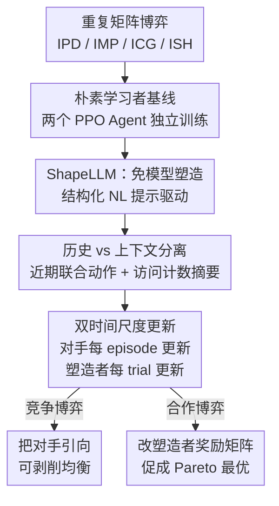

# Opponent Shaping in LLM Agents

**会议**: ICLR 2026  
**OpenReview**: [https://openreview.net/forum?id=yJoHTqUNry](https://openreview.net/forum?id=yJoHTqUNry)  
**代码**: https://github.com/martaemili/shape-llm  
**领域**: LLM Agent / 多智能体 / 博弈论  
**关键词**: 对手塑造, 多智能体强化学习, LLM Agent, 重复矩阵博弈, PPO

## 一句话总结
本文首次研究 LLM Agent 之间的"对手塑造"（opponent shaping），提出 ShapeLLM——一种把"历史"和"上下文"压进结构化自然语言提示、用 PPO 训练的免模型对手塑造算法，证明 LLM Agent 既能主动操纵对手的学习动态把它引向可被剥削的均衡（竞争博弈中独吞收益），也能用同一机制促成合作、提升集体福利。

## 研究背景与动机

**领域现状**：LLM 越来越多地作为自主 Agent 被部署，多个 Agent 在共享环境里交互、协作或竞争已不可避免。但现有多智能体 LLM 研究大多把 LLM 当成静态实体，只观察它们的合作/理性/策略推理，忽视了"当 Agent 持续相互适应时"会涌现的策略动态。

**现有痛点**：在多智能体强化学习（MARL）里，独立学习者常把对方当成环境的静态部分，导致糟糕的集体结局——比如重复囚徒困境（IPD）中两个独立学习者可靠地收敛到"双方背叛"这一最差均衡。MARL 早就发展出"对手塑造"来主动预判并影响对手的学习动态，把它引向更有利的均衡（如 LOLA、M-FOS、SHAPER）。但这些方法要么需要高阶导数（LOLA），要么依赖 transformer 中根本不存在的架构组件（SHAPER 绑定 RNN 的独立记忆流，M-FOS 是双 Agent 架构难以扩展），**无法直接搬到 LLM 上**。

**核心矛盾**：LLM 处理丰富语义、有复杂推理能力、能通过上下文学习（in-context learning）调整行为，这和传统塑造方法所依赖的"显式参数更新 + 特定记忆架构"完全不在一个范式里——传统塑造方法到底能不能迁移到 LLM Agent，是一个悬而未决的问题。

**本文目标**：把这个问题拆成两个子问题：(1) 能否设计一个适配 transformer、不需要高阶导数和特殊记忆架构的免模型塑造算法；(2) 在竞争和合作两类博弈里，LLM 塑造者能否真的改变对手的学习轨迹。

**切入角度**：作者注意到塑造的关键不在于特殊架构，而在于让塑造者同时掌握两类信息——回合内的"历史"（history，用于实现 TFT 这类条件策略）和回合间的"上下文"（context，关于对手学习动态的跨回合信息）。LLM 天生擅长处理结构化自然语言，那就干脆把这两类记忆都编码成提示词喂给它。

**核心 idea**：用结构化自然语言提示把"历史 + 上下文"合并成单一信息流，让一个用 PPO 微调的 LLM 充当塑造者，在多回合博弈中通过纯交互影响对手的学习动态。

## 方法详解

### 整体框架

实验把博弈组织成"试验（trial）"。每个 trial 含 N 个并行环境，每个环境里 Agent 玩 E 个回合制 episode，每个 episode 是 T 轮的某个 2×2 矩阵博弈。基线是两个用 PPO 独立训练、各自最大化自身收益的"朴素学习者"（naive learner, NL），它们把对手当成环境的静态部分。要研究塑造，就把其中一个 Agent 换成**塑造者（shaper）**，用 ShapeLLM 训练它去改变对手的学习动态。

关键的不对称在于**更新时机**：对手（NL）在**每个 episode 结束**时用 PPO 更新参数、最大化该 episode 回报；而塑造者只在**整个 trial 结束**时更新参数、最大化整个 trial 的累计回报。因此在一个 trial 内，塑造者会经历 E 次对手更新——它不是直接看到对手参数，而是通过跨 episode 持续累积的"联合动作摘要"间接感知对手在如何进化，从而学会"为了长期收益，现在该怎么引导对手"。

每一步 τ，塑造者收到的观测 $c^\tau_j$ 拼接两部分：最近一次联合动作 $a^{\tau-1}$（历史），以及该 trial 内此前所有联合动作的压缩自然语言表示 $f(a^1,\dots,a^{\tau-2})$（上下文）。塑造者据此采样动作 $a^\tau_j \sim \rho_{\theta_j}(w \mid c^\tau_j)$，拿到奖励并进入下一步。

### 关键设计

**1. ShapeLLM：把对手塑造重写成"读自然语言提示"的免模型算法**

针对"传统塑造方法搬不到 transformer"这个核心痛点，ShapeLLM 不要高阶导数、不要双 Agent 架构、也不要 RNN 的独立记忆流，而是沿用 M-FOS / SHAPER 的免模型元学习思路，把塑造任务形式化为一个 POMDP $(\bar{S}, \bar{A}, \bar{P}, \bar{R}, \bar{\Omega}, \bar{O}, \bar{\gamma})$。其中元状态 $\bar{s}^\tau = \{\theta^{\tau-1}_i, c^{\tau-1}_i\}_{i\in I}$ 编码所有 Agent 上一步的参数和条件提示，动作空间 $\bar{A}$ 和奖励 $\bar{R}$ 直接等同于底层重复博弈，观测 $\bar{o}^\tau = f(a^1,\dots,a^{\tau-1})$ 是过去所有联合动作的函数。Agent 的策略就是 LLM 在给定上下文 $c$ 下对单 token 的分布 $\rho_\theta(w\mid c)$（作者刻意把生成长度设为 $L=1$、每个动作对应一个 token，并避免约束解码和格式微调，纯靠文字指令引导格式）。这样塑造能力被装进一个标准 transformer + PPO 的训练回路里，不依赖任何 LLM 没有的结构。

**2. 历史与上下文的分离：把两类记忆都压成一条提示流**

塑造为什么需要两类信息？回合内的**历史**（history）让 Agent 能实现 TFT 这种"看对手上一步再决定"的条件策略；回合间的**上下文**（context）则承载"对手的学习动态正在怎么变"。SHAPER 用 RNN 的输入流和隐藏状态分别承载这两者，但这正是它绑死 RNN 的原因。ShapeLLM 的做法是把两者都写进同一段结构化自然语言：历史用最近一次联合动作 $a^{\tau-1}$ 表示，上下文用**累计状态访问计数**表示（例如 IPD 里写成 "CC: 1, CD: 1, DC: 2, DD: 3"）。用访问计数而非完整轨迹是一个关键工程选择——它让提示的 token 长度不随轮数线性增长，否则长 trial 会撑爆上下文窗口。消融实验确认：把回合内和回合间历史都去掉、或只去掉回合间历史，塑造都会失效，说明两类信息缺一不可。

**3. 双时间尺度更新：对手按 episode 学、塑造者按 trial 学**

这是塑造效果的来源。对手在每个 episode 末更新参数以最大化单 episode 回报 $J_i = \sum_{t=1}^T r^t_i$；而塑造者只在 trial 末更新，最大化整个 trial 的累计回报：

$$\bar{J}_j = \sum_{e=1}^{E} J^e_j = \sum_{e=1}^{E}\sum_{t=1}^{T} r^{(e,t)}_j = \sum_{\tau=1}^{E\times T} r^\tau_j$$

正因为塑造者的优化跨越了对手的 E 次更新，它学到的不是"这一步怎么拿最高即时奖励"，而是"怎样的一连串动作能把对手的参数更新引向对自己最有利的方向"。值得注意的是对手参数在 trial 之间不重置，塑造者面对的是一个持续进化的对手。训练动态里能直接看到这种长期算计：IPD 中塑造者呈现"三阶段"模式——先从高初始合作率急剧降低合作、再在某个水平上平台期维持对手的合作、最后缓慢再降合作以逼近最大化剥削。

**4. 竞争与合作的统一：改塑造者的奖励矩阵就能切换目标**

同一套机制既能剥削也能促合作，区别只在塑造者的奖励信号。在剥削场景（IPD/IMP/ICG），塑造者和对手共享同一张收益矩阵，塑造者把对手引向"自己拿高分、对手吃亏"的均衡。在合作场景里，作者构造了合作版 IPD（C-IPD）：给对手原始收益矩阵，但**修改塑造者的版本**让它的最高收益来自双方合作（其余收益不变）——这可以理解为塑造者在达成全局最优结果时获得一份内在奖励。于是塑造者会主动把系统从"双方背叛"的纳什均衡拉到"双方合作"。这个设计点说明：对手塑造是中性的能力，导向剥削还是导向集体福利，取决于塑造者奖励函数怎么定。

### 损失函数 / 训练策略

基座模型是 gemma-2-2b-it（小、指令微调、开源），用 QLoRA 训练：基座 4-bit 量化（BitsAndBytes），rank $r=2$ 的 LoRA adapter（PEFT）加在 query/value 投影上，外加 value head 参数可学。PPO 是从 TRL 改写的自定义实现（原版只支持 contextual bandit）。训练 200–300 个 trial，$N=5$ 个并行环境、$E=5$ 个 episode、每 episode $T=20$ 轮。非法 token 动作 $a_{null}$ 会受惩罚 $r_{null}$ 且该转移被排除出双方历史。全部在单张 40G A100 上完成。

## 实验关键数据

### 主实验

四个 2×2 经典博弈：IPD、IMP（零和的匹配硬币）、ICG（小鸡博弈）、ISH（猎鹿博弈）。评估时每对训练好的 Agent 玩 100 局、episode 长度 $T=20$。

| 博弈 | 基线 P1 / P2（每步均奖励） | 塑造者 | 对手 |
|------|------|------|------|
| IPD | 1.00 / 1.00（双方背叛） | **3.96** | 0.10 |
| IMP | −0.03 / 0.03（混合均衡附近振荡） | **0.99** | −0.99 |
| ICG | 2.00 / 2.00（各占一个纯均衡） | **2.98** | 1.01 |

IPD 里塑造者拿到 3.96，超过任何零行列式勒索策略或 TFT 能拿到的上限，而对手只有 0.1（比双方背叛的 1 还低）；IMP 里塑造者把状态访问引到对自己有利的 (H,H) 和 (T,T)；ICG 里塑造者早期急剧降低 swerve 概率、强行把博弈逼向自己偏好的均衡。

合作场景结果（Table 3）：

| 博弈 | 基线 P1 / P2 | 塑造者 | 对手 |
|------|------|------|------|
| ISH | 1.30 / 1.30（90% 收敛到劣等的"双方猎兔"） | **3.96** | 3.96 |
| C-IPD | 1.00 / 1.00（双方背叛） | **5.88** | 2.86 |

ISH 里有塑造者后所有 run 都收敛到 Pareto 最优的"双方猎鹿"（双方都约 3.96）；C-IPD 里所有 run 都达成双方合作，塑造者 5.88、朴素学习者 2.86——塑造解决了协调失败、把系统引向互利结局。

### 消融与鲁棒性

| 配置 | 结论 |
|------|------|
| 仅给对手"富观测"（当前 episode 全部交互摘要） | 富观测本身不足以产生塑造，塑造效果不是单纯来自观测空间变大 |
| 去掉回合内 + 回合间历史 / 仅去回合间历史（IPD） | 两类历史信息都去掉或只去回合间，塑造都失效——证明 history 和 context 缺一不可 |
| 不同对手初始策略（$p^0_{NL}(a_1)\approx$ 0.75 / 0.5 / 0.25） | 跨所有博弈和对手类型塑造者都成功剥削（IPD 均 3.97、IMP 0.98、ICG 2.98）；初始越合作的对手最终被压得越惨 |
| 提示变体（动作反序、替代措辞）+ 跨模型（Llama-3.2-1B-Instruct）| 塑造在不同配置下稳健 |

### 关键发现
- **历史 + 上下文是塑造的充要信息**：消融显示富观测不够、缺任一类历史塑造就崩，验证了"把两类记忆压进提示"这个核心设计的必要性。
- **塑造者会因对手初始策略自适应调整**：面对越合作的对手，塑造者越快降低自己的合作率、最终合作水平更低；初始越倾向背叛的对手，反而需要更久的"合作诱饵"才能被有效剥削。
- **IMP 对初始策略不敏感**：直觉上越接近混合纳什的对手越难塑造，但实验没观察到这种效应，塑造者一律收敛到近最优（0.96/0.99/0.99）。
- **奖励矩阵决定善恶**：把塑造者奖励改成"合作时最高"，同一算法就从剥削切换为促进集体福利。

## 亮点与洞察
- **用自然语言当"记忆架构"**：SHAPER 必须靠 RNN 的输入流和隐藏状态分别装历史与上下文，本文直接把两者写成结构化文本喂给 transformer，绕开了架构依赖——这是"让 LLM 的语言能力替代专用网络结构"的漂亮迁移。
- **访问计数代替完整轨迹**：一个朴素却关键的工程 trick，让上下文表示的 token 数不随轮数线性增长，否则长博弈根本塞不进上下文窗口；这个思路可迁移到任何需要把长交互历史压进提示的 Agent。
- **双时间尺度是塑造的本质**：塑造者跨越对手多次更新才更新一次，逼着它去优化"对手参数轨迹"而非即时收益——这把"塑造对手学习动态"这件抽象的事落成了一个具体的优化时机设计。
- **能力中性，正负两用**：同一机制既是安全风险（LLM Agent 可能在不被对手感知的情况下被策略性剥削），也是协调工具（无论对手目标如何都能引向互利），对部署持续学习的 LLM Agent 有现实警示。

## 局限与展望
- **单一小模型**：只在 gemma-2-2b-it（外加 Llama-3.2-1B 的 IPD 验证）上做，模型规模与塑造能力/脆弱性的关系未知——大模型是更强的塑造者还是更难被塑造，都待研究。
- **只研究 LLM 之间的交互**：未探索跨架构塑造（LLM 塑造者能否影响其他类型 Agent，反之亦然）。
- **动作被限制为固定 token**：让评估可控，但限制了 LLM 相互影响的方式；现实中 LLM Agent 能用自然语言沟通、在行动前发信号或谈判，开放语言交互可能显著改变塑造动态。
- **仅限 2×2 矩阵博弈**：激励清晰易解读，但现实交互常有更微妙、重叠的目标，合作与竞争并非二元；更丰富的收益结构或多目标环境下塑造如何泛化仍是开放问题。

## 相关工作与启发
- **vs LOLA**: LOLA 把对手的学习规则显式纳入自己的更新，但假设知道对手学习规则、依赖高方差的高阶导数、且只考虑对手更新的即时效应；ShapeLLM 是免模型的、不需要这些，且天然适配没有这些组件的 transformer。
- **vs M-FOS**: M-FOS 用"内层 Agent 交互 + 外层 Agent 在元博弈里调控"的双 Agent 架构实现长期塑造，但双 Agent 结构扩展性差；ShapeLLM 把信息合并进单一 LLM 的提示流，单一动作空间即可。
- **vs SHAPER**: SHAPER 用单个 RNN 的输入与隐藏状态分别捕获 history 与 context、消除了 M-FOS 的双动作空间，但机制绑死 RNN 的独立记忆流；ShapeLLM 用结构化自然语言提示同时承载两者，把同样的"history/context 区分"原则迁移到 transformer。

## 评分
- 新颖性: ⭐⭐⭐⭐⭐ 首次把对手塑造引入 LLM Agent，并给出适配 transformer 的免模型算法
- 实验充分度: ⭐⭐⭐⭐ 覆盖竞争/合作五种博弈、多种对手初始化、提示变体与跨模型，但仅限小模型与 2×2 博弈
- 写作质量: ⭐⭐⭐⭐⭐ 动机—背景—方法—实验逻辑清晰，history/context 区分讲得透彻
- 价值: ⭐⭐⭐⭐⭐ 为"多智能体 LLM 的策略动态与安全"开辟了一个新维度，正负两用的现实意义强

<!-- RELATED:START -->

## 相关论文

- [\[ICLR 2026\] Test-Time Adaptation for LLM Agents via Environment Interaction](test-time_adaptation_for_llm_agents_via_environment_interaction.md)
- [\[ICLR 2026\] Social Agents: Collective Intelligence Improves LLM Predictions](social_agents_collective_intelligence_improves_llm_predictions.md)
- [\[ICLR 2026\] ChatInject: Abusing Chat Templates for Prompt Injection in LLM Agents](chatinject_abusing_chat_templates_for_prompt_injection_in_llm_agents.md)
- [\[ICLR 2026\] FingerTip 20K: A Benchmark for Proactive and Personalized Mobile LLM Agents](fingertip_20k_a_benchmark_for_proactive_and_personalized_mobile_llm_agents.md)
- [\[ICLR 2026\] Towards Multimodal Data-Driven Scientific Discovery Powered by LLM Agents](towards_multimodal_data-driven_scientific_discovery_powered_by_llm_agents.md)

<!-- RELATED:END -->
