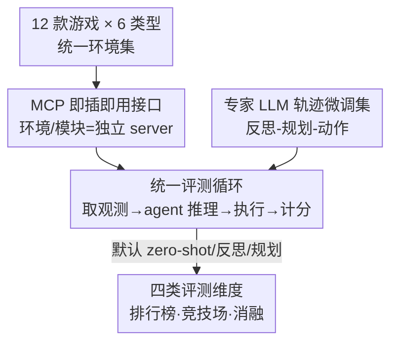

# Orak: A Foundational Benchmark for Training and Evaluating LLM Agents on Diverse Video Games

**会议**: ICLR 2026  
**OpenReview**: [https://openreview.net/forum?id=H1ncX6O6Yh](https://openreview.net/forum?id=H1ncX6O6Yh)  
**代码**: https://github.com/krafton-ai/Orak （含 HuggingFace 数据集 KRAFTON/Orak）  
**领域**: Agent / 数据集与基准  
**关键词**: LLM Agent、游戏基准、MCP 接口、Agentic 模块、微调数据集

## 一句话总结
Orak 用 MCP 即插即用接口把 12 款覆盖全部 6 大类型的真实视频游戏统一封装成基准，既能系统评测 LLM 的 agentic 模块（反思 / 规划 / 工具）效果，又随附一份专家 LLM 游玩轨迹微调数据集，把通用 LLM 转成有效的游戏 agent。

## 研究背景与动机
**领域现状**：用游戏评测 LLM 已经是热门方向——从早期的文本冒险（Jericho、Zork）、2D 网格游戏（国际象棋、NetHack、Crafter），到近期把 agentic workflow 套到 Minecraft、星际争霸、宝可梦等复杂游戏上。游戏天然是动态、不确定的真实世界模拟器，特别适合考察 agent 的高层决策与"系统 2"推理。

**现有痛点**：作者指出现有游戏基准有三个硬伤。第一，多数基准还停留在纯文本或 2D 网格模拟器，而不是真正复杂的视频游戏，离实际应用太远。第二，对 agentic 模块（自我反思、记忆、工具使用）的评测严重不足——这些模块恰恰是复杂游玩的关键，但基准里很少有受控的消融研究。第三，缺乏能把预训练 LLM 适配成游戏 agent 的微调数据集，这直接卡住了 LLM agent 在真实游戏里的落地。

**核心矛盾**：把已有 agent 套到游戏上的工作，几乎都是为每款游戏手工定制一套 workflow，这让"做一个通用游戏 agent"变得不可复用、不可扩展；而游戏又不像 web / 编程 / 数学那样状态结构化，它的状态空间大、动态、部分可观测，要求 agent 跨多种情境泛化、学多样行为模式。

**本文目标**：拆成三个子问题——(1) 给一个覆盖全类型、能统一接入的游戏环境集；(2) 给一个能即插即用、可复现地评测各种 agentic 模块的接口；(3) 给一份能把通用 LLM 转成游戏 agent 的微调数据。

**切入角度**：作者借用 Model Context Protocol（MCP）这个"函数调用包装"协议，把每款游戏环境、每个 agentic 模块都做成独立的 MCP server，让 LLM 像调用工具一样统一调用它们。这样评测时只需在配置里指定游戏 + LLM + agent 策略，就能跑通任意组合。

**核心 idea**：用 MCP 把"游戏机制"和"agentic 策略"都抽象成可调用工具，配上全类型游戏集 + 专家轨迹微调集，做成一个既能评测、又能训练游戏 agent 的统一基础设施。

## 方法详解

### 整体框架
Orak 的"方法"本质是一套基准基础设施，而非单一算法。它要解决的事是：让任意一个快速迭代的 LLM，都能在 12 款真实游戏上以一致、可复现的方式被评测，并能进一步被训练成游戏 agent。整体怎么转可以分三层来看：底层是 **12 款游戏环境**（覆盖动作 / 冒险 / 角色扮演 / 模拟 / 策略 / 解谜六大类型），每款游戏定义好状态、动作空间、评测任务与归一化分数；中间层是 **MCP 接口**，把每个游戏环境和每个 agentic 模块（反思、规划、记忆、知识库、技能管理等）封装成独立 MCP server，对 LLM 暴露成可调用工具；上层是 **统一评测循环 + 四类评测维度**（游戏排行榜、LLM 对战竞技场、agentic / 模态 / 微调消融）。

评测时（`eval.py`）只需配置好游戏、LLM backbone、agent 策略：每一步先从环境 server 取观测并转成文本（`obs2text`），交给指定的 agent 策略让 LLM 推理（如依次跑反思→规划→动作），把输出文本转成动作（`text2act`）执行（`step`），循环直到游戏结束或到达最大步数，最后由 evaluator 给出归一化分数。提交时用户只需自定义 `llm.py`（换 backbone）或 `agent.py`（换 agentic 策略），其余复用。

### 关键设计

**1. 全类型真实游戏集 + 七维能力刻画：让"考什么"可解释**

针对"基准只考文本 / 网格游戏、覆盖面窄"的痛点，Orak 收了 12 款被亿级玩家玩过的真实视频游戏——街霸 III、超级马力欧、逆转裁判、Her Story、宝可梦红、暗黑地牢、Minecraft、星露谷、星际争霸 II、杀戮尖塔、Baba Is You、2048——恰好铺满动作、冒险、角色扮演、模拟、策略、解谜六大类型，是已知唯一全类型覆盖的游戏基准。每款游戏都标准化定义了游戏状态、给 LLM 的动作空间、评测任务与指标（如街霸看通关关卡数、马力欧看死亡前水平移动距离、宝可梦看触发了 12 个剧情 flag 中的几个）。

更关键的是作者用游戏设计文献里的原则，给每款游戏在 7 个能力维度上打了 1–3 级的等级：规则遵循 RF、逻辑推理 LR（按需要的推理 hop 数：1 hop / 1–3 hop / ≥3 hop）、空间推理 SR、长文本理解 LTU（几行 / 几段 / 超过一页 500+ 词）、长程规划 LP（≤3 步 / >3 步连续动作）、错误处理 EH（单步回滚 / 多步回滚重规划）、随机性处理 OH。等级由 8 名人类标注取中位数。这套刻画让"动作游戏重空间推理、冒险游戏重长文本理解、策略 / 解谜重多步规划"这类结论不再是直觉，而是有可比的坐标。

**2. MCP 即插即用接口：把 agentic 模块做成可受控消融的工具**

针对"现有基准对 agentic 模块评测不足、且每款游戏都要手工定制 workflow"的痛点，Orak 把每个游戏环境和每个 agentic 模块都做成独立 MCP server。游戏 server 暴露游戏机制（取状态、执行一步、评估分数），agent server 暴露策略（反思、规划、记忆、知识检索、技能管理）。LLM 在评测循环里通过 MCP 顺序调用这些工具，既能单独调一个模块，也能把多个模块串成一条流水线。

这样设计的直接好处是把 agentic 策略变成可插拔、可受控对比的变量：想研究"加上反思 / 规划到底有没有用"，只要换 agent server 的组合即可，跨游戏保持一致结构（如固定"推理→规划→用工具"的顺序）。由于接口标准化，面对层出不穷的新 LLM 也能即插即用地接进来评测，避免了"为每款游戏重写一套适配代码"的工程债。

**3. 专家轨迹微调集：把"何时用什么策略"的元知识蒸馏给小模型**

针对"缺微调数据、通用 LLM 不会玩游戏"的痛点，作者用 GPT-4o、o3-mini 等专家 LLM 在全部 12 款游戏上用 agentic 策略游玩，采集交互轨迹。轨迹记为 $T=\{\tau_1,\dots,\tau_T\}$，每一步 $\tau=\{(X_{a_i}, S, Y_{a_i})\}_{i=1}^{n}$，其中 $a_i\in\{\text{reflection},\text{planning},\dots,\text{action}\}$ 是第 $i$ 个 agentic 模块，$X_a$ 是该模块的提示、$S$ 是游戏状态、$Y_a$ 是 LLM 的回应。这种结构让数据天然编码了"在什么状态下、按什么顺序调用哪个策略"的元知识。

数据筛选上，每款游戏先采集到超过 1000 条推理序列 $\tau$，再按游戏分数从高到低排序，选高分轨迹直到超过 300 条，且所有入选轨迹都遵循"反思-规划-动作"序列，于是每个模块约 300 条样本、12 款游戏合计约 11k 条。为增加语言多样性，再用 GPT-4o 对每条样本的提示 $X_a$ 做改写（保留全部游戏信息），每条扩增 10 倍。该数据集主要用于监督微调（SFT），强化学习式微调留作未来工作。

**4. 四维统一评测：从排行榜到对战竞技场再到三类消融**

为了把上述环境 + 接口 + 数据真正用起来，Orak 给出统一的评测维度。游戏分数全部用"实际分 / 该游戏满分"归一化后再比较，每款游戏报 3–20 次试验均值，并附 3 名人类新手作参照。维度包括：**游戏排行榜**（15 个 LLM 用各游戏默认策略横评）；**LLM 对战竞技场**（街霸 III、星际 II 支持双人对战，做 pairwise 对局算 Elo）；以及三类消融——**agentic 策略**（zero-shot / 反思 / 规划 / 反思-规划）、**视觉输入模态**（纯文本 / 纯图像 / 图文都给）、**微调效果**（intra-game / OOD-game / non-game 三种泛化）。这套维度让基准不只给一个排行榜数字，而是能回答"模块有没有用、视觉有没有用、微调能不能迁移"这些更本质的问题。

### 一个完整示例
以超级马力欧 + "反思" agent 的一步为例（对应微调数据格式）：环境先给出游戏状态 $S$——"Mario 在 (100,100)，砖块在 (120,100) 和 (120,150)"。反思模块的提示 $X_{\text{ref}}$ 要求"对比前后状态、批判上一步动作"，LLM 输出 $Y_{\text{ref}}$："Mario 被砖块挡住，要跳更高才能越过"。接着动作模块的提示 $X_{\text{act}}$ 要求从记忆里取出这条反思、再决定最佳跳跃等级（0–6 的整数），LLM 输出 $Y_{\text{act}}$："Jump Level: 6"。这条 $\{(X_{\text{ref}},S,Y_{\text{ref}}),(X_{\text{act}},S,Y_{\text{act}})\}$ 就是一条 $\tau$，被收进微调集，从而把"卡住时该往高处跳"的决策习惯蒸馏给小模型。

## 实验关键数据

### 主实验
15 个 LLM 用各游戏默认策略横评（归一化分，越高越好，下表节选）：

| 模型 | AceAttorney | Pokémon | StarCraft2 | BabaIsYou | 2048 | 平均排名 |
|------|------|------|------|------|------|------|
| Gemini-2.5-pro | 55.7 | 83.3 | 100.0 | 73.3 | 5.1 | **3.5** |
| GPT-4o | 85.3 | 38.9 | 100.0 | 20.0 | 5.6 | 3.6 |
| GPT-5 | 59.1 | 88.9 | 25.0 | 100.0 | 10.2 | 3.6 |
| o3-mini | 91.7 | 0.0 | 25.0 | 73.3 | 25.3 | 4.0 |
| Llama-3.2-1B | 1.3 | 0.0 | 0.0 | 6.7 | 0.0 | 13.5 |
| Human(新手) | 87.8 | 86.1 | 33.3 | 100.0 | 22.7 | - |

闭源模型整体显著领先开源模型，Gemini-2.5-pro 平均排名 3.5、12 款里 5 款第一；GPT-5 在 Baba Is You / 2048 这类需强数学逻辑 + 空间理解的解谜游戏上突出。8B 以下小开源模型在宝可梦、Minecraft、星露谷、星际、杀戮尖塔等复杂游戏上几乎 0 分。

### 消融实验
agentic 模块消融（Llama-3.2-3B vs GPT-4o，平均排名越小越好）：

| 配置 | GPT-4o 排名 | Llama-3.2-3B 排名 | 说明 |
|------|------|------|------|
| Zero-shot | 3.4 | 6.4 | 直接动作推理 |
| Reflection | 3.0 | **5.6** | 小模型在此最好 |
| Planning | 3.3 | 6.2 | |
| Reflection-Planning | **2.2** | 6.1 | 大模型在此最好 |

微调泛化（Llama-3.2-3B，✗ 未微调 / ✓ 微调）：

| 场景 | 游戏/任务 | ✗ | ✓ |
|------|------|------|------|
| Intra-game | SF3 | 12.0 | 40.0 |
| OOD-game | 2048 | 0.1 | 3.1 |
| Non-game | WebShop-H | 0.0 | 12.6 |

### 关键发现
- **agentic 模块的收益依模型能力而定**：GPT-4o 加越多模块越好（反思-规划最佳），但 Llama-3.2-3B 反而是单"反思"最好、加规划掉点——对小模型，过多模块只是把提示变复杂、拖累决策。这说明"最优 agentic 策略取决于 backbone 内在能力"，是本基准最有价值的结论之一。
- **对战与排行榜结论会反转**：街霸竞技场里 Minitron-8B 的 Elo 反而最高、超过所有大模型，说明多 agent 对抗环境下博弈动态会改变胜负，单机排行榜不能直接外推到对战。
- **视觉输入目前是负担多于帮助**：纯图像输入普遍大幅掉分；图文都给则效果两极——街霸这种屏幕细节难用文字表达的游戏，给 Claude 加视觉涨 16.6 分，但逆转裁判这种叙事重的游戏，GPT-4o 反而掉 31.8 分。模型还没学会从视觉里抽够价值。
- **微调靠质量而非数量**：高分数据集最有效，低分数据几乎无益甚至有害（暗黑地牢），高低混合翻倍数据也没明显提升；且游戏微调能迁移到数学 / WebShop 等非游戏决策任务（Llama-3.2-3B 在 WebShop-H 从 0% 提到 12.6%），但这种泛化依赖模型容量（1B 几乎不迁移）。
- **实时延迟是隐形门槛**：星际 II 切到实时模式后，hard 难度下所有模型 0 分；easy 难度只有 GPT-4o 在实时下还满分。每步反思-规划延迟 GPT-4o-mini 19.6s、GPT-4o 27.2s、Gemini-2.5-pro 99.2s，GPT-4o 在延迟与准确率间权衡最好。

## 亮点与洞察
- **用 MCP 当评测中间件**很巧妙：把"游戏机制"和"agentic 策略"都抽象成可调用工具，于是评测任意 LLM × 任意策略 × 任意游戏只是配置组合，天然支持快速迭代的新模型即插即用——这个思路可迁移到 web / 工具调用等任何"环境 + 策略可正交组合"的 agent 基准。
- **七维能力等级表**把"这游戏难在哪"量化成可比坐标，让"动作游戏重空间、冒险游戏重长文本"从直觉变成证据，也方便按能力维度诊断模型短板。
- **最反直觉的发现**是 agentic 模块对小模型可能是负担——这提醒"堆 agentic workflow 一定更好"是个伪命题，策略要和 backbone 能力匹配。
- **游戏轨迹能迁移到非游戏任务**（数学 / WebShop）说明微调学到的是"反思-规划"这种通用决策套路而非游戏特例知识，这条对构建通用 agent 的数据配方很有启发。

## 局限与展望
- **作者承认**：Orak 把游戏状态预处理成结构化文本、隐藏了与游玩无关的信息，这其实给了 LLM 推理"友好"的环境；把完整、未加工的富文本游戏状态喂给 LLM 是更难也更真实的方向，留作未来工作。微调集目前只支持 SFT，强化学习式微调（从环境动态抽数据）也未做。
- **自己发现**：视觉评测目前结论偏负面，部分原因可能是文本状态本身已很优质、图像通道反而引入噪声，难以单独判定"模型视觉能力差"还是"任务设置不利于视觉"。归一化分数掩盖了不同游戏满分口径的差异，跨游戏直接比大小需谨慎；每款游戏只 3–20 次试验，方差较大（表中 ±50 这类波动常见）。
- **改进思路**：可补充 RL 微调基线、提供"原始状态"难度档位、把延迟纳入排行榜主指标（而非只在星际上做附加实验），让"实时可玩性"成为一等公民。

## 相关工作与启发
- **vs SmartPlay / Balrog**：它们停在文本 / 2D 网格游戏、不覆盖全类型、不做 agent 模块消融、也无微调集；Orak 用真实视频游戏全类型覆盖，并把 agentic 模块消融和微调数据都补齐。
- **vs Cradle / V-MAGE / DSGBench / LMGame-Bench**：这些用视频游戏但各自只聚焦少数类型（如 V-MAGE 只动作、DSGBench 只策略、LMGame 偏解谜），且都不提供 agent 模块消融与微调集；Orak 是表 1 里唯一同时满足"全类型 + 支持 LLM/VLM + agent 消融 + 微调集"四项的基准。
- **vs FireAct / CodeAct 等 agent 微调工作**：它们强调统一数据格式与高质量轨迹筛选，但主要面向 web / 编程 / 数学等结构化任务；Orak 把这套思路搬到状态大、动态、部分可观测的游戏域，并验证了游戏轨迹能反向迁移到非游戏决策任务。

## 评分
- 新颖性: ⭐⭐⭐⭐ 用 MCP 统一封装游戏 + agentic 模块，全类型覆盖 + 微调集是已有基准都没做齐的组合
- 实验充分度: ⭐⭐⭐⭐⭐ 15 个 LLM、12 款游戏、四类评测维度，agentic / 模态 / 微调 / 延迟全面消融
- 写作质量: ⭐⭐⭐⭐ 结构清晰、图表完备，能力刻画与发现都讲得有据
- 价值: ⭐⭐⭐⭐⭐ 给游戏 agent 研究提供了可复现的统一基础设施和可迁移的微调数据配方

<!-- RELATED:START -->

## 相关论文

- [\[ICLR 2026\] ST-WebAgentBench: A Benchmark for Evaluating Safety and Trustworthiness in Web Agents](st-webagentbench_a_benchmark_for_evaluating_safety_and_trustworthiness_in_web_ag.md)
- [\[ICLR 2026\] FingerTip 20K: A Benchmark for Proactive and Personalized Mobile LLM Agents](fingertip_20k_a_benchmark_for_proactive_and_personalized_mobile_llm_agents.md)
- [\[ICLR 2026\] WebFactory: Automated Compression of Foundational Language Intelligence into Grounded Web Agents](webfactory_automated_compression_of_foundational_language_intelligence_into_grou.md)
- [\[ICLR 2026\] Evaluating Memory in LLM Agents via Incremental Multi-Turn Interactions](evaluating_memory_in_llm_agents_via_incremental_multi-turn_interactions.md)
- [\[ICLR 2026\] SimuHome: A Temporal- and Environment-Aware Benchmark for Smart Home LLM Agents](simuhome_a_temporal-_and_environment-aware_benchmark_for_smart_home_llm_agents.md)

<!-- RELATED:END -->
