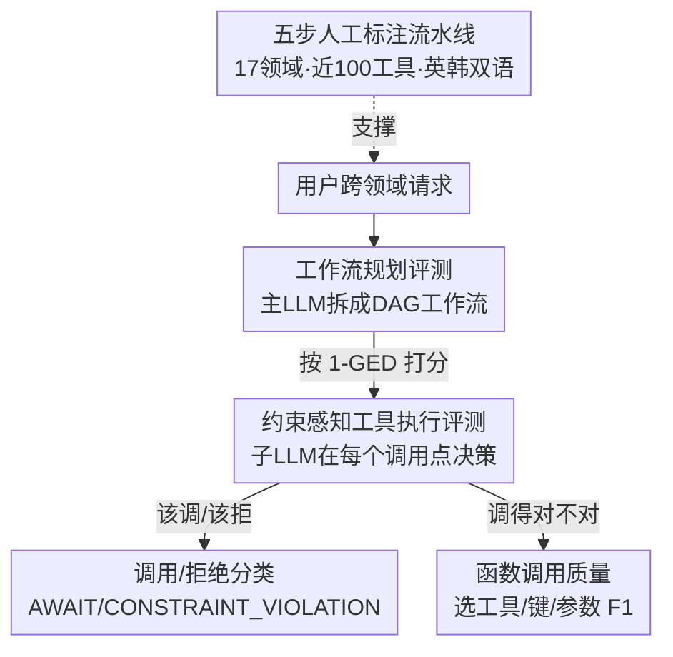

# OrchestrationBench: LLM-Driven Agentic Planning and Tool Use in Multi-Domain Scenarios

**会议**: ICLR 2026  
**OpenReview**: [https://openreview.net/forum?id=Oljnxmf4pc](https://openreview.net/forum?id=Oljnxmf4pc)  
**代码**: https://github.com/kakao/OrchestrationBench  
**领域**: Agent / 工具调用 / Benchmark  
**关键词**: 多智能体编排, 工作流规划, 工具调用, 约束校验, 双语评测

## 一句话总结
提出 OrchestrationBench——一个全人工标注的中英（应为英/韩）双语基准，把"主 LLM 拆解请求 → 分配给子 LLM → 子 LLM 调工具"这套服务级编排能力拆成**工作流规划**和**约束感知的工具执行**两条独立维度来评测，发现各大模型的函数调用水平相近、但规划能力差距巨大。

## 研究背景与动机
**领域现状**：LLM 已经从"文本生成器"进化成能多步推理、结构化规划、调用外部工具的智能体。业界越来越想把它们当作"可上线的服务智能体"，去帮用户跨多个领域（订机票、查天气、约会议）完成一连串相互依赖的子任务。

**现有痛点**：现有 agent 基准要么停留在单领域、单 agent 的简化设定（如 TaskBench 测单个 LLM 拆任务+调 API，τ-bench、GAIA 测单 agent 完整任务），要么把规划和工具执行混在一个端到端分数里。端到端评测虽然灵活，但在多步复杂任务里**会把失败点糊在一起**——你只知道整体没做成，却不知道是规划错了还是工具调错了。

**核心矛盾**：真实服务场景里，"编排"（orchestration）是一个**主 LLM 协调多个专才子 LLM** 的分层过程，涉及任务依赖管理、对话中途改需求、以及在调工具前对业务约束做校验（比如会议只能整点/半点预约）。这种 **LLM-to-LLM** 的协调能力，和单 agent 直接调 API 的 **LLM-to-API** 范式根本不同，现有基准基本没覆盖。

**本文目标**：构造一个能 (1) 单独评测工作流规划质量、(2) 单独评测约束感知下的工具执行质量，并且 (3) 覆盖多领域、双语、真实约束的基准。

**切入角度**：作者把编排显式拆解（disentangle）成规划和执行两条线，规划用有向无环图（DAG）形式化、用图编辑距离量化；执行则进一步拆成"该不该调/该不该拒"的决策 + "调得对不对"的函数调用质量。

**核心 idea**：用"分层主-子 LLM 编排 + 规划/执行解耦的诊断式评测"，把模糊的端到端 agent 成功率，换成能定位失败点的细粒度能力画像。

## 方法详解

### 整体框架
OrchestrationBench 不是一个新模型，而是一套**评测框架 + 全人工标注数据集**。它模拟的运行场景是：用户提一个跨领域请求，**主 LLM** 把请求拆成若干**工作流（workflow）**，每个工作流再拆成若干**步骤（step）**并指派给合适的**子 LLM（agent）**；子 LLM 用提炼后的查询去**调用虚拟工具**，结果回传给主 LLM 聚合后返回用户。整个过程支持顺序/并行执行、用户澄清、以及对话中途的工作流修订。

评测时，框架把这条链路切成两段分别打分：**规划段**评 DAG 形式的工作流构造得对不对，**执行段**评子 LLM 在每个工具调用点的决策与参数质量。数据集本身则经过"选领域 → 设计虚拟工具 → 构造场景 → 定义工作流/工具调用 → 多人交叉校验"五步人工流水线产出，覆盖 17 个领域、近 100 个虚拟工具、英韩双语。

### 关键设计

**1. 工作流规划：用 DAG 形式化编排，再用图编辑距离打分**

针对"端到端评测说不清规划到底错在哪"这个痛点，作者把每个编排目标形式化成一张**有向无环图**：每个工作流是一个节点，带 `status`（pending/running/waiting_for_input/completed/paused/canceled）、`type`（independent/dependent）、`depend_on`（前置工作流）三个字段，工作流内部再展开成有序的 step（每个 step 记录进度、指派的子 LLM 名、提炼后的 query）。比如"订机票+订 COEX 附近酒店+把行程分享给团队"会被建成 workflow_1、workflow_2 独立，workflow_3 依赖前两者。

打分用**图编辑距离（GED）**：把模型生成的图变成标准答案图所需的最少编辑操作数，归一化到 0–1，再取 $1-\text{GED}$ 让分数越高越好。作者做了**分层加权**——结构分（structural score）看拓扑对不对，组件分（component score）看 step 级别的子 LLM 指派对不对，并且**给"选错工具/agent"的权重 0.8、给"状态判断错"的权重 0.2**（理由是选错工具比误判执行状态更致命，作者坦承这个权重是经验设定而非实验推导）。这套设计的价值在于：规划质量第一次有了结构化、可比较的连续指标，而不是一个笼统的成功/失败。

**2. 约束感知的工具执行：先判"该不该调"，再判"调得对不对"**

真实服务不光要求语法正确，还要求模型懂得**何时不该硬调工具**。作者把执行评测拆成两个串行阶段。第一阶段是**调用/拒绝分类（Call/reject classification）**：模型要识别两类"应该拒绝"的情况——信息不足时发 `AWAIT_FOR_USER_INPUT` 主动要澄清（如"给 Minji 转账"但通讯录里有多个 Minji）；违反业务约束时发 `TOOL_CONSTRAINT_VIOLATION`（如预约 4:10 但工具规定只能整点/半点，或返程日期早于出发日期）。C/R 准确率 = 正确决策（该拒的拒了 + 该调的调了）占全部 case 的比例。

只有通过这一关、确实进入函数调用阶段的 case，才进第二阶段评**函数调用质量**，用三个 F1：工具选择 F1、键 F1（key F1）、参数 F1（argument F1）。参数校验走三级——先精确匹配，再按工具描述做类型/模式校验，剩下的用语义校验，并用 **GPT-4.1 + Claude Sonnet 4 + Gemini 2.5 Flash 三个 LLM 评委**（temperature 0.3）取算术平均来降低单模型偏差。人评与 LLM 评委的一致性 Cohen's Kappa 为 0.63（实质性一致）。这种"先决策、后质量"的两段式，让"模型乱调一通但参数填对"和"模型该拒绝却硬调"被区分开，避免高 F1 掩盖了糟糕的决策。

**3. 多领域虚拟工具 + 全人工标注 + 双语文化适配**

针对"现有基准工具抽象太简化、且容易带某个生成模型的偏置"，作者用 17 个代表性服务领域（旅行、金融、日程、购物等），覆盖三类工作流：信息查询类、动作交易类、规划协调类。每个领域配带真实约束的虚拟工具——英文 97 个、韩文 99 个（差异来自地址罗马化、算命等文化特定服务）。

关键是**全程人工标注**：所有对话、工作流、工具调用都由训练过的标注员手写而非合成（工具描述初稿用 GPT-4o 生成后人工精修，工具调用结果用 GPT-4o 生成后多轮人审），每个场景至少 3 名标注员交叉校验，并刻意剔除歧义/多解 case 只留依赖清晰的任务。数据集**最初用韩文构建**再扩到英文，因此天然带**双语+双文化**——这对韩语规划/工具调用评测资源稀缺的现状尤其有价值。这个设计保证了基准的真实性、多样性和"不偏向任何单一模型"。

### 一个完整示例
以用户请求"明天要去首尔出差，帮我订机票、找 COEX 中心附近的酒店、把行程分享给团队"为例：主 LLM 把它拆成 3 个工作流——workflow_1（`travel_agent`，refined_query="订明天去首尔的出差机票"，type=independent）、workflow_2（`travel_agent`，"找并订 COEX 附近酒店"，independent）、workflow_3（`calendar_agent`，"把完整行程分享给团队"，type=dependent，`depend_on=[workflow_1, workflow_2]`）。评测时先用 $1-\text{GED}$ 比这张 DAG 和标准答案差多少（拓扑+指派是否正确）；随后子 agent 在调日历/订票工具时，若用户把会议改到 4:10 而工具只允许整点/半点，模型应触发 `TOOL_CONSTRAINT_VIOLATION` 并建议 4:00/4:30，这一步算进 C/R 分类，参数若合法再进函数调用 F1。整条链路每一步都被独立计分，失败点一目了然。

## 实验关键数据

### 主实验
评测了 GPT（4.1/4o/5/mini/nano）、Claude Sonnet 4、Gemini 2.5 Pro/Flash、Qwen3 系列，以及韩文开源模型 A.X-4.0、kanana-1.5、EXAONE-4.0。每个场景每模型跑 3 次，temperature 0.2；推理模型统一用 low reasoning effort。下表为英文数据集部分结果（Plan = 规划 $1-\text{GED}$，C/R = 调用/拒绝准确率，FC = 函数调用，Score = 综合）：

| 模型 | Plan | C/R | FC | Score |
|------|------|------|------|------|
| gemini-2.5-pro-preview | **0.850** | 0.724 | 0.836 | 0.803 |
| claude-sonnet-4 | 0.773 | **0.868** | **0.885** | **0.842** |
| gpt-4.1 | 0.744 | 0.860 | 0.861 | 0.822 |
| Qwen3-235B-A22B | 0.768 | 0.876 | 0.880 | 0.842 |
| Qwen3-32B | 0.792 | 0.857 | 0.808 | 0.819 |
| gpt-5 | 0.583 | 0.791 | 0.804 | 0.726 |
| gpt-4.1-nano | 0.462 | 0.725 | 0.752 | 0.646 |
| EXAONE-4.0-32B | 0.057 | 0.653 | 0.534 | 0.415 |

关键观察：**函数调用（FC）相对稳定**（多数模型 0.75–0.89），而**规划（Plan）差距极大**——从 Gemini 的 0.850 一路掉到 EXAONE 的 0.057，说明规划才是区分模型的"分水岭"能力。开源稠密模型很能打，Qwen3-235B-A22B 综合分 0.840（英）/0.804（韩）已逼平顶级闭源模型；且稠密架构在规划上稳定优于 MoE 变体。

### 消融 / 分析实验
作者没做模块消融（这是 benchmark 论文），而是做了任务维度间的相关性分析，揭示"规划-执行鸿沟"：

| 数据集 | C/R 与 Plan 相关性 | C/R 与 FC 相关性 | Plan 与 FC 相关性 |
|--------|------|------|------|
| 英文 | 0.583 | 0.726 | 0.922 |
| 韩文 | 0.448 | 0.577 | 0.775 |

C/R 决策与规划分的相关性明显偏弱（英 0.583 / 韩 0.448），意味着**模型可能能生成好工作流、却在"何时该调/该拒"的执行决策上栽跟头**——规划强不等于执行决策强。

### 关键发现
- **规划是区分度最高的能力**：FC 大家都还行，但 Plan 在顶级与垫底模型间差距巨大，做编排任务必须按规划能力选型。
- **规划-执行鸿沟**：C/R 与规划弱相关，说明当前训练没有充分解决"约束感知决策"这块，好规划未必带来好的调用/拒绝判断。
- **语言依赖明显**：模型排名随语言大幅变动，Claude 在英文决策上从 0.759 跳到 0.868，Gemini 则更擅长韩文——印证双语评测的必要性。
- **家族各有专长**：Gemini 强规划但 FC 偏弱，Claude FC 最强，GPT-4.1 系最均衡。

## 亮点与洞察
- **把"编排"解耦成规划/执行两条线**是最核心的方法论贡献：它让"agent 没做成"这个黑箱变成可定位的诊断报告，这个思路可迁移到任何复杂多步 agent 评测。
- **用 DAG + 图编辑距离量化规划质量**很巧妙：规划本来是开放生成、难打分的，转成图结构后既能比拓扑又能比指派，还能分层加权。
- **C/R 拒绝判断单独成维**点出了一个被忽视的能力：会调工具 ≠ 知道何时不该调。`AWAIT_FOR_USER_INPUT` 和 `TOOL_CONSTRAINT_VIOLATION` 这两类拒绝信号，恰恰是真实服务里最容易翻车的地方。
- **英韩双语 + 文化适配**填补了韩语 agent 评测资源空白，也实证了语言会显著改变模型排名。

## 局限与展望
- **作者承认的局限**：① 只覆盖 17 领域、英韩双语，未必泛化到其他语言/场景；② 用的是预定义工作流和虚拟工具，没接真实工具（如 MCP），离真正端到端还有距离；③ **逐回合评测假设每步都执行成功**，因此整体分可能被高估——真实端到端里早期错误会向后级联，成功率会更低。
- **自己发现的局限**：规划用单一标准答案 DAG + GED 打分，对"同样合理但拓扑不同"的工作流可能误判；选工具错 0.8 / 状态错 0.2 的权重是拍脑袋定的，作者也坦承未经实验验证。
- **改进思路**：接入真实工具做误差级联的端到端评测；针对"规划-执行鸿沟"设计专门的训练方法；扩展更复杂的多 agent 协调模式。

## 相关工作与启发
- **vs TaskBench / UltraTool**：它们测**单个 LLM** 拆任务+调 API（LLM-to-API），UltraTool 还是六阶段单模型流水线；本文测**主 LLM 协调多个子 LLM**（LLM-to-LLM 分层编排），关注的是协调而非单 agent 性能。
- **vs τ-bench / GAIA / WebArena / OSWorld**：这些是单 agent 完整任务基准，端到端给分；本文把规划与执行**解耦诊断**，能定位失败点。
- **vs ToolEmu / R-Judge / SafeToolBench**：它们测的是**安全**（拒绝有害请求）；本文测的是**功能可行性**（主 LLM 能否根据子 LLM 的能力描述拒绝"不可行"请求），是一个不同维度。
- **vs MultiAgentBench / REALM-Bench**：同属多 agent 评测，但本文独有"规划/约束执行解耦 + 双语 + 服务级约束校验"的组合。

## 评分
- 新颖性: ⭐⭐⭐⭐ 把编排解耦成规划/执行、引入 DAG+GED 量化规划、补上韩语双语评测，组合新颖
- 实验充分度: ⭐⭐⭐⭐ 覆盖 16 个主流模型、英韩双语、相关性分析到位，但缺真实工具的端到端验证
- 写作质量: ⭐⭐⭐⭐ 框架清晰、相关工作梳理充分，指标定义讲得明白
- 价值: ⭐⭐⭐⭐ 对"服务级 agent 编排"评测有实际指导意义，living benchmark 可持续扩展

<!-- RELATED:START -->

## 相关论文

- [\[ICLR 2026\] Code Driven Planning with Domain-Adaptive Selector](code_driven_planning_with_domain-adaptive_selector.md)
- [\[ICLR 2026\] Benchmarking LLM Tool-Use in the Wild](benchmarking_llm_tool-use_in_the_wild.md)
- [\[ICLR 2026\] GTool: Graph Enhanced Tool Planning with Large Language Model](gtool_graph_enhanced_tool_planning_with_large_language_model.md)
- [\[ICLR 2026\] ToolTree: Efficient LLM Agent Tool Planning via Dual-Feedback Monte Carlo Tree Search and Bidirectional Pruning](tooltree_efficient_llm_tool_planning_via_dual-feedback_monte_carlo_tree_search_a.md)
- [\[ACL 2026\] Feedback-Driven Tool-Use Improvements in Large Language Models via Automated Build Environments](../../ACL2026/llm_agent/feedback-driven_tool-use_improvements_in_large_language_models_via_automated_bui.md)

<!-- RELATED:END -->
