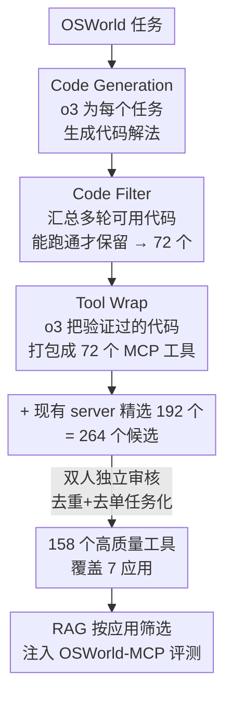

# OSWorld-MCP: Benchmarking MCP Tool Invocation in Computer-Use Agents

**会议**: ICLR 2026  
**OpenReview**: [https://openreview.net/forum?id=rceD6wwt4B](https://openreview.net/forum?id=rceD6wwt4B)  
**代码**: https://osworld-mcp.github.io  
**领域**: Agent / 多模态VLM / Benchmark  
**关键词**: 计算机操作智能体, MCP 工具调用, GUI-工具混合决策, 自动工具生成, 评测基准

## 一句话总结
OSWorld-MCP 在真实计算机环境 OSWorld 之上注入 158 个高质量 MCP 工具，让多模态智能体在每一步都能自主选择「调工具」还是「点 GUI」，第一次把工具调用、GUI 操作、混合决策三种能力放进同一个公平评测里——结果显示 MCP 工具普遍提升成功率（如 OpenAI o3 在 15 步从 8.3%→17.6%），但最强模型工具调用率也只有 33.3%，说明现有智能体远未学会用工具。

## 研究背景与动机
**领域现状**：多模态大模型在「计算机操作」（computer-use）场景上进展飞快，已有 OSWorld、WindowsAgentArena、WebArena 等一批动态交互式 benchmark，专门评测智能体能不能通过 GUI 操作（点击、输入、拖拽）完成真实桌面任务。

**现有痛点**：这些 benchmark 几乎都只预定义了一组 GUI 动作，**完全忽略了工具调用能力**——尤其是 Anthropic 2024 年提出的 MCP（Model Context Protocol）。MCP 是一个标准化的 client-server 接口，让智能体能直接访问文件、数据库、搜索引擎、计算器等外部资源。很多任务用 MCP 比纯 GUI 高效得多：比如「在 VS Code 装 autoDocstring 插件」，GUI 路径至少要点四步，一个 MCP 工具一步搞定，还更鲁棒。

**核心矛盾**：有些新智能体（CoAct、GUI-Owl 等）已经内置了自主工具调用，**拿它们和只评 GUI 交互的智能体比，本身就不公平**——能力维度对不齐。但目前没有任何 benchmark 能在统一框架里同时、公平地度量 GUI 操作、工具调用和决策三种能力。同时，纯文本的工具评测（MCPEval、MCP-Radar、LiveMCPBench）要么只覆盖几十个工具、任务多样性差，要么用 LLM 当裁判、不适合需要实时真实状态的任务，也填不上这个坑。

**本文目标**：建立一个统一标准，公平比较不同模型的工具利用能力，同时保留真实计算机环境里的 GUI 操作和复杂决策。具体要解决：(1) 哪来一批又多又好、贴近真实需求的 MCP 工具；(2) 怎么让工具和 GUI 在同一任务里动态共存、由智能体自己权衡；(3) 用什么指标把「会不会用工具」量化出来。

**核心 idea**：在 OSWorld 真实环境上挂载一套人工严格验证过的 158 个 MCP 工具，**每一步都让智能体在 MCP 工具和 GUI 动作之间自主二选一**，并新增 TIR、ACS 两个指标，把工具调用倾向和决策效率显式测出来。

## 方法详解

### 整体框架
OSWorld-MCP 不是一个新模型，而是一个**评测基准 + 配套的工具生产线**。它建在 OSWorld（覆盖 Ubuntu/Windows/macOS、9 个应用、369 个真实任务，含 GUI 与 CLI 交互）之上，核心改造是：在原本只有 11 个基础 GUI 动作（key/type/click/drag/scroll/terminate 等）的动作空间里，**额外注入 158 个 MCP 工具**，于是智能体在执行每一步时可以自主决定——是调一个 MCP 工具，还是发一个 GUI 动作。

整条工作流分两段：**离线的工具生产**和**在线的任务评测**。工具生产段用一条自动代码生成流水线（三个模块：Code Generation → Code Filter → Tool Wrap）批量造工具，再混入从现有 MCP server 精选的工具，经两轮人工审核筛成 158 个高质量工具，覆盖 7 个常见应用（LibreOffice Writer/Calc/Impress、VS Code、Chrome、VLC、OS）。评测段则把这批工具通过 RAG 按当前应用筛选后喂给模型（一次性给全部 158 个会导致 context 过长），模型在 GUI 与工具之间混合决策，最后用三个指标打分。

下图是离线工具生产流水线：

### 关键设计

**1. 自动代码生成流水线：用 o3 把任务解法批量沉淀成工具**

现有 MCP server 提供的工具普遍偏简单、功能高度重叠，缺少能在真实场景直接用的高质量工具。作者设计了一条三模块流水线来「造工具」。**Code Generation Module**：用户只需指定目标任务，模块就用 OpenAI o3 为 OSWorld 里的每个任务自动生成代码解法（prompt 沿用 CoAct 的策略并改造）。**Code Filter Module**：用 o3 把多轮交互里得到的可用代码汇总成一段，再拿去实际解对应任务，**只保留真正跑通的代码**，这一步筛出 72 个被验证的解法。**Tool Wrap Module**：再用一个 prompt 让 o3 把这 72 段验证过的代码自动封装成 72 个 MCP 工具。关键在于「能跑通才留」这条硬约束——它保证了生成工具不是纸面 API，而是真能完成任务的可执行单元。

**2. 自动生成 + 人工严选的双重把关：从 264 个候选筛到 158 个**

光靠自动生成不够：一部分生成或导入的工具是为某个单一任务量身定做的，没有真实世界的通用性。作者把 72 个生成工具与从现有 MCP server 精选的 192 个工具合并成 264 个候选，然后做**细粒度人工核验**——每个工具由至少两位有丰富 GUI 智能体开发经验的审核者独立评估，**两人都判定合格才保留**，同时剔除功能冗余项和高度任务特化项。最终得到 158 个工具，其中 25 个来自外部 server。作者还追加验证：133 个工具确实能提升任务效率；用五个 SOTA 模型实测，131 个工具至少被调用过一次，剩下 2 个是因为关联任务太难、模型不敢尝试。这套「机器造、人来筛」的组合，是 benchmark「公平 + 高质量」声明的根基。

**3. GUI-工具动态混合决策：每一步自主二选一**

OSWorld-MCP 最有区分度的设计，是把工具和 GUI 放进**同一个动作空间动态竞争**：在任务的每一步，智能体都能自主选择调用 MCP 工具，或者执行 click/type 等直接 GUI 动作。这让决策不再只是「选对工具」，还包括「在 GUI 和工具都能完成时，挑出最高效的执行路径」。为支撑这种评测，作者把全部任务人工标注切成两类：**Tool-Beneficial Tasks**（至少有一个可用工具能显著提效，250 个，占 69%）和 **Non-Tool-Beneficial Tasks**（没有任何工具能提效，111 个）。其中 153 个任务（42%）需要多轮工具调用，难度陡增——即便最强的 Claude 4 Sonnet，在需要四轮工具调用的任务上纯 GUI 准确率为 0，加了 MCP 工具也只有 19.5%。

**4. TIR 与 ACS：把「会不会用工具」量化出来**

只有 Task Accuracy 看不出智能体是否「该用工具时用了、不该用时忍住了」。作者新增两个指标。**Tool Invocation Rate（TIR）** 定义为 $\text{TIR} = (n_t + n_g)/(N_t + N_g)$，其中 $N_t$ 是 Tool-Beneficial 任务总数、$n_t$ 是其中「调了工具且成功」的任务数，$N_g$ 是 Non-Tool-Beneficial 任务总数、$n_g$ 是其中「正确地没调工具且成功」的任务数。在 Tool-Beneficial 子集上（$N_g=0$）退化为 $\text{TIR}=n_t/N_t$，衡量「该用工具时确实用对并成功」的比例；在 Non-Tool-Beneficial 子集上（$N_t=0$）退化为 $\text{TIR}=n_g/N_g$，衡量「正确避免调用」的比例——所以 TIR 同时刻画了「该不该调用」的判断力。**Average Completion Steps（ACS）** 为 $\text{ACS} = \sum_{i=1}^{N} S_i / N$（$S_i$ 是任务 $i$ 的执行步数），决策越准、用对工具越频繁，ACS 越低，反映决策效率。

## 实验关键数据

### 主实验
评测六个端到端模型（Qwen2.5-VL-72B、Qwen3-VL-Plus、Seed1.5-VL、Claude 4 Sonnet、OpenAI o3、Gemini-2.5-Pro）和一个多智能体框架 Agent-S2.5，统一用 GUI-Owl agent 配置，步数上限 15 / 50，每个配置跑三次取平均，RAG 按应用筛工具，temperature=1.0。下表为 Overall 结果（GUI-only vs +MCP）：

| 模型 | 步数 | GUI Acc | +MCP Acc | +MCP TIR | ACS 变化 |
|------|------|---------|----------|----------|----------|
| OpenAI o3 | 15 | 8.3 | **17.6** | 9.3 | 14.0→11.9 |
| OpenAI o3 | 50 | 12.8 | **24.1** | 16.0 | 44.8→33.0 |
| Claude 4 Sonnet | 15 | 30.2 | **36.1** | 27.4 | 11.9→10.5 |
| Claude 4 Sonnet | 50 | 38.9 | **45.0** | 33.3 | 25.0→20.0 |
| Gemini-2.5-Pro | 50 | 13.3 | **25.7** | 16.8 | 40.0→31.0 |
| Qwen3-VL-Plus | 50 | 33.8 | **39.5** | 26.1 | 25.6→18.6 |
| Agent-S2.5（多智能体） | 50 | — | **49.5** | — | — |

Claude 4 Sonnet 在两个步数上下都拿到 LMM 最高准确率（36.1 / 45.0）和最高 TIR；Qwen3-VL-Plus 的 ACS 最低（15 步 10.0、50 步 18.6）；多智能体 Agent-S2.5 整体最强（15 步 42.1、50 步 49.5）。

### 消融 / 分析

| 现象 | 关键数据 | 说明 |
|------|---------|------|
| 工具普遍提效 | 除 Qwen2.5-VL 外，所有模型加 MCP 后 Acc↑、ACS↓ | 工具确实带来准确率和效率双赢 |
| Qwen2.5-VL 反例 | 50 步 Acc 13.9→15.6 但 ACS 30.5→39.0↑ | 工具调用/决策弱，反而更费步数 |
| 工具调用率普遍低 | 最高 Claude 33.3%，最低 Qwen2.5-VL 9.3% | 模型远未学会主动用工具 |
| 多轮组合难 | 四轮工具任务 Claude 纯 GUI=0、+MCP 仅 19.5% | 工具链式组合是最大瓶颈 |

### 关键发现
- **MCP 工具同时提升准确率和效率**：典型如 OpenAI o3 在 15 步从 8.3%→17.6%，Gemini-2.5-Pro 在 50 步从 13.3%→25.7% 且 ACS 从 40.0→31.0，提升最显著。
- **TIR 与准确率正相关**：会用工具的模型（Claude、Agent-S2.5）准确率也更高；但所有模型 TIR 都偏低，说明当前 LMM 的工具利用潜力远未释放。
- **多工具组合是最大挑战**：任务涉及工具越多，性能下降越明显；模型从完整工具列表里「选对那一个」也很吃力——组合 MCP 工具比组合 GUI 操作更难。

## 亮点与洞察
- **「机器造工具 + 人工严选」是可复用的工具生产范式**：用 o3 跑「生成代码→筛能跑通的→封装成 MCP」，再用双人独立审核去重去特化，把「造一批高质量工具」这件苦差事工程化了，思路可迁移到任何需要扩充工具库的 agent 评测。
- **公平性的本质是「能力维度对齐」**：作者点破了一个被忽视的评测漏洞——拿带工具的智能体和只评 GUI 的比本就不公平。OSWorld-MCP 把工具和 GUI 放进同一动作空间动态竞争，才让比较有意义。
- **TIR 把「决策」拆成正反两面**：不仅奖励「该用工具时用对」，还奖励「不该用时忍住」，比单看准确率更能暴露智能体的决策毛病（如 Qwen2.5-VL 滥用工具反而更慢）。
- **「四轮工具任务纯 GUI 准确率为 0」**是个极有冲击力的数据点，直观说明某些真实任务靠点点点根本做不完，工具是刚需而非加分项。

## 局限与展望
- **工具集受 OSWorld 软件版本限制**：GIMP 和 Thunderbird 因版本约束没做 MCP server，覆盖面有缺口。
- **依赖 RAG 筛工具**：一次性给 158 个工具 context 过长，只能 RAG 按应用筛选——但 RAG 召回质量本身会影响模型能否看到正确工具，这部分误差未被单独剥离分析。
- **工具生产强依赖 o3**：整条流水线用 OpenAI o3 生成和封装，换一个更弱的生成模型能否复现这套高质量工具，文中未验证。
- **多轮工具组合仍是开放难题**：benchmark 暴露了瓶颈但没给解法，如何让模型学会链式调用、从长列表精准选工具，是后续工作的核心方向。

## 相关工作与启发
- **vs OSWorld（基座环境）**：OSWorld 只预定义 GUI 动作，无法评测工具调用引入后的替代路径；本文在其上挂载 158 个 MCP 工具并允许每步动态二选一，把评测从「纯 GUI」扩到「GUI + 工具 + 混合决策」。
- **vs 纯文本 MCP 评测（MCPEval / MCP-Radar / LiveMCPBench / MCP-Bench）**：它们要么工具数只有几十个、多样性差，要么用 LLM 当裁判不适合实时真实任务，要么按可用工具反推任务、与开放世界脱节；本文在真实视觉 GUI 环境里评测，要求模型解读界面、操作 GUI、调用并链接工具，更贴近真实计算机使用。
- **vs 静态 GUI benchmark（Mind2Web / WebLinx / OmniAct）**：它们建在预录的 GUI 轨迹上，无法评测工具引入后出现的新动作路径；本文用动态交互环境给出真实奖励信号，能容纳工具带来的全新解法。

## 评分
- 新颖性: ⭐⭐⭐⭐⭐ 第一个在真实计算机环境里公平联合评测 GUI + 工具调用 + 决策的 benchmark，点破了「能力维度不对齐」的评测漏洞
- 实验充分度: ⭐⭐⭐⭐⭐ 覆盖 6 个端到端模型 + 1 个多智能体框架、两档步数、每配置三跑取平均，并按任务类型细分
- 写作质量: ⭐⭐⭐⭐ 动机和指标定义清晰，但工具生成流水线的若干细节（候选 192 来源、RAG 实现）略简
- 价值: ⭐⭐⭐⭐⭐ 为 computer-use 智能体的工具能力设立了新标准，配套工具集和环境全部开源

<!-- RELATED:START -->

## 相关论文

- [\[ICLR 2026\] MCP-Bench: Benchmarking Tool-Using LLM Agents with Complex Real-World Tasks via MCP Servers](mcp-bench_benchmarking_tool-using_llm_agents_with_complex_real-world_tasks_via_m.md)
- [\[ICLR 2026\] MCPMark: A Benchmark for Stress-Testing Realistic and Comprehensive MCP Use](mcpmark_a_benchmark_for_stress-testing_realistic_and_comprehensive_mcp_use.md)
- [\[ICLR 2026\] SCUBA: Salesforce Computer Use Benchmark](scuba_salesforce_computer_use_benchmark.md)
- [\[ICLR 2026\] MCP Security Bench (MSB): Benchmarking Attacks Against Model Context Protocol in LLM Agents](mcp_security_bench_msb_benchmarking_attacks_against_model_context_protocol_in_ll.md)
- [\[ICLR 2026\] VideoAgentTrek: Computer Use Pretraining from Unlabeled Videos](videoagenttrek_computer-use_pretraining_from_unlabeled_videos.md)

<!-- RELATED:END -->
