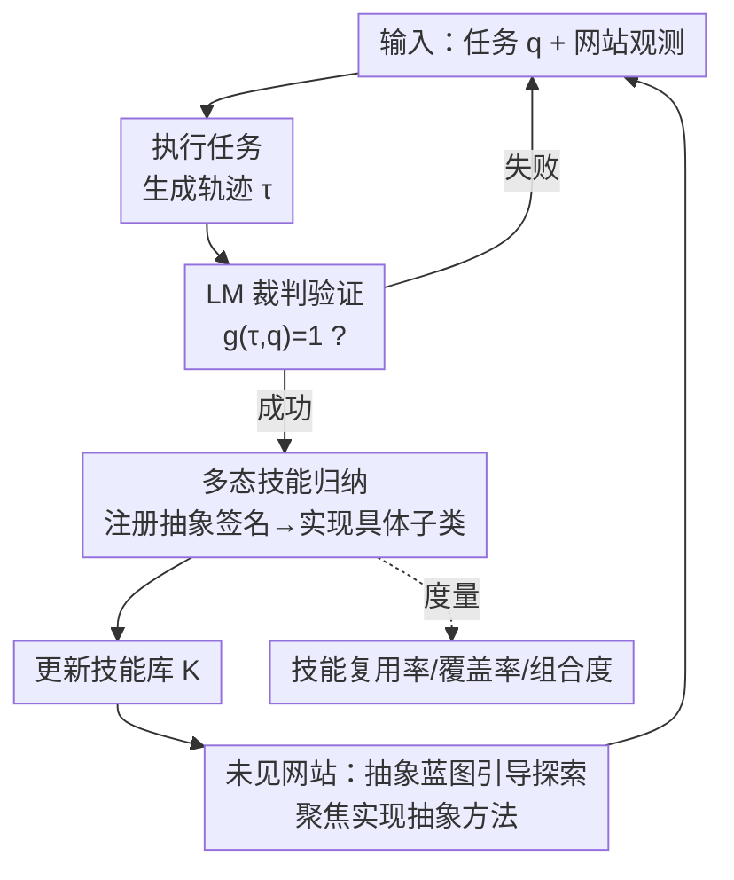

# PolySkill: Learning Generalizable Skills through Polymorphic Abstraction for Continual Agents

**会议**: ICLR 2026  
**OpenReview**: [https://openreview.net/forum?id=KdEsujyiSV](https://openreview.net/forum?id=KdEsujyiSV)  
**代码**: https://github.com/simonucl/PolySkill  
**领域**: Agent  
**关键词**: Web 智能体, 技能归纳, 持续学习, 多态抽象, 跨站点泛化

## 一句话总结
PolySkill 把软件工程里的「多态」搬进 Web 智能体的技能学习：用一个抽象领域类定义「该做什么」（如 `search_product`），各网站只填「具体怎么做」的子类实现，从而让学到的技能能跨网站复用——在已见网站上技能复用率提升 1.7 倍，在未见网站上成功率最高提升 13.9%、步数减少 20% 以上，同时缓解持续学习中的灾难性遗忘。

## 研究背景与动机

**领域现状**：LLM 驱动的 Web 智能体要在各种图形界面（GUI）上完成用户指定的任务，一个有前景的方向是「技能归纳」（skill induction）——从过去成功的交互轨迹里提炼出可复用的技能。Voyager 在开放环境里最早验证了这个想法，Agent Workflow Memory 把它带到 Web 智能体（用自然语言描述技能），随后 ASI（Agent Skill Induction）和 SkillWeaver 进一步把技能结构化为可执行代码，让技能更鲁棒。

**现有痛点**：这些方法几乎都聚焦于「同一网站、跨任务」的设定。为了在熟悉的网站上把性能刷高，它们生成的技能严重「过拟合」到某个网站——代码里写死了某个页面的元素定位逻辑，换一个布局不同的网站就直接崩。作者实测发现：ASI 在未见网站上的技能复用率不到 9%，SkillWeaver 更是不到 3%，而且 SkillWeaver 在持续探索时自提的任务越来越复杂特化，导致学习曲线不稳定甚至倒退。

**核心矛盾**：技能的「专用性」（specificity）和「泛化性」（generalizability）之间存在根本张力。现有方法把技能存成孤立的脚本，缺少一个机制把技能的「语义意图」从它的「具体实现」里剥离出来——一段写死的代码既是目标又是实现，无法被原则性地修改或重组。

**本文目标**：(1) 如何归纳出能跨不同网站迁移的技能；(2) 如何在「任务成功率」之外，定量度量技能的迁移与复用。

**切入角度**：作者从面向对象设计的「多态」（polymorphism）这一经久不衰的概念出发——多态天生就是为了「在保持稳定接口的同时管理实现之间的差异」而设计的。把它映射到智能体技能上：一个购物类网站的「搜索商品」目标是稳定的，变的只是 Amazon 和 Target 上点哪个按钮、填哪个框。

**核心 idea**：用「抽象目标 / 具体实现」的多态分层来代替「写死的单体脚本」，让智能体在抽象层面操作、在具体层面适配，从而获得可跨站点复用、可组合的技能。

## 方法详解

### 整体框架

PolySkill 把智能体建模在一个部分可观测马尔可夫决策过程（POMDP）$\langle S, A_p, T, \Omega, O \rangle$ 上：$A_p$ 是页面上的原子动作（如 `click`、`type`），智能体看不到完整状态 $S$，每步只收到观测 $o_t$（无障碍树 A11y tree + 截图）。智能体由 LLM 策略 $\pi_L$ 驱动，它的动作空间被一个动态技能库 $K_t$ 扩展：$A_t = A_p \cup K_t$，每个技能 $k(\text{args}) := a_1 \oplus \cdots \oplus a_n$ 就是一段参数化的动作序列。整体目标是归纳出一个高效的技能库，最大化一个带轨迹长度惩罚的奖励 $\max_{\pi_L, K} \mathbb{E}_{q \sim Q}[g(\tau, q) - \gamma|\tau|]$——长度惩罚项 $\gamma|\tau|$ 鼓励智能体造出更紧凑、更可复用的技能。

整条流水线分三个互补的阶段：**通过多态抽象做技能发现 → 通过组合式验证做技能精炼 → 通过自适应执行做技能部署**。具体地（见 Algorithm 1），智能体逐个执行任务序列里的任务，每次先用当前动作空间 $A_t$ 跑出一条轨迹 $\tau$；由一个 LLM 裁判 $V_L$ 验证轨迹是否成功；只有验证通过，才进入「多态技能归纳」——把这次成功的轨迹提炼成分层技能（先在抽象类里注册函数签名，再在网站子类里填具体实现），加进技能库供后续任务使用；失败则技能库保持不变。当智能体踏上同领域的新网站时，它会调出已有的抽象蓝图，把探索目标聚焦到「怎么在新站上实现这些抽象方法」。

### 关键设计

**1. 多态技能抽象：用抽象类 + 具体子类把「目标」从「实现」里剥出来**

这是全文的根。现有方法把技能存成绑定某网站 UI 的孤立脚本，换站即废。PolySkill 借鉴面向对象的多态，把技能组织成「领域驱动的层级」：为一类网站定义一个抽象类（如 `AbstractShoppingSite`），它只声明高层目标的方法签名——`search_product(query)`、`add_to_cart(item_id, quantity)`、`checkout()`，相当于这类网站的「schema / 蓝图」；而 Amazon、Target 各自作为具体子类（`AmazonSite`、`TargetSite`），继承抽象类并提供各自的、与网站强相关的实现。关键好处在于「组合式技能」只需在抽象父类里定义一次：比如 `purchase_item` 直接调用 `find_and_add_to_cart` 再调 `checkout`，而后者又只调抽象的 `search_product` 和 `add_to_cart`——这些组合技能完全建立在其它技能的可组合性之上，不依赖任何具体网站，因此**换站时不需要重新实现组合逻辑**，只需补上底层抽象方法的新实现即可。这样就把技能从脆弱的 UI 变化里解耦了出来。

**2. 多态引导的技能归纳：先注册抽象签名，再填具体实现**

光有数据结构不够，还得让归纳过程真按这个结构走。PolySkill 的归纳流程建立在 ASI 的鲁棒验证流水线之上：任务用原子动作成功完成后，一个 LLM 归纳模块分析这条成功轨迹，提出若干程序化技能；在加入库之前要先「验证」——智能体用新生成的技能重做同一个任务，只有这次执行依然成功，技能才算通过验证被收录。PolySkill 的改造点在于把这个过程「多态化」：如果智能体是第一次踏上某类网站（如第一个购物站），它必须先归纳出高层抽象类 `AbstractShoppingSite`，给这一领域提供共同的技能签名；之后在具体站点（如 amazon.com）归纳新技能时，它被引导成**先在抽象类里注册对应的函数签名，再在站点子类里定义具体实现**。这就把归纳提示从「直接造一个技能」重写成「先造一个通用的抽象技能，再实现这个网站特定的 `search` 方法」，逼着智能体学到的不是局部有效的片段，而是某个领域级共享概念的「结构一致的实现」。

**3. 未见网站上的蓝图引导探索：把抽象方法当成现成的探索课程表**

这个多态结构让「在已知类别的新网站上学习」变得高效得多。设想智能体已经从 amazon.com 形成了 `AbstractShoppingSite` 抽象类，现在第一次访问 walmart.com：它立刻识别出 Walmart 是购物站，调出抽象蓝图。这张蓝图等于给了它一组明确的探索目标——它不必随机乱试动作，而是知道「我需要搞清楚怎么在这个站上具体实现 `search_product` 和 `add_to_cart`」。一旦成功搜到商品，它就按标准归纳流程创建 `WalmartSite` 子类，把 `search_product` 方法填上这次有效的动作。在完全无预设任务的「任务无关持续学习」设定里，这种结构化探索尤其关键：已学到的抽象领域类充当 schema，为「哪些技能值得发现」提供了强先验，让自主探索比 SkillWeaver 那种无结构的自提任务更有方向性，从而生成更可迁移的课程。

**4. 三个新评测指标：让「技能到底复用没复用」可被量化**

作者指出，以往只看「最终任务成功率」会掩盖真相——它只能说明智能体成功了，但分不清「是高效复用了已学技能」还是「从零硬解了一遍」，因此无法度量技能归纳的真正价值。为此他们在标准的「任务成功率 SR」和「步数」之外，新增三个指标：**Skill Reusability（技能复用率）**度量技能在新任务里被复用的程度，高复用率说明学到的是广泛适用的技能而非过于狭隘的技能；**Task Coverage（任务覆盖率）**度量「至少用到一个技能」的任务比例，反映技能在真实测试场景里的适应性；**Skill Compositionality（技能组合度）**度量系统把已有技能当积木去搭更复杂任务的频率，高分意味着高效、可扩展的学习过程。正是靠这套指标，作者才量化暴露出现有方法的迁移失败：先前方法在未见网站上的技能复用率低于 18%，而 PolySkill 达到 31%。

### 一个完整示例

以购物领域的持续学习为例走一遍：智能体先在 WebArena 购物任务上把技能库初始化好，并归纳出 `AbstractShoppingSite` 抽象类。接着它在线更新、依次适配 Amazon、Target 两个新网站——每到一站，它调出抽象蓝图，把探索聚焦到实现 `search_product` 等抽象方法上，成功后创建 `AmazonSite`、`TargetSite` 子类填入具体动作。由于组合技能 `purchase_item` 写在父类、只依赖抽象方法，换站时无需重写。最终在 Mind2Web Cross-task 设定下，PolySkill + Update 仅用 47 个技能就达到 63.2% 成功率，而 ASI + Update 要用 66 个技能才到 59.4%——说明它是靠「精炼已有的多态定义」而非「盲目堆积冗余技能」来适配新环境的。更关键的是，适配 Amazon、Target 之后回看原 WebArena 任务，ASI 的性能明显退化（灾难性遗忘），而 PolySkill 因为通用知识沉淀在稳定的抽象接口里，原任务性能基本不掉，最终比 ASI 高出 +4.9%。

## 实验关键数据

### 主实验

在 Mind2Web（137 个网站、31 个领域、2350 个任务，按 cross-task / cross-website / cross-domain 三档难度划分）上，用 GPT-4.1 对比（成功率 Acc↑ / 技能数 #Skill↓）：

| 方法 | Cross-task Acc | Cross-task #Skill | Cross-Website Acc | Cross-Domain Acc |
|------|------|------|------|------|
| Baseline（无技能） | 53.8 | – | 56.2 | 62.3 |
| ASI（静态） | 52.3 | 50 | 54.9 | 57.3 |
| **PolySkill（静态）** | **55.4** | **43** | **57.6** | **60.1** |
| ASI + Update | 59.4 | 66 | 58.7 | 62.1 |
| **PolySkill + Update** | **63.2** | **47** | **61.3** | **63.4** |

可见 PolySkill 在更少技能数下持续超过 ASI，且在线更新版在所有设定上取得 SOTA；在最难的 Cross-Domain 上增益最明显，体现更强泛化。在 Qwen3-Coder 上，PolySkill + Update 把 Cross-task 从 41.5% 提到 47.5%、Cross-Domain 从 35.2% 提到 39.9%，说明结论不局限于闭源模型。

### 持续学习 / 任务无关探索

| 设定（Shopping 域，SR% / 技能使用率%） | WA Shopping | AMZ | Target |
|------|------|------|------|
| Baseline | 37.4 / – | 47.3 / – | 60.5 / – |
| 单域专家（仅 Target 训练） | 38.0 / 2.1 | 48.5 / 3.5 | 77.0 / 52.1 |
| SkillWeaver*（150 轮） | 39.8 / 8.6 | 64.4 / 25.2 | 74.2 / 18.3 |
| **自引导探索（PolySkill）** | **43.1 / 14.6** | 66.7 / 36.4 | 75.2 / 19.4 |

单域专家在主场很强（Target 77.0%）但几乎无法迁移（他站技能复用率 <4%）；完全自主的自引导智能体在留出的 WA Shopping 上取得最高的通用成功率 43.1%。在开发者平台（GitLab/GitHub）上，自引导智能体同样最优——GitLab 66.2%、GitHub 84.0%，证明能同时掌握两个领域。

### 关键发现
- **复用率与步数强负相关**：随技能复用率从 0% 升到 20%+，平均步数从约 6.1 降到 3.3–4.4；PolySkill 在第 180 个任务时复用率达 20.4%，验证了「技能复用 → 任务更高效」这一核心前提。
- **少技能 + 高准确率 = 真正的多态**：PolySkill 用更小的技能库取得更高准确率，说明它把任务底层逻辑「蒸馏」进了少量可跨布局复用的多态技能，而非记忆一大堆专用子程序。
- **抗灾难性遗忘**：依次适配 Amazon、Target 后，PolySkill 在原 WebArena 任务上性能保持稳定，而 ASI 显著退化，最终 +4.9% 优势——通用知识沉淀在稳定抽象接口是关键。

## 亮点与洞察
- **把「多态」这一软件工程老概念精准映射到智能体技能**：抽象类管「目标」、子类管「实现」，组合技能只写在父类一次即可跨站复用——这个类比不是装饰，而是直接落到归纳提示和数据结构上，让泛化变成结构性的必然而非偶然。
- **指标即诊断**：新增的 Skill Reusability / Task Coverage / Skill Compositionality 把「技能到底有没有被复用」从黑箱里拽出来，正是这套指标才让「现有方法过拟合单站」这个问题被定量看见（复用率 <18% vs 31%）。
- **结构化探索抵掉了人工课程**：抽象蓝图当 schema 给自主探索提供强先验，让无任务设定下的自提目标更有方向，这个思路可迁移到任何「不同环境共享结构模式」的智能体（不限 Web）。

## 局限与展望
- **依赖「领域类别可识别」**：多态收益建立在「能把网站归到某个领域、并已有该领域抽象类」之上；面对全新结构、无共享 schema 的环境，蓝图引导的优势会减弱。
- **抽象类的质量由 LLM 自归纳决定**：第一次造抽象类时若签名设计得不好（粒度过粗/过细），会污染后续所有子类实现，论文未深入讨论抽象类本身的纠错/演化机制。
- **裁判依赖**：成功验证依赖 GPT-4.1 裁判（与人工一致率约 85%），裁判的偏差会直接影响哪些技能被收录。
- **效率原则只用于提示而非真优化**：带长度惩罚的目标只是用来「引导提示」，并未作为损失真正优化，留有进一步形式化的空间。

## 相关工作与启发
- **vs ASI（Agent Skill Induction）**：两者共享「成功轨迹 → 归纳 → 重做验证 → 入库」的程序化技能流水线；区别在 ASI 把技能存成扁平的具体脚本，PolySkill 在归纳时强制「先注册抽象签名再实现子类」，因此用更少技能取得更高准确率、并抗遗忘。
- **vs SkillWeaver**：SkillWeaver 靠自提任务做无结构探索，任务越提越复杂特化、学习不稳；PolySkill 用抽象蓝图把探索结构化，生成更可迁移的技能与更好的课程。
- **vs Voyager**：Voyager 在开放环境里最早做技能归纳，但技能是具体片段、缺组合结构；PolySkill 引入多态分层，让技能可被原则性地组合与跨站复用。

## 评分
- 新颖性: ⭐⭐⭐⭐⭐ 把面向对象多态系统性地落到智能体技能归纳，并配套可量化迁移的新指标，角度新且自洽。
- 实验充分度: ⭐⭐⭐⭐ 覆盖 Mind2Web/WebArena、四个开闭源模型、任务定义与任务无关两种设定，但部分曲线类结果以图呈现、数值需从图读。
- 写作质量: ⭐⭐⭐⭐ 动机—方法—指标—实验链条清晰，多态类比讲得直观。
- 价值: ⭐⭐⭐⭐⭐ 为「持续学习的 Web/通用智能体」提供了一条可复用、可组合、抗遗忘的技能表示路径，工程落地性强。

<!-- RELATED:START -->

## 相关论文

- [\[ICML 2026\] Position: Modular Memory is the Key to Continual Learning Agents](../../ICML2026/llm_agent/position_modular_memory_is_the_key_to_continual_learning_agents.md)
- [\[ICLR 2026\] WebSeer: Training Deeper Search Agents through Reinforcement Learning with Self-Reflection](webseer_training_deeper_search_agents_through_reinforcement_learning_with_self-r.md)
- [\[CVPR 2026\] CGL: Advancing Continual GUI Learning via Reinforcement Fine-Tuning](../../CVPR2026/llm_agent/cgl_advancing_continual_gui_learning_via_reinforcement_fine-tuning.md)
- [\[ICLR 2026\] NewtonBench: Benchmarking Generalizable Scientific Law Discovery in LLM Agents](newtonbench_benchmarking_generalizable_scientific_law_discovery_in_llm_agents.md)
- [\[ICML 2026\] Skill-Pro: Learning Reusable Skills from Experience via Non-Parametric PPO for LLM Agents](../../ICML2026/llm_agent/skill-pro_learning_reusable_skills_from_experience_via_non-parametric_ppo_for_ll.md)

<!-- RELATED:END -->
