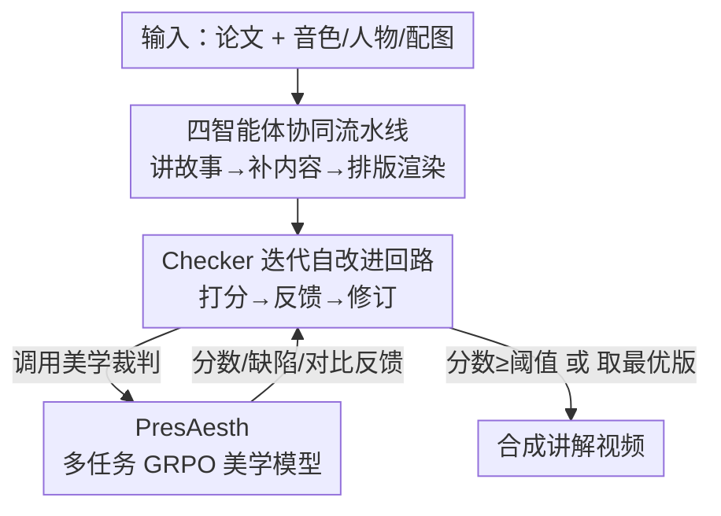

# Presenting a Paper is an Art: Self-Improvement Aesthetic Agents for Academic Presentations

**会议**: ICLR 2026  
**OpenReview**: [https://openreview.net/forum?id=8NXCwNjFNR](https://openreview.net/forum?id=8NXCwNjFNR)  
**项目页**: [https://evopresent.github.io/](https://evopresent.github.io/)  
**代码**: 待确认  
**领域**: Agent / 多模态 / 强化学习  
**关键词**: 学术演示生成, 多智能体, 美学评估, 多任务 GRPO, 自改进

## 一句话总结
EvoPresent 用「讲故事—丰富内容—排版渲染—审美检查」四个智能体串成一条草稿—反馈—修订的自改进流水线，把论文一键变成有叙事、有美感、带虚拟讲解的演示视频；核心是一个用多任务强化学习训练的美学模型 PresAesth，给整条流水线提供可靠的打分、缺陷诊断与对比反馈，让系统能在很少标注数据下自我迭代。

## 研究背景与动机
**领域现状**：随着学术交流越来越线上化，把论文做成幻灯片、海报、讲解视频来扩大可见度变得重要。已有自动化工作大致分两条线——paper-to-slide（PPTAgent、PresentAgent）和 paper-to-poster（Paper2Poster），它们能把论文内容抽出来铺到模板里。

**现有痛点**：作者把现有方法的毛病归结为三点。一是**叙事生硬**：直接从论文里抠文字段落，没有重新组织成连贯的讲述线，观众跟不上逻辑。二是**设计死板**：依赖固定模板，版式没有弹性，美感差。三是**缺自改进机制**：要么没有检查器，要么只有一个 VLM-as-judge 充当检查器，但 VLM 对美学的感知很弱、判断不稳定，结果系统高度依赖人工反复调整。

**核心矛盾**：作者点出一条朴素却关键的原则——"评不准就改不好"（there is no way to improve it when you cannot evaluate it right）。演示质量的瓶颈不在"会不会生成"，而在"能不能可靠地判断好不好看"。现有美学评估方法大多针对自然图像，面对幻灯片这种主观性更强、设计维度更复杂的场景时表现很不稳，于是自改进回路缺了最关键的那个"裁判"。

**本文目标**：做一套能在极少美学标注下，同时保证叙事连贯、设计美观、又能自我迭代的演示生成系统，并配一个能系统衡量"生成质量"和"美学感知"的基准。

**核心 idea**：把"美学评判"单独训成一个多任务强化学习模型 PresAesth（打分 / 缺陷诊断 / 成对比较三合一），再把它嵌进一个四智能体流水线的检查环节，用"草稿—反馈—修订"的闭环驱动系统自改进——评得准，才改得好。

## 方法详解

### 整体框架
EvoPresent 的输入是一篇论文（PDF）外加可选的个人音色 / 人物 / 配图素材，输出是一段配好讲稿、带虚拟讲解的演示视频。整条流水线按顺序串起四个智能体，再叠一个迭代自改进回路：**Storyline Agent** 先把论文拆成主题章节、重组成连贯讲述线并生成讲稿；**Scholar Agent** 用外部知识检索和图像生成工具补全学术信息、增强视觉素材；**Design Agent** 负责版式规划与风格渲染，先排出稳定布局再套 CSS 样式，产出初版幻灯片和视频帧；**Checker Agent** 调用美学模型 PresAesth 给当前幻灯片打分、诊断缺陷、给出修订反馈，循环若干轮直到达到审美阈值，再配上 TTS 旁白合成视频。PresAesth 本身是离线用多任务 GRPO 训好的、贯穿检查环节的"裁判"。

### 关键设计

**1. 四智能体协同的草稿—反馈—修订流水线：把"生成"拆成各司其职的角色**

针对"直接抠文字导致叙事生硬、固定模板导致设计死板"这两个痛点，作者不再用单一大模型一把梭，而是拆出三个串行生成 agent，让内容组织和视觉设计各有专人。**Storyline Agent** 用 Marker 抽取论文的文本与图表存进统一素材库，然后做四件事：按主题把论文分段构建故事框架、把文字重组成连贯章节并提炼关键论点、把相关图表/公式与内容关联同时过滤无关元素、最后基于这条故事线生成完整讲稿——它解决的是"叙事连贯"。**Scholar Agent** 在故事线基础上补学术内容和视觉：用 arXiv 元数据与引文解析 MCP 工具做知识扩充，用 GPT-4o、Qwen-Image 生成相关图表增强视觉冲击。**Design Agent** 内含 Layout Planner 和 Style Render 两件套：Planner 先根据文字和图片尺寸排出一个保证元素平衡、长宽比正确的初始布局（避免没有视觉反馈时排版乱飞），Render 再分析主题从预设 CSS 库里选风格、只叠加颜色/字体/背景这类视觉元素以保持布局弹性，最后调字号建立信息层级、加动效提升观感。值得一提的是作者选 HTML 而非更不稳定的 PPTX，正是为了获得这套流程需要的版式灵活度和美学控制力。

**2. PresAesth：用多任务 GRPO 把"主观美学"变成可验证奖励**

这是全文的核心——也是回应"评不准就改不好"那条原则的关键。作者把幻灯片美学感知定义成三个共享原则的任务：**打分（Scoring）** 给单张幻灯片在 1–10 区间上一个整体质量分；**缺陷诊断（Defect Adjustment）** 识别幻灯片的具体毛病并给改进反馈，缺陷归为构图与布局、排版、图像与可视化三类；**成对比较（Comparison）** 给一张基准图和两个改版，判断哪个改得更好。以 Qwen-2.5-VL-7B 为底座，用 GRPO（组相对策略优化）做联合多任务训练。作者强调这里必须用 RL 而非 SFT——SFT 只能从简单的标签里学，学不出复杂的美学推理，而 RL 让模型通过可验证奖励去探索、形成"既给判断又给理由"的推理；而且 GRPO 的组内比较天然契合"人是靠比较而非绝对打分来做审美判断"的方式。奖励由两部分组成：**格式奖励**要求输出把推理放在 `<think>` 标签、结论放在 `<answer>` 标签里，合规给 1 否则 0；**准确率奖励** $r_{acc}$ 按任务而定：

$$r_{acc}=\begin{cases}\mathbb{I}(o_{comp}=y_{comp}) & \text{比较任务}\\ \mathbb{I}(F_1(f(o_{def}),y_{def})>\alpha) & \text{诊断任务}\\ \mathbb{I}(|o_{score}-y_{score}|<\zeta) & \text{打分任务}\end{cases}$$

其中 $\mathbb{I}(\cdot)$ 是指示函数，$f(\cdot)$ 把模型文本反馈解析成缺陷类别，$\alpha$、$\zeta$ 分别是 F1 和打分误差的容忍阈值。第 $i$ 条回复的总奖励 $r^{(i)}=r^{(i)}_{fmt}+r^{(i)}_{acc}$。这样一个模型就能同时给出靠谱的分数、可操作的缺陷反馈和成对偏好，仅用很少的人类偏好数据就把"主观审美"变成了驱动 agent 自改进的可靠信号。

**3. Checker Agent 的迭代自改进回路：用分数门控 + 回退 + 取优保证收敛**

光有裁判还不够，得有一套机制把反馈变成稳定的迭代。Checker Agent 嵌入 PresAesth，按 Algorithm 1 运行：每轮先给当前幻灯片 $S^{(t)}$ 打分，**若分数超过阈值（默认 8.0）就提前终止**并生成视频；否则把当前版本交给 Layout Planner 按反馈修订。这里有两个稳健性设计——**回退**：如果本轮分数比上一轮低（$Score^{(t)}<Score^{(t-1)}$），就退回上一版再修，避免越改越差；**取优**：全程记录历史最高分版本 $S_{best}$，若 $T$ 轮都没达到目标分，就拿历史最优版作为最终输出。最终定稿的幻灯片再配上 TTS 旁白，每段音频与对应幻灯片时间对齐，幻灯片按旁白时长展示并可加转场，合成讲解视频。这个回环把"评得准的裁判"真正落成了"能稳定收敛的自改进"，而不是盲目多轮反而劣化。

**4. EvoPresent Benchmark：一套同时量"生成质量"和"美学感知"的评测体系**

针对现有评估"样本少、领域窄、缺专门指标、过度依赖 VLM-as-judge"的问题，作者建了两件套基准。**生成质量**部分覆盖 650 篇顶会论文（共 1.3 万张幻灯片，跨 CV/NLP 等多领域、2023–2025），每篇配齐幻灯片/视频/讲稿三种格式并由 2–3 名专家标注；评测分全局（用 Perplexity、ROUGE-L 量内容连贯流畅，用 Layout Balance、PresAesth 美学分量设计）和细粒度（VLM-as-judge 在 Fidelity/Clarity/Narrative/Engagement 四个内容维度 + Elements/Layout/Hierarchy/Color 四个设计维度上 1–5 打分）两层。**美学感知**部分对原始幻灯片施加受控扰动（如改版式、换风格）造出 poor/base/good 三档变体并组成 2000 对幻灯片（6000 张，1600 训 / 400 测），同时支撑打分、诊断、比较三任务的联合训练与评测——这正是 PresAesth 的训练与测试场。

### 损失函数 / 训练策略
PresAesth 沿用 GRPO 的损失（与 Shao et al. 2024 一致，含与参考模型的 KL 正则），底座 Qwen-2.5-VL-7B，在 1600 对训练样本上做多任务联合优化；奖励即上文的格式奖励 + 任务相关准确率奖励之和。生成侧的四个 agent 不训练，直接用现成大模型（GPT-4o / GPT-5 / Claude-4 / DeepSeek-R1 等）做骨干，靠流水线和 PresAesth 反馈驱动质量。

## 实验关键数据

### 主实验（生成质量，节选自 Table 2）

| 方法 | PPL ↓ | ROUGE-L ↑ | Balance ↑ | Aesth. ↑ | Overall ↑ |
|------|-------|-----------|-----------|----------|-----------|
| Slides+Scripts（Oracle 上界） | 16.64 | 20.53 | 0.82 | 8.50 | 4.01 |
| GPT-4o（端到端 HTML） | 24.32 | 12.59 | 0.70 | 7.05 | 3.58 |
| PresentAgent-4o（多智能体） | 22.80 | 12.69 | 0.68 | 7.42 | 3.75 |
| Paper2Poster-4o | 22.23 | 13.64 | 0.71 | 7.65 | 3.76 |
| **EvoPresent-4o** | 20.00 | 14.68 | 0.67 | 7.82 | 3.82 |
| **EvoPresent-claude-4** | **18.57** | **16.78** | **0.78** | 8.05 | **3.90** |

同骨干下 EvoPresent-4o 比直接用 GPT-4o 困惑度降约 17%、整体分从 3.58 升到 3.82；用更强的 Claude-4 做骨干时整体分 3.90、美学 8.05，已接近 Oracle 上界（4.01 / 8.50）。作者还观察到一条普遍 trade-off：推理模型（DeepSeek-R1、GPT-5）视觉更好但爱堆冗余、困惑度反而高，说明美学设计与内容构建之间存在内在权衡，而美学感知是主要瓶颈。

### 美学感知（Table 3，400 对测试集）

| 方法 | Scoring MAE ↓ | Adjustment Avg-F1 ↑ | Comparison Acc ↑ |
|------|---------------|---------------------|------------------|
| GPT-4o | 1.64 | 0.386 | 0.771 |
| Claude-4-sonnet | 1.61 | 0.386 | 0.695 |
| GPT-5 | 1.39 | 0.386 | 0.597 |
| **PresAesth (Ours, 7B)** | **1.33** | **0.389** | **0.878** |

PresAesth 这个 7B 模型在三任务上全面领先闭源大模型：打分 MAE 比 GPT-4o/Claude 平均低约 18%，比较准确率 87.8%、平均比其他模型高约 40 个百分点，且能给出结构化解释性反馈。

### 消融实验

| Scholar | Design | Checker | Content ↑ | Design ↑ | Aesth ↑ |
|---------|--------|---------|-----------|----------|---------|
| ✗ | ✓ | ✓ | 3.40 | 3.73 | 7.53 |
| ✓ | ✗ | ✓ | 3.91 | 3.35 | 7.03 |
| ✓ | ✓ | ✗ | 3.91 | 3.54 | 6.40 |
| ✓ | ✓ | ✓ | 3.91 | 3.73 | 7.53 |

| 训练策略 | Scoring MAE ↓ | Adjustment F1 ↑ | Comparison Acc ↑ |
|----------|---------------|------------------|------------------|
| Scoring Only (GRPO) | 1.42 | 0.370 | 0.550 |
| Comparison Only | 1.79 | 0.373 | 0.719 |
| Multi-Task SFT | 1.73 | 0.334 | 0.872 |
| **Multi-Task GRPO** | **1.33** | **0.389** | 0.878 |

### 关键发现
- **三个 agent 各管一块**：去掉 Scholar，内容分从 3.91 掉到 3.40（管内容深度）；去掉 Design，设计分掉约 10.2%（管布局可读性）；去掉 Checker，设计降约 5.1%、美学降约 15%（管细节对齐与一致性）。
- **多任务联合 > 单任务**：单任务 GRPO 各项都比 PresAesth 差，说明打分/诊断/比较共享"平衡、视觉一致"等美学原则、彼此有依赖；而 Multi-Task SFT 虽然比较准确率不低，却只能吐静态标签、给不出可操作反馈，唯有多任务 GRPO 既准又能给反馈，契合自改进范式。
- **反馈质量决定自改进**：高质量反馈才能让 agent 用更少轮数更快收敛；而模型初始能力强并不保证自我纠错能力强——这是作者反复强调的反直觉结论。
- **人类偏好评测**与 Qwen-Omni 视频体验评测中，EvoPresent 均优于其他方法且与人类制作的演示有竞争力。

## 亮点与洞察
- **"评不准就改不好"被做成了系统设计原则**：把整套系统的瓶颈精准定位到"美学裁判"，再单独花力气训一个可靠裁判嵌进回路，思路干净且抓住了要害。
- **用多任务 RL 把主观审美变成可验证奖励**：打分用误差容忍阈值、诊断用 F1 阈值、比较用精确匹配，三种"软主观"目标都被转成 0/1 可验证信号喂给 GRPO——这套把"主观评价 RL 化"的配方可迁移到海报、网页、UI 等任何"好看与否"难量化的生成任务。
- **回退 + 取优的稳健回路**：很多自改进系统会越改越差，本文用"分数下降就退回上一版、全程留最优版兜底"两招保证迭代单调向好，简单但实用。
- **基准本身就是贡献**：650 篇论文多格式 + 2000 对受控扰动幻灯片，既能评生成又能训/评美学，填了这个方向"没专门指标、过度依赖 VLM-judge"的空白。

## 局限与展望
- **细粒度评测仍依赖 VLM-as-judge**：内容/设计八维打分用 VLM 充当裁判，作者自己也指出 VLM 美学感知不稳，这层评测的一致性仍是隐患。
- **生成骨干不训练**：四个 agent 直接用现成大模型，质量很大程度受骨干能力牵制（Claude-4 明显优于 GPT-4o），系统本身的"可学习上限"有限。
- **美学标注规模有限且主观**：PresAesth 训练只用 1600 对、每对 2–3 人标注，审美本身因人而异，跨文化/跨领域的泛化与一致性还需更大规模验证。
- **数值精度**：正文若干提升幅度（约 17%、约 18%、约 40%）为作者表述，部分百分比为表格估算，具体以原文为准。

## 相关工作与启发
- **vs PPTAgent / PresentAgent**：它们靠直接抽取 + 固定模板，叙事生硬、版式死板；EvoPresent 用 Storyline Agent 重组叙事 + Design Agent 弹性排版 + 自改进回路，内容连贯性和美感都更好。
- **vs Paper2Poster**：它有 VLM 检查器但美学感知弱、需大量人工调整，且只做静态海报；EvoPresent 把检查器换成专训的 PresAesth，并扩展到带讲稿/视频的完整演示。
- **vs 通用图像美学评估（自然图像打分/对齐）**：那些方法局限于自然图像、面对幻灯片这种高主观高复杂度场景不稳；PresAesth 专门面向学术视觉设计、用多任务 RL 训练，评估更可靠。

## 评分
- 新颖性: ⭐⭐⭐⭐⭐ 首个面向学术演示的自改进多智能体框架，并把美学评判 RL 化成可验证奖励
- 实验充分度: ⭐⭐⭐⭐⭐ 自建大基准 + 多骨干对比 + agent/训练策略双消融 + 人类偏好评测
- 写作质量: ⭐⭐⭐⭐ 框架与动机清晰，个别表格数字与英文表述略需对照
- 价值: ⭐⭐⭐⭐⭐ "评不准就改不好"的范式与可迁移的美学 RL 配方对生成类任务有普适启发

<!-- RELATED:START -->

## 相关论文

- [\[CVPR 2026\] Paper2Figure: A Multi-Agent Collaborative System for Figure Generation Towards Academic Research Paper](../../CVPR2026/llm_agent/paper2figure_a_multi-agent_collaborative_system_for_figure_generation_towards_ac.md)
- [\[ACL 2025\] PaSa: An LLM Agent for Comprehensive Academic Paper Search](../../ACL2025/llm_agent/pasa_an_llm_agent_for_comprehensive_academic_paper_search.md)
- [\[ACL 2025\] Gödel Agent: A Self-Referential Agent Framework for Recursive Self-Improvement](../../ACL2025/llm_agent/gödel_agent_a_self-referential_agent_framework_for_recursive_self-improvement.md)
- [\[ICLR 2026\] Your Agent May Misevolve: Emergent Risks in Self-evolving LLM Agents](your_agent_may_misevolve_emergent_risks_in_self-evolving_llm_agents.md)
- [\[ICLR 2026\] MemGen: Weaving Generative Latent Memory for Self-Evolving Agents](memgen_weaving_generative_latent_memory_for_self-evolving_agents.md)

<!-- RELATED:END -->
